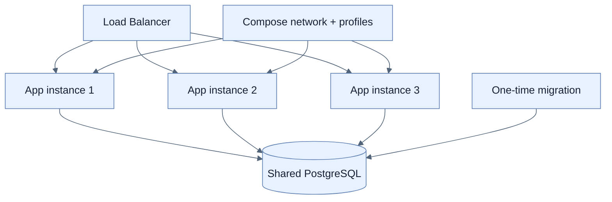

# 운영 설정, 수평 확장, Docker Compose

## 한눈에 보기

동일 JAR/image에 `SERVER_PORT`, 외부 `application.properties`, instance profile을 적용해 여러 process를 실행한다. 세 instance는 각기 다른 host port를 쓰되 PostgreSQL 같은 shared persistent database를 바라본다. Compose는 DB와 application instances를 한 선언으로 시작한다.

## 1. 왜 이게 필요한가

Traffic이 늘면 stateless application copy를 추가할 수 있지만 각 instance가 embedded DB를 가지면 상태가 갈라진다. Binary는 같게 유지하고 endpoint·profile만 external config로 바꾸며 shared service에 연결해야 load balancer 뒤에서 같은 system처럼 동작한다.

## 2. 어떻게 동작하는가

Instance profile은 local 실행에서 9000/9001/9002를 고른다. Container 안에서는 모두 8080을 사용하고 Compose가 host port만 다르게 mapping한다. 같은 Compose network의 DB는 `localhost`가 아니라 service name `postgres`로 찾는다. `depends_on`은 start ordering을 표현하지만 DB readiness까지 보장하지 않으므로 healthcheck/retry가 별도 필요하다.

여러 instance가 `CommandLineRunner`로 seed/schema를 동시에 바꾸면 중복·race가 생긴다. 초기 자료는 one-time `setup` profile로 제한하고 production schema migration은 Flyway/Liquibase 또는 운영 process로 관리한다. Compose는 학습·개발 orchestration에 좋지만 대규모 rolling update와 reconciliation에는 Kubernetes/GitOps 같은 플랫폼이 필요하다.

## 3. 그림으로 보기

## 4. 이 노트에 나온 용어

- **horizontal scaling**: 더 큰 한 process 대신 동일 application instance 수를 늘리는 확장.
- **service discovery**: network service를 고정 IP 대신 논리 이름으로 찾는 기능.
- **Docker Compose**: 여러 container service·network·volume을 한 YAML로 정의·실행하는 도구.
- **migration**: database schema/reference data를 versioned 단계로 변경하는 작업.

## 7. 연결

- [[chapter-6-configuring-an-application-with-spring-boot/05-ordering-property-overrides|설정 우선순위]] — instance별 runtime 값을 공급한다.
- [[02-building-a-docker-container]] — Compose가 반복 실행할 image다.
- [[chapter-13-observability-with-spring-boot-4/06-correlating-logs-metrics-and-traces|Telemetry 상관관계]] — 여러 instance를 한 요청 흐름으로 추적해야 한다.

## 8. 스스로 확인

- 전체 1차 정리 후: Compose 안에서 DB URL이 `localhost`가 아니라 service name을 쓰는 이유를 설명한다.

<!-- ==== 아래는 내 영역 · 스킬 수정 금지 ==== -->

## 내 설명 시도

## 막혔던 지점

## 리뷰 이력

