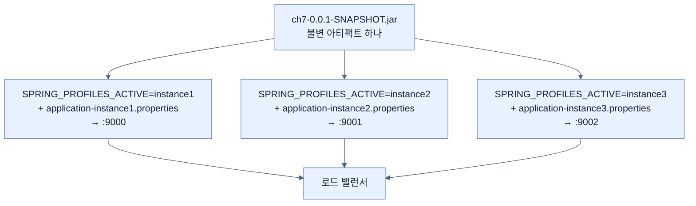
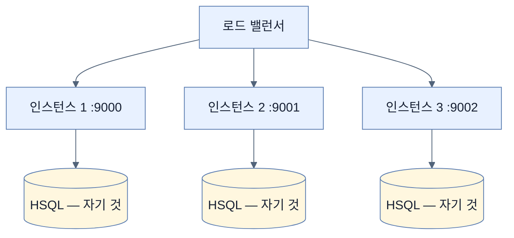

# 같은 JAR 세 벌, 다른 포트 — 프로파일로 인스턴스 나누기

## 한눈에 보기

| 질문 | 핵심 답 |
|---|---|
| 요구 | 트래픽이 늘어 **인스턴스를 여러 개** 돌려야 한다 |
| 포트 | 9000 · 9001 · 9002 — **로드 밸런서 설정에 맞춘다** |
| 이름 | `instance1` · `instance2` · `instance3` |
| 방법 | `application-instance{N}.properties` + `SPRING_PROFILES_ACTIVE` |
| JAR은 | **하나.** 세 번 다르게 띄운다 |
| 확인 로그 | `The following 1 profile is active: "instance1"` |
| 남는 문제 | 기본이 **인메모리 HSQL**이라 세 인스턴스가 **DB를 공유하지 않는다** |

## 1. 왜 이게 필요한가

### 출발 장면: 인스턴스 하나로는 부족하다

[[04-tuning-and-scaling-in-production]]이 남긴 시나리오다. 매니저가 트래픽 증가에 대응하려고 **같은 애플리케이션의 인스턴스를 여러 개** 돌리라고 한다.

**[[수평-확장]]**(= 인스턴스 수를 늘려 처리량을 키우는 방식)이다. 그런데 한 기계에서 세 벌을 띄우려면 즉시 문제가 생긴다.

```text
% java -jar target/ch7-0.0.1-SNAPSHOT.jar   # 8080에 뜬다
% java -jar target/ch7-0.0.1-SNAPSHOT.jar   # 8080? 이미 쓰고 있다 → 실패
```

**포트가 겹친다.** 그리고 앞 절에서 배운 `SERVER_PORT=9001` 방식은 매번 타이핑해야 한다.

포트 번호를 9000·9001·9002로 정하는 것도 임의가 아니다. 책이 짚듯 **운영팀이 구성한 [[로드-밸런서]]**(= 요청을 여러 인스턴스에 나눠 보내는 장치)**의 설정에 맞춘다.** 로드 밸런서가 대상 목록을 갖고 있으므로 인스턴스들이 그 목록의 주소로 떠야 한다.

## 2. 어떻게 동작하는가

### 2.1 파일 세 개

앞 절에서 만든 `application.properties`를 이름만 바꾼다.

| 파일 | `server.port` | 만드는 법 |
|---|---:|---|
| `application-instance1.properties` | 9000 | 기존 파일을 **rename** |
| `application-instance2.properties` | 9001 | 복사 후 값 수정 |
| `application-instance3.properties` | 9002 | 복사 후 값 수정 |

파일 이름의 `-instance1` 부분이 **[[프로파일]]**(= 상황별 설정 묶음에 이름을 붙이는 장치) 이름이다. [[../chapter-6-configuring-an-application-with-spring-boot/02-creating-profile-based-property-files|Chapter 6]]의 `application-test.properties`와 같은 규칙이며, 여기서는 **환경이 아니라 인스턴스**를 구분하는 데 쓴다.

이 용법이 흥미롭다. 프로파일은 보통 dev/test/prod 같은 **환경**을 나누는 데 쓰이는데, 여기서는 **같은 환경 안의 서로 다른 복제본**을 나눈다. 프로파일이 "상황"을 나누는 일반적 장치라는 것이 드러난다.

### 2.2 세 번 띄우기

```bash
% SPRING_PROFILES_ACTIVE=instance1 java -jar target/ch7-0.0.1-SNAPSHOT.jar
…
o.s.boot.tomcat.TomcatWebServer : Tomcat started on port 9000 (http) with context path '/'
```

콘솔 탭을 새로 열어 두 번째.

```bash
% SPRING_PROFILES_ACTIVE=instance2 java -jar target/ch7-0.0.1-SNAPSHOT.jar
…
o.s.boot.tomcat.TomcatWebServer : Tomcat started on port 9001 (http) with context path '/'
```

세 번째도 마찬가지로 9002에 뜬다.

**세 번 모두 같은 JAR 파일이다.** 달라진 것은 환경 변수 하나뿐이다.



**[[불변-아티팩트]]**(= 빌드 후 고치지 않는 배포물)가 왜 중요한지가 여기서 드러난다. 세 인스턴스가 **바이트 단위로 같은 코드**를 돌리고 있다. 어느 인스턴스에서 버그가 나든 나머지 둘에서도 재현된다.

### 2.3 확인 로그

첫 콘솔 출력 깊숙이 이 줄이 있다.

```text
2026-02-11T22:17:44.823-03:00  INFO 6335 --- [main]
c.l.Chapter7Application : The following 1 profile is active: "instance1"
```

Spring Boot가 `instance1` 프로파일을 인식했다는 확인이다. 나머지 둘에도 같은 종류의 줄이 있다.

이 로그가 진단에 유용하다. 프로파일 이름을 잘못 적으면(`instance1` 대신 `instace1`) **오류가 나지 않고** 해당 파일이 그냥 안 읽힌다. 그러면 포트가 기본값 8080으로 뜬다. 이 줄을 보면 무엇이 활성화됐는지 바로 안다.

책의 정리가 간결하다 — **"프로파일은 단순한 단일 애플리케이션으로 시작한 것을 여러 인스턴스로 돌리는 강력한 방법이다."**

### 2.4 그런데 끝이 아니다

책이 곧바로 문제를 제기한다.

> **"우리는 아직 끝나지 않았다. 이 애플리케이션의 기본 설정이 인메모리 HSQL 데이터베이스이기 때문이다. 즉 세 인스턴스가 공통 데이터베이스를 공유하지 않는다."**

**[[인메모리-데이터베이스]]**(= 프로세스 메모리 안에서만 사는 데이터베이스)의 성질이 여기서 정면으로 문제가 된다.



무슨 일이 벌어지는지 구체적으로 보자.

| 사용자 행동 | 결과 |
|---|---|
| 인스턴스 1에 동영상을 등록 | 인스턴스 1의 메모리에만 저장 |
| 새로고침 → 로드 밸런서가 인스턴스 2로 보냄 | **방금 등록한 것이 안 보인다** |
| 다시 새로고침 → 인스턴스 3 | 역시 안 보인다 |
| 인스턴스 1을 재시작 | **데이터가 통째로 사라진다** |

**[[무상태-인스턴스]]**(= 자기 안에 지속 상태를 두지 않는 인스턴스)가 수평 확장의 전제라는 사실이 여기서 드러난다. 인스턴스가 상태를 갖고 있으면 "어느 인스턴스가 받아도 같은 결과"가 성립하지 않는다.

포트를 나눈 것만으로는 확장이 아니다. **상태를 밖으로 빼야** 확장이 된다. 그것이 [[04b-configuring-a-shared-database]]의 주제다.

## 3. 그림으로 보기

| 무엇을 나눴나 | 어떻게 | 충분한가 |
|---|---|---|
| 포트 | 프로파일별 `server.port` | 띄우는 데는 충분 |
| 프로세스 | 세 번 실행 | 처리량은 늘어난다 |
| **데이터** | **나누면 안 되는데 나뉘어 있다** | **아니다** |


## 4. 이 노트에 나온 용어

| 용어 | 한 줄 뜻 | 정의 위치 |
|---|---|---|
| 수평 확장 | 인스턴스 수를 늘려 처리량을 키우는 방식 | [[_glossary#수평-확장]] |
| 로드 밸런서 | 요청을 여러 인스턴스에 나눠 보내는 장치 | [[_glossary#로드-밸런서]] |
| 프로파일 | 상황별 설정 묶음에 이름을 붙이는 장치 | [[_glossary#프로파일]] |
| 외부 설정 파일 | JAR 옆에 두는 설정 파일 | [[_glossary#외부-설정-파일]] |
| 불변 아티팩트 | 빌드 후 고치지 않는 배포물 | [[_glossary#불변-아티팩트]] |
| 인메모리 데이터베이스 | 프로세스 메모리 안에서만 사는 데이터베이스 | [[_glossary#인메모리-데이터베이스]] |
| 무상태 인스턴스 | 자기 안에 지속 상태를 두지 않는 인스턴스 | [[_glossary#무상태-인스턴스]] |

## 5. 자주 헷갈리는 것

**"프로파일은 환경(dev/prod)을 나누는 것이다"** — 그것이 흔한 용법이지만 **상황을 나누는 일반적 장치**다. 여기서는 같은 환경 안의 인스턴스를 나눈다.

**"인스턴스마다 다른 JAR이 필요하다"** — 하나면 된다. 달라지는 것은 프로파일과 그에 딸린 **[[외부-설정-파일]]**뿐이다.

**"포트를 나눴으니 확장이 끝났다"** — 데이터가 나뉘어 있으면 확장이 아니다. 사용자 눈에는 **데이터가 사라졌다 나타났다** 한다.

**"프로파일 이름을 잘못 적으면 오류가 난다"** — 나지 않는다. 파일이 안 읽히고 기본값으로 뜬다. 확인 로그를 봐야 안다.

## 6. 언제 안 쓰나 / 경계

- **한 기계에 세 벌을 띄우는 것은 진짜 확장이 아니다.** CPU와 메모리를 나눠 쓰므로 처리량이 세 배가 되지 않는다. 예제로서의 시연이다.
- **로드 밸런서는 이 장에서 다루지 않는다.** 포트를 맞춰 두는 것까지가 애플리케이션 쪽의 몫이다.
- **인메모리 DB 문제는 데이터에만 있는 게 아니다.** 세션이나 캐시를 인스턴스 안에 두면 같은 문제가 생긴다.
- **비유의 한계.** 이 구조는 "같은 대본으로 무대를 세 개 여는 것"에 가깝다. 배우도 대사도 같고 극장 주소만 다르다. 다만 이 비유는 **관객이 무대 사이를 오간다**는 점을 담지 못한다. 실제로 로드 밸런서는 같은 사용자의 요청을 매번 다른 인스턴스로 보낼 수 있어서, 세 무대가 **같은 이야기의 같은 지점**에 있어야 한다. 그것이 공유 데이터베이스가 필요한 이유다.

## 7. 연결

- [[04-tuning-and-scaling-in-production]] — "여러 인스턴스를 서로 다른 설정으로"라는 그 노트의 마지막 문장을 이어받는다.
- [[04b-configuring-a-shared-database]] — 이 노트가 드러낸 "DB를 공유하지 않는다"는 문제를 해결한다.
- [[04c-running-the-setup-with-docker-compose]] — 세 번 손으로 띄우는 대신 한 명령으로 전체 환경을 세운다.

## 8. 스스로 확인

1. 한 기계에서 같은 JAR을 두 번 띄우면 즉시 생기는 문제는?
2. 포트를 9000·9001·9002로 정한 이유가 임의가 아닌 근거는?
3. 프로파일의 일반적 용법과 이 절의 용법이 어떻게 다른가?
4. 세 인스턴스가 "바이트 단위로 같은 코드"라는 사실이 왜 중요한가?
5. 프로파일 이름 오타가 조용히 실패하는 이유와, 그것을 잡는 방법은?
6. 인메모리 DB로 세 인스턴스를 돌릴 때 사용자가 겪는 증상을 순서대로 그릴 수 있는가?
7. 수평 확장이 성립하기 위한 두 조건은?
8. 세 무대 비유가 깨지는 지점은 어디인가?

<!-- ==== 아래는 내 영역 · 스킬 수정 금지 ==== -->

## 내 설명 시도


## 막혔던 지점


## 리뷰 이력
