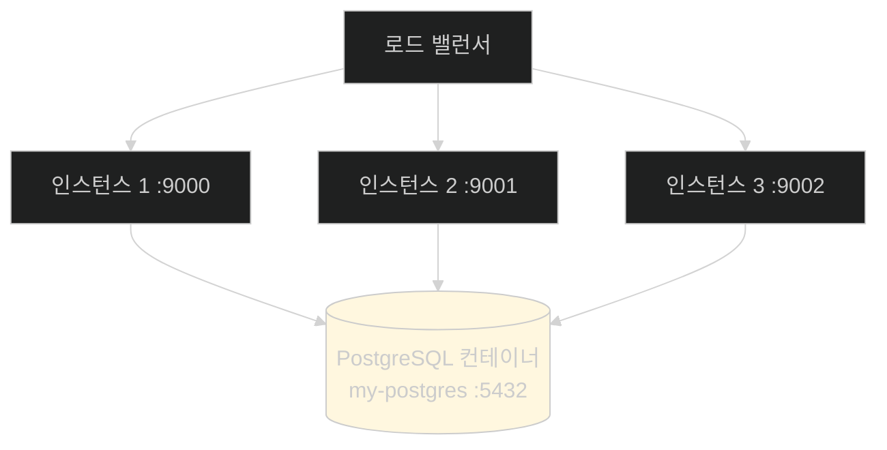
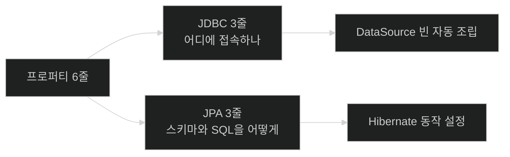

# 테스트에서 쓰던 그 컨테이너를 운영으로 — 공유 PostgreSQL

## 한눈에 보기

| 질문 | 핵심 답 |
|---|---|
| 왜 PostgreSQL인가 | **Testcontainers로 이미 통합 테스트한 그 데이터베이스**다 |
| 띄우는 법 | `docker run -d -p 5432:5432 --name my-postgres -e POSTGRES_PASSWORD=… postgres:16` |
| `--name`을 주는 이유 | 임의 이름 대신 고정해 **중복 실행을 막는다** |
| 설정 두 묶음 | JDBC 3줄(url·username·password) + JPA 3줄 |
| `ddl-auto=update` | 필요한 것만 더하고 **아무것도 지우지 않는다** |
| 원문 오류 | `spring.jpa.hibernate.show-sql`은 **존재하지 않는 키**다 |

## 1. 왜 이게 필요한가

### 출발 장면: 세 인스턴스가 각자의 세계에 산다

[[04a-scaling-with-spring-boot]]이 드러낸 문제다. **[[인메모리-데이터베이스]]**(= 프로세스 메모리 안에서만 사는 데이터베이스)를 쓰는 인스턴스 세 개는 데이터를 공유하지 않는다.

**[[무상태-인스턴스]]**(= 자기 안에 지속 상태를 두지 않는 인스턴스)가 되려면 상태를 밖으로 빼야 한다. 그러면 무엇을 쓸 것인가.

책의 답이 실용적이다 — **이미 Testcontainers로 PostgreSQL을 상대로 통합 테스트를 해 뒀으니, 설정만 조정하면 운영 인스턴스를 가리킬 수 있다.**

이 연결이 중요하다. [[../../part-2-creating-an-application-with-spring-boot/chapter-5-testing-with-spring-boot/07-testing-repositories-with-testcontainers|Chapter 5]]에서 실제 PostgreSQL 컨테이너로 리포지토리를 검증했다면, **테스트한 것과 운영에서 쓰는 것이 같은 종류**가 된다. H2로 테스트하고 PostgreSQL로 배포할 때 생기는 방언 차이 문제가 없다.

## 2. 어떻게 동작하는가

### 2.1 데이터베이스 띄우기

책의 표현대로 **"Testcontainers가 길을 보여 줬다 — Docker를 쓰면 된다."**

```bash
% docker run -d -p 5432:5432 --name my-postgres -e POSTGRES_PASSWORD=mysecretpassword postgres:16
```

| 옵션 | 하는 일 | 왜 |
|---|---|---|
| `-d` | 백그라운드 데몬으로 실행 | 터미널을 붙잡지 않는다 |
| `-p 5432:5432` | PostgreSQL 표준 포트 매핑 | 호스트에서 접속할 수 있게 |
| `--name my-postgres` | **고정 이름** | [[02a-building-the-right-type-of-container]]에서 본 임의 이름 대신. **같은 이름을 두 번 못 쓰므로 중복 실행이 막힌다** |
| `-e POSTGRES_PASSWORD=…` | 환경 변수로 비밀번호 설정 | Postgres 이미지가 요구하는 방식 |
| `postgres:16` | 이미지와 태그 | **Testcontainers 테스트와 같은 좌표** |

마지막 줄이 이 절의 핵심이다. **테스트에서 쓴 것과 글자 그대로 같은 이미지**를 띄운다.

`--name`의 부수 효과도 책이 짚는다 — 고정 이름이라 **여러 개를 동시에 띄울 수 없다.** 실수로 두 번째를 띄우려 하면 이름 충돌로 거부된다. 데이터베이스는 하나여야 하므로 이것이 오히려 안전장치다.

> **원문 표현의 과장.** 책은 `-p 5432:5432`를 "표준 5432 포트가 **public에 export된다**"고 설명한다. 실제로는 **호스트 인터페이스에 바인딩**되는 것이고, 그것이 외부에 공개되는지는 호스트의 방화벽과 네트워크 설정에 달렸다.

### 2.2 설정 두 묶음

`application-instance1.properties`에 아래를 더한다.

```properties
# JDBC DataSource settings
spring.datasource.url=jdbc:postgresql://localhost:5432/postgres
spring.datasource.username=postgres
spring.datasource.password=mysecretpassword
# JPA settings
spring.jpa.hibernate.ddl-auto=update
spring.jpa.hibernate.show-sql=true
spring.jpa.properties.hibernate.dialect = org.hibernate.dialect.PostgreSQLDialect
```

두 묶음이 서로 다른 층에 대응한다.

| 묶음 | 무엇을 정하나 | 누가 소비하나 |
|---|---|---|
| JDBC | **어디에 어떻게 접속하나** | Spring Boot가 `DataSource` 빈을 조립 |
| JPA | **스키마와 SQL을 어떻게 다루나** | Hibernate |

### 2.3 JDBC 세 줄

| 프로퍼티 | 값 | 뜻 |
|---|---|---|
| `spring.datasource.url` | `jdbc:postgresql://localhost:5432/postgres` | **[[JDBC-URL]]**(= 드라이버·호스트·포트·DB를 담은 접속 좌표) |
| `spring.datasource.username` | `postgres` | 컨테이너의 기본 사용자 |
| `spring.datasource.password` | `mysecretpassword` | 앞에서 정한 값 |

책의 정리가 정확하다 — **"Spring Boot가 JDBC [[DataSource]] 빈을 조립하는 데 필요한 전부다."**

드라이버 클래스를 적지 않았다는 점이 눈에 띈다. URL의 `jdbc:postgresql:` 접두사에서 Spring Boot가 추론하고, classpath에 있는 드라이버를 찾는다.

`localhost`라는 점을 기억해 두자. [[04c-running-the-setup-with-docker-compose]]에서 이 값이 바뀐다.

### 2.4 JPA 세 줄

| 프로퍼티 | 뜻 |
|---|---|
| **[[ddl-auto]]**(= 엔티티 매핑을 기준으로 스키마를 어떻게 다룰지) `update` | 필요하면 스키마를 갱신하되 **아무것도 drop하거나 삭제하지 않는다** |
| `show-sql` | Hibernate가 만든 SQL을 로그로 출력 |
| `hibernate.dialect` | **[[SQL-방언]]**(= DB마다 다른 문법을 흡수하는 Hibernate의 추상)이 PostgreSQL임을 알린다 |

`update`의 성질을 책이 명시한다 — **"필요하면 스키마를 업데이트하지만 아무것도 drop하거나 삭제하지 않는다."** [[../../part-2-creating-an-application-with-spring-boot/chapter-5-testing-with-spring-boot/07-testing-repositories-with-testcontainers|Chapter 5]]의 테스트가 쓰던 `create-drop`과 정반대 방향이다. 테스트는 매번 깨끗한 스키마를 원하고 운영은 **데이터를 잃지 않는 것**이 최우선이다.

> **원문 오류.** 프로퍼티 블록에 적힌 **`spring.jpa.hibernate.show-sql`은 존재하지 않는 키다.** Spring Boot 4.1.0 배포물의 설정 메타데이터를 확인하면 `spring.jpa.hibernate` 아래에는 `ddl-auto`·`naming.*`·`use-new-id-generator-mappings`만 있고, SQL 출력 키는 **`spring.jpa.show-sql`**(`spring-boot-jpa` 모듈)이다. 바로 아래 항목 설명은 `spring.jpa.show-sql`이라고 **올바르게** 쓰고 있어, 코드 블록과 설명이 어긋난다.
>
> 또 `spring.jpa.properties.hibernate.dialect` 명시는 Hibernate 6 이후로는 대개 불필요하다. JDBC 메타데이터에서 방언을 자동 판별하기 때문이다. Spring Boot 자체 키로 지정하려면 `spring.jpa.database-platform`이 있다.

### 2.5 무엇이 달라졌나



[[04a-scaling-with-spring-boot]]의 그림과 비교하면 차이가 하나다. **데이터베이스 상자가 세 개에서 하나가 됐다.**

이제 **[[공유-데이터베이스]]**(= 여러 인스턴스가 함께 바라보는 하나의 데이터베이스)가 있으므로 사용자가 겪던 증상이 사라진다.

| 사용자 행동 | 이전 | 이후 |
|---|---|---|
| 인스턴스 1에 등록 | 인스턴스 1에만 | **모두가 본다** |
| 새로고침 → 인스턴스 2 | 안 보임 | 보임 |
| 인스턴스 1 재시작 | 데이터 소실 | **데이터는 DB에 남는다** |

## 3. 그림으로 보기

| 계층 | 테스트에서 | 운영에서 | 같은가 |
|---|---|---|---|
| DB 종류 | PostgreSQL (Testcontainers) | PostgreSQL (Docker) | **같다** |
| 이미지 | `postgres:16` | `postgres:16` | **같다** |
| 수명 | 테스트마다 새로 | 계속 유지 | 다르다 |
| `ddl-auto` | `create-drop` | **`update`** | 다르다 |
| 접속 정보 | Testcontainers가 주입 | 프로퍼티 파일 | 다르다 |



## 4. 이 노트에 나온 용어

| 용어 | 한 줄 뜻 | 정의 위치 |
|---|---|---|
| 공유 데이터베이스 | 여러 인스턴스가 함께 보는 하나의 DB | [[_glossary#공유-데이터베이스]] |
| 인메모리 데이터베이스 | 프로세스 메모리 안에서만 사는 DB | [[_glossary#인메모리-데이터베이스]] |
| JDBC URL | 접속 좌표를 담은 문자열 | [[_glossary#JDBC-URL]] |
| DataSource | 커넥션을 만들고 관리하는 자바 표준 추상 | [[_glossary#DataSource]] |
| ddl-auto | 스키마를 어떻게 다룰지 정하는 설정 | [[_glossary#ddl-auto]] |
| SQL 방언 | DB별 문법 차이를 흡수하는 Hibernate 추상 | [[_glossary#SQL-방언]] |
| 무상태 인스턴스 | 지속 상태를 안에 두지 않는 인스턴스 | [[_glossary#무상태-인스턴스]] |
| 컨테이너 | 커널을 공유하며 격리된 실행 단위 | [[_glossary#컨테이너]] |

## 5. 자주 헷갈리는 것

**"운영 DB를 Docker로 띄우는 건 예제일 뿐이다"** — 예제 맥락이 맞지만, 요지는 **테스트와 운영이 같은 종류의 DB**라는 점이다. 실제 운영에서는 관리형 서비스를 쓰더라도 그 성질은 유지된다.

**"드라이버 클래스를 적어야 한다"** — URL 접두사에서 추론된다.

**"`ddl-auto=update`면 안전하다"** — 지우지는 않지만 **자동으로 스키마를 바꾼다.** 운영에서는 마이그레이션 도구가 더 안전하며, [[04c-running-the-setup-with-docker-compose]]의 Note가 그 이야기를 한다.

**"`spring.jpa.hibernate.show-sql`이 SQL을 찍어 준다"** — **존재하지 않는 키다.** `spring.jpa.show-sql`이 맞다.

**"방언을 명시해야 한다"** — Hibernate 6 이후로는 대개 자동 판별된다.

## 6. 언제 안 쓰나 / 경계

- **비밀번호가 프로퍼티 파일에 평문이다.** 예제라 그렇고, 실제로는 환경 변수나 비밀 관리 도구에서 주입해야 한다.
- **`localhost`는 지금 상황에서만 맞다.** 인스턴스가 컨테이너 안으로 들어가면 이 값이 통하지 않는다. 그 이야기가 다음 노트다.
- **`ddl-auto=update`는 운영 표준이 아니다.** 스키마 변경은 버전 관리된 마이그레이션이 낫다.
- **공유 DB가 새 병목이 된다.** 인스턴스를 늘려도 DB 하나가 감당하지 못하면 확장이 멈춘다.
- **비유의 한계.** 공유 데이터베이스는 "여러 창구가 같은 장부를 본다"에 가깝다. 어느 창구에서 처리하든 기록이 하나로 남는다. 다만 이 비유는 **장부에 동시에 손대는 상황**을 담지 못한다. 실제로는 여러 인스턴스가 같은 행을 동시에 고칠 수 있어 트랜잭션과 잠금이 필요해지고, 그 문제는 인스턴스가 하나였을 때는 드러나지 않던 것이다.

## 7. 연결

- [[04a-scaling-with-spring-boot]] — 그 노트가 드러낸 "DB를 공유하지 않는다"는 문제를 이 노트가 해결한다.
- [[04c-running-the-setup-with-docker-compose]] — 여기서 손으로 띄운 DB와 세 인스턴스를 한 파일로 묶는다. `localhost`도 그때 바뀐다.
- [[04-tuning-and-scaling-in-production]] — 이 설정이 전부 JAR 밖 프로퍼티 파일에 들어간다는 점이 그 노트의 원칙을 따른다.

## 8. 스스로 확인

1. 세 인스턴스가 인메모리 DB를 쓸 때 사용자가 겪는 증상을 다시 말할 수 있는가?
2. 책이 PostgreSQL을 고른 실용적 근거는?
3. `--name my-postgres`가 주는 부수 효과는?
4. JDBC 세 줄과 JPA 세 줄이 각각 어느 층에 대응하는가?
5. 드라이버 클래스를 적지 않아도 되는 이유는?
6. `ddl-auto`가 테스트에서는 `create-drop`, 운영에서는 `update`인 이유는?
7. `spring.jpa.hibernate.show-sql`의 무엇이 잘못됐는가?
8. 창구와 장부 비유가 깨지는 지점은 어디인가?


> 여덟 문항을 스스로 답한 **뒤에** [[_04b-configuring-a-shared-database]]에서 모범답안과 대조한다. 먼저 열면 이 문항들은 다시 인출 문제로 쓸 수 없다.

<!-- ==== 아래는 내 영역 · 스킬 수정 금지 ==== -->

## 내 설명 시도


## 막혔던 지점


## 리뷰 이력
