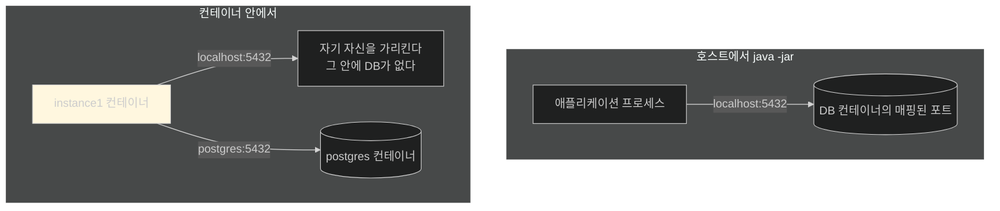
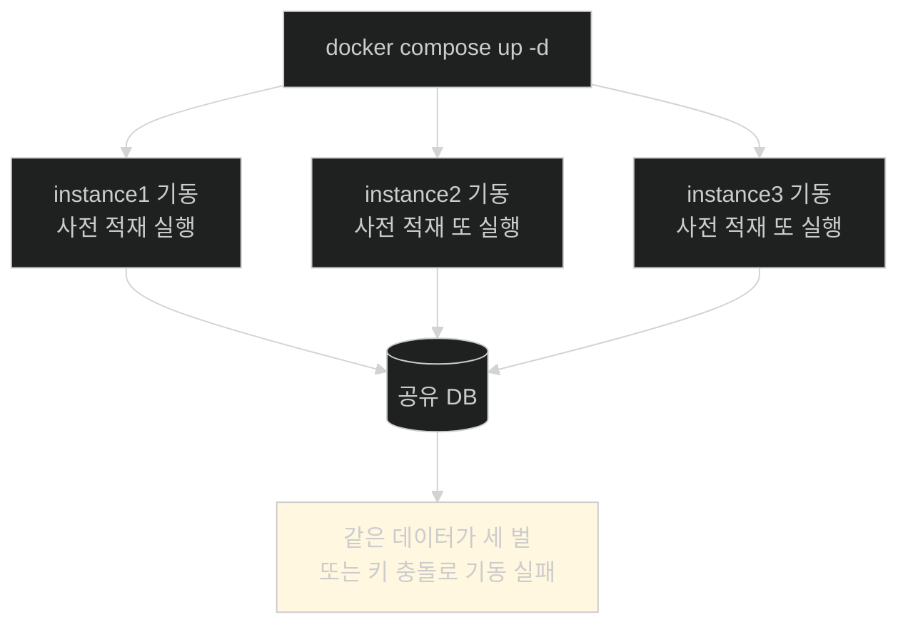
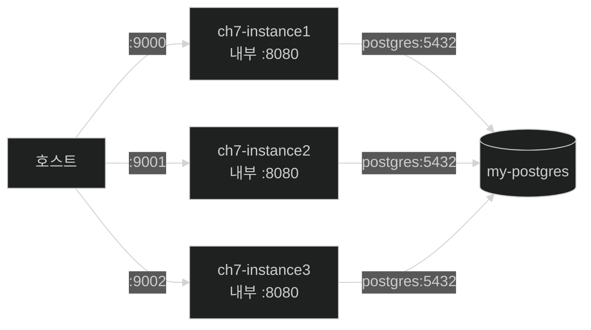

# 명령 하나로 환경 전체 — Compose, 그리고 사전 적재의 함정

## 한눈에 보기

| 질문 | 핵심 답 |
|---|---|
| 왜 Compose인가 | 손으로 네 번 띄우는 대신 **환경 전체를 한 파일로 선언** |
| 먼저 고칠 것 | `localhost` → **`postgres`**(서비스 이름) |
| 왜 | 같은 Compose 네트워크 안에서는 **서비스 이름으로 통신**한다 |
| 파일 | `compose.yml` — postgres 1 + instance 3 |
| 포트 매핑 | `9000:8080`, `9001:8080`, `9002:8080` — **호스트만 다르고 안은 같다** |
| 실행 | `docker compose up -d` |
| 가장 중요한 Note | **사전 적재 데이터를 세 인스턴스가 각자 만들면 안 된다** → `@Profile("setup")` |
| 그다음은 | Kubernetes 같은 오케스트레이션 |

## 1. 왜 이게 필요한가

### 출발 장면: 터미널 탭 네 개

[[04b-configuring-a-shared-database]]까지 하면 환경이 이렇게 구성된다.

```text
터미널 1: docker run … postgres:16
터미널 2: SPRING_PROFILES_ACTIVE=instance1 java -jar …
터미널 3: SPRING_PROFILES_ACTIVE=instance2 java -jar …
터미널 4: SPRING_PROFILES_ACTIVE=instance3 java -jar …
```

동작은 한다. 그런데 문제가 있다.

| 문제 | 결과 |
|---|---|
| 순서를 지켜야 한다 | DB가 먼저 떠야 한다 |
| 명령을 기억해야 한다 | 팀원마다 다르게 띄운다 |
| 종료도 하나씩 | 정리를 잊는다 |
| 재현이 안 된다 | "내 환경에서는 됐는데" |

책의 정리가 간결하다 — **"인스턴스를 하나씩 수동으로 띄우는 것은 Spring Boot 프로파일이 어떻게 동작하는지 보여 주는 데는 도움이 되지만, 실제 시나리오에서는 [[Docker-Compose]](= 여러 컨테이너와 그 관계를 한 파일에 선언해 함께 띄우는 도구)로 환경 전체를 정의하고 명령 하나로 시작하는 편이 더 흔하다."**

## 2. 어떻게 동작하는가

### 2.1 먼저 주소를 바꾼다

세 프로퍼티 파일에서 이 줄을

```properties
spring.datasource.url=jdbc:postgresql://localhost:5432/postgres
```

이렇게 바꾼다.

```properties
spring.datasource.url=jdbc:postgresql://postgres:5432/postgres
```

**`localhost`가 `postgres`가 됐다.** 이유가 명확하다.



컨테이너 안에서 `localhost`는 **그 컨테이너 자신**이다. 데이터베이스가 아니다. 그래서 그대로 두면 연결이 실패한다.

**[[서비스-이름-해석]]**(= 같은 Compose 네트워크의 컨테이너들이 서비스 이름으로 서로를 찾게 해 주는 내장 DNS)이 답이다. 책의 표현대로 **"Docker Compose로 실행하면 서비스들이 내부 네트워크로 통신하므로, `localhost` 대신 서비스 이름(`postgres`)으로 데이터베이스를 참조한다. Docker가 자동으로 해석해 준다."**

그다음 이미지를 다시 만든다.

```bash
% ./mvnw spring-boot:build-image
```

### 2.2 환경 전체를 한 파일로

```yaml
services:
  postgres:
     image: postgres:16
     container_name: my-postgres
     environment:
         POSTGRES_PASSWORD: mysecretpassword
     ports:
         - "5432:5432"

  instance1:
     image: ch7:0.0.1-SNAPSHOT
     container_name: ch7-instance1
     environment:
         SPRING_PROFILES_ACTIVE: instance1
     ports:
         - "9000:8080"
     depends_on:
         - postgres

  instance2:
     image: ch7:0.0.1-SNAPSHOT
     container_name: ch7-instance2
     environment:
         SPRING_PROFILES_ACTIVE: instance2
     ports:
         - "9001:8080"
     depends_on:
         - postgres

  instance3:
     image: ch7:0.0.1-SNAPSHOT
     container_name: ch7-instance3
     environment:
         SPRING_PROFILES_ACTIVE: instance3
     ports:
         - "9002:8080"
     depends_on:
         - postgres
```

| 항목 | 하는 일 |
|---|---|
| `image: postgres:16` | [[04b-configuring-a-shared-database]]에서 쓴 그 이미지 |
| `container_name` | **고정 이름.** [[02a-building-the-right-type-of-container]]의 임의 이름 대신 |
| `environment: POSTGRES_PASSWORD` | `docker run -e`와 같은 것 |
| `image: ch7:0.0.1-SNAPSHOT` | [[02-building-a-docker-container]]에서 구운 **[[컨테이너-이미지]]** |
| `environment: SPRING_PROFILES_ACTIVE` | 앞 절의 환경 변수를 선언으로 |
| `ports` | **[[포트-매핑]]** — 아래 참고 |
| **[[depends_on]]** | 기동 순서 |

### 2.3 포트 매핑의 비대칭이 핵심이다

```text
instance1:  "9000:8080"
instance2:  "9001:8080"
instance3:  "9002:8080"
```

**왼쪽(호스트)만 다르고 오른쪽(컨테이너 내부)은 전부 8080이다.**

이것이 [[04a-scaling-with-spring-boot]]에서 손으로 띄울 때와 근본적으로 다른 점이다.

| | 호스트에서 직접 실행 | 컨테이너 |
|---|---|---|
| 포트 충돌 | **일어난다** — 한 OS의 포트 공간을 공유 | 일어나지 않는다 — **각자 네트워크 스택** |
| 앱이 쓰는 포트 | 인스턴스마다 달라야 한다 | **전부 8080이어도 된다** |
| 구분하는 곳 | 애플리케이션 설정 | **매핑** |

컨테이너가 격리된 네트워크 스택을 갖는다는 [[02-building-a-docker-container]]의 성질이 여기서 실질적 이득이 된다. **애플리케이션은 자기가 8080에 떠 있다고만 알면 되고, 밖에서 어느 포트로 보이는지는 배치가 정한다.**

> **원문의 공백.** 그런데 그러면 `application-instance{N}.properties`의 `server.port` 값(9000·9001·9002)은 어떻게 되나. 컨테이너 안에서 그 값이 적용되면 앱은 9000에 뜨는데 매핑은 8080을 가리키므로 **연결되지 않는다.** 책은 이 점을 설명하지 않는다.
>
> 더 근본적인 문제도 있다. 앞 절([[04-tuning-and-scaling-in-production]])은 그 프로퍼티 파일들을 **"로컬 폴더", 즉 JAR 옆에** 만들라고 했다. 그런데 `compose.yml`은 `image: ch7:0.0.1-SNAPSHOT`을 그대로 띄운다. **호스트의 파일은 이미지 안에 없다.** 그대로 따르면 컨테이너가 프로파일 설정을 찾지 못하고, DB 접속 정보도 적용되지 않는다. 이미지에 담으려면 `src/main/resources`에 두고 다시 빌드해야 하고, 그러면 `server.port` 문제가 앞의 형태로 남는다.

### 2.4 `depends_on`의 한계

책은 `depends_on: postgres`를 "데이터베이스 컨테이너가 애플리케이션 인스턴스보다 먼저 시작되도록 **보장한다**"고 설명한다.

정확히는 **기동 순서만** 보장한다. "컨테이너가 시작됐다"까지이고 "PostgreSQL이 연결을 받을 준비가 됐다"는 아니다. 데이터베이스는 초기화에 몇 초가 걸리므로, 그 사이 인스턴스의 연결 시도가 실패할 수 있다.

[[../../part-5-observing-spring-boot-4-applications/chapter-13-observing-spring-boot-4-applications/03a-setting-up-the-logging-infrastructure|Chapter 13]]에서도 같은 성질이 나온다. 운영에서는 헬스 체크 기반의 기동 조건(`condition: service_healthy`)이 필요하다.

책이 짚는 네트워크 성질은 정확하다 — **모든 서비스가 같은 기본 Compose 네트워크에 속하므로 서비스 이름으로 통신할 수 있다.**

### 2.5 한 명령

```bash
% docker compose up -d
```

이 한 줄이 앞의 터미널 네 개를 대신한다. 그리고 `http://localhost:9000`, `:9001`, `:9002`로 접근한다.

### 2.6 가장 중요한 Note — 사전 적재 데이터

책이 이 장에서 가장 실무적인 경고를 여기에 둔다. **운영 데이터 경고.**

문제는 이렇다. [[../../part-2-creating-an-application-with-spring-boot/chapter-3-querying-for-data-with-spring-boot/03-creating-repositories-and-declarative-queries|Chapter 3]]과 [[../../part-2-creating-an-application-with-spring-boot/chapter-4-securing-an-application-with-spring-boot/06f-displaying-user-details-on-the-site|Chapter 4]]에서 사용자 로그인 정보와 동영상 항목을 **사전 적재**하는 코드를 넣었다.

인스턴스가 하나일 때는 문제가 없었다. 이제 셋이다.



책의 원칙이 단호하다 — **"시작하고 멈추며 여러 인스턴스로 도는 애플리케이션은 지속 데이터 관리 정책을 적용하는 수단이 아니다(is NOT the vehicle)."**

권하는 방식은 둘이다.

| 방식 | 내용 |
|---|---|
| **[[데이터베이스-마이그레이션]]** 도구 | Flyway나 Liquibase가 스키마 변경과 기준 데이터를 버전 관리된 절차로 다룬다 |
| DBA 통제 프로세스 | 사람이 통제하는 절차 |

그리고 예제 코드의 대응책도 알려 준다 — **데이터 적재 빈에 `@Profile("setup")`을 붙여 `setup` 프로파일이 활성일 때만 돌게 한다.** 이 장의 최종 코드에는 `application-setup.properties`와 그 제약이 들어 있다.

사용법의 단서도 강조된다 — 사전 적재를 하고 싶으면 `setup` 프로파일로 실행하되, **데이터베이스를 띄운 뒤 딱 한 번만** 하라.

이것이 [[04a-scaling-with-spring-boot]]의 "무상태 인스턴스" 원칙의 또 다른 얼굴이다. **인스턴스가 기동할 때마다 하는 일이 있으면, 인스턴스를 늘리는 순간 그 일이 여러 번 일어난다.**

### 2.7 열두 개가 되면

책이 마지막으로 범위를 넓힌다. **"여기서부터는 한계가 없다. 열두 벌도 돌릴 수 있다. 다만 이런 방식으로 하고 싶지는 않을 것이다."**

그때 필요한 것이 **[[오케스트레이션]]**(= 여러 컨테이너의 배치·확장·네트워킹·롤링 업데이트를 자동 관리하는 것)이고, 책이 네 가지를 소개한다.

| 도구 | 성격 | 트레이드오프 |
|---|---|---|
| **[[Kubernetes]]** | 지배적인 오케스트레이션 플랫폼 | 세밀한 제어와 확장성, 대신 **운영 복잡도와 가파른 학습 곡선** |
| Argo CD · Flux | Kubernetes용 **[[GitOps]]** 도구. Git 저장소를 감시해 실제 상태를 원하는 상태에 맞춘다 | GitHub Actions·GitLab CI·Jenkins·Tekton 같은 CI와 짝을 이룬다 |
| Spinnaker | 지속적 전달 플랫폼. 고급 배포 전략 지원 | 다른 인프라와의 통합이 필요하고, **새 Kubernetes GitOps 구성에서는 덜 선택된다** |
| VMware Tanzu | 엔터프라이즈 플랫폼 | 통합된 경험 대신 유연성이 낮다. **2023년 말 Broadcom 인수 후 로드맵·라이선스를 확인해야 한다** |

책의 태도가 균형 잡혀 있다. 각각 장단이 있고, **환경이 요구하는 제어 수준과 복잡도에 따라** 고르라는 것이다.

## 3. 그림으로 보기



| 규모 | 적절한 도구 |
|---|---|
| 인스턴스 1개 | `java -jar` |
| 인스턴스 3개, 한 기계 | **Docker Compose** |
| 인스턴스 수십 개, 여러 기계 | Kubernetes |
| 배포 자동화까지 | + Argo CD / Flux |

## 4. 이 노트에 나온 용어

| 용어 | 한 줄 뜻 | 정의 위치 |
|---|---|---|
| Docker Compose | 여러 컨테이너를 한 파일로 띄우는 도구 | [[_glossary#Docker-Compose]] |
| 서비스 이름 해석 | 컨테이너들이 서비스 이름으로 서로를 찾는 내장 DNS | [[_glossary#서비스-이름-해석]] |
| depends_on | 기동 순서를 지정하는 항목 | [[_glossary#depends_on]] |
| 포트 매핑 | 컨테이너 포트를 호스트 포트에 연결 | [[_glossary#포트-매핑]] |
| 프로파일 | 상황별 설정 묶음에 이름을 붙이는 장치 | [[_glossary#프로파일]] |
| 데이터베이스 마이그레이션 | 스키마·기준 데이터를 버전 관리된 절차로 다루는 것 | [[_glossary#데이터베이스-마이그레이션]] |
| 오케스트레이션 | 여러 컨테이너의 배치·확장을 자동 관리 | [[_glossary#오케스트레이션]] |
| Kubernetes | 지배적인 컨테이너 오케스트레이션 플랫폼 | [[_glossary#Kubernetes]] |
| GitOps | Git의 상태를 원하는 상태로 삼는 배포 방식 | [[_glossary#GitOps]] |
| 컨테이너 이미지 | 컨테이너를 만드는 읽기 전용 템플릿 | [[_glossary#컨테이너-이미지]] |

## 5. 자주 헷갈리는 것

**"컨테이너 안에서도 `localhost`가 통한다"** — 통하지만 **자기 자신**을 가리킨다. 다른 컨테이너는 서비스 이름으로 부른다.

**"인스턴스마다 내부 포트도 달라야 한다"** — 다를 필요가 없다. 네트워크 스택이 격리돼 있어 **전부 8080이어도** 된다.

**"`depends_on`이 DB 준비를 보장한다"** — **시작 순서만** 보장한다.

**"사전 적재 코드는 그대로 둬도 된다"** — 인스턴스가 셋이면 세 번 돈다. `@Profile("setup")`으로 막아야 한다.

**"Compose로 열두 개도 돌리면 된다"** — 돌아가지만 관리가 안 된다. 그 규모에는 오케스트레이션이 필요하다.

## 6. 언제 안 쓰나 / 경계

- **Compose는 한 호스트용이다.** 여러 기계에 걸친 배치는 오케스트레이션의 몫이다.
- **`depends_on`만으로는 부족하다.** 운영에서는 헬스 체크 조건이 필요하다.
- **프로파일 파일의 위치 문제가 남는다.** 위의 원문 공백 항목대로, 이미지 안에 들어가지 않으면 설정이 적용되지 않는다.
- **비유의 한계.** Compose 파일은 "무대 세팅 지시서"에 가깝다. 무엇을 어디에 놓고 어떤 순서로 올릴지 한 장에 적혀 있다. 다만 이 비유는 **지시서가 배우까지 만들어 내지는 않는다**는 점을 흐린다. Compose는 이미 만들어진 이미지를 배치할 뿐이고, 이미지가 없거나 낡았으면 아무리 정확한 지시서도 옛 공연을 올린다. 그래서 이 절이 `build-image`를 다시 돌리는 것으로 시작한다.

## 7. 연결

- [[04b-configuring-a-shared-database]] — 그 노트에서 손으로 띄운 DB와 설정이 이 노트에서 선언으로 바뀐다. `localhost`도 여기서 바뀐다.
- [[04a-scaling-with-spring-boot]] — 그 노트의 "무상태 인스턴스" 원칙이 사전 적재 문제로 다시 나타난다.
- [[02a-building-the-right-type-of-container]] — 거기서 본 임의 이름 대신 `container_name`으로 고정하는 이유가 여기서 드러난다.

## 8. 스스로 확인

1. 터미널 네 개로 띄우는 방식의 문제 네 가지는?
2. 컨테이너 안에서 `localhost`가 데이터베이스를 가리키지 못하는 이유는?
3. 포트 매핑에서 왼쪽만 다르고 오른쪽이 같아도 되는 근거는?
4. `depends_on`이 보장하는 것과 보장하지 않는 것은?
5. 사전 적재 코드가 인스턴스 셋에서 만드는 문제를 구체적으로 그릴 수 있는가?
6. 책이 "애플리케이션은 데이터 관리 정책의 수단이 아니다"라고 한 근거는?
7. `@Profile("setup")`이 하는 일과, 실행 시 주의 사항은?
8. Compose로 감당이 안 되는 규모에서 필요한 것과, 그 대가는?
9. 무대 세팅 지시서 비유가 깨지는 지점은 어디인가?


> 아홉 문항을 스스로 답한 **뒤에** [[_04c-running-the-setup-with-docker-compose]]에서 모범답안과 대조한다. 먼저 열면 이 문항들은 다시 인출 문제로 쓸 수 없다.

<!-- ==== 아래는 내 영역 · 스킬 수정 금지 ==== -->

## 내 설명 시도


## 막혔던 지점


## 리뷰 이력
