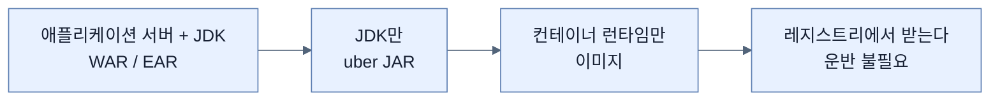
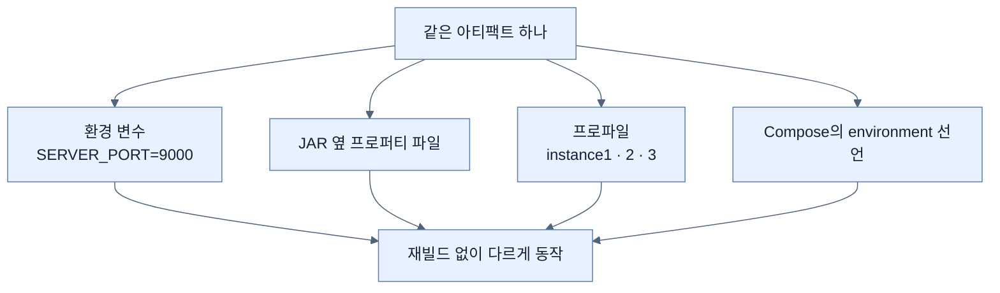

# Chapter 7 개념 지도 — Releasing an Application with Spring Boot

> 책 pp. 207–227 / PDF pp. 232–252. 노트 8개, 용어 40개, 책 이미지 0개.
> 원문 커버리지는 [[_coverage]], 용어 정의는 [[_glossary]]에 있다.

이 장의 문장은 하나다 — **IDE에서 서버까지 가는 단계를 최소화한다.** 그리고 그 최소화가 네 번 일어난다. 애플리케이션 서버를 없애고(uber JAR), 런타임 설치를 없애고(컨테이너), 물리적 운반을 없애고(레지스트리), 재빌드를 없앤다(외부 설정).

---

## 축 1 — 대상 머신에 무엇이 있어야 하나

장 전체를 "배포 대상에 요구하는 것이 줄어드는 과정"으로 읽으면 순서가 필연이 된다.

| 단계 | 대상에 필요한 것 | 없앤 것 | 노트 |
|---|---|---|---|
| 옛 방식 | 애플리케이션 서버 + JDK | — | (도입부) |
| uber JAR | **JDK** | 서버 설치·WAR/EAR 조립 | [[01-creating-an-uber-jar]] |
| 컨테이너 이미지 | **컨테이너 런타임** | 런타임 설치·버전 충돌 | [[02-building-a-docker-container]] · [[02a-building-the-right-type-of-container]] |
| 레지스트리 | 네트워크 | **물리적 운반** | [[03-publishing-an-image-to-docker-hub]] |

---

## 축 2 — 아티팩트는 불변, 달라지는 것은 밖에서

장의 후반부 네 노트는 전부 이 원칙의 변주다.

| 무엇을 밖으로 뺐나 | 노트 | 근거가 되는 규칙 |
|---|---|---|
| 포트 하나 | [[04-tuning-and-scaling-in-production]] | JAR 밖 설정이 JAR 안을 이긴다 |
| 인스턴스별 설정 묶음 | [[04a-scaling-with-spring-boot]] | 프로파일별 파일 |
| 데이터 | [[04b-configuring-a-shared-database]] | 상태를 인스턴스 밖으로 |
| 배치 전체 | [[04c-running-the-setup-with-docker-compose]] | 선언적 환경 정의 |

**세 번째 줄이 가장 깊다.** 설정만 밖으로 빼서는 확장이 안 된다. **상태**까지 빼야 한다.

---

## 축 3 — 수평 확장이 성립하기 위한 조건

[[04a-scaling-with-spring-boot]]이 문제를 드러내고 [[04b-configuring-a-shared-database]]와 [[04c-running-the-setup-with-docker-compose]]가 답한다.

| 조건 | 왜 필요한가 | 어디서 해결 | 안 지키면 |
|---|---|---|---|
| ① 인스턴스마다 다른 주소 | 포트가 겹치면 안 뜬다 | [[04a-scaling-with-spring-boot]] | 두 번째부터 기동 실패 |
| ② 무상태 | 로드 밸런서가 아무 인스턴스로나 보낸다 | [[04b-configuring-a-shared-database]] | **데이터가 사라졌다 나타난다** |
| ③ 기동 시 부작용 없음 | 인스턴스 수만큼 반복된다 | [[04c-running-the-setup-with-docker-compose]] | 사전 적재가 세 번 |
| ④ 재현 가능한 배치 | 사람마다 다르게 띄우면 안 된다 | [[04c-running-the-setup-with-docker-compose]] | "내 환경에서는 됐는데" |

③이 이 장에서 가장 실무적인 경고다. 책의 표현대로 **"시작하고 멈추며 여러 인스턴스로 도는 애플리케이션은 지속 데이터 관리 정책을 적용하는 수단이 아니다."**

---

## 축 4 — 같은 개념이 두 층위에서 반복된다

컨테이너 이야기와 애플리케이션 이야기에서 **같은 구조가 두 번** 나온다.

| 개념 | 컨테이너 층위 | 애플리케이션 층위 |
|---|---|---|
| 이름 붙이기 | `docker tag`의 `namespace/name:tag` ([[03-publishing-an-image-to-docker-hub]]) | 프로파일 이름 `instance1` ([[04a-scaling-with-spring-boot]]) |
| 고정 vs 임의 | `container_name` vs Docker의 임의 이름 ([[02a-building-the-right-type-of-container]]) | 프로파일 지정 vs 기본값 |
| 한 번 만들고 여러 번 쓰기 | 이미지 하나 → 인스턴스 N ([[02-building-a-docker-container]]) | JAR 하나 → 프로세스 N ([[04a-scaling-with-spring-boot]]) |
| 변경 빈도로 나누기 | 레이어 분리 ([[02a-building-the-right-type-of-container]]) | 설정을 아티팩트 밖으로 ([[04-tuning-and-scaling-in-production]]) |

마지막 줄이 특히 흥미롭다. **"자주 바뀌는 것과 안 바뀌는 것을 분리한다"**는 원칙이 레이어 설계와 설정 외부화에서 같은 모양으로 나타난다.

---

## 축 5 — 이 장이 남긴 원문의 오류

전체 표는 [[_coverage]] 5절에 있다.

| 위치 | 문제 | 노트 |
|---|---|---|
| pp. 222–223 | **`spring.jpa.hibernate.show-sql`은 존재하지 않는 키**다(Boot 4.1.0 배포물로 확인). 바로 아래 설명은 올바른 `spring.jpa.show-sql`을 쓴다 | [[04b-configuring-a-shared-database]] |
| pp. 223–225 | `application-instance*.properties`가 **컨테이너 이미지 안에 어떻게 들어가는지** 설명이 없다. 앞 절대로 JAR 옆에 두면 이미지에는 없다 | [[04c-running-the-setup-with-docker-compose]] |
| p. 213 vs p. 215 | 로그의 플러그인 버전은 `4.0.0`, 배너는 `v4.1.0` | [[02a-building-the-right-type-of-container]] |
| p. 226 | `depends_on`이 준비 완료를 "보장한다"고 서술 — 기동 순서만 보장한다 | [[04c-running-the-setup-with-docker-compose]] |
| p. 222 | `-p 5432:5432`를 "public에 export"라고 표현 — 호스트 인터페이스 바인딩이다 | [[04b-configuring-a-shared-database]] |
| p. 223 | `hibernate.dialect` 명시는 Hibernate 6 이후 대개 불필요 | [[04b-configuring-a-shared-database]] |

---

## 앞뒤 Chapter와의 연결

- **← Chapter 6** — [[../chapter-6-configuring-an-application-with-spring-boot/05-ordering-property-overrides|Ordering property overrides]]: 이 장의 "JAR 밖이 JAR 안을 이긴다"가 전적으로 그 노트의 Config Data 4단계 위에 서 있다. 프로파일 파일 규칙도 [[../chapter-6-configuring-an-application-with-spring-boot/02-creating-profile-based-property-files|그 장]]의 것이다.
- **← Chapter 5** — [[../../part-2-creating-an-application-with-spring-boot/chapter-5-testing-with-spring-boot/07-testing-repositories-with-testcontainers|Testcontainers 리포지토리 테스트]]: 그 장이 PostgreSQL로 통합 테스트를 해 뒀기에 [[04b-configuring-a-shared-database]]가 "같은 이미지를 운영에 쓴다"고 말할 수 있다.
- **→ Chapter 8** — [[../chapter-8-going-native-with-spring-boot/04-building-native-container-images|Building native container images]]: 이 장의 Paketo 위임 구조를 그대로 쓰면서 JVM 대신 네이티브 바이너리를 담는다.
- **→ Chapter 13** — [[../../part-5-observing-spring-boot-4-applications/chapter-13-observing-spring-boot-4-applications/02-designing-an-observability-architecture|Observability architecture]] · [[../../part-5-observing-spring-boot-4-applications/chapter-13-observing-spring-boot-4-applications/06-correlating-logs-metrics-and-traces|Correlating signals]]: 이 장에서 인스턴스를 셋으로 늘린 순간, 요청 하나를 추적하려면 그 장의 상관관계가 필요해진다.

특히 **Chapter 13과의 짝**이 중요하다. [[04a-scaling-with-spring-boot]]에서 인스턴스가 셋이 되는 순간 "어느 인스턴스가 그 요청을 처리했나"가 새 문제로 등장한다. 배포 version과 digest를 텔레메트리 리소스 속성에 담아야 한다는 것도 [[03-publishing-an-image-to-docker-hub]]의 태그 이야기와 이어진다.
