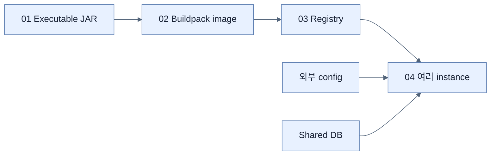

# Chapter 7 지도 — Releasing an Application

## 산출물 축

`source → tested executable JAR → layered OCI image → registry digest → configured runtime instances`

## 운영 책임 축

Boot가 packaging과 sensible image build를 단순화하지만 registry 보안, rollout, health/readiness, DB migration, secret과 관측은 배포 시스템이 계속 관리한다.

