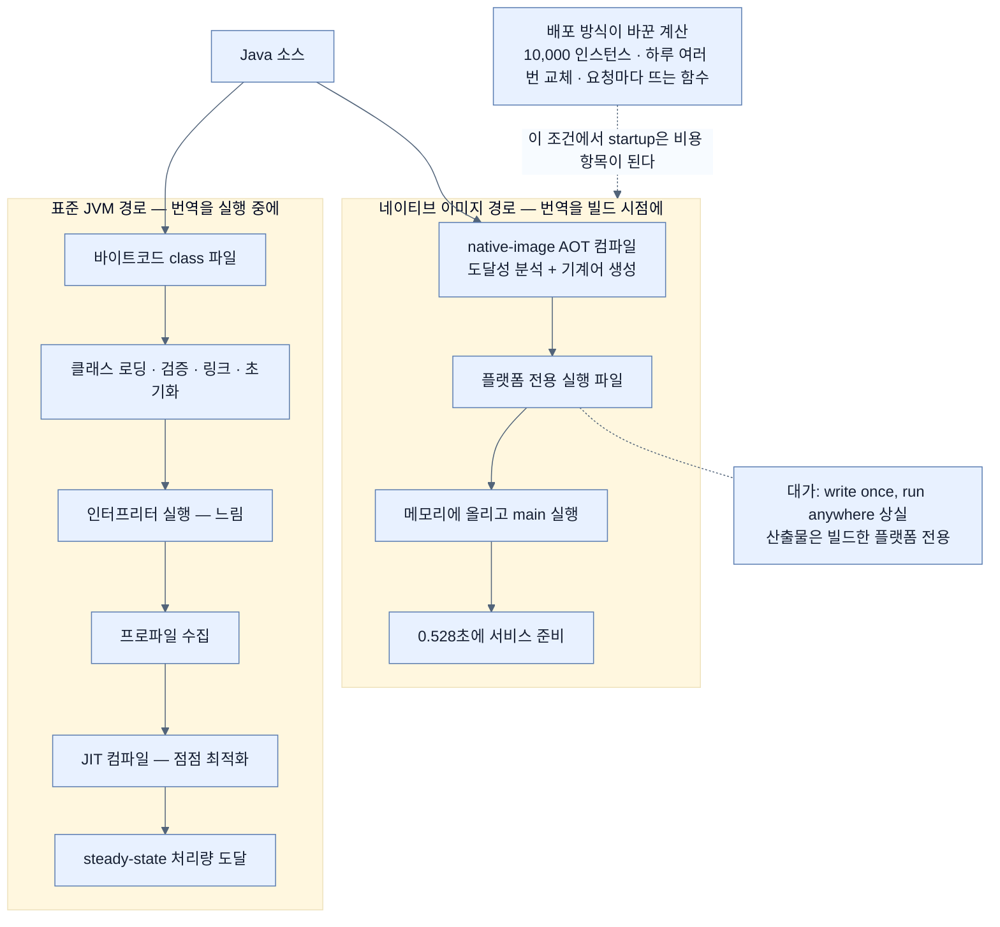

# GraalVM이 등장한 이유 — startup time이 청구서가 되는 순간

## 한눈에 보기

| | 예전 | 지금 |
|---|---|---|
| 배포 단위 수명 | 몇 주~몇 달 | 하루에도 여러 번 교체 |
| 인스턴스 수 | 수십 대 | 10,000대 |
| 실행 단위 | 웹 애플리케이션 | **요청이 올 때 뜨는 함수** |
| 30초 startup의 의미 | 하루에 한 번, 무시 가능 | 곱하기 10,000, 곱하기 하루 몇 번 |

Java의 startup time은 오래 "사소한 흠"이었다. 그것을 **비용 항목**으로 바꾼 것은 언어가 아니라 배포 방식이다.

## 1. 왜 이게 필요한가

Java는 오랫동안 성능 비판을 받아 왔고, 상당 부분은 사실이었다. 그런데 Java는 여러 세대에 걸쳐 도약해 원시 성능에서는 다른 플랫폼과 겨룰 만해졌다.

그런데도 사람들이 계속 붙잡고 늘어진 것이 하나 있다. **startup time**이다.

Java 앱은 자기 가상 머신 안에서 도니 Go나 C++ 바이너리만큼 빠르게 시작하지 못한다. 오랫동안 이것은 문제가 아니었다 — 웹 앱은 한 번 뜨면 몇 주씩 살아 있고, 30초는 그 몇 주에 비하면 없는 시간이다.

그 전제가 두 곳에서 무너졌다.

**첫째, 지속 배포.** 인스턴스 10,000개가 동시에 돌면서 하루에도 여러 번 교체되는 시스템에서 30초는 더 이상 한 번이 아니다. 교체할 때마다 10,000번 지불하는 시간이고, **[[지속-배포]]**(= 작은 변경을 자주 자동으로 배포하는 방식)를 열심히 할수록 더 자주 지불한다.

**둘째, 실행 가능 함수.** AWS Lambda 같은 플랫폼에서는 **함수 하나가 애플리케이션 전체**로 배포되고, 그 결과가 다른 함수로 흘러 들어간다. 요청이 올 때 즉시 띄우는 이 **[[서버리스]]**(= 요청 때 띄우고 끝나면 내리는 실행 모델)에서 **[[cold-start]]**(= 인스턴스가 뜬 뒤 첫 요청을 처리하기까지의 지연)는 기술 선택을 좌우하는 1순위 지표가 된다.

여기에서 **[[GraalVM]]**(= Oracle의 고성능 런타임이자 툴체인)이 등장한다.

## 2. 어떻게 동작하는가

### 2.1 잃어버린 30초는 어디로 갔나

Java가 느리게 시작하는 이유를 알아야 GraalVM이 무엇을 바꾸는지 보인다. **[[JVM]]**(= 바이트코드를 실행하는 가상 머신)이 뜨면서 하는 일이 이렇다.

1. **[[바이트코드]]**(= 플랫폼 중립 중간 표현)로 된 class 파일 수천 개를 찾아 읽는다.
2. 검증하고 링크하고 초기화한다.
3. 처음엔 인터프리터로 실행한다 — **느리다**.
4. 실행하면서 프로파일을 모아, 자주 도는 코드를 **[[JIT]]**(= 실행 중 hot code를 기계어로 컴파일하는 방식)로 점점 최적화한다.

3번과 4번이 startup을 잡아먹는다. 그리고 이 비용은 **매 인스턴스가 처음부터 다시** 지불한다. 앞 인스턴스가 애써 알아낸 최적화는 프로세스가 죽는 순간 사라진다.

### 2.2 GraalVM이 바꾸는 것

GraalVM은 이 순서를 뒤집는다. 실행 중에 번역하는 대신 **미리** 번역한다 — **[[AOT-컴파일]]**(= 실행 전에 미리 기계어로 번역해 두는 방식)이다. 그 산출물이 **[[네이티브-이미지]]**(= 미리 컴파일된 플랫폼 전용 독립 실행 파일)다.

그러면 위 네 단계가 이렇게 줄어든다.

1. 실행 파일을 메모리에 올린다.
2. `main`부터 실행한다. **끝.**

class 로딩도, 인터프리터 구간도, 워밍업도 없다. 이 장의 예제가 **0.528초**에 뜨는 이유다.

### 2.3 이름이 두 가지를 가리킨다

여기서 혼동이 하나 생긴다. 책은 GraalVM을 "어떤 언어든 지원하는 새로운 가상 머신"이라 소개하며 "JAR을 JVM 말고 GraalVM에서 돌려라"라고 쓴다. 그건 GraalVM의 **한 얼굴**이다.

| GraalVM의 얼굴 | 무엇인가 | 이 장에서 쓰는가 |
|---|---|---|
| 런타임(VM) | Graal 컴파일러를 JIT로 쓰는 JVM. 여러 언어를 한 VM에서 돌린다 | 아니오 |
| `native-image` 도구 | 애플리케이션을 AOT 컴파일해 독립 실행 파일을 만드는 컴파일러 | **예, 이것만** |

이 장이 실제로 쓰는 것은 두 번째다. 그래서 최종 산출물에는 **JVM이 아예 없다.**

### 2.4 대가는 write once, run anywhere

Java 초창기의 혁명은 **[[write-once-run-anywhere]]**(= 같은 바이트코드를 어디서나 실행)였다. 그 이전에는 배포할 기계 아키텍처마다 따로 컴파일해야 했다. 바이트코드와 JVM이 그 짐을 없앴고, 덤으로 JIT 같은 컴파일 이후 최적화까지 열어 줬다.

네이티브 이미지는 **그 시절로 되돌아간다.** 산출물은 빌드한 플랫폼 전용이다.

이것을 손해로만 볼지는 배포 방식에 달렸다. CI가 타깃과 같은 OS·아키텍처에서 빌드한다면, "어디서나 돌아간다"는 성질은 애초에 쓰지 않던 성질이다.

### 2.5 Spring은 어디에 있었나

2019년 실험 프로젝트 **[[Spring-Native]]**(= Boot 2.x 시대에 GraalVM 지원을 검증하던 다리)가 시작됐고, 그 뒤 Spring 포트폴리오의 거의 모든 영역이 이 방향에 맞춰 조정됐다. 지금 그 결과는 별도 프로젝트가 아니라 본류에 들어와 있다 — [[04a-from-spring-native-to-mainstream]]이 그 이야기다.

### 2.6 비유와 그 한계

즉석 요리와 밀키트에 빗댈 수 있다. JVM은 주문을 받고 나서 재료를 손질하는 식당이다 — 준비 시간이 걸리지만 손님 반응을 보며 간을 조절할 수 있다(JIT). 네이티브 이미지는 미리 다 조리해 진공포장해 둔 밀키트다 — 데우기만 하면 되니 즉시 나오지만, 만들 때 정한 간을 나중에 못 바꾼다.

**깨지는 지점 둘.** 첫째, 밀키트는 **아무 데서나 데울 수 있지만** 네이티브 이미지는 만든 플랫폼에서만 돈다 — 오히려 원재료(바이트코드) 쪽이 이동성이 좋다. 둘째, 밀키트는 "무엇이 들어갈지"를 요리사가 정하지만, 네이티브 이미지는 **컴파일러가 도달성 분석으로 정한다.** 요리사가 넣으려던 재료가 조용히 빠질 수 있고, 그 문제가 [[02-adapting-an-application-for-native-image]]의 주제다.

## 3. 그림으로 보기

## 4. 이 노트에 나온 용어

- **[[GraalVM]]**: Oracle의 고성능 런타임이자 툴체인. 이 장에서는 `native-image` 컴파일러로 쓴다.
- **[[네이티브-이미지]]**: 미리 컴파일된 플랫폼 전용 독립 실행 파일.
- **[[AOT-컴파일]]**: 실행 전에 미리 기계어로 번역해 두는 방식.
- **[[JIT]]**: 실행 중 프로파일을 보고 hot code를 기계어로 컴파일하는 방식.
- **[[바이트코드]]**: Java 컴파일러가 만드는 플랫폼 중립 중간 표현.
- **[[JVM]]**: 바이트코드를 실행하는 가상 머신.
- **[[write-once-run-anywhere]]**: 같은 바이트코드를 어디서나 실행한다는 Java의 약속.
- **[[cold-start]]**: 인스턴스가 뜬 뒤 첫 요청을 처리하기까지의 지연.
- **[[서버리스]]**: 요청 때 띄우고 끝나면 내리는 실행 모델.
- **[[지속-배포]]**: 작은 변경을 자주 자동으로 배포하는 방식.
- **[[Spring-Native]]**: Boot 2.x 시대의 실험 프로젝트. 지금은 본류에 흡수됐다.

## 5. 자주 헷갈리는 것

**원문의 이름 겹침** — 책 p.230은 "GraalVM은 본질적으로 새로운 가상 머신"이라고 소개하지만, 이 장이 실제로 쓰는 것은 VM으로서의 GraalVM이 아니라 **`native-image` AOT 컴파일러**다. 최종 산출물에는 JVM이 없다. 같은 이름이 두 가지를 가리키니 "GraalVM에서 돌린다"는 문장이 나올 때마다 어느 쪽인지 확인해야 한다.

**"네이티브가 항상 빠르다"** — 빠른 것은 **시작**이다. 오래 도는 서비스에서는 JIT가 실제 실행 패턴에 맞춰 최적화하므로 **최고 처리량은 JVM 쪽이 더 높을 수 있다.** 이 트레이드오프가 [[07b-comparing-four-execution-strategies]]의 핵심이다.

**"startup이 느린 건 Spring 탓"** — Spring의 bean 스캔·프록시 생성이 기여하는 것은 맞지만, class 로딩과 워밍업이라는 더 큰 몫은 JVM 자체의 실행 모델이다. 그래서 해법도 Spring 설정이 아니라 실행 모델을 바꾸는 쪽에 있다.

## 6. 언제 안 쓰나 / 경계

- **오래 도는 소수의 인스턴스**에는 이득이 거의 없다. 하루 한 번 뜨는 서버 세 대의 30초는 90초다.
- **빌드 시간과 CI 비용**이 크게 는다. Figure 8.1이 보여 주듯 메서드 컴파일에만 161초, Peak RSS 5.03GB가 든다 — [[03-building-and-running-a-native-application]].
- **동적 기능에 크게 기대는 앱**은 옮기는 비용이 이득을 넘을 수 있다 — [[02-adapting-an-application-for-native-image]].
- **JVM에 남으면서 startup을 줄이는 길**도 있다. 네이티브가 유일한 답이 아니다 — [[07-using-java-25-aot-cache]].

## 7. 연결

- [[02-adapting-an-application-for-native-image]] — AOT 컴파일이 요구하는 닫힌 세계 가정과 그 대가.
- [[03a-why-native-images-pay-off]] — "그래서 얼마를 아끼나"를 숫자로 따진다.
- [[04a-from-spring-native-to-mainstream]] — Spring Native가 어디로 갔는지.
- [[07b-comparing-four-execution-strategies]] — 네이티브가 유일한 선택지가 아닌 이유.

## 8. 스스로 확인

- 30초 startup이 20년 전에는 문제가 아니었다가 지금 문제가 된 이유를 배포 방식으로 설명해 보라.
- JVM이 시작할 때 하는 네 가지 일 중 네이티브 이미지가 없애는 것은 무엇이고, 그 대가는?
- "GraalVM에서 돌린다"는 말이 이 장에서 실제로 뜻하는 것은 무엇인가?
- write once, run anywhere를 포기해도 괜찮은 배포 환경의 조건은?

<!-- ==== 아래는 내 영역 · 스킬 수정 금지 ==== -->

## 내 설명 시도

## 막혔던 지점

## 리뷰 이력
