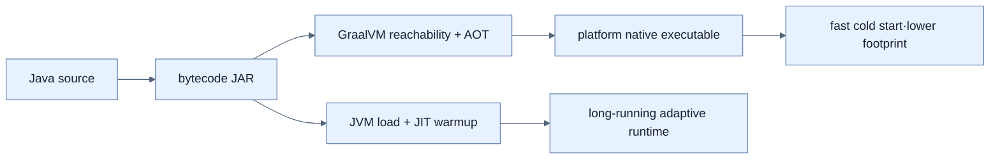

# GraalVM Native Image가 필요한 이유

## 한눈에 보기

GraalVM Native Image는 Java application을 platform-specific machine executable로 미리 compile해 JVM cold start와 memory overhead를 줄인다. 짧게 실행되는 function, 자주 scale-to-zero/replace되는 container, 대량 instance에서 startup latency가 비용이 될 때 가치가 커진다.

## 1. 왜 이게 필요한가

Long-running service에서는 JIT warmup 비용이 전체 lifetime에 비해 작지만 serverless와 rapid scaling에서는 request가 올 때마다 지연과 resource 비용으로 나타난다. 수천 instance의 작은 차이는 fleet 전체 비용과 rollout 시간을 바꾼다.

## 2. 어떻게 동작하는가

일반 Java는 bytecode를 JVM이 class-load하고 profile한 뒤 hot method를 JIT compile한다. Native-image builder는 build time에 reachable code를 분석하고 machine code, heap metadata, runtime support를 하나의 executable로 고정한다. 결과는 빠르게 시작하고 보통 memory가 작지만 architecture/OS별로 다시 build하며 runtime adaptability와 peak optimization trade-off가 생긴다.

Native image는 instant coffee와 비슷해 준비 시간을 줄이지만 원두·추출 방식을 현장에서 바꾸기 어렵다. 항상 빠른 throughput이나 작은 total cost를 보장하지 않으므로 실제 workload benchmark로 결정한다.

## 3. 그림으로 보기

## 4. 이 노트에 나온 용어

- **cold start**: process가 없는 상태에서 application이 요청 처리 가능해질 때까지의 시작.
- **native image**: build machine target용 machine code로 미리 compile한 executable.
- **AOT compilation**: 실행 전 build 단계에서 machine code를 생성하는 compile 방식.

## 7. 연결

- [[02-adapting-an-application-for-native-image]] — 성능 이익과 맞바꾸는 closed-world 제약을 다룬다.
- [[03-building-and-running-a-native-application]] — 실제 native compile workflow다.
- [[07-java-25-aot-cache-and-crac-comparison]] — JVM을 유지하는 다른 startup 개선과 비교한다.

## 8. 스스로 확인

- 전체 1차 정리 후: long-running service보다 serverless에서 startup latency가 중요한 이유를 설명한다.

<!-- ==== 아래는 내 영역 · 스킬 수정 금지 ==== -->

## 내 설명 시도

## 막혔던 지점

## 리뷰 이력

