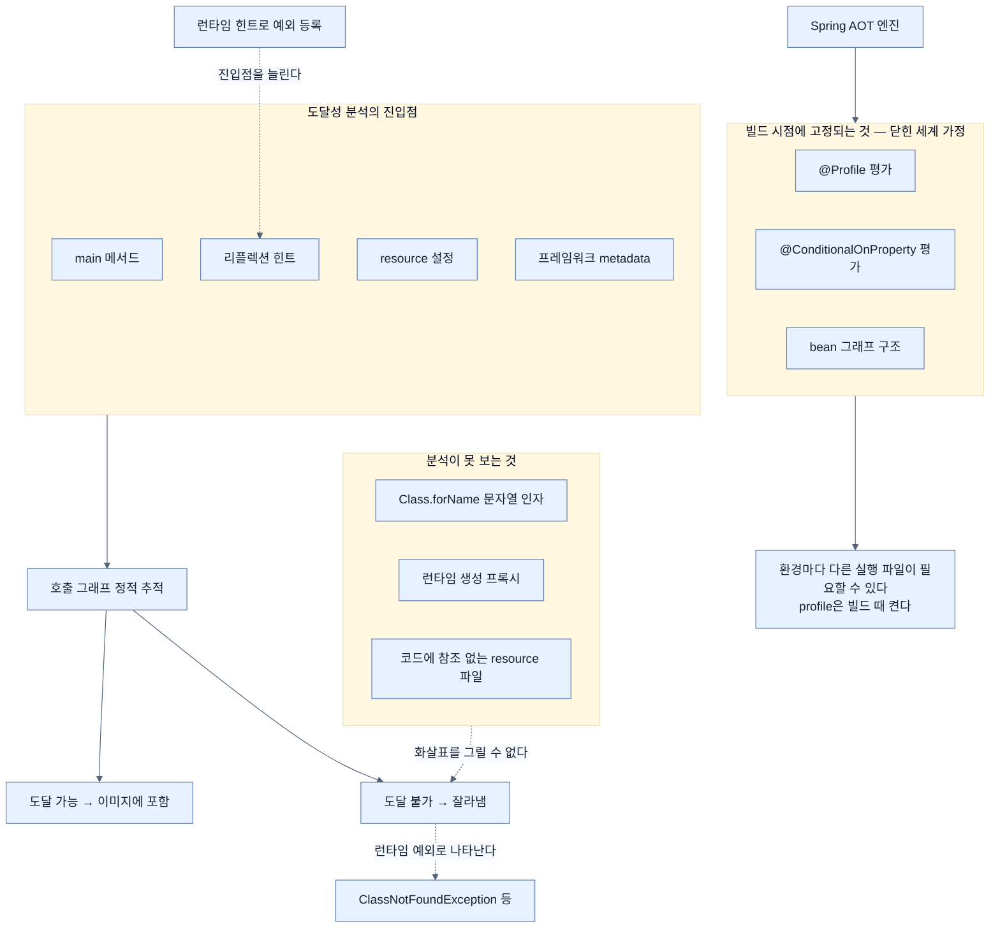

# 닫힌 세계 가정 — 빌드 시점에 고정되는 것들

## 한눈에 보기

| 잃는 것 | 이유 |
|---|---|
| 리플렉션의 자유 | 호출 대상이 문자열이라 정적 추적이 못 본다 |
| 동적 프록시 | 런타임 바이트코드 생성이 불가능하다 |
| 외부 resource의 자동 포함 | 코드에서 참조가 보이지 않으면 잘려 나간다 |
| **런타임 조건 평가** | `@Profile`·`@ConditionalOnProperty`가 **빌드 때** 결정된다 |

이 장의 코드는 앞 장 코드의 **복사본**이다. 바뀌는 것은 애플리케이션이 아니라 **빌드 파일**이다.

## 1. 왜 이게 필요한가

"그럼 모든 애플리케이션을 GraalVM으로 컴파일하면 되지 않나?"

[[01-why-graalvm-native-image]]의 숫자만 보면 당연한 질문이다. 답은 **trade-off** 때문이다. 그리고 그 trade-off가 왜 생기는지는 컴파일러가 무엇을 하는지 보면 바로 드러난다.

`native-image`는 실행 파일을 작고 빠르게 만들어야 한다. 그러려면 **안 쓰는 것을 버려야** 한다. 그런데 무엇이 안 쓰이는지 어떻게 아나?

그래서 쓰는 것이 **[[도달성-분석]]**(= 알려진 진입점에서 호출 그래프를 정적으로 추적하는 분석)이다. `main` 메서드, 리플렉션 힌트, resource 설정, 프레임워크가 준 metadata를 진입점으로 삼아 호출 그래프를 따라간다. **거기서 닿지 않는 것은 최종 이미지에서 잘라낸다.**

여기서 문제가 생긴다. 이런 코드를 생각해 보자.

```java
Class<?> type = Class.forName(props.getProperty("handler.class"));
Object handler = type.getDeclaredConstructor().newInstance();
```

정적 분석기의 눈에 `Class.forName`의 인자는 **그냥 문자열**이다. 어떤 클래스가 들어올지 알 수 없으니 그 클래스로 가는 화살표를 그릴 수 없고, 화살표가 없으면 그 클래스는 **도달 불가**로 판정돼 잘려 나간다. 실행하면 `ClassNotFoundException`이 뜨는데, 그때는 이미 배포된 뒤다.

## 2. 어떻게 동작하는가

### 2.1 포기하는 네 가지

책이 드는 목록은 이렇다.

| 제약 | 무슨 뜻인가 |
|---|---|
| **[[리플렉션]]**(= 이름으로 클래스·메서드에 런타임 접근) 제한 | 여전히 되지만 **대상을 등록해야** 한다 |
| **[[동적-프록시]]**(= 런타임에 바이트코드로 만드는 구현체) 제한 | 모든 프록시가 **빌드 시점에** 생성돼야 한다 |
| 외부 resource의 특수 취급 | 어떤 파일이 필요한지 미리 알려 줘야 한다 |
| 조건과 구조의 빌드 시점 평가 | 아래 2.3 |

여기서 흔한 오해 하나를 책이 직접 바로잡는다. **"네이티브에서는 리플렉션과 프록시가 지원되지 않는다"는 서술은 거짓이다.** 리플렉션은 지원되되 상대편 코드가 등록돼야 하고, 프록시는 런타임 생성이 안 될 뿐 빌드 시점 생성은 된다. **사용의 제약이지 지원의 부재가 아니다.**

### 2.2 그래서 Spring이 한 일

이 제약 때문에 Spring 쪽이 스스로를 고쳤다.

- Spring Framework는 **리플렉션 의존을 줄였다.**
- Spring Boot는 bean 정의를 담은 configuration class의 **프록시를 가능한 한 피한다.** 애플리케이션 전체의 프록시 수를 줄이기 위해서다.
- Spring 팀과 GraalVM 팀이 함께 작업해, 한쪽은 불필요한 리플렉션을 걷어내고 다른 쪽은 Spring 기반 앱을 더 잘 지원하도록 진화했다.

즉 "네이티브가 잘 돌아간다"는 것은 저절로 된 것이 아니라 **양쪽이 서로에게 맞춰 온 결과**다.

### 2.3 가장 중요한 제약 — 조건이 빌드 때 정해진다

**[[닫힌-세계-가정]]**(= 프로그램이 무엇을 쓸지 빌드 시점에 전부 알 수 있다는 전제)이 이 장에서 가장 실질적인 영향을 미치는 곳이다.

**[[Spring-AOT-엔진]]**(= 빌드 시점에 애플리케이션 구조를 분석해 고정하는 처리 단계)이 애플리케이션을 분석하고 **그 순간 알려진 것을 기준으로 구조를 확정한다.** 런타임이 아니다.

결과가 세 가지다.

1. `@Profile`과 `@ConditionalOnProperty`가 **시작할 때가 아니라 빌드할 때** 평가된다.
2. 런타임에 property를 바꿔도 **애플리케이션 컨텍스트가 다시 만들어지지 않는다.**
3. 컴파일 후에 **새 bean 설정을 들여올 수 없다.**

그래서 결론이 이렇다 — **특정 profile용 실행 파일이 필요하면 그 profile을 빌드 때 켜야 한다.**

이게 왜 큰가 하면, JVM 세계의 습관이 정면으로 깨지기 때문이다. 우리는 같은 JAR을 dev·staging·prod에 배포하고 `SPRING_PROFILES_ACTIVE`로 갈랐다. 네이티브에서는 **환경마다 다른 실행 파일**을 빌드해야 할 수 있다.

### 2.4 프로젝트 만들기

이 장은 새 코드를 쓰지 않는다. **초점이 애플리케이션 작성이 아니라 컴파일 형식**이라, `ch8` 코드는 앞 장 코드의 복사본이고 **빌드 파일만 다르다.**

Initializr 좌표는 group `com.learningspringboot4`, artifact `ch8`, Java 25이고, 의존성은 여섯이다.

| 의존성 | 왜 |
|---|---|
| Spring Web | 앞 장과 같은 웹 스택 |
| Mustache | 템플릿 |
| H2 Database | 인메모리 DB |
| Spring Data JPA | 데이터 접근 |
| Spring Security | 보안 |
| **GraalVM Native Support** | 이 장의 유일한 새 항목 |

마지막 하나가 pom에 넣는 것은 새 프레임워크가 아니라 **빌드 툴링**이다 — [[04a-from-spring-native-to-mainstream]]에서 다시 다룬다.

### 2.5 Hibernate라는 특수 사례

Spring Data JPA를 쓰면 Hibernate가 기본 provider가 되는데, 네이티브에서는 **런타임 바이트코드 조작과 프록시 기반 동작이 더 제약된다.** Hibernate가 lazy loading을 구현하는 방식이 바로 그 둘이라 문제가 될 소지가 있다.

Boot 4의 AOT 엔진이 흔한 네이티브 설정은 자동 처리하므로 **대부분의 Spring Data JPA 앱은 추가 설정이 필요 없다.** 다만 lazy attribute loading, dirty tracking, association management 같은 **[[바이트코드-강화]]**(= Hibernate가 엔티티 바이트코드를 고쳐 기능을 넣는 것) 기능에 기대고 있다면, 그 강화를 **빌드 시점으로 옮겨야** 한다.

```xml
<plugin>
    <groupId>org.hibernate.orm</groupId>
    <artifactId>hibernate-maven-plugin</artifactId>
    <version>${hibernate.version}</version>
    <executions>
        <execution>
            <id>enhance</id>
            <goals>
                <goal>enhance</goal>
            </goals>
            <configuration>
                <enableLazyInitialization>true</enableLazyInitialization>
                <enableDirtyTracking>true</enableDirtyTracking>
                <enableAssociationManagement>true</enableAssociationManagement>
            </configuration>
        </execution>
    </executions>
</plugin>
```

`enhance` 골이 하는 일은 **컴파일된 엔티티 클래스의 바이트코드를 빌드 중에 고쳐 놓는 것**이다. 런타임에 할 일을 빌드로 당겼으니 네이티브의 제약에 걸리지 않는다.

### 2.6 native 프로파일

Boot의 parent POM이 **[[native-프로파일]]**(= `spring-boot-starter-parent`가 선언하는 Maven profile)을 제공한다. 켜면 두 가지를 한다.

1. Spring AOT 처리를 돌린다.
2. GraalVM Native Build Tools 플러그인의 합리적인 기본값을 잡아 준다.

즉 우리가 GraalVM 플러그인 설정을 직접 쓰지 않아도 되는 이유가 이 profile이다. 실제 사용은 [[03-building-and-running-a-native-application]]에서 본다.

### 2.7 비유와 그 한계

이사 갈 때 짐을 줄이는 일에 빗댈 수 있다. 도달성 분석은 "지난 1년간 쓴 물건만 가져간다"는 규칙이고, 안 쓴 것은 버린다. 짐이 가벼워지고 이사가 빨라진다.

**깨지는 지점 둘.** 첫째, 사람은 "이건 안 썼지만 필요할 때가 있다"고 **예외를 만들 수 있다.** 도달성 분석은 규칙만 따르므로, 예외를 만들려면 우리가 목록을 써 줘야 한다 — 그게 **[[런타임-힌트]]**(= AOT가 알 수 없는 접근을 명시적으로 등록하는 정보)이고 [[05-configuring-reflection-and-runtime-hints]]의 주제다. 둘째, 이사는 짐을 버려도 **나중에 다시 살 수 있지만** 네이티브 이미지는 그럴 수 없다 — 빠진 클래스는 런타임에 복구되지 않고 예외가 될 뿐이다.

## 3. 그림으로 보기



## 4. 이 노트에 나온 용어

- **[[도달성-분석]]**: 진입점에서 호출 그래프를 정적 추적해 쓰이는 코드를 판정하는 분석.
- **[[닫힌-세계-가정]]**: 프로그램이 무엇을 쓸지 빌드 시점에 전부 알 수 있다는 전제.
- **[[리플렉션]]**: 이름으로 클래스·메서드에 런타임 접근하는 기능.
- **[[동적-프록시]]**: 런타임에 바이트코드로 생성하는 구현체.
- **[[Spring-AOT-엔진]]**: 빌드 시점에 애플리케이션 구조를 분석해 고정하는 처리 단계.
- **[[바이트코드-강화]]**: Hibernate가 엔티티 바이트코드를 고쳐 lazy loading 등을 넣는 것.
- **[[native-프로파일]]**: Boot parent POM이 선언하는, AOT 처리와 GraalVM 기본값을 켜는 Maven profile.
- **[[네이티브-이미지]]**: 미리 컴파일된 플랫폼 전용 독립 실행 파일.
- **[[런타임-힌트]]**: AOT 분석이 알 수 없는 접근을 명시적으로 등록하는 정보.

## 5. 자주 헷갈리는 것

**Hibernate 강화 옵션은 이미 deprecated다** — 책이 제시하는 `enableLazyInitialization`·`enableDirtyTracking`·`enableAssociationManagement` 세 옵션은 Hibernate 공식 문서 기준 **모두 deprecated for removal**이고, lazy loading은 제거 후 기본 활성이 될 예정이다. 책은 현재 권장 설정처럼 제시하지만, 쓰는 Hibernate 버전의 문서를 확인해야 한다.

**"리플렉션을 안 쓰면 안전하다"** — 내 코드가 안 써도 **의존 라이브러리가 쓴다.** Jackson의 데이터 바인딩, JPA의 엔티티 인스턴스화가 전부 리플렉션이다. 그래서 [[04b-graalvm-and-third-party-libraries]]가 별도 주제가 된다.

**Spring AOT ≠ Java AOT Cache** — 이름이 비슷하지만 층이 다르다. Spring AOT는 **애플리케이션 구조**를 빌드 시점에 준비하고, Java AOT Cache는 **JVM 수준**에서 런타임 성능을 겨냥한다 — [[07-using-java-25-aot-cache]].

**`@ConditionalOnProperty`가 빌드 때 평가된다는 말의 무게** — 이건 "조금 다르다"가 아니라 **배포 모델이 바뀐다**는 뜻이다. 하나의 아티팩트를 여러 환경에 배포하던 방식이 성립하지 않을 수 있다.

## 6. 언제 안 쓰나 / 경계

- **플러그인 아키텍처**(런타임에 JAR을 얹어 기능을 늘리는 구조)는 닫힌 세계 가정과 근본적으로 충돌한다.
- **런타임 property로 bean 구성이 바뀌는 설계**는 네이티브로 옮기기 전에 재검토해야 한다.
- **Hibernate 바이트코드 강화 기능을 쓰지 않는다면** 그 플러그인을 넣지 않는다. Boot 4 AOT가 알아서 한다.
- **의존성 하나를 바꿀 때마다** 네이티브 빌드를 다시 돌려 검증해야 한다. 라이브러리가 리플렉션을 쓰는 순간 조용히 깨진다.

## 7. 연결

- [[01-why-graalvm-native-image]] — 이 제약들을 감수하는 이유.
- [[03-building-and-running-a-native-application]] — 여기 설정한 `native` profile을 실제로 돌린다.
- [[05-configuring-reflection-and-runtime-hints]] — 도달성 분석이 놓친 것을 손으로 등록하는 방법.
- [[04b-graalvm-and-third-party-libraries]] — 내 코드가 아니라 의존성이 문제를 일으키는 경우.

## 8. 스스로 확인

- `Class.forName(props.get("x"))`가 도달성 분석에서 왜 문제가 되는지 그림으로 설명해 보라.
- "리플렉션이 지원되지 않는다"는 서술이 왜 틀렸고, 정확히 어떻게 고쳐 말해야 하는가?
- `@Profile`이 빌드 시점에 평가된다는 사실이 CI/CD 파이프라인을 어떻게 바꾸는가?
- Hibernate 바이트코드 강화를 빌드 시점으로 옮기는 이유는?

<!-- ==== 아래는 내 영역 · 스킬 수정 금지 ==== -->

## 내 설명 시도


## 막혔던 지점


## 리뷰 이력
