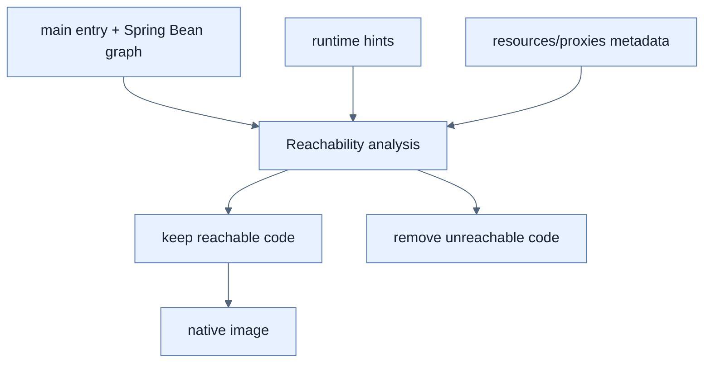

# 기존 애플리케이션을 Native Image에 맞추기

## 한눈에 보기

Native build는 main entry, hints, resources에서 reachable한 code만 image에 넣는 closed-world analysis를 사용한다. Runtime reflection·proxy·dynamic resource discovery는 build가 볼 수 없으므로 metadata 또는 build-time generation이 필요하다.

## 1. 왜 이게 필요한가

JVM에서는 class name 문자열로 runtime에 load하거나 proxy bytecode를 즉석 생성할 수 있다. Native image가 사용 가능성을 알지 못하면 필요한 constructor·method·resource를 잘라 runtime failure가 된다. Application과 library가 동적 behavior를 명시해야 한다.

## 2. 어떻게 동작하는가

Spring AOT engine이 Bean graph, proxy, binding, resource를 분석해 GraalVM metadata와 generated code를 만든다. `@Profile`·`@ConditionalOnProperty` 같은 structure-changing condition은 image build 때 평가되므로 profile별 다른 Bean graph가 필요하면 해당 profile로 별도 image를 build한다. Runtime property가 값은 바꿀 수 있어도 compile 후 새 Bean definition을 도입하지는 못한다.

Spring portfolio는 공통 hints를 내장하지만 third-party library의 과도한 reflection은 별도 대응이 필요하다. Hibernate lazy loading/dirty tracking처럼 bytecode enhancement가 필요한 기능은 Maven plugin으로 build time에 적용할 수 있다.

## 3. 그림으로 보기

## 4. 이 노트에 나온 용어

- **closed-world assumption**: build 시 알려진 code와 metadata가 실행 세계의 전부라고 보는 전제.
- **reachability analysis**: entry point에서 도달 가능한 type·method·resource를 추적하는 분석.
- **dynamic proxy**: runtime에 interface implementation bytecode를 생성하는 proxy.

## 7. 연결

- [[05-configuring-reflection-and-runtime-hints]] — 분석이 추론하지 못한 접근을 명시한다.
- [[03-building-and-running-a-native-application]] — AOT 분석을 실제 build profile에서 실행한다.
- [[chapter-6-configuring-an-application-with-spring-boot/02-creating-profile-based-property-files|Profile]] — native build에서는 Bean graph 선택 시점이 달라진다.

## 8. 스스로 확인

- 전체 1차 정리 후: native executable에서 runtime profile 변경이 JVM과 완전히 같지 않은 이유를 설명한다.

<!-- ==== 아래는 내 영역 · 스킬 수정 금지 ==== -->

## 내 설명 시도

## 막혔던 지점

## 리뷰 이력

