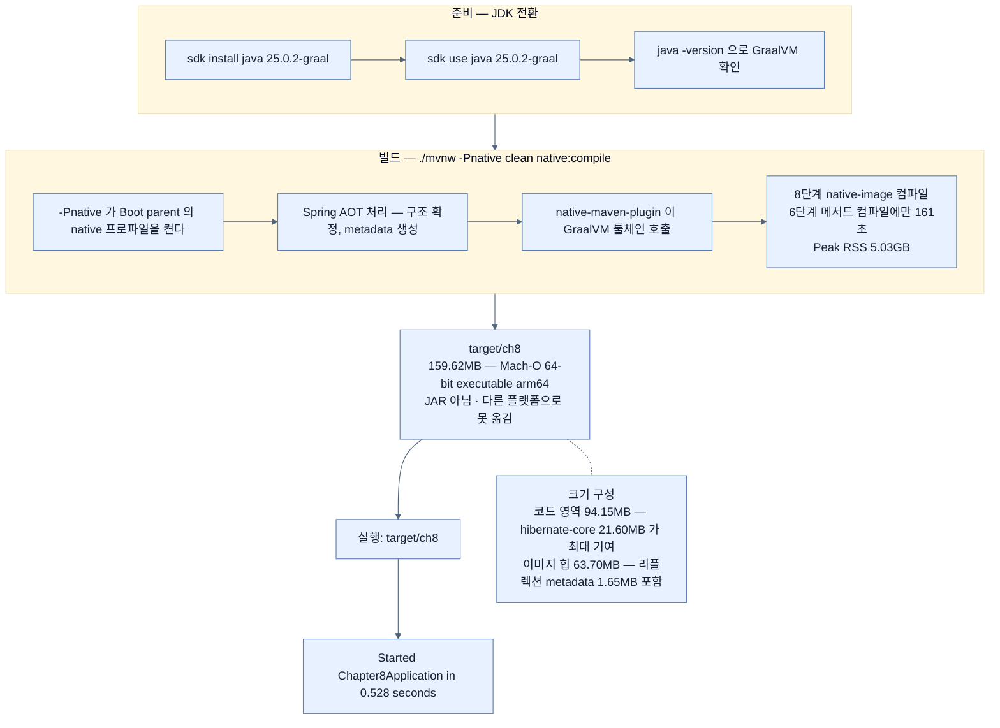

# 네이티브 빌드 실행 — 161초를 지불하고 0.528초를 얻기

## 한눈에 보기

```bash
sdk install java 25.0.2-graal          # 1. GraalVM이 든 JDK 설치
sdk use java 25.0.2-graal              # 2. 전환
./mvnw -Pnative clean native:compile   # 3. 빌드 — 오래 걸린다
target/ch8                             # 4. 실행 — 0.528초
```

산출물은 uber JAR도 executable JAR도 아니고 **빌드한 플랫폼 전용 실행 파일**이다.

## 1. 왜 이게 필요한가

Spring Boot에서 가장 익숙한 명령은 이것이다.

```bash
./mvnw clean package
```

낡은 산출물을 지우고 새 **[[uber-JAR]]**(= 애플리케이션과 모든 의존성을 한 파일에 담은 실행 가능 JAR)을 만든다. Chapter 7에서 본 그대로다.

네이티브 빌드도 흐름은 비슷하지만 **도구가 하나 더 필요하다.**

Boot 4는 빌드와 실행에 Java 17 이상이면 되지만, 네이티브 이미지 생성은 표준 JDK를 넘어선다. 컴파일이 GraalVM의 **`native-image` 도구**로 ahead-of-time 수행되기 때문이다. 그래서 표준 JDK가 아니라 **GraalVM 배포판**(또는 `native-image`가 설치된 호환 JDK)이 있어야 한다.

## 2. 어떻게 동작하는가

### 2.1 JDK 두 개를 오가기

네이티브 개발은 표준 JDK와 GraalVM 사이를 자주 오간다. macOS·Linux에서는 **[[SDKMAN]]**(= 여러 Java 배포판을 설치하고 전환하는 도구)이 가장 간단하다.

```bash
% sdk install java 25.0.2-graal
% sdk use java 25.0.2-graal
% java -version
java version "25.0.2" 2026-01-20 LTS
Java(TM) SE Runtime Environment Oracle GraalVM 25.0.2+10.1 (build 25.0.2+10-LTS-jvmci-b01)
Java HotSpot(TM) 64-Bit Server VM Oracle GraalVM 25.0.2+10.1 (build 25.0.2+10-LTS-jvmci-b01, mixed mode, sharing)
```

버전 문자열이 알려 주는 것이 하나 있다. 이건 **Java 25(LTS) 위에 올라간 GraalVM 25.0.2**다. 최신 GraalVM 릴리스는 현재 Java 버전과 정렬돼 있어서, Graal 컴파일러와 `native-image` 툴링이 **JDK 배포판 안에 통합**돼 있다. 예전처럼 "JDK 따로, GraalVM 따로"가 아니다.

> **Windows에서 빌드하기** — Linux가 가장 수월하고 macOS도 지원이 좋지만, 제대로 설정하면 Windows에서도 된다. Oracle 공식 페이지에서 GraalVM JDK 25의 Windows 배포판을 내려받아 ZIP을 풀고, `JAVA_HOME`을 그 디렉터리로 잡고, `bin` 폴더를 `PATH`에 넣어 `java`와 `native-image` 명령이 잡히게 한다. 여기에 더해 **Microsoft C++ 컴파일러와 Windows SDK**가 필요하다 — 네이티브 컴파일이 결국 플랫폼 링커를 부르기 때문이다.

### 2.2 빌드

```bash
% ./mvnw -Pnative clean native:compile
```

`-Pnative`가 **[[native-프로파일]]**(= Boot parent POM이 선언하는 Maven profile)을 켜고, 그 profile이 **[[native-maven-plugin]]**(= `org.graalvm.buildtools`의 Maven 플러그인)을 불러 GraalVM 툴체인을 빌드에 끌어들인다.

이 과정은 표준 빌드보다 **훨씬 오래 걸린다.** 하는 일이 다르기 때문이다.

- 코드 전체를 스캔한다.
- **[[AOT-컴파일]]**(= 실행 전에 미리 기계어로 번역)을 수행한다. 바이트코드로 남겨 두고 JVM 시작 때 기계어로 바꾸는 대신, **미리** 바꾼다.

그 대가로 **[[리플렉션]]**(= 이름으로 런타임 접근)과 프록시 사용이 제약된다. 쓸 수는 있지만 실행 파일이 커지고 이점이 줄며, AOT 도구가 리플렉션·프록시 너머를 볼 수 없어 **추가 metadata 등록**이 필요하다 — [[05-configuring-reflection-and-runtime-hints]].

### 2.3 빌드 출력이 알려 주는 것

![[_assets/lsb4-p237-fig8-1-native-image-build-output.png]]

이 화면이 이 절에서 가장 정보량이 많다. 본문 서술이 "오래 걸린다"고만 말하는 것을 **숫자로** 보여 준다.

| 읽을 곳 | 값 | 무엇을 뜻하나 |
|---|---|---|
| 단계별 시간 | `[6/8] Compiling methods... 161.0s @ 6.14GB` | 8단계 중 **메서드 컴파일이 압도적**이다. 빌드가 느린 이유가 여기 있다 |
| 이미지 크기 | 총 **159.62MB** (**[[코드-영역]]** 94.15MB / **[[이미지-힙]]** 63.70MB / 기타 1.78MB) | "네이티브는 작다"는 인상과 달리 **파일 자체는 크다.** 작아지는 것은 **런타임 메모리**다 |
| 코드 영역 기여 top | `hibernate-core 21.60MB`, `java.base 16.18MB`, `svm.jar 9.74MB` | 이미지를 키우는 것이 **내 코드가 아니라 의존성**임이 드러난다. Hibernate 하나가 전체의 13% |
| 이미지 힙 객체 | `27.36MB byte[] for code metadata`, **`1.65MB byte[] for reflection metadata`** | 리플렉션 힌트가 공짜가 아니라 **이미지에 실리는 비용**임을 보여 준다 |
| 자원 소모 | `Peak RSS: 5.03GB`, `CPU load: 4.00` | CI 러너의 메모리 스펙을 정할 때 이 숫자가 기준이 된다 |
| Recommendations | PGO, `--march=native`, max heap 설정 | 더 짜낼 여지가 남아 있다는 안내 |

`Security report`가 "Binary includes Java deserialization"이라고 알려 주는 것도 눈여겨볼 만하다 — 네이티브 이미지도 역직렬화 취약점에서 자유롭지 않다.

### 2.4 산출물은 JAR이 아니다

결과물은 uber JAR도 executable JAR도 아니다. **빌드한 플랫폼용 실행 파일**이다.

> Java의 1일차 대표 기능인 **[[write-once-run-anywhere]]**(= 같은 바이트코드를 어디서나 실행)는 플랫폼 중립 바이트코드와 기계마다 다른 JVM 덕에 성립한다. GraalVM은 그 전체를 우회한다. 최종 실행 파일에는 그 성질이 **없다.** 프로젝트 루트에서 `file target/ch8`을 쳐 보면 확인된다 — 저자의 기계에서는 `Mach-O 64-bit executable arm64`가 나온다.

이 한 줄이 [[03a-why-native-images-pay-off]]에서 다룰 운영상의 결정으로 이어진다.

### 2.5 실행

```bash
% target/ch8
  .   ____          _            __ _ _
 /\\ / ___'_ __ _ _(_)_ __  __ _ \ \ \ \
( ( )\___ | '_ | '_| | '_ \/ _` | \ \ \ \
 \\/  ___)| |_)| | | | | || (_| |  ) ) ) )
  '  |____| .__|_| |_|_| |_\__, | / / / /
 =========|_|==============|___/=/_/_/_/
 :: Spring Boot ::                (v4.1.0)
……생략……
INFO 75350 --- [main] o.s.boot.tomcat.TomcatWebServer : Tomcat started on port 8080 (http) with context path '/'
INFO 75350 --- [main] c.l.Chapter8Application : Started Chapter8Application in 0.528 seconds (process running for 0.74)
```

마지막 줄이 이 장 전체의 결론이다. **0.528초.** Java 애플리케이션 기준으로 놀라운 값이다.

`java -jar`로 띄우는 명령이 아니라는 점도 눈에 띈다. `target/ch8`은 그냥 **실행 파일**이다.

macOS에서 처음 실행하면 "ch8이 들어오는 네트워크 연결을 받도록 허용하시겠습니까?"라는 방화벽 대화상자가 뜰 수 있다. 서명되지 않은 새 바이너리가 포트를 열려 하기 때문이며, 허용하면 HTTP 요청을 받는다. **정상 동작이고 애플리케이션의 문제가 아니다.**

### 2.6 비유와 그 한계

사진 인화에 빗댈 수 있다. 표준 빌드는 필름(바이트코드)을 만들어 두고 볼 때마다 현상하는 것이고, 네이티브 빌드는 **미리 인화해 액자에 넣어 두는 것**이다. 인화에는 시간과 약품이 들지만(161초, 5GB), 걸어 두면 즉시 보인다(0.528초).

**깨지는 지점 둘.** 첫째, 인화한 사진은 **크기와 종이가 정해지지만** 필름은 나중에 다른 크기로도 뽑을 수 있다 — 그래서 네이티브 실행 파일이 159MB로 JAR보다 **커진다.** "네이티브는 작다"는 말은 파일이 아니라 **런타임 메모리** 얘기다. 둘째, 액자는 아무 벽에나 걸 수 있지만 네이티브 실행 파일은 **같은 OS·아키텍처에서만** 걸린다.

## 3. 그림으로 보기



## 4. 이 노트에 나온 용어

- **[[native-maven-plugin]]**: `org.graalvm.buildtools`의 Maven 플러그인. `native:compile` 골을 제공한다.
- **[[native-프로파일]]**: Boot parent POM이 선언하는, AOT 처리와 GraalVM 기본값을 켜는 profile.
- **[[SDKMAN]]**: 여러 Java 배포판을 설치·전환하는 도구.
- **[[AOT-컴파일]]**: 실행 전에 미리 기계어로 번역해 두는 방식.
- **[[네이티브-이미지]]**: 미리 컴파일된 플랫폼 전용 독립 실행 파일.
- **[[write-once-run-anywhere]]**: 같은 바이트코드를 어디서나 실행한다는 Java의 약속.
- **[[uber-JAR]]**: 애플리케이션과 모든 의존성을 한 파일에 담은 실행 가능 JAR.
- **[[코드-영역]]**: 네이티브 이미지에서 컴파일된 기계어가 차지하는 영역.
- **[[이미지-힙]]**: 빌드 시점에 초기화돼 이미지에 실리는 객체 그래프 영역.
- **[[리플렉션]]**: 이름으로 클래스·메서드에 런타임 접근하는 기능.

## 5. 자주 헷갈리는 것

**"네이티브 이미지는 작다"** — 실행 **파일**은 159.62MB로 uber JAR보다 크다. 작아지는 것은 **런타임 메모리 사용량**이다. 두 숫자를 섞으면 배포 스토리지 계획이 틀어진다.

**`native:compile` vs `package`** — 앞의 것은 GraalVM 실행 파일을, 뒤의 것은 uber JAR을 만든다. `-Pnative`를 붙여도 `package`는 여전히 JAR을 만들되 **Spring AOT 처리를 추가로 돌린다** — 그 산출물이 [[07a-enabling-aot-cache-for-spring-boot]]에서 쓰인다.

**빌드 머신 스펙이 요구사항이 된다** — Peak RSS 5.03GB는 흔한 CI 러너의 기본 메모리를 넘길 수 있다. 네이티브 빌드가 로컬에선 되는데 CI에서 OOM으로 죽는 전형적 원인이다.

**`java -jar`가 아니다** — 네이티브 실행 파일은 JVM 없이 직접 돈다. JVM 옵션(`-Xmx` 등)도 그대로 통하지 않고 `-XX:MaximumHeapSizePercent` 같은 네이티브 전용 옵션을 쓴다.

## 6. 언제 안 쓰나 / 경계

- **로컬 OS와 배포 OS가 다르면** 여기서 만든 실행 파일은 쓸 수 없다. [[04-building-native-container-images]]로 간다.
- **빌드 시간이 개발 반복을 막으면** 평소 개발은 JVM으로 하고 네이티브 빌드는 CI에만 둔다.
- **CI 러너 메모리가 부족하면** 빌드가 실패한다. 스펙을 먼저 확인한다.
- **의존성을 바꾼 뒤에는** 반드시 네이티브 빌드를 다시 돌린다. JVM에서 되는 것이 네이티브에서 안 될 수 있다.

## 7. 연결

- [[02-adapting-an-application-for-native-image]] — 여기서 켜는 `native` profile을 준비한 단계.
- [[03a-why-native-images-pay-off]] — 161초와 5GB를 지불할 가치가 있는지 계산한다.
- [[04-building-native-container-images]] — 로컬 플랫폼 제약을 컨테이너로 푸는 방법.
- [[05-configuring-reflection-and-runtime-hints]] — 빌드 로그의 reflection metadata가 어디서 오는지.

## 8. 스스로 확인

- `./mvnw clean package`와 `./mvnw -Pnative clean native:compile`의 산출물 차이를 세 가지 말해 보라.
- 빌드 출력에서 "이미지를 키우는 주범"을 찾으려면 어느 줄을 보는가?
- 159.62MB 실행 파일과 "네이티브는 메모리를 적게 쓴다"는 말은 모순인가?
- 로컬에서 되던 네이티브 빌드가 CI에서 실패한다면 가장 먼저 확인할 것은?

<!-- ==== 아래는 내 영역 · 스킬 수정 금지 ==== -->

## 내 설명 시도


## 막혔던 지점


## 리뷰 이력
