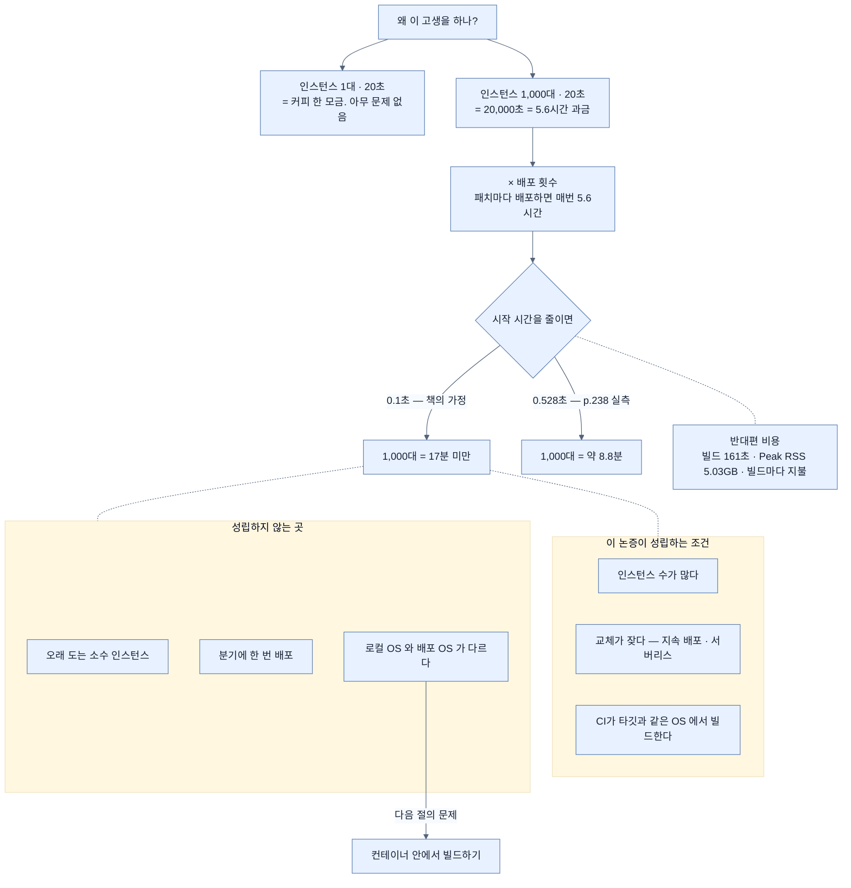

# 5.6시간 대 17분 — startup을 곱셈으로 보기

## 한눈에 보기

| 시작 시간 | × 1,000 인스턴스 | 배포 1회당 과금 시간 |
|---|---|---|
| 20초 | 20,000초 | **5.6시간** |
| 0.1초 (책의 가정) | 100초 | **약 1.7분** |
| 0.528초 (실측값) | 528초 | 약 8.8분 |

곱셈이 되는 순간 "몇 초"는 "몇 시간"이 된다. 그리고 배포 횟수를 곱하면 다시 커진다.

## 1. 왜 이게 필요한가

[[03-building-and-running-a-native-application]]까지 오면서 지불한 것을 정리해 보자.

- GraalVM을 설치하고 JDK를 전환했다.
- 빌드가 훨씬 오래 걸린다 — 메서드 컴파일에만 161초, Peak RSS 5.03GB.
- Java의 **[[write-once-run-anywhere]]**(= 같은 바이트코드를 어디서나 실행)를 내줬다.
- 리플렉션과 프록시에 제약이 생겼다.

**왜?**

이 질문에 "빠르니까"로 답하면 부족하다. 0.5초와 20초의 차이는 개발자 체감으로는 대단치 않다 — 커피 한 모금이다. 이 절이 하는 일은 그 차이를 **개발자의 체감이 아니라 회계의 단위로** 옮기는 것이다.

## 2. 어떻게 동작하는가

### 2.1 곱셈

클라우드에 이 애플리케이션 사본 1,000개를 돌린다고 하자.

앱이 뜨는 데 20초가 걸린다면 — 1,000 인스턴스 × 20초 = **20,000초 = 5.6시간**.

**5.6시간의 과금 시간이다.** 아무 요청도 처리하지 않으면서.

여기가 핵심이다. 클라우드 요금은 "일한 시간"이 아니라 "켜져 있던 시간"에 매겨진다. 시작하는 20초 동안 인스턴스는 CPU와 메모리를 잡고 있고, 요금은 그대로 붙는다.

그리고 이 5.6시간은 **배포할 때마다** 붙는다. **[[지속-배포]]**(= 작은 변경을 자주 자동으로 배포하는 방식)를 받아들여 패치 커밋마다 밀어낸다면, 청구서가 손을 벗어날 수 있다. 책의 표현이 정확하다 — **운영 관점에서는 아닐지 몰라도 청구 관점에서는 확실히** 문제다.

반대로 0.1초에 뜬다면 1,000 인스턴스가 **17분 미만**이다.

### 2.2 곱셈이 성립하지 않는 곳

이 계산은 조건부다. 성립하려면 두 가지가 필요하다.

| 조건 | 없으면 |
|---|---|
| 인스턴스 수가 많다 | 3대 × 20초 = 1분. 아무 의미 없다 |
| 교체가 잦다 | 분기에 한 번 배포하면 연 4회 × 5.6시간 |

그래서 [[01-why-graalvm-native-image]]가 짚은 두 무대 — 대규모 지속 배포와 **[[서버리스]]**(= 요청 때 띄우고 끝나면 내리는 실행 모델) — 밖에서는 이 논증이 힘을 잃는다. 서버리스에서는 조건이 더 극단적이다. 인스턴스 수명이 몇 초라서 **[[cold-start]]**(= 뜬 뒤 첫 요청을 처리하기까지의 지연)가 전체 실행 시간의 상당 부분을 차지한다.

### 2.3 덤과, 포기한 것의 재평가

시작 시간 말고 하나가 더 붙는다. 애플리케이션이 **더 효율적인 메모리 구성**으로 돈다. JVM의 힙·메타스페이스·JIT 코드 캐시가 통째로 없어지기 때문이다.

그리고 write once, run anywhere를 잃은 것이 **실은 손해가 아닐 수 있다**는 재평가가 여기서 나온다. 조건이 하나다 — **지속 배포 시스템이 타깃 환경과 같은 OS에서 앱을 빌드한다면.**

CI가 Linux에서 빌드하고 Linux 컨테이너로 배포한다면, "어디서나 돌아간다"는 성질은 애초에 쓰지 않던 성질이다. 쓰지 않는 기능을 내주는 것은 손해가 아니다.

### 2.4 남은 문제 하나

그런데 조건이 하나 남는다. **로컬 빌드 머신에 타깃 환경이 없다면?**

Windows나 Mac에서 일하는데 클라우드가 Linux 기반 Docker 컨테이너라면, [[03-building-and-running-a-native-application]]에서 만든 `Mach-O 64-bit executable arm64`는 쓸 수 없다. 다행히 해법이 있고, 그것이 [[04-building-native-container-images]]다.

### 2.5 비유와 그 한계

건물 엘리베이터 대기 시간에 빗댈 수 있다. 한 사람에게 20초는 아무것도 아니다. 그런데 출근 시간에 1,000명이 같은 20초를 기다리면 **총 5.6시간의 인건비**가 로비에서 증발한다. 개인의 체감과 조직의 비용은 다른 단위다.

**깨지는 지점 둘.** 첫째, 엘리베이터는 **동시에** 기다리므로 벽시계 시간은 여전히 20초지만, 클라우드 과금은 **인스턴스마다 따로** 매겨져 실제로 합산된다 — 비유보다 클라우드 쪽이 더 나쁘다. 둘째, 엘리베이터를 빠르게 만드는 비용은 한 번 지불하고 끝이지만, 네이티브 빌드 비용은 **빌드할 때마다** 지불한다. 161초 × 하루 20번 빌드 = 약 54분의 CI 시간이 반대편에 놓인다.

## 3. 그림으로 보기

## 4. 이 노트에 나온 용어

- **[[cold-start]]**: 인스턴스가 뜬 뒤 첫 요청을 처리하기까지의 지연.
- **[[지속-배포]]**: 작은 변경을 자주 자동으로 배포하는 방식.
- **[[write-once-run-anywhere]]**: 같은 바이트코드를 어디서나 실행한다는 Java의 약속.
- **[[네이티브-이미지]]**: 미리 컴파일된 플랫폼 전용 독립 실행 파일.
- **[[서버리스]]**: 요청 때 띄우고 끝나면 내리는 실행 모델.

## 5. 자주 헷갈리는 것

**원문의 숫자 불일치** — 책 p.239–240은 "우리 앱이 방금 그랬듯 0.1초에 뜬다면"이라고 쓰지만, 바로 앞 p.238의 실제 로그는 **0.528초**다. 0.1초는 이 장 어디에서도 측정되지 않은 값이며, "5.6시간 → 17분" 대비도 그 가정 위에 서 있다. 실측값으로 다시 계산하면 1,000 인스턴스가 약 8.8분으로, 여전히 큰 개선이지만 17분과는 다르다. **논증의 방향은 맞고 숫자만 낙관적이다.**

**빌드 비용을 계산에서 빼면 안 된다** — 절감되는 것은 **런타임** 과금이고, 늘어나는 것은 **빌드** 시간과 CI 자원이다. 배포가 잦을수록 앞의 이득이 커지지만 뒤의 비용도 같이 커진다. 하루 20번 빌드하면 CI에서 54분이 더 든다.

**"메모리도 절약된다"의 범위** — 절약되는 것은 **런타임 메모리**다. 실행 파일 크기(159.62MB)와 빌드 시 메모리(5.03GB)는 오히려 늘어난다.

## 6. 언제 안 쓰나 / 경계

- **인스턴스가 적고 오래 산다면** 이 계산은 성립하지 않는다. 네이티브의 이득이 빌드 비용을 못 넘는다.
- **배포가 드물다면** 마찬가지다. 절감액은 배포 횟수에 비례한다.
- **최고 처리량이 중요한 워크로드**라면 JIT를 잃는 대가를 따로 계산해야 한다 — [[07b-comparing-four-execution-strategies]].
- **중간 지대를 먼저 검토한다.** JVM에 남으면서 startup을 줄이는 방법이 있고, 빌드 비용이 훨씬 싸다 — [[07-using-java-25-aot-cache]].

## 7. 연결

- [[03-building-and-running-a-native-application]] — 이 절이 계산하는 0.528초가 나온 자리.
- [[01-why-graalvm-native-image]] — 이 곱셈이 성립하는 무대가 어떻게 생겼는지.
- [[04-building-native-container-images]] — "로컬에 타깃 환경이 없다"는 남은 문제의 해법.
- [[07b-comparing-four-execution-strategies]] — 같은 문제를 더 싸게 푸는 선택지들.

## 8. 스스로 확인

- 20초 startup이 "5.6시간"이 되는 계산을 조건까지 포함해 설명해 보라.
- 이 논증이 무력해지는 배포 환경을 두 가지 들어 보라.
- 책의 0.1초와 실측 0.528초 중 어느 쪽으로 계산해야 하고, 결과는 어떻게 달라지는가?
- 절감되는 비용과 새로 생기는 비용을 각각 어디에서 측정하는가?

<!-- ==== 아래는 내 영역 · 스킬 수정 금지 ==== -->

## 내 설명 시도

## 막혔던 지점

## 리뷰 이력
