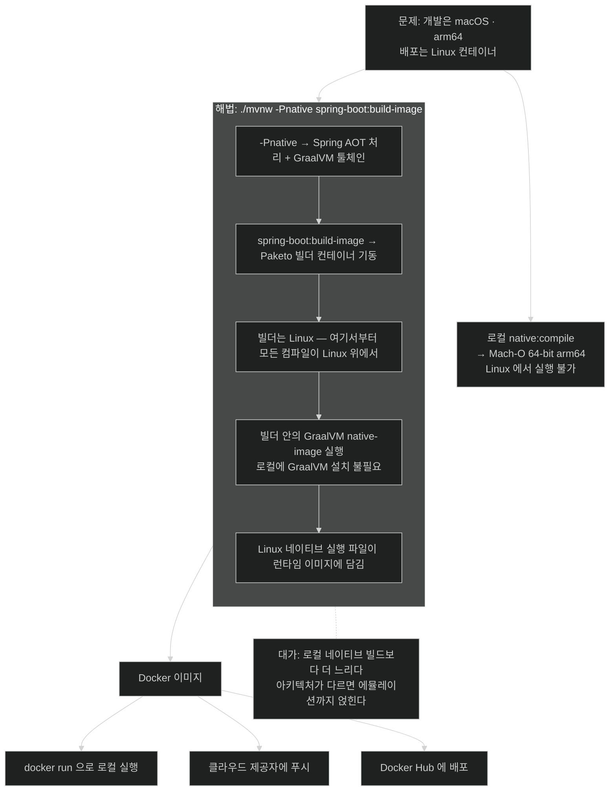

# 컨테이너 안에서 빌드하기 — 크로스 플랫폼 문제를 우회하는 법

## 한눈에 보기

```bash
./mvnw -Pnative spring-boot:build-image
```

Chapter 7의 buildpack 명령 + 이 장의 `native` profile. 두 개를 합치면 **네이티브 실행 파일이 든 Docker 컨테이너**가 나온다.

| | 로컬 네이티브 빌드 | 컨테이너 네이티브 빌드 |
|---|---|---|
| 명령 | `-Pnative clean native:compile` | `-Pnative spring-boot:build-image` |
| 산출물 | 내 OS·아키텍처용 실행 파일 | **Linux 컨테이너 이미지** |
| 빌드 시간 | 길다 | **더 길다** |
| 로컬 GraalVM 설치 | 필요 | 불필요 |

## 1. 왜 이게 필요한가

[[03a-why-native-images-pay-off]]가 남긴 문제가 이것이었다.

MacBook Pro에서 `./mvnw -Pnative clean native:compile`을 돌리면 `Mach-O 64-bit executable arm64`가 나온다. 그런데 배포처는 Linux 기반 클라우드다. 이 파일은 **거기서 실행되지 않는다.**

[[01-why-graalvm-native-image]]에서 **[[write-once-run-anywhere]]**(= 같은 바이트코드를 어디서나 실행)를 내줬을 때 감수한 대가가 여기서 실제 장애로 나타난다. JAR이라면 어디로 옮기든 돌았을 텐데, 네이티브 실행 파일은 **빌드한 플랫폼에 묶인다.**

Windows에서 개발하는 경우도 마찬가지다. 그리고 이건 개인 취향 문제가 아니다 — 팀에 macOS·Windows·Linux 사용자가 섞여 있으면 **각자 다른 실행 파일**이 나온다.

## 2. 어떻게 동작하는가

### 2.1 발상 — 빌드 자체를 타깃 환경 안에서

해법은 단순하다. **Linux용 실행 파일이 필요하면 Linux에서 빌드하면 된다.** 그리고 내 노트북에 Linux가 없어도, Docker는 Linux 컨테이너를 띄울 수 있다.

Chapter 7에서 `./mvnw spring-boot:build-image`로 **[[Paketo-Buildpack]]**(= Dockerfile 없이 소스에서 컨테이너 이미지를 조립하는 buildpack 구현)이 애플리케이션을 컨테이너로 조립하는 것을 봤다. 그 흐름을 그대로 쓰되, **[[native-프로파일]]**(= AOT 처리와 GraalVM 기본값을 켜는 Maven profile)을 함께 켠다.

```bash
% ./mvnw -Pnative spring-boot:build-image
```

이 한 줄이 두 명령의 결합이다.

| 조각 | 어디서 왔나 | 하는 일 |
|---|---|---|
| `spring-boot:build-image` | Chapter 7 | buildpack으로 컨테이너 이미지 조립 |
| `-Pnative` | 이 장 | Spring AOT 처리 + GraalVM 툴체인 활성화 |

### 2.2 단계마다의 이유

1. Maven이 `native` profile을 켠다 — **왜**: Spring AOT 처리가 돌아야 bean 구조가 확정되고 GraalVM용 metadata가 생성된다.
2. `spring-boot:build-image`가 buildpack 빌더 컨테이너를 띄운다 — **왜**: 그 컨테이너가 **Linux**다. 여기서부터 모든 컴파일이 Linux 위에서 일어난다.
3. 빌더 안에서 GraalVM `native-image`가 돈다 — **왜**: 내 노트북에 GraalVM이 없어도 된다. 빌더 이미지가 갖고 있다.
4. 결과 실행 파일이 런타임 이미지에 담긴다 — **왜**: 배포 단위가 실행 파일 하나가 아니라 컨테이너여야 클라우드에 그대로 올라간다.

**로컬 빌드보다 더 오래 걸린다.** 컨테이너를 띄우고, 그 안에서 [[03-building-and-running-a-native-application]]에서 본 161초짜리 컴파일을 돌리기 때문이다. 대신 완성되면 **네이티브 애플리케이션이 완전히 구워진 Docker 컨테이너**를 손에 쥔다.

### 2.3 그다음은 Chapter 7과 같다

이미지가 나온 뒤의 선택지는 앞 장에서 이미 배운 것들이다.

- 로컬에서 `docker run`으로 돌린다.
- 클라우드 제공자에 푸시한다.
- Docker Hub에 배포한다.

즉 **네이티브라는 사실이 배포 파이프라인을 바꾸지 않는다.** 컨테이너라는 공통 포장이 그 차이를 흡수한다. 이것이 이 방식의 두 번째 이득이다 — 첫째는 크로스 플랫폼 해결, 둘째는 **기존 배포 흐름을 그대로 쓸 수 있다는 것**.

### 2.4 비유와 그 한계

해외로 가구를 보내는 일에 빗댈 수 있다. 한국 규격 콘센트가 달린 가구를 만들어 보내면 현지에서 못 쓴다. 해법은 **현지 공장에서 조립하는 것**이다 — 설계도(소스)만 보내고 조립은 거기서 한다. Docker 빌더 컨테이너가 그 현지 공장이다.

**깨지는 지점 둘.** 첫째, 현지 공장은 진짜 현지에 있지만 **빌더 컨테이너는 내 기계 위에서 돈다.** CPU 아키텍처가 다르면(arm64 Mac에서 amd64 Linux 이미지) 에뮬레이션이 끼어들어 빌드가 훨씬 더 느려지거나 실패한다. 둘째, 공장은 한 번 세워 두고 계속 쓰지만 **buildpack 빌더는 매 빌드마다 컴파일 전체를 다시** 한다 — 캐시가 있어도 161초짜리 단계는 대체로 다시 돈다.

## 3. 그림으로 보기



## 4. 이 노트에 나온 용어

- **[[Paketo-Buildpack]]**: Dockerfile 없이 소스에서 컨테이너 이미지를 조립하는 buildpack 구현.
- **[[네이티브-이미지]]**: 미리 컴파일된 플랫폼 전용 독립 실행 파일.
- **[[native-프로파일]]**: AOT 처리와 GraalVM 기본값을 켜는 Maven profile.
- **[[write-once-run-anywhere]]**: 같은 바이트코드를 어디서나 실행한다는 Java의 약속.

## 5. 자주 헷갈리는 것

**`-Pnative`를 빼면 전혀 다른 결과** — `./mvnw spring-boot:build-image`만 쓰면 Chapter 7의 **JVM 기반 레이어드 이미지**가 나온다. 겉보기에 둘 다 "Docker 이미지"라 헷갈리기 쉬운데, 안에 든 것이 JAR이냐 네이티브 실행 파일이냐로 갈린다.

**아키텍처는 여전히 문제일 수 있다** — buildpack이 해결해 주는 것은 **OS**(macOS → Linux)다. CPU 아키텍처(arm64 → amd64)까지 자동으로 넘어가지는 않는다. Apple Silicon에서 amd64 이미지를 만들려면 별도 설정이 필요하고, 에뮬레이션이 끼면 빌드가 크게 느려진다.

**빌드 머신 자원 요구는 그대로다** — 컨테이너 안에서 도는 것도 같은 `native-image` 컴파일이다. [[03-building-and-running-a-native-application]]에서 본 Peak RSS 5.03GB는 Docker 데몬에 할당된 메모리 안에서 필요하다. Docker Desktop 기본 메모리로는 부족할 수 있다.

## 6. 언제 안 쓰나 / 경계

- **로컬 OS와 배포 OS가 같다면** 로컬 빌드가 더 빠르다. 컨테이너 오버헤드를 낼 이유가 없다.
- **개발 반복 중에는 쓰지 않는다.** 이 명령은 CI나 릴리스 단계용이다.
- **Docker에 할당된 메모리를 먼저 확인한다.** 빌드가 원인 불명으로 죽는 가장 흔한 이유다.
- **컨테이너가 필요 없는 배포**(VM에 실행 파일만 올리는 경우)라면 타깃과 같은 OS의 CI 러너에서 로컬 방식으로 빌드하는 편이 단순하다.

## 7. 연결

- [[03a-why-native-images-pay-off]] — "로컬에 타깃 환경이 없다"는 문제를 남긴 자리.
- [[03-building-and-running-a-native-application]] — 컨테이너 안에서 도는 것과 같은 컴파일 과정.
- [[06-using-buildpacks-with-java-aot-cache]] — 같은 buildpack 명령으로 **네이티브가 아닌** 다른 최적화를 켜는 방법.
- [[04a-from-spring-native-to-mainstream]] — 이 툴링이 별도 프로젝트가 아니라 본류인 이유.

## 8. 스스로 확인

- `-Pnative spring-boot:build-image`가 결합하는 두 개념을 각각 어느 장에서 배웠는지 말해 보라.
- buildpack이 해결해 주는 것과 해결해 주지 않는 것을 OS·아키텍처로 나눠 설명해 보라.
- 이 명령이 로컬 네이티브 빌드보다 더 느린 이유는?
- 이미지가 만들어진 뒤의 배포 절차가 Chapter 7과 같은 것이 왜 이득인가?


> 네 문항을 스스로 답한 **뒤에** [[_04-building-native-container-images]]에서 모범답안과 대조한다. 먼저 열면 이 문항들은 다시 인출 문제로 쓸 수 없다.

<!-- ==== 아래는 내 영역 · 스킬 수정 금지 ==== -->

## 내 설명 시도


## 막혔던 지점


## 리뷰 이력
