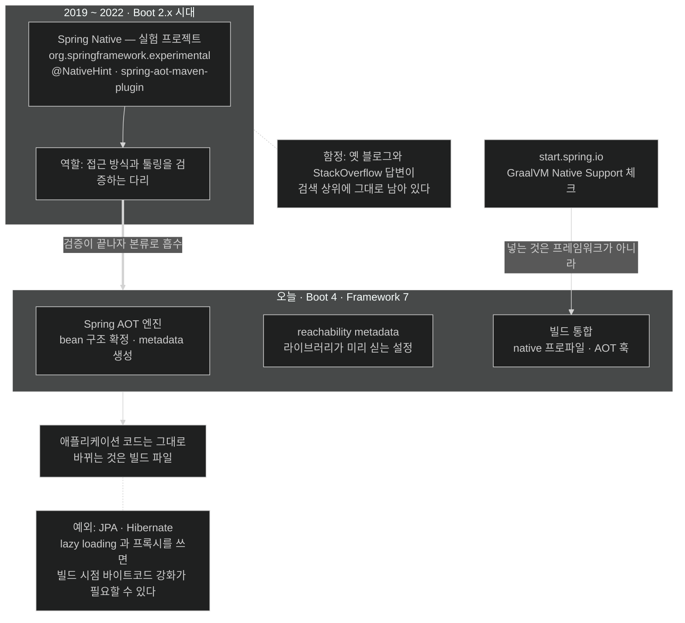

# Spring Native는 어디로 갔나 — 실험 프로젝트에서 본류로

## 한눈에 보기

| 질문 | 답 |
|---|---|
| `spring-native` 의존성을 넣어야 하나? | **아니다.** 그런 프로젝트는 더 이상 없다 |
| 그럼 start.spring.io의 "GraalVM Native Support"는? | 프레임워크가 아니라 **빌드 툴링** 통합 |
| 무엇이 본류로 들어왔나? | AOT 처리 · reachability metadata · 빌드 통합 |
| 어디에 있나? | Spring Boot 4 · Spring Framework 7 안에 |

## 1. 왜 이게 필요한가

네이티브 이미지를 검색하면 2020~2022년의 블로그 글이 잔뜩 나온다. 거기에는 이런 것들이 적혀 있다.

```xml
<dependency>
    <groupId>org.springframework.experimental</groupId>
    <artifactId>spring-native</artifactId>
    <version>0.12.1</version>
</dependency>
```

그리고 `@NativeHint`, `spring-aot-maven-plugin` 같은 이름들. 이걸 그대로 따라 하면 Boot 4에서 동작하지 않는다. **의존성 자체가 없기 때문이다.**

반대로 start.spring.io에서 "GraalVM Native Support"를 체크하면 pom에 무언가가 들어가는데, 그게 방금 그 실험 프로젝트인지 아닌지가 헷갈린다.

이 절은 그 혼동을 정리한다. 짧지만 실무에서 검색 결과를 걸러 낼 때 계속 쓰이는 지식이다.

## 2. 어떻게 동작하는가

### 2.1 Spring Native가 무엇이었나

**[[Spring-Native]]**(= Boot 2.x 시대에 GraalVM 네이티브 이미지를 검증하던 실험 프로젝트)는 "Spring 애플리케이션을 GraalVM 네이티브 이미지로 컴파일하려면 무엇이 필요한가"를 탐색하던 초기 프로젝트다.

**Boot 2.x 시대를 겨냥했고, 다리 역할을 했다.** Spring 팀이 접근 방식과 툴링을 검증하는 동안 임시로 놓인 다리다. 다리는 건너고 나면 치운다.

### 2.2 지금 어디에 있나

네이티브 이미지 지원은 오늘날 **Spring의 주류(mainstream)**다. GraalVM 네이티브 이미지에 필요한 세 가지가 현행 포트폴리오에 들어와 있다.

| 들어온 것 | 무엇인가 |
|---|---|
| **[[Spring-AOT-엔진]]**(= 빌드 시점에 구조를 분석·고정하는 처리) | bean 정의를 코드로 펼치고 metadata를 만든다 |
| **[[reachability-metadata]]**(= 라이브러리가 미리 싣는 리플렉션 등의 설정) | "여기에 리플렉션이 쓰인다"를 GraalVM에 알린다 |
| 빌드 통합 | Maven·Gradle profile, AOT 훅 |

그리고 이것들은 Spring Boot 4와 Spring Framework 7에서 **계속 개선되고 있다.** 즉 정체된 기능이 아니라 본류의 일부다.

핵심 문장은 이것이다 — **따로 껴안을 "Spring Native" 프로젝트는 없다.**

### 2.3 그럼 체크박스는 무엇을 넣는가

start.spring.io에서 **GraalVM Native Support**를 고르는 것은 **외부 프레임워크를 추가하는 것이 아니다.** 넣는 것은 **빌드 툴링**이다.

- Maven·Gradle의 네이티브 지원(`native-maven-plugin`과 그것을 켜는 profile)
- AOT 훅

그리고 그 툴링이 하는 일은 **GraalVM이 요구하는 metadata를 생산하는 것**이다. 런타임 라이브러리가 아니라 빌드 파이프라인이 바뀐다.

[[02-adapting-an-application-for-native-image]]에서 "이 장의 코드는 앞 장 코드의 복사본이고 빌드 파일만 다르다"고 한 것이 정확히 이 뜻이다.

### 2.4 여전히 손이 가는 곳

다만 예외가 있다. 특히 **JPA/Hibernate**에서는 lazy loading과 프록시가 네이티브에서 제대로 돌게 하려고 **빌드 시점 [[바이트코드-강화]]**(= 엔티티 바이트코드를 고쳐 기능을 넣는 것)를 켜야 할 수 있다.

즉 "본류로 들어왔다"가 "아무것도 안 해도 된다"는 뜻은 아니다. 기본 경로는 자동이고, **동적 기능에 깊이 기대는 지점에서만** 명시적 설정이 남는다.

### 2.5 비유와 그 한계

건축의 가설 비계에 빗댈 수 있다. Spring Native는 본관을 짓는 동안 세워 둔 비계였다. 건물이 완성되면 비계는 철거하고, **그 기능은 건물 자체의 계단과 엘리베이터로 흡수된다.** 지금 "비계를 어떻게 설치하나요"라고 묻는 것은 시대착오다.

**깨지는 지점 하나.** 비계는 철거하면 흔적이 없지만, **인터넷의 글은 남는다.** Spring Native 시절의 블로그·StackOverflow 답변이 검색 상위에 계속 노출되고, 그것들은 문법적으로는 멀쩡해 보인다. 그래서 "언제 쓰인 글인가"를 먼저 보는 습관이 필요하다 — 이 절이 실무에서 값을 하는 지점이 거기다.

## 3. 그림으로 보기



## 4. 이 노트에 나온 용어

- **[[Spring-Native]]**: Boot 2.x 시대의 실험 프로젝트. 지금은 본류에 흡수됐다.
- **[[Spring-AOT-엔진]]**: 빌드 시점에 애플리케이션 구조를 분석해 고정하는 처리 단계.
- **[[reachability-metadata]]**: 라이브러리가 미리 싣는 리플렉션 등의 설정.
- **[[네이티브-이미지]]**: 미리 컴파일된 플랫폼 전용 독립 실행 파일.
- **[[바이트코드-강화]]**: Hibernate가 엔티티 바이트코드를 고쳐 기능을 넣는 것.

## 5. 자주 헷갈리는 것

**Spring AOT ≠ Java AOT** — 이 절의 "AOT 처리"는 **Spring이 빌드 시점에 애플리케이션 구조를 준비하는 것**이다. [[07-using-java-25-aot-cache]]의 Java AOT Cache는 **JVM 수준의 런타임 최적화**로, 이름만 겹칠 뿐 다른 층이다. 책도 이 구분을 따로 강조한다.

**"본류에 들어왔으니 설정이 필요 없다"** — 기본 경로는 자동이지만, 커스텀 리플렉션·직렬화·resource 접근은 여전히 손으로 등록해야 한다 — [[05-configuring-reflection-and-runtime-hints]]. 그리고 서드파티 라이브러리는 별개 문제다 — [[04b-graalvm-and-third-party-libraries]].

**버전을 먼저 본다** — 네이티브 관련 자료는 3년이면 낡는다. `org.springframework.experimental`이나 `@NativeHint`가 보이면 Boot 2.x 시대 글이다.

## 7. 연결

- [[02-adapting-an-application-for-native-image]] — "GraalVM Native Support" 체크박스가 실제로 넣는 것.
- [[04b-graalvm-and-third-party-libraries]] — 본류 지원이 닿지 않는 서드파티 영역.
- [[05-configuring-reflection-and-runtime-hints]] — 자동 처리로 부족할 때의 escape hatch.
- [[01-why-graalvm-native-image]] — Spring Native가 시작된 2019년의 배경.

## 8. 스스로 확인

- 검색으로 찾은 네이티브 이미지 글이 낡았는지 판별하는 단서를 두 가지 들어 보라.
- start.spring.io의 GraalVM Native Support가 pom에 넣는 것은 무엇이고, 넣지 **않는** 것은 무엇인가?
- "본류로 들어왔다"에도 불구하고 여전히 손이 가는 대표적 지점은?
- Spring AOT와 Java AOT Cache의 층 차이를 한 문장으로 말해 보라.


> 네 문항을 스스로 답한 **뒤에** [[_04a-from-spring-native-to-mainstream]]에서 모범답안과 대조한다. 먼저 열면 이 문항들은 다시 인출 문제로 쓸 수 없다.

<!-- ==== 아래는 내 영역 · 스킬 수정 금지 ==== -->

## 내 설명 시도


## 막혔던 지점


## 리뷰 이력
