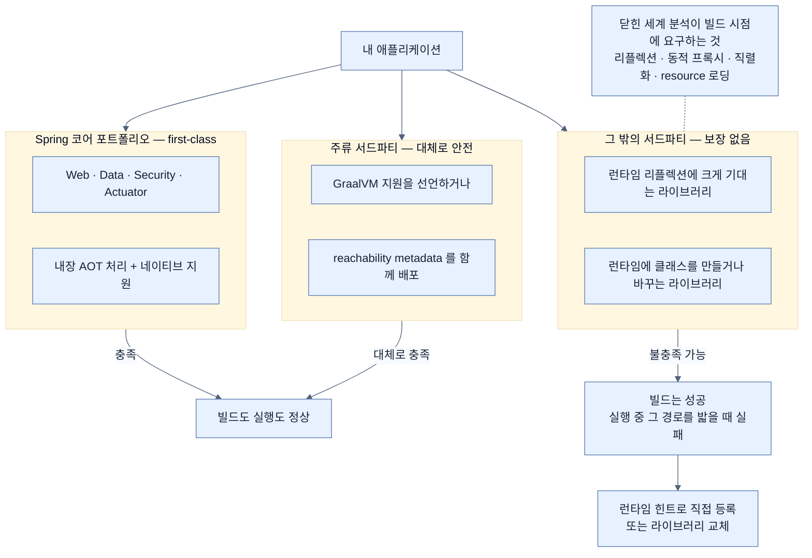

# 서드파티 의존성이라는 진짜 관문

## 한눈에 보기

| 계층 | 네이티브 준비 상태 |
|---|---|
| Spring 코어 포트폴리오 (Web·Data·Security·Actuator) | **first-class** — 내장 AOT 처리와 네이티브 지원 |
| 주류 라이브러리 | 대체로 지원하거나 reachability metadata를 함께 싣는다 |
| 그 밖의 서드파티 | **보장 없음.** 추가 설정이나 힌트가 필요할 수 있다 |

네이티브 전환이 실패하는 자리는 대개 내 코드가 아니라 **의존성 트리 어딘가**다.

## 1. 왜 이게 필요한가

[[04a-from-spring-native-to-mainstream]]까지 읽으면 안심하기 쉽다. Spring이 다 해 준다는 인상을 받기 때문이다.

그런데 실제 프로젝트의 `pom.xml`을 열어 보면 Spring 것이 아닌 의존성이 훨씬 많다. 로깅, JSON, 검증, 메트릭, 클라이언트 SDK, 사내 공용 라이브러리, 그리고 그것들이 다시 끌고 오는 전이 의존성.

네이티브 빌드는 이 **전체**를 도달성 분석에 넣는다. 그리고 그중 하나라도 런타임 리플렉션에 기대고 있으면, 빌드는 조용히 성공하고 **실행할 때 터진다.**

이게 이 절이 짧은데도 실무에서 가장 자주 부딪히는 벽인 이유다.

## 2. 어떻게 동작하는가

### 2.1 Spring 쪽은 됐다

**[[네이티브-이미지]]**(= 미리 컴파일된 플랫폼 전용 실행 파일) 지원은 Spring Boot 4와 Spring Framework 7의 **first-class 기능**이다. Spring 코어 포트폴리오 — Web, Data, Security, Actuator — 가 내장 AOT 처리와 네이티브 지원을 갖는다.

즉 우리가 쓰는 `@RestController`, `JpaRepository`, `SecurityFilterChain`, `/actuator/health`는 이미 검증된 영역이다.

### 2.2 문제는 그 바깥

그런데 네이티브 컴파일은 **[[닫힌-세계-가정]]**(= 프로그램이 무엇을 쓸지 빌드 시점에 전부 알 수 있다는 전제) 위의 분석 시스템이다. 그래서 네 가지가 빌드 시점에 알려져야 한다.

| 알려져야 할 것 | 왜 |
|---|---|
| **[[리플렉션]]**(= 이름으로 런타임 접근) | 대상 클래스로 가는 화살표를 정적으로 그릴 수 없다 |
| **[[동적-프록시]]**(= 런타임 바이트코드 생성 구현체) | 런타임 생성이 불가능하므로 미리 만들어야 한다 |
| 직렬화 | 역직렬화는 이름으로 타입을 찾는 리플렉션이다 |
| resource 로딩 | 코드에 참조가 없는 파일은 이미지에 안 담긴다 |

주류 라이브러리는 **대체로** GraalVM을 지원하거나 **[[reachability-metadata]]**(= 라이브러리가 "내 안에서는 여기에 리플렉션이 쓰인다"고 미리 싣는 설정)를 함께 배포한다. 그러면 사용하는 쪽이 아무것도 안 해도 된다.

**그러나 서드파티가 항상 네이티브 준비를 마친 것은 아니다.**

### 2.3 어떤 라이브러리가 위험한가

Spring Boot 참조 문서가 정리하듯, 네이티브 이미지는 라이브러리가 **GraalVM의 분석 모델에 협조해 주기를** 요구한다. 협조하지 않는 두 부류가 있다.

- **과도하게 reflective한 라이브러리** — 특히 런타임 리플렉션에 크게 기대는 것
- **동적인 라이브러리** — 런타임에 클래스를 만들거나 바꾸는 것

이런 것들은 **추가 설정이나 힌트**가 필요하다. 그 힌트를 우리가 써야 한다면 [[05-configuring-reflection-and-runtime-hints]]의 방법을 쓰는 것이고, 그것이 이 절이 다음 절로 이어지는 이유다.

### 2.4 상황은 나아지고 있다

네이티브 지원은 Java 생태계 안에서 **점진적으로 올라오고 있다.** 그래서 "지금 안 된다"가 "영영 안 된다"는 뜻이 아니다. Spring 팀은 spring.io/blog에서 모범 사례와 개선 사항을 계속 낸다.

실무적으로 이 말이 뜻하는 것은 — **의존성 하나를 올릴 때마다 네이티브 지원 상태가 달라질 수 있다**는 것이다. 좋은 쪽으로도, 나쁜 쪽으로도.

### 2.5 그런데 라이브러리 선택만의 문제도 아니다

책이 이 절을 닫으며 다음 절로 넘기는 문장이 정확하다. 어떤 경우에는 **호환되는 라이브러리를 고르는 것만으로 해결되지 않는다.** AOT 분석이 애플리케이션에 필요한 것을 다 추론할 수 없을 때, **우리가 그 정보를 명시적으로 줘야 한다.**

그 수단이 **[[런타임-힌트]]**(= AOT가 알 수 없는 접근을 명시적으로 등록하는 정보)다.

### 2.6 비유와 그 한계

해외 이주 시 서류 준비에 빗댈 수 있다. 본인 서류(내 코드)는 준비했고 주요 기관(Spring 포트폴리오)도 협조한다. 그런데 **동행하는 가족 구성원 하나가 서류를 안 갖췄으면** 전체가 출국장에서 막힌다. 그리고 그 사실은 대개 출국 당일에야 드러난다.

**깨지는 지점 둘.** 첫째, 출국장에서는 **막히지만** 네이티브 이미지는 빌드가 조용히 성공한다 — 문제는 배포 후 그 코드 경로를 처음 밟을 때 드러난다. 즉 "출국은 됐는데 현지에서 못 산다"에 가깝다. 둘째, 서류는 본인이 준비할 수 있지만 라이브러리의 리플렉션은 **내가 소스를 고칠 수 없다** — 그래서 힌트라는 우회로가 필요하다.

## 3. 그림으로 보기

## 4. 이 노트에 나온 용어

- **[[reachability-metadata]]**: 라이브러리가 미리 싣는 리플렉션 등의 설정.
- **[[닫힌-세계-가정]]**: 프로그램이 무엇을 쓸지 빌드 시점에 전부 알 수 있다는 전제.
- **[[리플렉션]]**: 이름으로 클래스·메서드에 런타임 접근하는 기능.
- **[[동적-프록시]]**: 런타임에 바이트코드로 생성하는 구현체.
- **[[런타임-힌트]]**: AOT 분석이 알 수 없는 접근을 명시적으로 등록하는 정보.
- **[[네이티브-이미지]]**: 미리 컴파일된 플랫폼 전용 독립 실행 파일.

## 5. 자주 헷갈리는 것

**"빌드가 성공했으니 됐다"** — 네이티브 빌드 성공은 **도달 가능하다고 판정된 코드가 컴파일됐다**는 뜻이지, 필요한 코드가 다 담겼다는 뜻이 아니다. 잘려 나간 것은 그 경로를 실행할 때 드러난다. 그래서 네이티브 전환에는 **실행 경로를 넓게 훑는 통합 테스트**가 JVM 때보다 더 중요하다.

**"Spring이 지원하니 Spring Data JPA도 문제없다"** — 대체로 맞지만 Hibernate의 lazy loading처럼 **런타임 바이트코드 조작에 기대는 기능**은 별도 처리가 필요하다 — [[02-adapting-an-application-for-native-image]].

**reachability metadata의 출처가 두 곳이다** — 라이브러리가 자기 JAR에 싣는 경우와, GraalVM 커뮤니티가 별도 저장소에 모아 두는 경우가 있다. 후자를 쓰려면 빌드 설정에 그 저장소를 켜야 한다.

## 6. 언제 안 쓰나 / 경계

- **의존성 트리가 넓고 통제 밖이라면** 네이티브 전환의 난이도를 먼저 조사한다. 라이브러리 목록을 뽑아 네이티브 지원 여부를 확인하는 것이 첫 작업이다.
- **소스를 고칠 수 없는 라이브러리**가 문제라면 힌트로 우회하거나 교체를 검토한다.
- **의존성 업그레이드마다** 네이티브 빌드와 통합 테스트를 다시 돌린다.
- **네이티브가 막히면 중간 지대를 본다.** JVM에 남으면서 startup을 줄이면 이 문제가 아예 사라진다 — [[07-using-java-25-aot-cache]].

## 7. 연결

- [[04a-from-spring-native-to-mainstream]] — Spring 쪽 지원이 어디까지 왔는지.
- [[05-configuring-reflection-and-runtime-hints]] — 라이브러리가 협조하지 않을 때 우리가 쓰는 우회로.
- [[02-adapting-an-application-for-native-image]] — 닫힌 세계 가정이 이 제약을 만드는 원리.
- [[07-using-java-25-aot-cache]] — 서드파티 문제를 아예 피하는 대안 경로.

## 8. 스스로 확인

- 네이티브 빌드가 성공했는데 실행 중에 실패하는 상황이 왜 생기는가?
- 어떤 성격의 라이브러리가 네이티브에서 위험한지 두 부류로 나눠 말해 보라.
- reachability metadata가 있으면 사용하는 쪽이 무엇을 안 해도 되는가?
- 네이티브 전환 프로젝트를 시작할 때 의존성 목록으로 먼저 해야 할 일은?

<!-- ==== 아래는 내 영역 · 스킬 수정 금지 ==== -->

## 내 설명 시도

## 막혔던 지점

## 리뷰 이력
