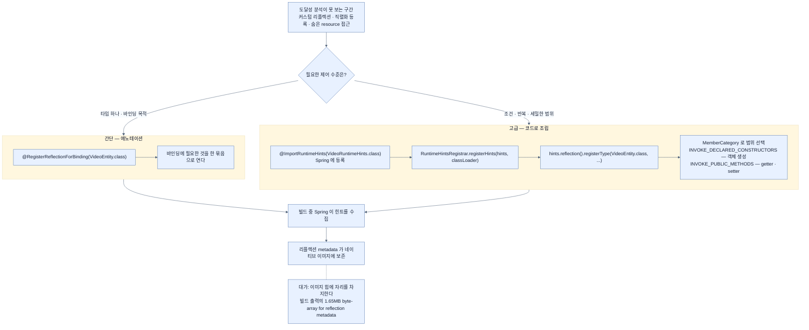

# 런타임 힌트 — 닫힌 세계에 뚫는 escape hatch

## 한눈에 보기

| 방법 | 언제 | 형태 |
|---|---|---|
| `@RegisterReflectionForBinding(X.class)` | 타입 하나에 데이터 바인딩용 리플렉션이 필요할 때 | 애노테이션 한 줄 |
| `@ImportRuntimeHints(Y.class)` + `RuntimeHintsRegistrar` | 조건·반복·세밀한 범위 지정이 필요할 때 | 코드로 조립 |

Spring Boot가 네이티브 설정을 대량으로 자동 생성하지만, **전부를 예측할 수는 없다.**

## 1. 왜 이게 필요한가

[[02-adapting-an-application-for-native-image]]에서 본 **[[도달성-분석]]**(= 진입점에서 호출 그래프를 정적 추적)의 규칙을 다시 떠올려 보자. 화살표를 그릴 수 없는 곳은 잘려 나간다.

문제는 이런 코드가 실제로는 아주 흔하다는 것이다.

```java
// Jackson이 JSON을 VideoEntity로 되돌릴 때 내부적으로 하는 일
Constructor<?> ctor = VideoEntity.class.getDeclaredConstructor();
Object obj = ctor.newInstance();
Method setter = VideoEntity.class.getMethod("setName", String.class);
setter.invoke(obj, "Spring Boot 4");
```

우리가 이런 코드를 쓴 적은 없다. 하지만 `@RequestBody VideoEntity video` 한 줄을 쓰는 순간 Jackson이 이걸 한다. 도달성 분석의 눈에 `VideoEntity`의 생성자와 setter로 가는 화살표는 **어디에도 없다.** 그래서 잘려 나가고, 배포 후 첫 POST 요청에서 터진다.

**[[닫힌-세계-가정]]**(= 빌드 시점에 전부 알 수 있다는 전제)이 성립하지 않는 구간이 실재한다는 뜻이다. 그 구간을 위해 **[[런타임-힌트]]**(= AOT가 알 수 없는 접근을 명시적으로 등록하는 정보)가 있다.

Spring Boot는 상당량의 네이티브 설정을 자동 생성하지만, 다음 셋은 예측하지 못한다.

- 애플리케이션이 **커스텀한 방식으로** 리플렉션을 쓸 때
- 클래스를 **직렬화용으로** 등록할 때
- AOT 분석이 발견하기 어려운 **resource에 접근**할 때

## 2. 어떻게 동작하는가

### 2.1 간단한 경우 — 애노테이션 한 줄

```java
@RegisterReflectionForBinding(VideoEntity.class)
@Configuration
public class NativeConfig {
}
```

**[[@RegisterReflectionForBinding]]**(= 데이터 바인딩 대상에 리플렉션 접근이 필요함을 선언하는 애노테이션)이 하는 일은 이름 그대로다 — "이 타입은 **바인딩** 때문에 리플렉션이 필요하다"고 알린다.

`for Binding`이라는 이름이 중요하다. 바인딩에 필요한 것(생성자와 접근자)을 **한 묶음으로** 열어 주므로, 무엇을 열지 하나하나 고를 필요가 없다. Jackson·폼 바인딩·`@ConfigurationProperties`처럼 "객체를 만들고 필드를 채우는" 전형적인 경우에 맞는다.

이 애노테이션은 `org.springframework.aot.hint.annotation` 패키지에 있다.

### 2.2 복잡한 경우 — 코드로 조립

바인딩보다 세밀한 제어가 필요하면 두 조각을 쓴다.

```java
@Configuration
@ImportRuntimeHints(VideoRuntimeHints.class)
public class NativeAdvancedConfig {
}
```

```java
public class VideoRuntimeHints implements RuntimeHintsRegistrar {
    @Override
    public void registerHints(RuntimeHints hints, ClassLoader classLoader) {
        hints.reflection().registerType(
                VideoEntity.class,
                MemberCategory.INVOKE_DECLARED_CONSTRUCTORS,
                MemberCategory.INVOKE_PUBLIC_METHODS
        );
    }
}
```

두 조각의 역할이 다르다.

| 조각 | 하는 일 | 왜 나뉘어 있나 |
|---|---|---|
| **[[@ImportRuntimeHints]]**(= registrar를 AOT 엔진에 등록하는 애노테이션) | "이 클래스가 힌트를 기여한다"고 Spring에 알린다 | 힌트 등록을 configuration의 관심사로 유지하기 위해 |
| **[[RuntimeHintsRegistrar]]**(= `registerHints` 하나를 갖는 인터페이스) | 실제 힌트를 **코드로** 만든다 | 조건문·반복문을 쓸 수 있다. 애노테이션으로는 못 하는 일 |

빌드 중에 Spring이 애플리케이션을 분석하면서 이 힌트를 포함시키고, 그 결과 필요한 리플렉션 metadata가 **네이티브 이미지 안에 보존된다.**

### 2.3 MemberCategory — 얼마나 열 것인가

`registerType`의 두 번째 인자부터가 **[[MemberCategory]]**(= 리플렉션 힌트에서 허용 범위를 고르는 열거형)다. 예제가 고른 둘은 이렇다.

| 값 | 여는 것 | 왜 필요한가 |
|---|---|---|
| `INVOKE_DECLARED_CONSTRUCTORS` | **객체 생성** | 역직렬화가 먼저 인스턴스를 만들어야 한다 |
| `INVOKE_PUBLIC_METHODS` | public 메서드의 리플렉티브 호출 | **getter와 setter**가 여기 포함된다 |

이 둘이 짝인 이유가 보인다 — 만들고(생성자), 채우는(setter) 것이 바인딩의 전부다.

범위를 고르게 해 둔 이유는 **비용 때문**이다. [[03-building-and-running-a-native-application]]의 빌드 출력에서 `1.65MB byte[] for reflection metadata`를 봤다. 리플렉션 힌트는 **[[이미지-힙]]**(= 이미지에 실리는 객체 그래프 영역)에 실제 자리를 차지한다. 모든 클래스에 모든 카테고리를 열면 이미지가 부풀고, [[01-why-graalvm-native-image]]에서 얻으려던 이득이 줄어든다.

`MemberCategory`에는 `INTROSPECT_*`(존재만 조회)와 `INVOKE_*`(실제 호출)의 구분도 있다. 리스트만 훑는 용도라면 `INTROSPECT_*`로 충분해 더 싸다.

### 2.4 왜 이것이 "escape hatch"인가

네이티브 컴파일은 닫힌 세계 모델을 쓴다. 리플렉션 사용을 자동으로 추론할 수 없으면 **런타임에 metadata가 없어진다.** 런타임 힌트는 Spring이 생성한 힌트로 부족할 때를 위한 **실용적인 비상구**다.

"비상구"라는 표현이 정확한 이유는 두 가지다. 첫째, **평소에 쓰는 문이 아니다** — 대부분의 경우 Spring AOT가 알아서 한다. 둘째, **쓸수록 이미지가 무거워진다** — 비상구를 벽 전체에 뚫으면 벽이 아니게 된다.

### 2.5 비유와 그 한계

공항 반입 금지 물품에 빗댈 수 있다. 기본 규칙(도달성 분석)이 모르는 물건을 다 압수한다. 그런데 의료용 주사기처럼 **정당한 사유가 있는 물건**은 진단서를 내면 통과된다. 힌트가 그 진단서다.

**깨지는 지점 셋.** 첫째, 진단서는 **압수당한 뒤에 낼 수 있지만** 힌트는 빌드 전에 내야 한다 — 사후 복구가 없다. 둘째, 진단서는 종이 한 장이지만 힌트는 **이미지에 무게로 남는다.** 셋째, 여행자는 자기 짐을 알지만 우리는 **라이브러리가 무엇을 리플렉션으로 쓰는지 모른다** — 그래서 [[04b-graalvm-and-third-party-libraries]]가 어려운 문제로 남는다.

## 3. 그림으로 보기



## 4. 이 노트에 나온 용어

- **[[런타임-힌트]]**: AOT 분석이 알 수 없는 접근을 명시적으로 등록하는 정보.
- **[[@RegisterReflectionForBinding]]**: 데이터 바인딩 대상에 리플렉션이 필요함을 선언하는 애노테이션.
- **[[@ImportRuntimeHints]]**: `RuntimeHintsRegistrar` 구현을 AOT 엔진에 등록하는 애노테이션.
- **[[RuntimeHintsRegistrar]]**: `registerHints(RuntimeHints, ClassLoader)` 하나를 갖는 인터페이스.
- **[[MemberCategory]]**: 리플렉션 힌트에서 허용 범위를 고르는 열거형.
- **[[닫힌-세계-가정]]**: 프로그램이 무엇을 쓸지 빌드 시점에 전부 알 수 있다는 전제.
- **[[도달성-분석]]**: 진입점에서 호출 그래프를 정적 추적하는 분석.
- **[[리플렉션]]**: 이름으로 클래스·메서드에 런타임 접근하는 기능.
- **[[이미지-힙]]**: 빌드 시점에 초기화돼 이미지에 실리는 객체 그래프 영역.

## 5. 자주 헷갈리는 것

**패키지가 `spring-core`에 있다** — `@RegisterReflectionForBinding`은 `org.springframework.aot.hint.annotation`, `MemberCategory`와 `RuntimeHintsRegistrar`도 `org.springframework.aot.hint`다. 반면 `@ImportRuntimeHints`는 `org.springframework.context.annotation`이다. 책은 패키지를 적지 않아 IDE 자동 완성이 엉뚱한 것을 집어 올 수 있다.

**`INTROSPECT_*`와 `INVOKE_*`는 다르다** — 앞의 것은 "이런 멤버가 있다"를 조회하게만 해 주고, 뒤의 것은 실제 호출까지 연다. 리스트를 훑기만 한다면 `INTROSPECT_*`가 싸다. 무조건 `INVOKE_*`를 쓰면 이미지가 불필요하게 커진다.

**필드 카테고리는 이름이 바뀌었다** — Spring Framework 7에서 `PUBLIC_FIELDS`·`DECLARED_FIELDS`는 **deprecated for removal**이고 `ACCESS_PUBLIC_FIELDS`·`ACCESS_DECLARED_FIELDS`가 자리를 이어받았다. 책 예제가 쓰는 `INVOKE_DECLARED_CONSTRUCTORS`·`INVOKE_PUBLIC_METHODS`는 그대로 유효하다.

**힌트를 썼는데도 안 될 때** — 대상이 인터페이스면 프록시 힌트(`hints.proxies()`)가, 파일이면 resource 힌트(`hints.resources()`)가 따로 필요하다. `hints.reflection()`은 힌트 API의 일부일 뿐이다.

## 6. 언제 안 쓰나 / 경계

- **먼저 자동 처리를 믿는다.** 힌트를 예방적으로 뿌리면 이미지만 커진다. 실제로 실패한 지점에만 쓴다.
- **모든 카테고리를 여는 습관을 만들지 않는다.** 필요한 최소 범위를 고른다.
- **테스트로 검증한다.** 힌트가 맞는지는 네이티브 이미지를 실제로 실행해 그 경로를 밟아야 안다. JVM 테스트는 통과한다.
- **내가 못 고치는 라이브러리라면** 힌트가 임시방편이다. 근본 해결은 라이브러리의 metadata 지원이나 교체다 — [[04b-graalvm-and-third-party-libraries]].

## 7. 연결

- [[02-adapting-an-application-for-native-image]] — 힌트가 필요해지는 원인인 닫힌 세계 가정.
- [[04b-graalvm-and-third-party-libraries]] — 내가 아니라 의존성이 리플렉션을 쓸 때.
- [[03-building-and-running-a-native-application]] — 빌드 출력에서 리플렉션 metadata의 무게를 확인하는 법.
- [[07-using-java-25-aot-cache]] — 힌트 작업 자체를 피하는 대안 경로.

## 8. 스스로 확인

- `@RequestBody VideoEntity` 한 줄이 왜 네이티브에서 문제가 될 수 있는가?
- `@RegisterReflectionForBinding`과 `RuntimeHintsRegistrar` 중 어느 것을 쓸지 정하는 기준은?
- `INVOKE_DECLARED_CONSTRUCTORS`와 `INVOKE_PUBLIC_METHODS`가 짝으로 등장하는 이유는?
- 힌트를 넉넉히 넣는 것이 왜 공짜가 아닌가? 어디에서 그 비용을 확인하는가?

<!-- ==== 아래는 내 영역 · 스킬 수정 금지 ==== -->

## 내 설명 시도


## 막혔던 지점


## 리뷰 이력
