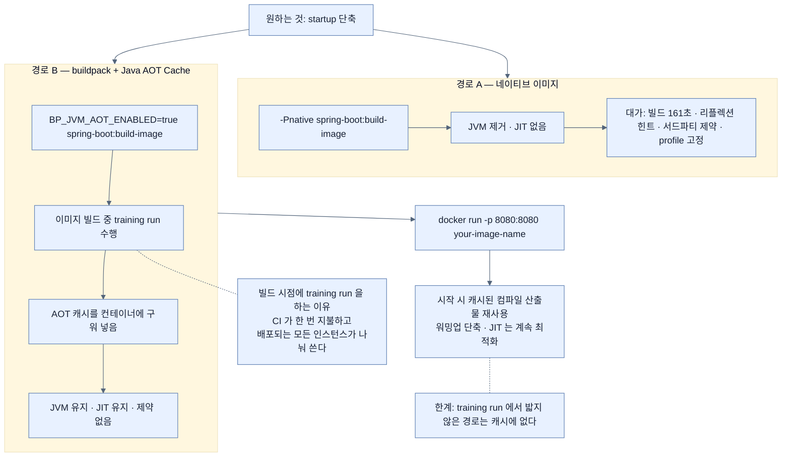

# buildpack + AOT Cache — 네이티브를 쓰지 않고 startup 줄이기

## 한눈에 보기

```bash
BP_JVM_AOT_ENABLED=true ./mvnw spring-boot:build-image
docker run -p 8080:8080 your-image-name
```

환경 변수 하나가 이미지 빌드 중에 **training run**을 돌려 AOT 캐시를 구워 넣는다.

| | 네이티브 이미지 | buildpack + AOT Cache |
|---|---|---|
| 런타임 | JVM 없음 | **JVM 유지** |
| JIT | 없음 | **온전히 유지** |
| 리플렉션·프록시 제약 | 있음 | **없음** |
| startup | 가장 빠름 | 개선됨 |
| 명령 | `-Pnative spring-boot:build-image` | `BP_JVM_AOT_ENABLED=true spring-boot:build-image` |

## 1. 왜 이게 필요한가

여기까지 오면서 네이티브 이미지를 얻기 위해 지불한 목록이 꽤 길어졌다.

- 빌드 161초, Peak RSS 5.03GB — [[03-building-and-running-a-native-application]]
- `@Profile`이 빌드 시점에 고정 — [[02-adapting-an-application-for-native-image]]
- 리플렉션 힌트를 손으로 등록 — [[05-configuring-reflection-and-runtime-hints]]
- 서드파티 의존성이 협조해야 함 — [[04b-graalvm-and-third-party-libraries]]

그런데 우리가 원했던 것은 **startup 시간 하나**였다. 저 목록 전체를 감수해야만 얻을 수 있는 것일까?

아니다. 책이 여기서 방향을 튼다. **[[네이티브-이미지]]**(= 미리 컴파일된 플랫폼 전용 실행 파일)만이 빠른 startup으로 가는 길은 아니다. **JVM에 남은 채로도** 개선할 수 있다.

## 2. 어떻게 동작하는가

### 2.1 buildpack은 GraalVM 전용이 아니다

[[04-building-native-container-images]]에서 **[[Paketo-Buildpack]]**(= Dockerfile 없이 컨테이너 이미지를 조립하는 buildpack)을 네이티브 이미지 만드는 데 썼다. 그런데 buildpack이 할 수 있는 최적화는 그것만이 아니다.

Spring Boot는 **[[Java-AOT-Cache]]**(= training run에서 만든 컴파일·프로파일링 산출물을 저장해 재사용하는 JVM 수준 최적화)를 활용하는 컨테이너 이미지 워크플로도 지원한다.

이 방식의 핵심은 한 문장이다 — **애플리케이션은 여전히 JVM에서 돌고**, 이미지 **빌드**가 캐시를 만들고, 그 캐시를 **시작할 때** 재사용한다.

### 2.2 Java AOT Cache가 무엇인가

JVM 수준 최적화로, **[[training-run]]**(= 캐시를 만들기 위해 애플리케이션을 한 번 대표적으로 실행해 보는 단계)에서 생성된 선별 컴파일·프로파일링 산출물을 저장했다가 이후 실행에서 재사용한다.

효과가 둘이다.

| 얻는 것 | 지키는 것 |
|---|---|
| startup 시간 단축 | **[[JIT]]**(= 실행 중 hot code를 컴파일) 능력 온전히 유지 |
| **[[warmup]]**(= 프로파일을 모아 JIT 최적화를 적용해 가는 초기 구간) 단축 | 런타임 동적 기능 그대로 |

두 번째 열이 네이티브와의 결정적 차이다. 네이티브는 JIT를 **없애서** startup을 얻고, AOT Cache는 JIT를 **유지한 채** 워밍업만 앞당긴다.

그래서 책의 표현이 정확하다 — **production 친화적인 대안**이다. JVM 기반 이미지이면서 startup이 개선되고, 네이티브 컴파일의 제약이 없다.

### 2.3 명령

```bash
% BP_JVM_AOT_ENABLED=true ./mvnw spring-boot:build-image
```

**[[BP_JVM_AOT_ENABLED]]**(= buildpack에 training run을 돌려 AOT 캐시를 구워 넣으라고 지시하는 환경 변수)가 켜지면 **이미지 빌드 중에 training run이 수행**되고, 생성된 AOT 캐시가 컨테이너에 **박혀서** 나온다.

`BP_`로 시작하는 이름은 buildpack 설정의 관례다. Maven 옵션이 아니라 **buildpack에 주는 지시**라 명령 앞에 환경 변수로 붙인다.

```bash
docker run -p 8080:8080 your-image-name
```

시작할 때 JVM이 캐시된 컴파일 산출물을 재사용해 **워밍업 시간이 줄고, JIT 능력은 그대로 남는다.**

### 2.4 왜 빌드 시점에 training run을 하나

여기가 이 방식의 영리한 지점이다.

training run은 애플리케이션을 실제로 한 번 띄워 봐야 한다. 그것을 **운영 배포 시점**에 하면 첫 인스턴스가 느려지므로 의미가 없다. **이미지 빌드 시점**에 해 두면 그 비용을 CI가 한 번 지불하고, **배포되는 모든 인스턴스가 그 결과를 나눠 쓴다.**

[[03a-why-native-images-pay-off]]의 곱셈이 여기서도 작동한다 — 다만 이번엔 이득 쪽에서.

### 2.5 비유와 그 한계

악기 조율에 빗댈 수 있다. JVM은 연주를 시작하면서 조금씩 음을 잡아 간다(워밍업). AOT Cache는 **리허설(training run)에서 잡아 둔 조율값을 기록해 두었다가** 본 공연 시작 때 그대로 적용한다. 연주 중에도 계속 미세 조정할 수 있다는 점이 중요하다 — JIT는 살아 있다.

**깨지는 지점 둘.** 첫째, 조율값은 **그 악기 그 환경**에서만 맞다 — AOT 캐시도 같은 빌드와 같은 JVM 버전에만 유효하다([[07a-enabling-aot-cache-for-spring-boot]]). 둘째, 리허설에서 연주하지 않은 곡은 조율이 안 돼 있다 — **training run에서 밟지 않은 코드 경로는 캐시에 없다.** 그래서 리허설을 대충 하면 이득이 작다.

## 3. 그림으로 보기



## 4. 이 노트에 나온 용어

- **[[Java-AOT-Cache]]**: training run 산출물을 저장해 재사용하는 JVM 수준 최적화.
- **[[training-run]]**: 캐시를 만들기 위해 애플리케이션을 한 번 대표적으로 실행하는 단계.
- **[[BP_JVM_AOT_ENABLED]]**: buildpack에 training run과 캐시 삽입을 지시하는 환경 변수.
- **[[Paketo-Buildpack]]**: Dockerfile 없이 컨테이너 이미지를 조립하는 buildpack 구현.
- **[[JIT]]**: 실행 중 hot code를 기계어로 컴파일하는 방식.
- **[[warmup]]**: 프로파일을 모아 JIT 최적화를 적용해 가는 초기 구간.
- **[[CDS]]**: 로드된 class 메타데이터를 아카이브로 저장해 재사용하는 이전 세대 JVM 기능.
- **[[네이티브-이미지]]**: 미리 컴파일된 플랫폼 전용 독립 실행 파일.

## 5. 자주 헷갈리는 것

**책이 빠뜨린 선택지 — CDS** — 이 절은 AOT Cache만 다루지만, Spring Boot는 같은 자리에서 **[[CDS]]**(= class 메타데이터를 아카이브로 저장해 재사용)도 지원한다. 공식 문서의 절차는 `java -XX:ArchiveClassesAtExit=application.jsa -Dspring.context.exit=onRefresh -jar app.jar`로 아카이브를 만들고 `-XX:SharedArchiveFile=application.jsa`로 시작하는 것이다. **Java 24 이전 JDK를 쓰는 팀에게는 이쪽이 유일한 선택지**인데 책에는 언급이 없다.

**AOT Cache ≠ Spring AOT** — 이름이 겹치지만 층이 다르다. Spring AOT는 빌드 시점에 **애플리케이션 구조**를 준비하고, Java AOT Cache는 **JVM 수준**의 런타임 성능을 겨냥한다 — [[07-using-java-25-aot-cache]]에서 책이 직접 이 구분을 강조한다.

**`-Pnative`와 `BP_JVM_AOT_ENABLED`는 배타적이다** — 앞의 것은 JVM을 없애고 뒤의 것은 JVM을 전제한다. 같이 켤 이유가 없다.

**JDK 버전 요구** — AOT Cache는 Java 24에서 도입돼 Java 25에서 단순화됐다. 그 이전 JDK 기반 이미지에서는 이 환경 변수가 의미가 없다.

## 6. 언제 안 쓰나 / 경계

- **극단적인 cold start가 요구되면** 네이티브가 여전히 더 빠르다 — [[07b-comparing-four-execution-strategies]].
- **training run이 대표성 없으면** 이득이 작다. 빌드 중 실행이라 DB 같은 외부 의존성에 붙지 못할 수 있고, 그러면 밟는 경로가 얕아진다.
- **이미지 빌드 시간이 늘어난다.** training run만큼 CI 시간이 추가된다.
- **JDK를 올리면 캐시를 다시 만들어야 한다.** 베이스 이미지 갱신 때 함께 계획한다.

## 7. 연결

- [[04-building-native-container-images]] — 같은 buildpack 명령을 네이티브 쪽으로 쓰는 경로.
- [[07-using-java-25-aot-cache]] — 같은 AOT Cache를 buildpack 없이 JVM 명령으로 직접 쓰는 방법.
- [[07a-enabling-aot-cache-for-spring-boot]] — training run과 캐시 사용의 구체적 명령.
- [[07b-comparing-four-execution-strategies]] — 이 방식이 네 전략 중 어디에 놓이는지.

## 8. 스스로 확인

- 네이티브 이미지와 AOT Cache가 startup을 줄이는 방식의 차이를 JIT를 중심으로 설명해 보라.
- training run을 배포 시점이 아니라 이미지 빌드 시점에 하는 이유는?
- `BP_`로 시작하는 환경 변수가 Maven 옵션이 아닌 이유는?
- Java 23 기반 이미지에서 startup을 줄이려면 무엇을 써야 하는가?

<!-- ==== 아래는 내 영역 · 스킬 수정 금지 ==== -->

## 내 설명 시도


## 막혔던 지점


## 리뷰 이력
