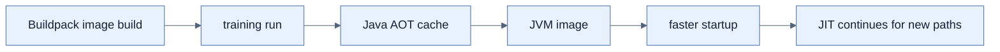

# Buildpack과 Java AOT Cache

## 한눈에 보기

`BP_JVM_AOT_ENABLED=true`로 JVM image를 build하면 training run에서 class loading·profiling artifact를 AOT cache로 만들고 image에 넣는다. Application은 여전히 HotSpot JVM과 JIT를 사용하면서 cold startup과 warmup을 줄인다.

## 1. 왜 이게 필요한가

Native image의 reflection·proxy 제약과 긴 compile을 받아들이기 어렵지만 restart·autoscaling startup을 개선하고 싶은 경우가 있다. AOT Cache는 full JVM compatibility와 dynamic JIT 최적화를 유지하는 중간 선택이다.

## 2. 어떻게 동작하는가

Buildpack이 image build 중 application을 대표적으로 실행해 cache material을 수집한다. Final image의 JVM은 다음 startup에서 이를 읽고 이미 load/link/profile된 경로를 재사용하며 새로운 경로는 계속 JIT compile한다. Training behavior가 실제 traffic을 대표할수록 hit와 효과가 커진다.

Cache는 exact application build, dependencies, JVM 조건과 연결된다. artifact나 JDK가 바뀌면 재생성해야 하며 stale cache를 일반 data cache처럼 공유하면 안 된다.

## 3. 그림으로 보기

## 4. 이 노트에 나온 용어

- **training run**: 향후 startup에 재사용할 execution artifact를 수집하는 대표 실행.
- **warmup**: JVM이 class를 load하고 code를 profile·JIT optimize해 steady state에 도달하는 기간.
- **Java AOT Cache**: JVM이 이전 실행의 loading/linking/profiling artifact를 재사용하는 cache.

## 7. 연결

- [[07-java-25-aot-cache-and-crac-comparison]] — direct JVM 명령과 다른 startup 모델을 비교한다.
- [[04-building-native-container-images]] — buildpack에서 선택 가능한 native 대안이다.
- [[01-why-graalvm-native-image]] — 해결하려는 cold start 문제는 같다.

## 8. 스스로 확인

- 전체 1차 정리 후: Java AOT Cache를 써도 JIT가 계속 필요한 이유를 설명한다.

<!-- ==== 아래는 내 영역 · 스킬 수정 금지 ==== -->

## 내 설명 시도

## 막혔던 지점

## 리뷰 이력

