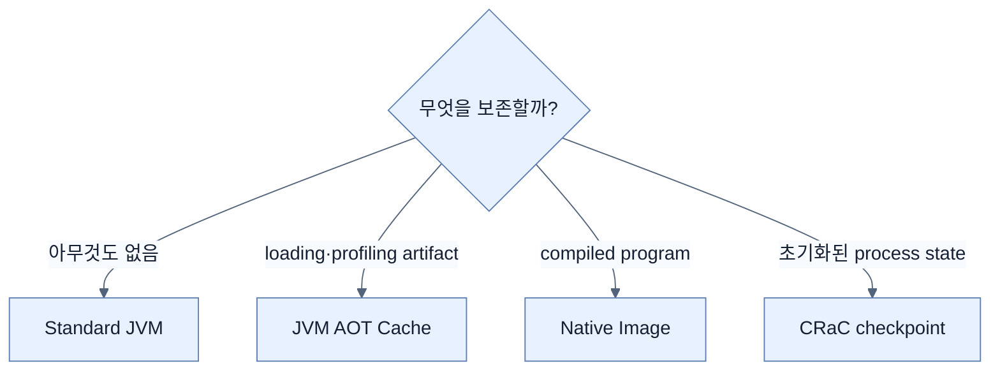

# Java 25 AOT Cache와 CRaC 비교

## 한눈에 보기

Java 25는 `-XX:AOTCacheOutput=app.aot` training run으로 cache를 만들고 `-XX:AOTCache=app.aot`로 재사용한다. Standard JVM, JVM+AOT Cache, GraalVM native image, CRaC는 startup, dynamic runtime, memory, build/operation complexity가 서로 다르다.

## 1. 왜 이게 필요한가

Startup 최적화에는 단일 정답이 없다. Cold start가 중요한지, peak throughput과 dynamic loading이 필요한지, checkpoint 가능한 Linux 환경인지, build pipeline 복잡도를 감당할지를 함께 봐야 한다.

## 2. 어떻게 동작하는가

Java 25 training은 `-Dspring.context.exit=onRefresh`로 context refresh 후 종료하며 cache file을 만든다. 실제 로그인·API·DB query 같은 representative path를 포함할수록 좋다. Application/JDK가 바뀌면 cache를 다시 만든다.

| 방식 | 시작 | Runtime model | 핵심 비용 |
|---|---|---|---|
| Standard JVM | 느린 편 | full JIT | warmup |
| JVM + AOT Cache | 더 빠름 | cached artifact + full JIT | training/compatibility |
| Native Image | 매우 빠름 | no JIT, AOT binary | build·closed-world 제약 |
| CRaC | restore가 매우 빠를 수 있음 | initialized HotSpot snapshot | checkpoint safety·Linux/CRIU 운영 |

Spring AOT는 Bean structure를 build time에 준비하고 Java AOT Cache는 JVM performance artifact를 재사용한다. 이름은 비슷하지만 층이 다르다.

## 3. 그림으로 보기

## 4. 이 노트에 나온 용어

- **CRaC**: 초기화된 JVM process를 checkpoint하고 나중에 restore하는 startup 기술.
- **Project Leyden**: Java application startup·warmup·footprint 개선을 다루는 OpenJDK project.
- **training compatibility**: cache가 exact application/JDK 조건과 일치해야 하는 제약.

## 7. 연결

- [[06-using-buildpacks-with-java-aot-cache]] — AOT Cache 생성의 container workflow다.
- [[03-building-and-running-a-native-application]] — binary AOT 선택과 비교한다.
- [[02-adapting-an-application-for-native-image]] — native 방식만 갖는 closed-world 제약이다.

## 8. 스스로 확인

- 전체 1차 정리 후: Spring AOT와 Java AOT Cache가 서로 다른 계층인 이유를 설명한다.

<!-- ==== 아래는 내 영역 · 스킬 수정 금지 ==== -->

## 내 설명 시도

## 막혔던 지점

## 리뷰 이력

