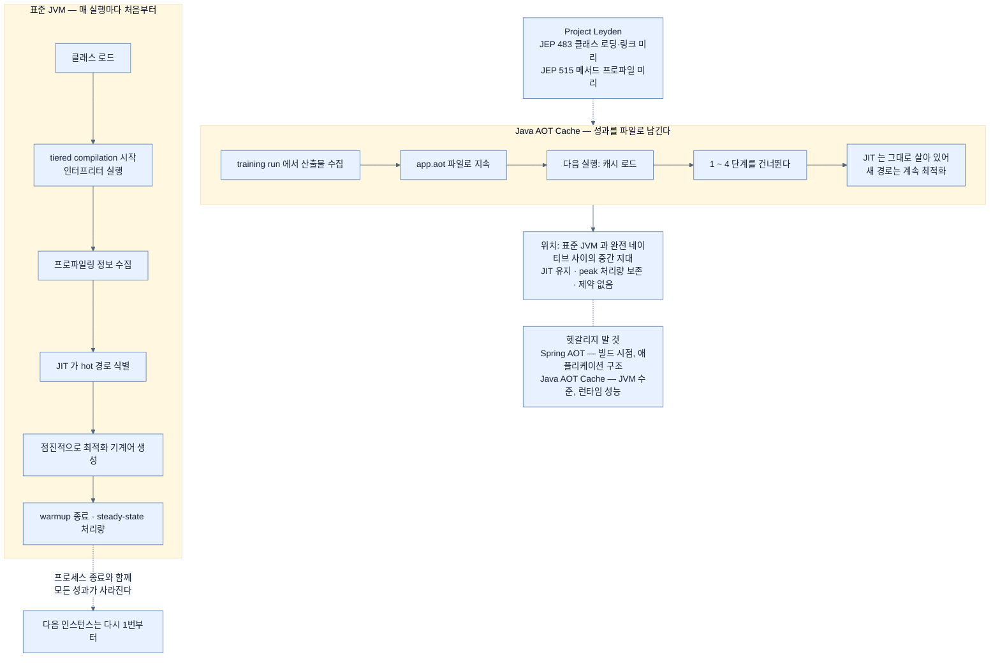

# Java 25 AOT Cache — JVM에 남으면서 워밍업을 앞당기기

## 한눈에 보기

| | 네이티브 이미지 | Java AOT Cache | 표준 JVM |
|---|---|---|---|
| 산출물 | 플랫폼 전용 바이너리 | JAR + `app.aot` 파일 | JAR |
| JIT | **없음** | **살아 있음** | 살아 있음 |
| peak 처리량 | 낮을 수 있음 | **보존됨** | 기준 |
| 빌드 복잡도 | 높음 | 낮음~보통 | 낮음 |

**표준 JVM 실행과 완전 네이티브 컴파일 사이의 아키텍처적 중간 지대.**

## 1. 왜 이게 필요한가

[[03-building-and-running-a-native-application]]에서 얻은 0.528초는 인상적이었다. 그런데 그 대가 목록을 다시 보자 — 빌드 복잡도, 그리고 리플렉션·동적 프록시·런타임 동작에 대한 **더 엄격한 제한**.

여기서 책이 질문을 던진다. **JVM에 남으면서 빠른 startup을 얻을 수는 없나?**

[[06-using-buildpacks-with-java-aot-cache]]에서 buildpack을 통해 그 답을 이미 한 번 봤다. 이 절은 같은 기능을 **JVM 수준에서 직접** 들여다본다.

## 2. 어떻게 동작하는가

### 2.1 표준 JVM이 시작할 때 실제로 하는 일

AOT Cache가 무엇을 아끼는지 알려면 무엇에 시간을 쓰는지부터 봐야 한다.

JVM 애플리케이션을 띄우면 이렇게 진행된다.

1. class가 메모리로 로드된다.
2. **[[tiered-compilation]]**(= 인터프리터와 여러 단계 JIT를 조합하는 HotSpot의 실행 모델) 안에서 실행이 시작된다.
3. 메서드가 돌면서 런타임이 **프로파일링 정보를 모은다.**
4. **[[JIT]]**(= 실행 중 hot code를 기계어로 컴파일)가 자주 쓰이는 "hot" 경로를 찾아낸다.
5. 그 메서드들이 점점 더 최적화된 기계어로 컴파일된다.
6. 프로파일 데이터가 쌓이고 상위 최적화가 적용되면서 **[[warmup]]**(= 성능이 올라가는 초기 구간) 동안 성능이 개선된다.
7. **[[steady-state-처리량]]**(= 워밍업이 끝난 뒤의 안정된 처리 성능)에 도달한다.

3~6번이 매번 처음부터 반복된다는 것이 요점이다. **어제 이 서버가 알아낸 최적화는 오늘 새 인스턴스에 전달되지 않는다.**

### 2.2 언제 이게 문제가 되나

오래 도는 서비스에서는 이 워밍업 비용이 **대체로 수용 가능**하다. 몇 주 도는 프로세스에서 처음 몇 분은 무시할 수 있다.

책이 드는, 문제가 되는 네 상황은 이렇다.

| 상황 | 왜 |
|---|---|
| 애플리케이션이 자주 재시작된다 | 워밍업을 자주 다시 지불한다 |
| 컨테이너가 동적으로 스케일한다 | 새로 뜨는 인스턴스마다 처음부터 |
| **[[cold-start]]** 지연이 중요하다 | 첫 요청의 응답 시간이 곧 지표 |
| **[[서버리스]]**·버스트 워크로드 | 수명이 짧아 워밍업이 전체의 큰 몫 |

### 2.3 AOT Cache가 하는 일

**[[Java-AOT-Cache]]**(= 선별 컴파일·프로파일링 산출물을 실행 간에 보존하는 JVM 수준 최적화)는 HotSpot JVM이 그 산출물을 **실행 사이에 파일로 지속**하게 한다. 호환되는 조건에서 이전에 만든 최적화 기계어를 재사용하므로 startup과 워밍업이 크게 준다.

**그리고 JIT 능력은 온전히 남는다.**

이것이 네이티브와 다른 trade-off를 만든다.

- 네이티브 바이너리를 만들지 **않는다.**
- 애플리케이션은 **JVM에서 계속 돈다.**
- JIT 컴파일러가 **살아 있다.**
- **peak 처리량 성능이 보존된다.**

그래서 AOT Cache는 표준 JVM 실행과 완전 네이티브 컴파일 사이의 **아키텍처적 중간 지대**에 놓인다.

### 2.4 계보

Java 25는 Java 24가 도입한 AOT Cache 지원을 이어받아, 캐시 생성을 **단일 training-run 명령**으로 단순화했다.

이 지원은 **[[Project-Leyden]]**(= Java의 시작·워밍업 시간을 줄이는 OpenJDK 프로젝트)의 일부이며, 책이 드는 **[[JEP]]**(= OpenJDK 변경 제안 문서)는 둘이다.

| JEP | 제목 | 하는 일 |
|---|---|---|
| 483 | Ahead-of-Time Class Loading and Linking | class 로딩·링크 결과를 미리 만들어 둔다 |
| 515 | Ahead-of-Time Method Profiling | 메서드 프로파일을 미리 수집해 둔다 |

둘을 합치면 2.1절의 1~4단계가 앞당겨진다.

### 2.5 Spring AOT와 헷갈리지 말 것

책이 이 절을 닫으며 못 박는 구분이 중요하다.

| | Spring AOT 처리 | Java AOT Cache |
|---|---|---|
| 층 | 프레임워크 | JVM |
| 시점 | 빌드 | 실행 사이 |
| 다루는 것 | 애플리케이션 **구조**(bean 그래프, metadata) | **런타임 성능**(컴파일·프로파일 산출물) |
| 관련 노트 | [[02-adapting-an-application-for-native-image]] | 이 노트 |

**[[Spring-AOT-엔진]]**(= 빌드 시점에 구조를 분석·고정하는 처리)은 "무엇이 bean인가"를 미리 정하고, Java AOT Cache는 "이 메서드를 어떻게 컴파일했었나"를 기억한다. 이름만 겹칠 뿐 서로 독립적이며, **함께 쓸 수도 있다.**

### 2.6 비유와 그 한계

산악 등반의 고정 로프에 빗댈 수 있다. 표준 JVM은 매번 맨몸으로 루트를 찾아 올라간다(워밍업). 앞선 팀이 박아 둔 로프(AOT 캐시)가 있으면 같은 구간을 훨씬 빨리 통과한다. 그러면서도 **로프가 없는 새 구간은 여전히 스스로 개척할 수 있다** — JIT가 살아 있다는 뜻이다.

**깨지는 지점 둘.** 첫째, 로프는 **누가 박았든 쓸 수 있지만** AOT 캐시는 **정확히 같은 빌드와 같은 JVM 버전**에만 맞는다([[07a-enabling-aot-cache-for-spring-boot]]). 둘째, 로프는 루트를 안전하게 만들지만 캐시는 **정확성에 관여하지 않는다** — 순수한 성능 장치이므로 캐시가 없거나 무효여도 프로그램은 그냥 느리게 정상 동작한다. 이 점이 네이티브 이미지의 "잘려 나가면 예외"와 결정적으로 다르다.

## 3. 그림으로 보기

## 4. 이 노트에 나온 용어

- **[[Java-AOT-Cache]]**: 컴파일·프로파일링 산출물을 실행 간에 보존하는 JVM 수준 최적화.
- **[[Project-Leyden]]**: Java의 시작·워밍업 시간을 줄이는 OpenJDK 프로젝트.
- **[[JEP]]**: OpenJDK에 들어갈 변경을 기술한 제안 문서.
- **[[tiered-compilation]]**: 인터프리터와 여러 단계 JIT를 조합하는 HotSpot의 실행 모델.
- **[[warmup]]**: 프로파일을 모아 JIT 최적화를 적용해 가는 초기 구간.
- **[[steady-state-처리량]]**: 워밍업이 끝난 뒤의 안정된 처리 성능.
- **[[JIT]]**: 실행 중 hot code를 기계어로 컴파일하는 방식.
- **[[Spring-AOT-엔진]]**: 빌드 시점에 애플리케이션 구조를 분석해 고정하는 처리 단계.
- **[[cold-start]]**: 인스턴스가 뜬 뒤 첫 요청을 처리하기까지의 지연.
- **[[서버리스]]**: 요청 때 띄우고 끝나면 내리는 실행 모델.

## 5. 자주 헷갈리는 것

**책이 빠뜨린 JEP** — p.244는 근거로 **JEP 483과 515만** 든다. 그런데 Java 25에서 "record와 create 두 단계 대신 단일 training-run 명령"을 실제로 가능하게 한 것은 **JEP 514 Ahead-of-Time Command-Line Ergonomics**다. 책이 바로 다음 절에서 쓰는 **`-XX:AOTCacheOutput`이 바로 이 JEP가 도입한 옵션**인데, 근거로 인용되지 않았다. OpenJDK 자료로 확인한 사실이다 — JEP 514는 JDK 25를 대상으로 하며, 이 옵션이 켜지면 JVM이 **내부적으로 `AOTMode=create` 하위 호출을 스스로 오케스트레이션**해 준다. 즉 책의 한 줄짜리 흐름은 두 단계가 사라진 것이 아니라 **JVM이 대신 밟아 주는 것**이다.

**"AOT"라는 말이 이 장에서 세 번 다른 뜻으로 쓰인다** — GraalVM의 AOT 컴파일(바이너리 생성), Spring AOT(빌드 시점 구조 확정), Java AOT Cache(JVM 런타임 최적화). 문맥마다 어느 것인지 확인해야 한다.

**캐시는 정확성에 관여하지 않는다** — 캐시가 없거나 무효면 그냥 평소대로 느리게 시작한다. 네이티브 이미지에서 클래스가 잘려 나가면 예외가 나는 것과 성질이 완전히 다르다. 그래서 **도입 리스크가 훨씬 낮다.**

**peak 처리량이 보존된다는 말의 의미** — 네이티브는 JIT가 없어 실행 패턴에 맞춘 최적화를 못 한다. 오래 도는 고부하 서비스에서는 **JVM 쪽이 최종 처리량에서 앞설 수 있다.** AOT Cache는 그 이점을 지키면서 초반만 앞당긴다.

## 6. 언제 안 쓰나 / 경계

- **극단적 cold start**가 요구되면 네이티브가 여전히 앞선다.
- **Java 24 미만**에서는 쓸 수 없다. 그때는 CDS를 본다 — [[06-using-buildpacks-with-java-aot-cache]].
- **메모리 사용량을 줄이는 것이 목표**라면 이 방식은 도움이 안 된다. JVM이 그대로 있다.
- **오래 도는 소수 인스턴스**라면 워밍업 비용 자체가 무시할 만하다.

## 7. 연결

- [[06-using-buildpacks-with-java-aot-cache]] — 같은 기능을 buildpack이 대신 켜 주는 경로.
- [[07a-enabling-aot-cache-for-spring-boot]] — 실제 명령과 운영상 주의사항.
- [[07b-comparing-four-execution-strategies]] — 네 전략 중 이 방식의 자리.
- [[03a-why-native-images-pay-off]] — 네이티브를 선택할 때의 비용 계산과 비교해 볼 것.

## 8. 스스로 확인

- 표준 JVM 시작의 7단계 중 AOT Cache가 앞당기는 것은 어디까지이고, 그대로 남는 것은?
- AOT Cache가 "중간 지대"라 불리는 이유를 JIT와 peak 처리량으로 설명해 보라.
- 이 장에서 "AOT"라는 말이 쓰인 세 가지 뜻을 각각 구분해 보라.
- AOT Cache 도입 리스크가 네이티브 전환보다 낮은 이유는?

<!-- ==== 아래는 내 영역 · 스킬 수정 금지 ==== -->

## 내 설명 시도

## 막혔던 지점

## 리뷰 이력
