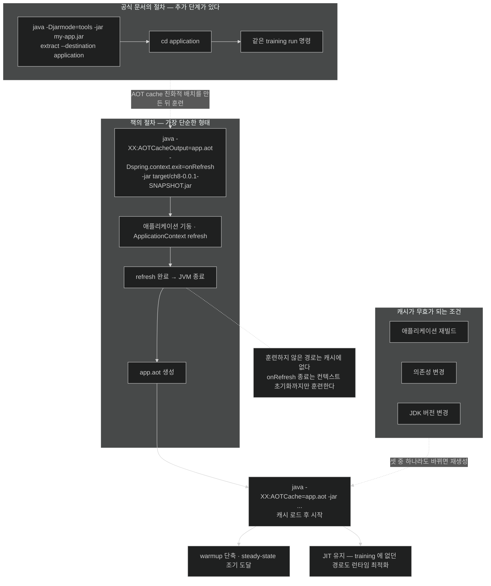

# AOT Cache 실제로 켜기 — training run 두 명령과 그 함정

## 한눈에 보기

```bash
# 1) 캐시 만들기 — 떠서 refresh 끝나면 바로 종료
java -XX:AOTCacheOutput=app.aot -Dspring.context.exit=onRefresh -jar target/ch8-0.0.1-SNAPSHOT.jar

# 2) 캐시 쓰기
java -XX:AOTCache=app.aot -jar target/ch8-0.0.1-SNAPSHOT.jar
```

Spring 설정이 한 줄도 없다. **AOT cache는 Spring 기능이 아니라 JVM 기능**이기 때문이다.

## 1. 왜 이게 필요한가

[[07-using-java-25-aot-cache]]가 개념을 정리했다면, 이 절은 **실제로 어떻게 켜는가**다.

여기서 먼저 확실히 해 둘 것이 있다. AOT cache는 **Spring 기능이 아니다.** JVM 기능이다. 가장 단순한 형태로는 Spring 전용 설정 없이 **JVM 옵션만으로** 쓴다.

그렇다면 왜 Spring 이야기가 끼는가? 두 지점 때문이다.

1. **[[training-run]]**(= 캐시를 만들기 위해 애플리케이션을 한 번 실행하는 단계)을 "떴다가 바로 끄는" 방법이 필요한데, 그 스위치를 Spring이 제공한다.
2. Spring Boot는 AOT 생성 코드가 포함되도록 패키징하는 법과 컨테이너 빌드에서 캐시를 쓰는 법을 문서화한다.

## 2. 어떻게 동작하는가

### 2.1 Java 25가 단순하게 만든 것

Java 24에서는 **record와 create 두 단계**를 따로 밟아야 했다. Java 25 이후로는 **training run 한 번에** 캐시 생성이 끝난다. Spring Framework의 AOT 캐시 문서도 이 단순화된 Java 25+ 방식을 보여 준다.

```bash
java -XX:AOTCacheOutput=app.aot -Dspring.context.exit=onRefresh -jar target/ch8-0.0.1-SNAPSHOT.jar
```

세 조각이 각각 일을 한다.

| 조각 | 하는 일 | 왜 필요한가 |
|---|---|---|
| `-XX:AOTCacheOutput=app.aot` | 이번 실행의 산출물을 `app.aot`에 쓴다 | 캐시를 **만드는** 모드로 전환 |
| `-Dspring.context.exit=onRefresh` | context refresh가 끝나면 **JVM을 종료**한다 | training run은 "떠 보는 것"이 목적이다. 안 끄면 서버가 계속 살아 있다 |
| `-jar ...` | 평소처럼 애플리케이션 실행 | 실제로 클래스를 로드하고 초기화해야 기록할 것이 생긴다 |

**[[spring.context.exit]]**(= `onRefresh`를 주면 refresh 직후 JVM을 종료시키는 Spring Framework 속성)이 이 흐름의 핵심 스위치다. Spring Framework 6.1부터 있고 `DefaultLifecycleProcessor`가 구현한다. 이 속성 덕에 "애플리케이션을 완전히 초기화해 보되 서비스는 시작하지 않는" 실행이 가능해진다.

### 2.2 캐시 쓰기

```bash
java -XX:AOTCache=app.aot -jar target/ch8-0.0.1-SNAPSHOT.jar
```

옵션 이름이 `AOTCacheOutput`(쓰기)에서 `AOTCache`(읽기)로 바뀐 것만 다르다.

이제 시작할 때 `app.aot`가 재사용된다. JVM이 cold 상태에서 출발하는 대신 **사전 컴파일된 산출물을 캐시에서 로드**해 **[[warmup]]**(= 성능이 올라가는 초기 구간) 오버헤드를 줄이고 steady-state에 더 빨리 도달한다.

중요한 것은 그다음 문장이다. **JVM은 여전히 온전한 [[JIT]] 능력을 유지한다.** training 단계에 없던 실행 경로가 나타나면 런타임에 동적으로 최적화된다. 캐시는 출발선을 앞당길 뿐 **한계를 정하지 않는다.**

### 2.3 training run을 제대로 하는 법

여기가 이 절에서 가장 실무적인 부분이다. **training run에서 현실적이고 대표적인 동작을 시켜야 한다.**

- 로그인해 보기
- API 호출 돌려 보기
- DB 질의 실행하기
- 자주 쓰는 endpoint 접근하기

이유는 단순하다 — **밟지 않은 경로는 캐시에 없다.** 로그인 코드를 한 번도 실행하지 않으면 그 부분의 컴파일 산출물이 기록되지 않고, 실제 운영에서 첫 로그인은 여전히 cold다.

개선 폭은 애플리케이션 크기, 로드되는 class 수, 프레임워크 복잡도, 하드웨어 특성에 달렸다. **"몇 배 빨라진다"는 고정된 숫자가 없다.**

여기서 긴장이 하나 생긴다. `spring.context.exit=onRefresh`는 **refresh 직후 끈다.** 그러면 위의 "로그인해 보기, API 호출하기"를 할 시간이 없다. 즉 책이 보여 준 명령은 **context 초기화까지만** 훈련하는 가장 단순한 형태이고, endpoint까지 훈련하려면 종료를 미루고 부하를 걸어 주는 별도 스크립트가 필요하다.

### 2.4 캐시 무효화 규칙

**`app.aot` 파일은 정확히 같은 애플리케이션 빌드와 JVM 버전에 맞아야 한다.**

셋 중 하나라도 바뀌면 캐시를 다시 만들어야 한다.

| 바뀐 것 | 왜 |
|---|---|
| 애플리케이션 재빌드 | 클래스가 달라졌다 |
| 의존성 변경 | 로드되는 클래스 집합이 달라졌다 |
| JDK 버전 변경 | 컴파일 산출물의 형식·전제가 달라졌다 |

이 규칙이 CI/CD에 주는 함의가 크다 — **캐시 생성을 빌드 파이프라인에 넣어야 한다.** 손으로 한 번 만들어 두고 재사용하는 방식은 곧 어긋난다.

### 2.5 비유와 그 한계

시험 전 모의고사에 빗댈 수 있다. training run이 모의고사이고, 거기서 푼 유형은 본시험에서 빨리 풀린다. 안 풀어 본 유형은 여전히 처음부터 생각해야 한다(JIT가 살아 있다).

**깨지는 지점 둘.** 첫째, 모의고사는 **범위가 조금 달라도 도움이 되지만** AOT 캐시는 빌드가 한 글자만 달라도 **통째로 무효**다. 둘째, 학생은 모의고사를 안 봐도 시험을 칠 수 있고 결과만 나쁘다 — 캐시도 마찬가지로 **없으면 그냥 느릴 뿐 실패하지 않는다.** 이 점이 네이티브 이미지와 결정적으로 다른, 도입 리스크가 낮은 이유다.

## 3. 그림으로 보기



## 4. 이 노트에 나온 용어

- **[[training-run]]**: 캐시를 만들기 위해 애플리케이션을 한 번 실행하는 단계.
- **[[spring.context.exit]]**: `onRefresh` 값으로 refresh 직후 JVM을 종료시키는 Spring 속성.
- **[[Java-AOT-Cache]]**: 컴파일·프로파일링 산출물을 실행 간에 보존하는 JVM 수준 최적화.
- **[[jarmode-tools]]**: uber JAR을 애플리케이션 코드와 의존 JAR로 풀어내는 Spring Boot 기능.
- **[[uber-JAR]]**: 애플리케이션과 모든 의존성을 한 파일에 담은 실행 가능 JAR.
- **[[JIT]]**: 실행 중 hot code를 기계어로 컴파일하는 방식.
- **[[warmup]]**: 프로파일을 모아 JIT 최적화를 적용해 가는 초기 구간.

## 5. 자주 헷갈리는 것

**책이 빠뜨린 단계 — 먼저 풀어내야 한다** — 책은 training run을 **uber JAR에 직접** 건다(`-jar target/ch8-0.0.1-SNAPSHOT.jar`). 그런데 Spring Boot 4.1 공식 문서의 절차에는 앞 단계가 하나 더 있다.

```bash
java -Djarmode=tools -jar my-app.jar extract --destination application
cd application
java -XX:AOTCacheOutput=app.aot -Dspring.context.exit=onRefresh -jar my-app.jar
```

**[[jarmode-tools]]**(= uber JAR을 애플리케이션 코드와 의존 JAR로 풀어내는 기능)로 먼저 펼친 뒤 그 디렉터리에서 훈련한다. 공식 Dockerfile 예제도 같은 순서이고, 문서가 이유를 밝힌다 — 풀어낸 JAR은 애플리케이션 코드와 추출된 JAR 참조만 담아 **"시작이 효율적이고 AOT cache 친화적인 배치"**이기 때문이다. **[[uber-JAR]]**의 중첩 JAR 로딩 구조는 그 조건이 아니다. 책 절차를 그대로 따라도 캐시는 만들어지지만, 공식 절차만큼의 효과는 기대하기 어렵다.

**한 줄짜리 흐름은 힙이 두 배 필요하다** — 책이 언급하지 않는 운영상 함정이다. OpenJDK 자료에 따르면 `-XX:AOTCacheOutput`의 one-step 워크플로는 **캐시를 만드는 하위 호출이 training run과 같은 크기의 자기 힙을 따로 쓴다.** 그래서 `-Xms4g -Xmx4g`와 함께 쓰면 **환경에 8GB가 필요하다.** 컨테이너에서 메모리 상한을 걸고 CI에서 캐시를 굽다가 원인 불명으로 죽는다면 여기를 먼저 본다.

**`AOTCacheOutput`과 `AOTCache`를 혼동하기 쉽다** — 이름이 비슷해 오타가 잦다. `Output`이 붙으면 **쓰기**(training), 없으면 **읽기**(사용)다.

**`onRefresh` 종료와 "대표적 동작"은 서로 당긴다** — refresh 직후 끄면 endpoint를 밟을 수 없다. 책은 둘을 같은 절에 나란히 적어 놓았지만 한 명령으로는 둘 다 못 한다. 깊은 훈련이 필요하면 종료를 미루고 부하를 거는 별도 절차를 짜야 한다.

**AOT 캐시는 정확성에 관여하지 않는다** — 파일이 없거나 무효면 경고 후 평소대로 시작한다. 배포가 깨지지 않는다.

## 6. 언제 안 쓰나 / 경계

- **손으로 만든 캐시를 재사용하지 않는다.** 빌드가 바뀌면 무효다. 파이프라인에 넣는다.
- **컨테이너에서는 buildpack이 더 간단하다** — [[06-using-buildpacks-with-java-aot-cache]]가 이 절차를 대신 해 준다.
- **Java 24 미만에서는 못 쓴다.**
- **개선 폭을 미리 약속하지 않는다.** 애플리케이션과 하드웨어에 따라 크게 다르므로 측정이 먼저다.

## 7. 연결

- [[07-using-java-25-aot-cache]] — 이 명령들이 무엇을 하는지의 개념 배경.
- [[06-using-buildpacks-with-java-aot-cache]] — 같은 일을 컨테이너 빌드가 대신 하는 경로.
- [[07b-comparing-four-execution-strategies]] — 이 방식과 나머지 셋의 선택 기준.
- [[03-building-and-running-a-native-application]] — 비교 대상인 네이티브 빌드 절차.

## 8. 스스로 확인

- `-Dspring.context.exit=onRefresh`가 없으면 training run에서 무슨 일이 생기는가?
- 공식 문서가 `jarmode=tools extract`를 먼저 시키는 이유를 uber JAR 구조로 설명해 보라.
- "대표적 동작을 시켜야 한다"와 "refresh 후 종료한다"가 어떻게 충돌하는가?
- `app.aot`를 재생성해야 하는 세 가지 조건은?


> 네 문항을 스스로 답한 **뒤에** [[_07a-enabling-aot-cache-for-spring-boot]]에서 모범답안과 대조한다. 먼저 열면 이 문항들은 다시 인출 문제로 쓸 수 없다.

<!-- ==== 아래는 내 영역 · 스킬 수정 금지 ==== -->

## 내 설명 시도


## 막혔던 지점


## 리뷰 이력
