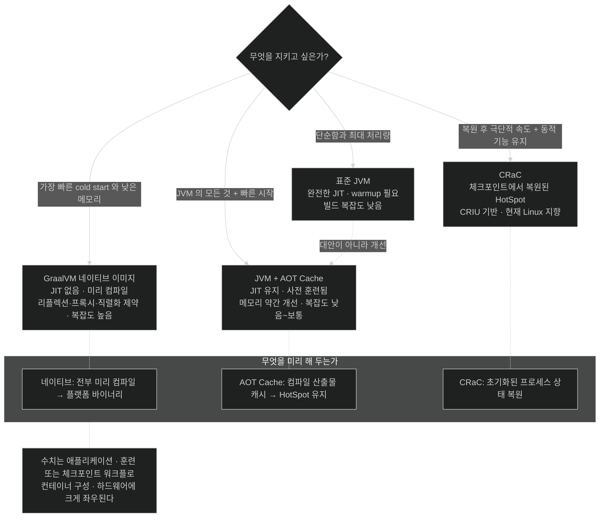

# 네 가지 실행 전략 — 무엇을 내주고 무엇을 얻나

## 한눈에 보기

Table 8.1(책 p.246)의 재현이다.

| 접근 | 시작 시간 | 런타임 모델 | 메모리 사용량 | 빌드 복잡도 |
|---|---|---|---|---|
| **표준 JVM** | 느림 | 완전한 JIT 컴파일 | 표준 | 낮음 |
| **JVM + AOT Cache** | 표준 JVM보다 빠름 | JIT 유지 (사전 훈련됨) | 약간 개선 | 낮음~보통 |
| **GraalVM 네이티브 이미지** | 표준 JVM보다 빠름 | JIT 없음 (미리 컴파일됨) | 더 낮음 | 높음 |
| **CRaC** | 복원 후 극단적으로 빠를 수 있음 | 체크포인트에서 복원된 HotSpot JVM | 구성에 따라 다름 | 보통~높음 |

## 1. 왜 이게 필요한가

이 장은 세 가지 실행 전략을 훑었다 — 표준 JVM, AOT Cache, 네이티브 이미지. 그런데 선택을 하려면 **같은 축에 놓고 봐야** 한다.

그리고 축에 놓는 순간 네 번째가 보인다. Spring Boot가 startup 시간 단축의 또 다른 방법으로 문서화하는 **[[CRaC]]**(= 초기화된 JVM 상태를 저장했다가 복원하는 방식)다.

네 가지 모두 Spring Boot 4 앱을 성공적으로 돌릴 수 있다. **다른 것은 운영상의 함의다.** 시작 속도, 런타임 적응성, 메모리 관리, 빌드 복잡도 사이의 trade-off가 각각 다르다.

## 2. 어떻게 동작하는가

### 2.1 표준 JVM — 기준선

전적으로 **[[JIT]]**(= 실행 중 hot code를 컴파일)에 의존한다. **[[tiered-compilation]]**(= 인터프리터와 여러 단계 JIT의 조합) 안에서 실행 경로를 프로파일링하고 컴파일하는 **[[warmup]]** 단계가 필요하다.

- **얻는 것**: 최대의 유연성, 장기 처리량 최적화
- **내주는 것**: startup 지연
- **빌드 복잡도**: 낮게 유지된다

### 2.2 JVM + AOT Cache — 기준선의 보완

**[[Java-AOT-Cache]]**(= 컴파일 산출물을 실행 간에 보존)는 실행 사이에 컴파일 산출물을 남겨 이 모델을 **보완한다.** 애플리케이션은 JVM에 남고 완전한 JIT 최적화 능력을 유지하되, startup과 워밍업 시간이 준다.

책의 표현이 정확하다 — **네이티브 컴파일의 추가 제약 없이 더 반응성 있는 해법**이다.

즉 이것은 표준 JVM의 **대안이 아니라 개선**이다. 나머지 셋과 성격이 다르다.

### 2.3 GraalVM 네이티브 이미지 — 근본적으로 다른 모델

애플리케이션이 미리 독립 실행 파일로 컴파일된다. **런타임에 JIT 컴파일러가 돌지 않으므로** startup이 크게 빠르고 메모리 사용량이 대체로 낮다.

- **내주는 것**: 추가 빌드 시점 설정, 리플렉션·동적 프록시·직렬화에 대한 더 많은 제약
- 그 제약의 내용은 [[02-adapting-an-application-for-native-image]]와 [[05-configuring-reflection-and-runtime-hints]]에 있다

여기서 놓치기 쉬운 것 하나 — JIT가 없다는 것은 startup만 바꾸는 게 아니라 **[[steady-state-처리량]]**(= 워밍업 후 안정된 처리 성능)의 상한도 바꾼다. 실행 패턴에 맞춘 최적화가 불가능하기 때문이다.

### 2.4 CRaC — 상태를 통째로 복원

**Coordinated Restore at Checkpoint.** 완전히 초기화된 애플리케이션을 **[[체크포인트]]**(= 프로세스 메모리와 상태의 스냅숏)로 떠 두었다가 나중에 복원한다. 복원 후 startup이 극단적으로 빨라질 수 있다.

**[[CRIU]]**(= 리눅스에서 프로세스를 파일로 덤프·복원하는 기반 기술) 위에 서 있고, **현재 Linux 지향 체크포인트/복원 워크플로를 겨냥한다.**

네이티브 대신 CRaC를 고르는 이유는 명확하다 — **일반 JVM 런타임과 그 동적 기능, 표준 JVM 동작을 유지하면서** startup을 줄이려는 것이다.

### 2.5 세 문장으로 압축한 차이

책이 개념을 이렇게 정리한다.

| 방식 | 무엇을 미리 해 두나 |
|---|---|
| 네이티브 이미지 | **전부를 미리 컴파일**해 플랫폼 전용 바이너리로 |
| AOT cache | **컴파일된 산출물을 캐시**해 HotSpot에 남은 채 워밍업 단축 |
| CRaC | **초기화된 JVM 프로세스 상태를 복원** |

실제 순서는 대체로 이렇다 — 표준 JVM이 가장 느리고, AOT cache가 정상 JVM 동작을 지키며 눈에 띄게 개선하고, 네이티브가 대체로 가장 빠른 cold start를 내고, CRaC는 복원 후 극단적으로 빠를 수 있다.

**정확한 수치는 애플리케이션·훈련 또는 체크포인트 워크플로·컨테이너 구성·하드웨어에 크게 좌우된다.**

### 2.6 비유와 그 한계

식당 개점 준비에 빗댈 수 있다.

| | 비유 |
|---|---|
| 표준 JVM | 매일 아침 재료 손질부터 시작 |
| AOT Cache | 어제 손질법 메모를 보고 빠르게 재현. 새 메뉴는 그때그때 |
| 네이티브 이미지 | 모든 요리를 미리 만들어 진공포장. 메뉴 변경 불가 |
| CRaC | **어제 영업 중이던 주방을 통째로 사진 찍어 두었다가 그대로 되살림** |

**깨지는 지점 둘.** 첫째, 주방 사진은 재료가 상하지 않지만 CRaC 체크포인트는 **열린 소켓·파일 핸들·만료된 토큰**을 담고 있어 복원 시 정리가 필요하다 — 그래서 애플리케이션이 체크포인트 이벤트에 "협조(Coordinated)"해야 하고, 이름에 그 단어가 들어간다. 둘째, 비유는 넷을 나란히 놓지만 실제로 AOT Cache는 **다른 셋과 층이 다르다** — 표준 JVM의 대안이 아니라 그 위에 얹는 개선이라, "표준 JVM + AOT Cache"가 자연스러운 조합이다.

## 3. 그림으로 보기

## 4. 이 노트에 나온 용어

- **[[CRaC]]**: 초기화된 JVM 프로세스 상태를 저장했다가 복원하는 방식.
- **[[CRIU]]**: 리눅스에서 프로세스를 파일로 덤프·복원하는 기반 기술.
- **[[체크포인트]]**: 프로세스의 메모리와 상태를 저장한 스냅숏.
- **[[spring.context.checkpoint]]**: `onRefresh` 값으로 refresh 시점에 체크포인트를 찍는 Spring 속성.
- **[[Java-AOT-Cache]]**: 컴파일·프로파일링 산출물을 실행 간에 보존하는 JVM 수준 최적화.
- **[[네이티브-이미지]]**: 미리 컴파일된 플랫폼 전용 독립 실행 파일.
- **[[JIT]]**: 실행 중 hot code를 기계어로 컴파일하는 방식.
- **[[warmup]]**: 프로파일을 모아 JIT 최적화를 적용해 가는 초기 구간.
- **[[steady-state-처리량]]**: 워밍업이 끝난 뒤의 안정된 처리 성능.
- **[[tiered-compilation]]**: 인터프리터와 여러 단계 JIT를 조합하는 HotSpot의 실행 모델.

## 5. 자주 헷갈리는 것

**책이 CRaC만 명령을 보여 주지 않는다** — 나머지 셋은 실제 명령이 나오는데 CRaC는 "Spring Boot가 문서화한 또 하나의 방법"이라는 소개에서 끝난다. Spring 쪽 진입점은 실제로 존재하고, [[07a-enabling-aot-cache-for-spring-boot]]에서 본 스위치와 **정확히 짝을 이룬다.**

| | 속성 | 하는 일 |
|---|---|---|
| AOT Cache · CDS | `spring.context.exit=onRefresh` | refresh 후 **종료** |
| CRaC | `spring.context.checkpoint=onRefresh` | refresh 후 **체크포인트** |

둘 다 Spring Framework 6.1부터 `DefaultLifecycleProcessor`가 구현한다. 게다가 Spring Boot는 CRaC MXBean이 classpath에 있으면 시작 배너를 `Started` 대신 **`Restored`**로 바꾸고, 가동 시간도 마지막 복원 이후로 보고한다. 즉 CRaC는 "언급만 되는 미래 기술"이 아니라 **이미 통합된 경로**다.

**"네이티브가 항상 가장 빠르다"** — cold start에서는 대체로 그렇다. 그러나 **복원 후의 CRaC가 더 빠를 수 있고**, 오래 도는 고부하 서비스의 최종 처리량은 JIT가 있는 쪽이 앞설 수 있다. 축이 하나가 아니다.

**AOT Cache는 나머지 셋과 층이 다르다** — 표 하나에 나란히 놓여 있어 네 개의 배타적 선택지처럼 보이지만, AOT Cache는 표준 JVM 위에 얹는 개선이다. "표준 JVM이냐 AOT Cache냐"가 아니라 "AOT Cache를 켜느냐 마느냐"에 가깝다.

**CRaC의 운영 제약** — CRIU 기반이라 Linux 지향이고, 체크포인트에 열린 연결·핸들이 담겨 복원 시 정리가 필요하다. 그래서 애플리케이션이 체크포인트/복원 이벤트에 협조해야 한다 — 이름의 "Coordinated"가 그 뜻이다.

## 6. 언제 안 쓰나 / 경계

- **측정 없이 고르지 않는다.** 책도 "정확한 수치는 크게 좌우된다"고 못 박는다. 우리 애플리케이션으로 재 봐야 한다.
- **가장 싼 것부터 시도한다.** AOT Cache는 코드 변경이 없고 실패해도 느려질 뿐이다. 네이티브는 그 반대다.
- **CRaC를 비-Linux 환경에 계획하지 않는다.** 현재 워크플로가 Linux 지향이다.
- **메모리가 목표라면** 선택지가 사실상 네이티브 하나다. 나머지 셋은 JVM을 유지한다.

## 7. 연결

- [[07-using-java-25-aot-cache]] — 네 전략 중 AOT Cache의 개념 배경.
- [[07a-enabling-aot-cache-for-spring-boot]] — `spring.context.exit`가 CRaC의 `checkpoint`와 짝인 자리.
- [[03a-why-native-images-pay-off]] — 네이티브를 고를 때의 비용 계산.
- [[01-why-graalvm-native-image]] — 이 선택지들이 존재하게 된 배경.

## 8. 스스로 확인

- 네 전략을 시작 시간·런타임 모델·메모리·빌드 복잡도 네 축으로 표 없이 복원해 보라.
- AOT Cache가 "나머지 셋과 층이 다르다"는 말의 뜻은?
- CRaC의 "Coordinated"가 왜 이름에 들어가는가?
- 처리량이 최우선인 서비스에서 네이티브 이미지를 고르면 무엇을 잃는가?

> 네 문항을 스스로 답한 **뒤에** [[_07b-comparing-four-execution-strategies]]에서 모범답안과 대조한다. 먼저 열면 이 문항들은 다시 인출 문제로 쓸 수 없다.

<!-- ==== 아래는 내 영역 · 스킬 수정 금지 ==== -->

## 내 설명 시도

## 막혔던 지점

## 리뷰 이력
