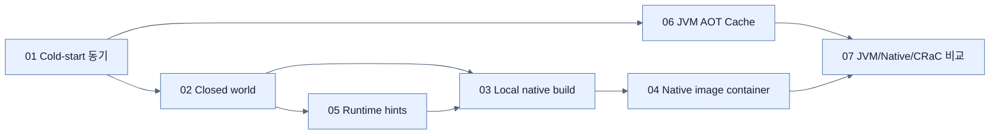

# Chapter 8 지도 — Going Native

## 선택 축

| 우선순위 | 후보 |
|---|---|
| 최대 runtime 유연성·낮은 build 복잡도 | Standard JVM |
| JVM 호환성 유지 + startup 개선 | Java AOT Cache |
| 작은 footprint + 빠른 cold start | GraalVM Native Image |
| 초기화된 JVM의 매우 빠른 복원 | CRaC |

실제 선택은 startup뿐 아니라 throughput, memory, build time, library compatibility, 운영 platform을 함께 benchmark한다.

