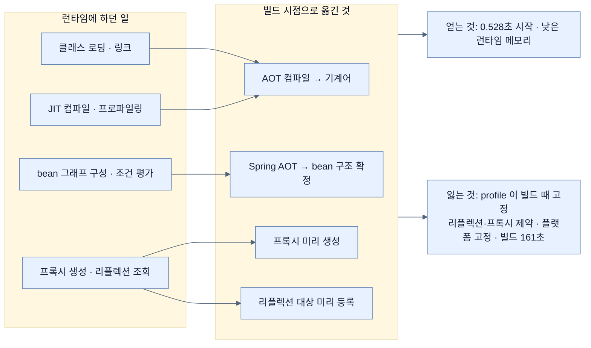
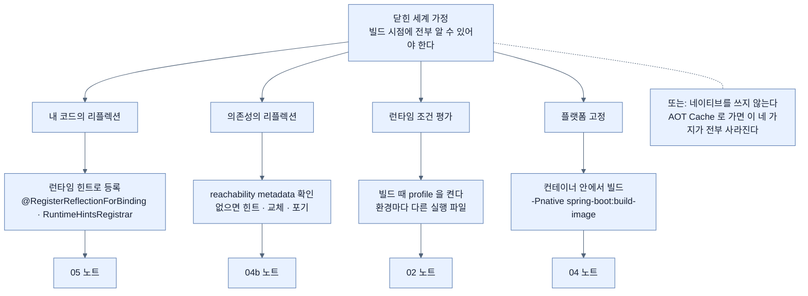

# Chapter 8 개념 지도 — Going Native with Spring Boot

> *Learning Spring Boot 4*, Ch. 8 (책 pp. 229–248 / PDF pp. 254–273). 노트 12개를 세 축으로 엮는다. 축 1은 **"무엇을 언제 결정하는가"**, 축 2는 **"무엇을 내주고 무엇을 얻는가"**, 축 3은 **"어디에서 깨지는가"**다.

## 축 1 — 결정의 시점이 앞으로 당겨진다

이 장 전체를 관통하는 한 문장은 이것이다. **런타임에 하던 일을 빌드 시점으로 옮긴다.** 그러면 시작이 빨라지고, 대신 런타임의 자유가 준다.

노트 순서가 이 축을 따라간다 — [[01-why-graalvm-native-image]]가 동기를, [[02-adapting-an-application-for-native-image]]가 대가를, [[03-building-and-running-a-native-application]]이 실행을, [[05-configuring-reflection-and-runtime-hints]]가 그 대가를 되사는 방법을 다룬다.

## 축 2 — 네 전략의 좌표

같은 목표(빠른 시작)에 이르는 길이 넷이고, **각각 다른 것을 내준다.**

| 전략 | 내주는 것 | 지키는 것 | 다루는 노트 |
|---|---|---|---|
| 표준 JVM | 시작 시간 | 전부 | [[07b-comparing-four-execution-strategies]] |
| JVM + AOT Cache | 빌드 단계 하나(training run) | **JIT · 동적 기능 · 처리량** | [[06-using-buildpacks-with-java-aot-cache]] · [[07-using-java-25-aot-cache]] · [[07a-enabling-aot-cache-for-spring-boot]] |
| GraalVM 네이티브 | **JIT · 리플렉션 자유 · 이식성 · 빌드 시간** | 가장 빠른 cold start · 낮은 메모리 | [[03-building-and-running-a-native-application]] · [[04-building-native-container-images]] |
| CRaC | Linux 종속 · 체크포인트 관리 | JVM 동적 기능 | [[07b-comparing-four-execution-strategies]] |

**가장 싼 것부터 시도한다**는 원칙이 여기서 나온다. AOT Cache는 코드 변경이 없고 실패해도 느려질 뿐이며, 네이티브는 코드·의존성·CI를 다 건드리고 실패하면 런타임 예외다.

## 축 3 — 실패는 어디에서 오는가

네이티브 전환이 깨지는 지점을 원인별로 모으면 이렇게 갈린다.

세 번째 축이 알려 주는 것은, **네이티브의 문제 대부분이 닫힌 세계 가정 하나에서 파생된다**는 점이다. 그래서 [[02-adapting-an-application-for-native-image]]를 제대로 이해하면 나머지가 따라온다.

## 축 4 — 이름이 겹치는 것들

이 장에서 가장 자주 혼동되는 쌍들을 모았다.

| 겹치는 이름 | 구분 |
|---|---|
| GraalVM(런타임 VM) ↔ GraalVM(`native-image` 컴파일러) | 이 장이 쓰는 것은 **후자**. 산출물에 JVM이 없다 — [[01-why-graalvm-native-image]] |
| Spring AOT ↔ Java AOT Cache | 전자는 **빌드 시점 · 애플리케이션 구조**, 후자는 **JVM 수준 · 런타임 성능** — [[07-using-java-25-aot-cache]] |
| `-Pnative spring-boot:build-image` ↔ `BP_JVM_AOT_ENABLED=true spring-boot:build-image` | 같은 buildpack 명령, 안에 든 것이 **네이티브 실행 파일이냐 JAR + 캐시냐** — [[04-building-native-container-images]] · [[06-using-buildpacks-with-java-aot-cache]] |
| `-XX:AOTCacheOutput` ↔ `-XX:AOTCache` | **쓰기**(training) ↔ **읽기**(사용) — [[07a-enabling-aot-cache-for-spring-boot]] |
| `spring.context.exit` ↔ `spring.context.checkpoint` | AOT/CDS용 **종료** ↔ CRaC용 **체크포인트** — [[07b-comparing-four-execution-strategies]] |
| Spring Native(옛 프로젝트) ↔ 네이티브 지원(현 본류) | 앞의 것은 **더 이상 없다** — [[04a-from-spring-native-to-mainstream]] |

## 노트 목록

| # | 노트 | 한 줄 |
|---|---|---|
| 01 | [[01-why-graalvm-native-image]] | startup이 비용 항목이 된 배경과 GraalVM의 자리 |
| 02 | [[02-adapting-an-application-for-native-image]] | 닫힌 세계 가정과 빌드 시점에 고정되는 것들 |
| 03 | [[03-building-and-running-a-native-application]] | SDKMAN·`native:compile`·빌드 출력이 알려 주는 수치 |
| 03a | [[03a-why-native-images-pay-off]] | 5.6시간 대 17분, 그 계산이 성립하는 조건 |
| 04 | [[04-building-native-container-images]] | 크로스 플랫폼 문제를 buildpack으로 우회 |
| 04a | [[04a-from-spring-native-to-mainstream]] | Spring Native는 어디로 갔나 |
| 04b | [[04b-graalvm-and-third-party-libraries]] | 서드파티 의존성이라는 진짜 관문 |
| 05 | [[05-configuring-reflection-and-runtime-hints]] | 힌트로 뚫는 escape hatch와 그 비용 |
| 06 | [[06-using-buildpacks-with-java-aot-cache]] | 네이티브 없이 startup 줄이기 |
| 07 | [[07-using-java-25-aot-cache]] | JVM에 남는 중간 지대의 원리 |
| 07a | [[07a-enabling-aot-cache-for-spring-boot]] | training run 두 명령과 공식 절차의 차이 |
| 07b | [[07b-comparing-four-execution-strategies]] | 네 전략의 좌표와 선택 기준 |

## 다른 Chapter와의 연결

- **Ch. 7 릴리스** — 이 장의 두 buildpack 명령은 전부 Chapter 7의 `spring-boot:build-image` 위에 얹힌 것이다. `part-3-releasing-an-application-with-spring-boot/chapter-7-releasing-an-application-with-spring-boot/02-building-a-docker-container`와 같은 폴더의 `01-creating-an-uber-jar`가 전제다. [[03-building-and-running-a-native-application]]이 "`./mvnw clean package`가 만드는 uber JAR"을 대조군으로 삼는 이유가 그것이다.
- **Ch. 6 설정** — [[02-adapting-an-application-for-native-image]]의 "profile이 빌드 시점에 고정된다"는 사실은 `part-3-releasing-an-application-with-spring-boot/chapter-6-configuring-an-application-with-spring-boot/02-creating-profile-based-property-files`에서 배운 배포 모델을 정면으로 흔든다. 하나의 아티팩트를 여러 환경에 배포하는 습관이 성립하지 않을 수 있다.
- **Ch. 11 가상 스레드** — 같은 "성능을 짜낸다"는 목표를 다른 층에서 다룬다. 이 장은 **시작 시간**, Ch. 11은 **동시성 처리량**이다. `part-4-scaling-an-application-with-spring-boot/chapter-11-virtual-threads-in-java-and-spring-boot/01-understanding-virtual-threads`.
- **Ch. 13 관측** — startup 개선을 주장하려면 측정이 필요하다. `part-5-observing-spring-boot-4-applications/chapter-13-observing-spring-boot-4-applications/04-metrics-with-micrometer-prometheus-and-grafana`의 metric으로 실제 startup과 처리량을 재야, [[07b-comparing-four-execution-strategies]]가 말하는 "수치는 크게 좌우된다"를 우리 환경에서 확정할 수 있다.
- **다음 장** — Chapter 9가 리액티브 프로그래밍으로 넘어가 **높은 부하에서 I/O를 효율적으로 다루는 법**을 본다. 이 장이 "시작을 빠르게"였다면 다음은 "적은 스레드로 많이"다. `part-4-scaling-an-application-with-spring-boot/chapter-9-writing-reactive-web-controllers/01-reactive-programming-and-backpressure`.
