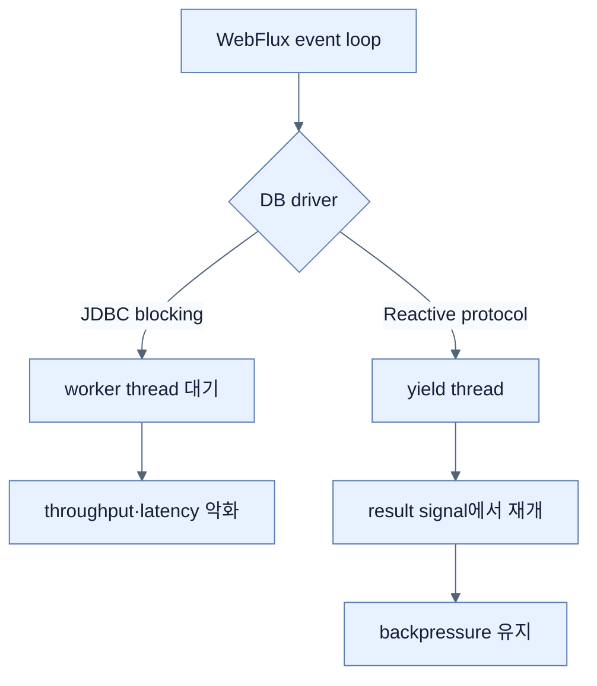

# Reactive Data Access가 요구하는 것

## 한눈에 보기

WebFlux 아래의 database access도 non-blocking이어야 end-to-end reactive가 된다. JDBC는 본질적으로 blocking specification이므로 JPA, jOOQ, MyBatis 등 JDBC 기반 경로를 event-loop에서 직접 호출하면 적은 Reactor worker thread를 멈춘다.

## 1. 왜 이게 필요한가

Reactive runtime은 대략 CPU core 수만큼의 소수 thread로 많은 I/O를 multiplex한다. 4개 worker 중 하나가 DB 결과를 blocking wait하면 처리 capacity의 큰 비율이 즉시 줄고 tail latency가 전체 pipeline으로 번진다.

## 2. 어떻게 동작하는가

Reactive driver는 connection, query send, row receive를 Publisher signal로 노출해 I/O 대기 동안 thread를 반환한다. Reactor scheduler는 ready task를 가져와 work-stealing 형태로 실행한다. JDBC를 별도 bounded thread pool로 감싸면 event-loop 직접 차단은 피할 수 있지만 pool saturation과 context switch를 다른 queue로 옮긴 것일 뿐 native backpressure를 DB driver까지 전달하지 못한다.

“Reactive shell + blocking core”는 고속도로 입구만 넓히고 중간에 한 차선 다리를 두는 것과 같다. 가장 느린 blocking boundary가 concurrency ceiling을 정한다.

## 3. 그림으로 보기

## 4. 이 노트에 나온 용어

- **reactive driver**: database network I/O와 결과를 non-blocking Publisher로 노출하는 driver.
- **work stealing**: idle worker가 queue의 다른 ready task를 가져와 처리하는 scheduling.
- **end-to-end reactive**: request부터 모든 I/O dependency까지 blocking 없이 demand signal을 유지하는 chain.

## 7. 연결

- [[02-choosing-r2dbc-and-a-reactive-data-store]] — JDBC 대신 관계형 reactive specification을 선택한다.
- [[chapter-9-writing-reactive-web-controllers/02-creating-a-webflux-application|WebFlux runtime]] — 적은 event-loop thread가 보호되어야 하는 이유다.
- [[chapter-11-virtual-threads-in-java-and-spring-boot/01-understanding-virtual-threads|Virtual threads]] — blocking driver를 유지하며 concurrency를 높이는 별도 모델이다.

## 8. 스스로 확인

- 전체 1차 정리 후: JDBC를 별도 thread pool로 감싸는 것이 완전한 reactive solution이 아닌 이유를 설명한다.

<!-- ==== 아래는 내 영역 · 스킬 수정 금지 ==== -->

## 내 설명 시도

## 막혔던 지점

## 리뷰 이력

