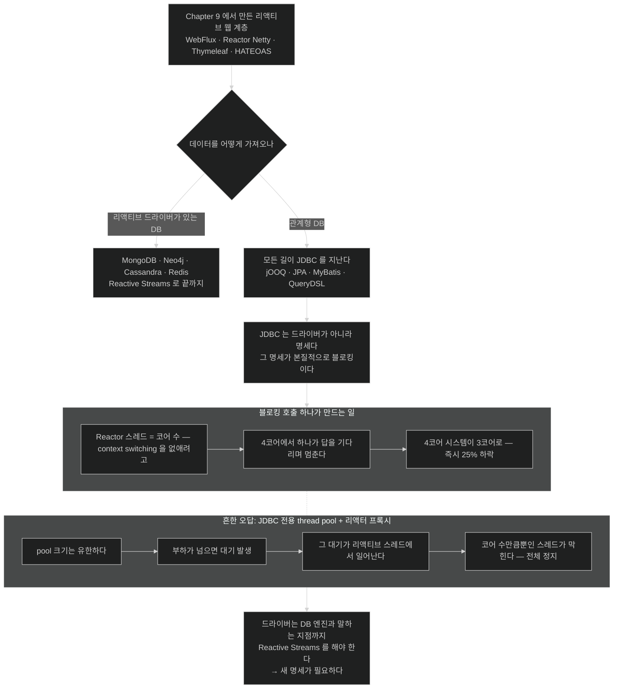

# JDBC라는 벽 — 명세가 블로킹이면 드라이버도 블로킹이다

## 한눈에 보기

| | |
|---|---|
| 문제 | 리액티브 웹을 다 만들어 놓고 **데이터를 블로킹으로 가져오면** 전부 헛수고다 |
| 왜 심각한가 | Reactor 스레드는 **코어 수만큼**뿐이다. 4코어에서 하나가 막히면 25%가 사라진다 |
| 이미 해결한 곳 | MongoDB·Neo4j·Cassandra·Redis가 리액티브 드라이버를 냈다 |
| 막힌 곳 | **JDBC** — jOOQ·JPA·MyBatis·QueryDSL이 전부 그 밑을 지난다 |
| 왜 못 고치나 | JDBC는 드라이버가 아니라 **명세**이고, 그 명세가 본질적으로 블로킹이다 |

## 1. 왜 이게 필요한가

Chapter 9에서 리액티브 웹 페이지를 만드는 기본을 두루 다뤘다. 그런데 **결정적인 재료 하나가 빠져 있었다 — 진짜 데이터.**

진짜 데이터는 데이터베이스에서 온다. 데이터베이스를 쓰지 않는 애플리케이션은 드물다. 그리고 전 세계를 상대하는 전자상거래 시대에 관계형·key-value·document 등 선택지가 어느 때보다 넓어졌다.

그래서 맞는 데이터베이스를 고르기가 까다로운데, **데이터베이스조차 리액티브하게 접근해야 한다**는 점이 그걸 더 어렵게 만든다.

그렇다. 앞 장에서 소개한 것과 **같은 리액티브 전술로** 데이터베이스에 접근하지 않으면, 우리의 모든 노력이 헛수고가 된다. 핵심을 다시 말하면 — **시스템의 모든 부분이 리액티브여야 한다.** 그러지 않으면 **[[블로킹-호출]]**(= 결과가 올 때까지 스레드를 붙드는 호출) 하나가 스레드를 붙들어 처리량을 망가뜨린다.

## 2. 어떻게 동작하는가

### 2.1 리액티브 런타임의 설계를 보면 이유가 분명해진다

Spring WebFlux가 쓰는 리액티브 런타임 Project Reactor는 **기본 thread pool 크기를 머신의 CPU 코어 수와 같게** 잡는다.

왜? **[[컨텍스트-스위칭]]**(= 스레드를 중단·저장·전환·복원하는 비용)이 비싸기 때문이다. 코어보다 스레드가 많지 않으면 **스레드를 중단하고 상태를 저장하고 다른 스레드를 깨워 상태를 복원할 일이 아예 생기지 않는다.**

그 비싼 연산을 선택지에서 지운 덕에, 리액티브 애플리케이션은 더 효과적인 전술에 집중할 수 있다 — **Reactor 런타임으로 돌아가 다음 작업을 집는 것**, 즉 **[[작업-훔치기]]**(= 멈춘 사이 다른 작업을 집어 오는 방식)다.

**다만 이건 Reactor의 [[Mono]]·[[Flux]] 타입과 그 연산자를 쓸 때만 가능하다.**

### 2.2 그래서 25%

원격 데이터베이스에 블로킹 호출을 하면 **스레드 전체가 답을 기다리며 멈춘다.**

4코어 머신에서 코어 하나가 그렇게 막힌 상황을 상상해 보자. 4코어 시스템이 갑자기 3코어만 쓰게 되고, **즉시 25% 처리량 하락**이 나타난다.

이것이 문제의 핵심을 보여 준다 — **블로킹 연산은 리액티브 시스템의 확장성 이득을 직접 무너뜨린다.**

### 2.3 그래서 벤더들이 움직였다

이것이 여러 데이터베이스가 **Reactive Streams 명세를 쓰는 대체 드라이버**를 구현하는 이유다 — MongoDB, Neo4j, Apache Cassandra, Redis 등.

**[[리액티브-드라이버]]**(= 연결·질의·결과 반환을 Reactive Streams 시그널로 수행하는 드라이버)란 무엇인가. 데이터베이스 드라이버가 하는 일은 이렇다.

1. 데이터베이스로의 연결을 연다.
2. 질의를 파싱한다.
3. 명령으로 바꾼다.
4. 결과를 호출자에게 되돌린다.

**[[Reactive-Streams-명세]]**(= 논블로킹 배압을 갖춘 비동기 스트림 처리의 표준) 기반 프로그래밍의 인기가 자라면서 벤더들이 리액티브 드라이버를 만들 동기를 얻었다.

### 2.4 그런데 JDBC는 막혀 있다

Java에서는 **모든 툴킷·드라이버·전략이 [[JDBC]]**(= Java가 관계형 DB와 말하는 방식을 정의하는 명세)**를 지나** 관계형 데이터베이스와 말한다.

| 도구 | 밑에서 쓰는 것 |
|---|---|
| jOOQ | JDBC |
| JPA | JDBC |
| MyBatis | JDBC |
| QueryDSL | JDBC |

**그리고 JDBC가 블로킹이므로, 리액티브 시스템에서 그냥 동작하지 않는다.**

목록의 범위가 이 문제의 무게를 말해 준다. 평범한 Java 애플리케이션이 관계형 DB에 접근하는 **모든 길**이 여기 있다.

### 2.5 thread pool로 가두면 안 되나

가장 흔한 반문이고, 책이 Note로 정면 반박한다.

> 사람들이 여러 방식으로 물어 왔다 — **JDBC 전용 thread pool을 떼어 내고 그 앞에 reactor 친화 프록시를 두면 되지 않나?**
>
> 사실은 이렇다. 들어오는 요청마다 thread pool에 넘길 수는 있지만, **pool의 한계에 부딪힐 위험**을 안게 된다. 그 순간 다음 리액티브 호출이 스레드가 나기를 기다리며 막히고, **결국 시스템 전체를 망가뜨린다.**
>
> 리액티브 시스템의 요점은 막지 않고 **양보해서 다른 일이 되게** 하는 것이다. **thread pool은 불가피한 것을 미룰 뿐이면서 context switching 오버헤드까지 물린다.**
>
> 데이터베이스 드라이버는 **데이터베이스 엔진과 말하는 지점까지** Reactive Streams를 해야 한다. 그러지 않으면 소용없다.

**[[스레드-풀-프록시]]**(= JDBC를 전용 pool에 가두고 앞에 리액터 친화 프록시를 두는 발상)가 왜 실패하는지를 단계로 풀면 이렇다.

1. pool 크기가 유한하다 — 무한이면 그냥 thread-per-request다.
2. 부하가 pool 크기를 넘는 순간 대기가 생긴다.
3. 그 대기는 **리액티브 스레드에서** 일어난다.
4. 리액티브 스레드는 코어 수만큼뿐이다.
5. **전체가 멈춘다.**

즉 이 발상은 문제를 **없애지 않고 옮길 뿐**이며, 옮긴 자리가 더 취약하다.

### 2.6 진짜 이유 — 드라이버가 아니라 명세다

도전 과제의 본질이 여기 있다. **JDBC는 그냥 드라이버가 아니다. 명세다.**

Java가 관계형 데이터베이스와 어떻게 말하는지를 정의하는 명세이고, **그 명세가 본질적으로 블로킹**이다. `ResultSet.next()`가 값을 반환하기로 되어 있는 이상, 그 값이 준비될 때까지 호출은 돌아올 수 없다.

JDBC 위에 세워진 **모든** 드라이버가 이 모델을 따르므로 리액티브 논블로킹 시스템과 호환되지 않는다.

그래서 해법은 "더 좋은 JDBC 드라이버"가 아니라 **다른 명세**여야 한다 — [[02-choosing-r2dbc-and-a-reactive-data-store]].

### 2.7 비유와 그 한계

우편함과 전화에 빗댈 수 있다. JDBC는 **전화**다. 걸면 상대가 받을 때까지 수화기를 들고 있어야 한다. 리액티브는 **우편함**이다. 편지를 넣고 다른 일을 하다가 답장이 오면 처리한다.

thread pool 프록시는 "전화기를 여러 대 두면 되지 않나"라는 발상이다. 전화기가 20대면 21번째 사람은 여전히 기다린다. 그리고 **기다리는 그 사람이 우편함 담당자**라는 것이 문제다.

**깨지는 지점 둘.** 첫째, 전화기는 늘리면 실제로 동시 통화가 늘지만 리액티브 스레드는 **늘리는 것 자체가 손해**다 — context switching 때문이다. 둘째, 전화는 상대가 안 받으면 끊을 수 있지만 블로킹 JDBC 호출은 **타임아웃까지 끊지 못한다.**

## 3. 그림으로 보기

## 4. 이 노트에 나온 용어

- **[[JDBC]]**: Java가 관계형 DB와 말하는 방식을 정의하는 명세. 본질적으로 블로킹이다.
- **[[블로킹-호출]]**: 결과가 올 때까지 스레드를 붙드는 호출.
- **[[스레드-풀-프록시]]**: JDBC를 전용 pool에 가두고 앞에 프록시를 두는 발상. 문제를 옮길 뿐이다.
- **[[작업-훔치기]]**: 한 작업이 멈춰 있을 때 다른 작업을 집어 오는 방식.
- **[[컨텍스트-스위칭]]**: 스레드를 중단·저장·전환·복원하는 비용.
- **[[리액티브-드라이버]]**: 연결·질의·결과 반환을 Reactive Streams 시그널로 수행하는 드라이버.
- **[[Reactive-Streams-명세]]**: 논블로킹 배압을 갖춘 비동기 스트림 처리의 표준.
- **[[Flux]]**: 0개 이상의 값이 시간에 걸쳐 도착하는 Reactor 타입.
- **[[Mono]]**: 0개 또는 1개 값을 다루는 Reactor 타입.

## 5. 자주 헷갈리는 것

**"25%"는 낙관적 하한이다** — Chapter 9와 같은 계산이며 같은 이유로 하한이다. 이벤트 루프에 고정 배정된 연결들이 함께 멈추므로, 실제 영향은 요청 분배에 따라 25%를 넘을 수 있다.

**"JPA를 리액티브로 쓰면 되지 않나"** — JPA는 JDBC 위에 서 있다. JPA를 리액티브로 만드는 것은 **JDBC를 리액티브로 만드는 것**과 같은 일이고, 명세 자체가 막혀 있다.

**"비동기로 감싸면 리액티브"** — `CompletableFuture`나 별도 스레드로 감싸도 **그 스레드는 여전히 막혀 있다.** 자원 관점에서 개선이 없다는 것이 thread pool 반박의 요점과 같다.

**드라이버 지원 여부를 먼저 확인한다** — 리액티브 전환의 실현 가능성은 웹 프레임워크가 아니라 **쓰는 데이터베이스에 리액티브 드라이버가 있느냐**로 결정된다.

## 6. 언제 안 쓰나 / 경계

- **리액티브 드라이버가 없는 DB를 쓴다면** 리액티브 전환 자체를 재검토한다.
- **일부만 리액티브로 만들지 않는다.** 웹만 바꾸면 병목이 아래로 이동할 뿐이다.
- **레거시 JDBC 코드가 많다면** 격리 비용과 이득을 계산한다. `boundedElastic` 격리는 임시방편이다.
- **명령형을 유지하는 다른 길**도 있다. 가상 스레드는 블로킹 코드를 그대로 두고 스레드를 싸게 만든다 — Chapter 11.

## 7. 연결

- [[02-choosing-r2dbc-and-a-reactive-data-store]] — 이 벽을 넘기 위해 만들어진 새 명세.
- [[03-creating-reactive-repositories-and-r2dbc-access]] — JPA repository 대신 쓰는 리액티브 repository.
- [[../chapter-9-writing-reactive-web-controllers/04b-java-concurrency-history]] — 같은 진단을 웹 계층에서 내린 자리.
- [[../chapter-9-writing-reactive-web-controllers/04a-scaling-with-project-reactor]] — work stealing과 코어당 스레드 하나의 구조.

## 8. 스스로 확인

- Reactor가 코어 수만큼만 스레드를 두는 이유와, 그 결정이 블로킹 호출을 왜 치명적으로 만드는지 이어서 설명해 보라.
- JDBC를 thread pool에 가두는 발상이 실패하는 과정을 다섯 단계로 말해 보라.
- "JDBC는 드라이버가 아니라 명세다"라는 문장이 왜 해법의 방향을 바꾸는가?
- 리액티브 전환 가능성을 판단할 때 가장 먼저 확인할 것은?

> 네 문항을 스스로 답한 **뒤에** [[_01-what-reactive-data-access-requires]]에서 모범답안과 대조한다. 먼저 열면 이 문항들은 다시 인출 문제로 쓸 수 없다.

<!-- ==== 아래는 내 영역 · 스킬 수정 금지 ==== -->

## 내 설명 시도

## 막혔던 지점

## 리뷰 이력
