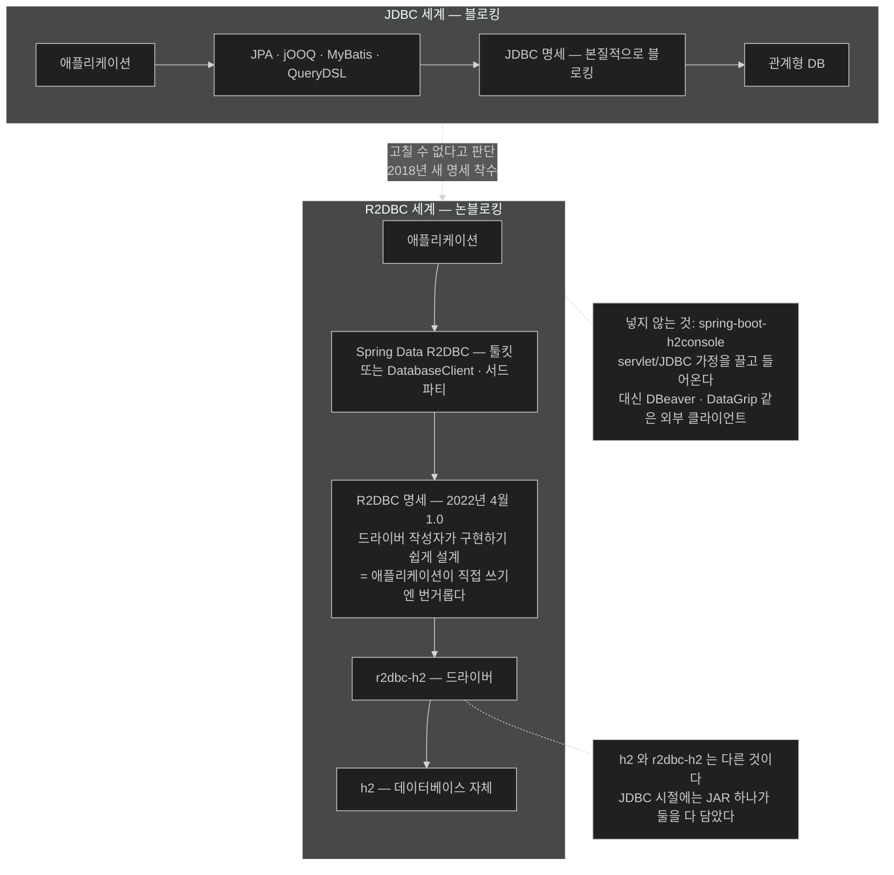

# R2DBC — JDBC를 고치는 대신 새로 쓴 명세

## 한눈에 보기

| 좌표 | 무엇 |
|---|---|
| `spring-boot-starter-data-r2dbc` | 리액티브 repository·연결·WebFlux 통합 |
| `h2` | **데이터베이스 자체** |
| `r2dbc-h2` | 그 DB와 **리액티브로 말하는 드라이버** |
| `spring-boot-starter-data-r2dbc-test` | 리액티브 repository 테스트 지원 |

`h2`와 `r2dbc-h2`가 **둘 다** 필요한 것이 이 조합의 핵심이다.

## 1. 왜 이게 필요한가

[[01-what-reactive-data-access-requires]]의 결론은 막다른 길처럼 보였다. **[[JDBC]]**(= Java가 관계형 DB와 말하는 방식을 정의하는 명세)가 블로킹이고, 관계형 DB로 가는 모든 길이 거기를 지난다.

그런데 희망이 있다. **JDBC를 고치는 대신 새 명세를 쓰는 것**이다.

## 2. 어떻게 동작하는가

### 2.1 R2DBC의 출발

JDBC가 Reactive Streams를 지원할 만큼 충분히 바뀔 수 없다는 것을 인식하고, 리액티브로 가고 싶어 하는 Spring 사용자 커뮤니티가 커지는 것을 보면서, Spring 팀이 **2018년** 새 해법에 착수했다. 그렇게 초안한 것이 **[[R2DBC]]**(= Reactive Relational Database Connectivity 명세)다.

명세로서 **2022년 4월에 1.0**에 도달했다.

이 연혁이 알려 주는 것 하나 — R2DBC는 라이브러리가 아니라 **명세**다. JDBC와 같은 층에 있는 대안이지 그 위에 얹은 래퍼가 아니다. 그래서 각 DB 벤더가 자기 **[[리액티브-드라이버]]**(= Reactive Streams 시그널로 동작하는 드라이버)를 구현한다.

### 2.2 무엇을 고를까

아주 단순한 것을 원하므로 관계형 DB로는 **[[H2]]**(= 인메모리이자 임베더블한 관계형 DB)를 고른다. 흔히 테스트용으로 쓰이지만, 이 장에서는 **production DB의 대역**으로 쓴다.

H2와 함께 **[[Spring-Data-R2DBC]]**(= R2DBC 위에 올리는 Spring Data 툴킷)를 쓴다.

start.spring.io에서 앞 장과 **같은 Boot 버전, 같은 메타데이터**를 넣고 의존성 둘을 고른다.

- H2 Database
- Spring Data R2DBC

EXPLORE를 눌러 `pom.xml`을 절반쯤 내려가면 네 항목이 보인다.

### 2.3 네 좌표

```xml
<dependency>
    <groupId>org.springframework.boot</groupId>
    <artifactId>spring-boot-starter-data-r2dbc</artifactId>
</dependency>
<dependency>
    <groupId>com.h2database</groupId>
    <artifactId>h2</artifactId>
    <scope>runtime</scope>
</dependency>
<dependency>
    <groupId>io.r2dbc</groupId>
    <artifactId>r2dbc-h2</artifactId>
    <scope>runtime</scope>
</dependency>
<dependency>
    <groupId>org.springframework.boot</groupId>
    <artifactId>spring-boot-starter-data-r2dbc-test</artifactId>
    <scope>test</scope>
</dependency>
```

| 좌표 | 하는 일 |
|---|---|
| `spring-boot-starter-data-r2dbc` | Spring Data R2DBC로 리액티브 관계형 DB 접근. **논블로킹 DB 연산의 핵심 인프라** — 리액티브 repository, DB 연결, WebFlux 리액티브 모델과의 통합 |
| `h2` | 개발·테스트에 흔한 경량 임베더블 관계형 DB. 인메모리나 단순 파일 기반으로 돌아 **외부 DB 서버 없이 빠르게 기동**한다 |
| **[[r2dbc-h2]]**(= H2용 R2DBC 드라이버) | `h2` 의존성이 **데이터베이스 자체**를 준다면, 이쪽은 애플리케이션과 H2 사이의 **리액티브 논블로킹 통신**을 가능하게 한다 |
| `spring-boot-starter-data-r2dbc-test` | Spring Data R2DBC 애플리케이션의 테스트 지원. 리액티브 repository와 DB 상호작용 테스트를 쉽게 하는 유틸과 auto-configuration |

두 번째와 세 번째의 구분이 이 절에서 가장 자주 놓치는 지점이다. **DB와 드라이버는 다른 것**이고, JDBC 시절에는 H2 JAR 하나가 둘을 다 담고 있었기 때문에 더 헷갈린다.

### 2.4 넣지 말아야 할 것

> **`spring-boot-h2console`(H2 Console)은 포함하지 않는다.** 이 애플리케이션이 Spring WebFlux와 Spring Data R2DBC를 쓰기 때문이다.
>
> 추가하면 **servlet/JDBC 가정이 예제에 들어온다.** 이 예제는 순수하게 리액티브로 남기려는 것이다.
>
> 데이터베이스를 들여다보려면 **DBeaver나 DataGrip 같은 외부 DB 클라이언트**를 쓴다.

**[[H2-Console]]**(= H2를 브라우저에서 들여다보는 도구)이 편리한데도 배제되는 이유가 명확하다 — 그것이 **servlet 기반**이고 **JDBC로 접속**하기 때문이다. Chapter 9에서 `spring-boot-starter-hateoas`를 배제한 것과 정확히 같은 종류의 판단이다.

이 패턴을 일반화하면 이렇게 된다 — **리액티브 프로젝트에서는 "편의 도구"가 웹 스택이나 데이터 스택을 함께 결정하지 않는지 매번 확인해야 한다.**

### 2.5 R2DBC를 직접 쓰지 않는 이유

책이 중요한 단서를 붙인다. **R2DBC는 매우 저수준이다.**

근본적으로 **드라이버 작성자가 구현하기 쉽게** 만드는 것을 겨냥한다. JDBC의 드라이버 인터페이스 측면 일부가 **애플리케이션이 소비하기 쉽도록** 타협돼 있었는데, R2DBC는 그것을 바로잡으려 했다.

**그 결과 애플리케이션이 R2DBC로 직접 말하는 것은 상당히 번거롭다.**

이건 결함이 아니라 **설계 선택의 결과**다. 드라이버 구현자와 애플리케이션 개발자 중 누구를 편하게 할지에서 R2DBC는 전자를 골랐고, 그래서 벤더들이 드라이버를 내놓기 쉬워졌다.

그래서 **툴킷을 쓰는 것이 권장된다.** 이 책은 Spring Data R2DBC를 쓰지만, Spring Framework의 **[[DatabaseClient]]**(= 원시 SQL을 리액티브하게 실행하는 저수준 client)나 서드파티를 써도 된다.

### 2.6 비유와 그 한계

전기 규격에 빗댈 수 있다. JDBC는 오래된 콘센트 규격이라 새 기능(리액티브)을 넣을 수 없었다. R2DBC는 **새 규격**이고, `r2dbc-h2` 같은 드라이버는 그 규격에 맞는 **어댑터**다. Spring Data R2DBC는 그 위에 얹는 **멀티탭** — 직접 규격을 다루지 않고 편하게 쓰게 해 준다.

**깨지는 지점 둘.** 첫째, 콘센트는 어댑터만 있으면 어느 기기든 꽂히지만 **R2DBC 드라이버는 DB마다 따로 있어야 하고, 없는 DB도 있다** — 그래서 [[01-what-reactive-data-access-requires]]의 "드라이버 지원을 먼저 확인하라"가 나온다. 둘째, 멀티탭은 규격을 완전히 감추지만 Spring Data R2DBC는 **스키마 정의만은 감춰 주지 않는다** — [[04-loading-data-with-r2dbcentitytemplate]]에서 저수준 `DatabaseClient`로 다시 내려간다.

## 3. 그림으로 보기



## 4. 이 노트에 나온 용어

- **[[R2DBC]]**: Spring 팀이 2018년 착수해 2022년 4월 1.0에 도달한 리액티브 관계형 연결 명세.
- **[[JDBC]]**: Java가 관계형 DB와 말하는 방식을 정의하는 명세. 본질적으로 블로킹이다.
- **[[H2]]**: 인메모리이자 임베더블한 관계형 DB.
- **[[r2dbc-h2]]**: H2용 R2DBC 드라이버.
- **[[H2-Console]]**: H2를 브라우저에서 보는 도구. servlet/JDBC 가정을 끌고 온다.
- **[[Spring-Data-R2DBC]]**: R2DBC 위에 올리는 Spring Data 툴킷.
- **[[DatabaseClient]]**: 원시 SQL을 리액티브하게 실행하는 저수준 client.
- **[[리액티브-드라이버]]**: Reactive Streams 시그널로 동작하는 DB 드라이버.

## 5. 자주 헷갈리는 것

**`h2` 하나로는 안 된다** — JDBC 프로젝트에서는 `h2` 의존성 하나로 DB와 드라이버가 다 해결됐다. R2DBC에서는 **`r2dbc-h2`가 따로 있어야** 한다. 이걸 빼먹으면 "연결 팩토리를 찾을 수 없다"는 기동 실패가 난다.

**R2DBC ≠ Spring Data R2DBC** — 앞의 것은 명세, 뒤의 것은 그 위의 툴킷이다. 명세가 저수준이라 툴킷 없이 쓰면 코드가 장황해진다.

**"저수준이다"가 "나쁘다"는 뜻이 아니다** — 드라이버 작성자를 편하게 한 덕에 벤더들이 드라이버를 내놓기 쉬워졌다. 사용자 편의는 툴킷 층이 맡는 분업이다.

**편의 도구가 스택을 결정한다** — H2 Console도, Chapter 9의 HATEOAS starter도 같은 함정이다. 리액티브 프로젝트에서는 의존성 하나가 servlet 스택을 통째로 끌고 올 수 있다.

## 6. 언제 안 쓰나 / 경계

- **쓰는 DB에 R2DBC 드라이버가 없으면** 이 길은 막힌다. 드라이버 목록을 먼저 확인한다.
- **H2를 production DB로 쓰지 않는다.** 이 장의 편의를 위한 대역이다.
- **R2DBC를 툴킷 없이 직접 쓰지 않는다.** 책 자신이 번거롭다고 말한다.
- **JPA의 기능을 그대로 기대하지 않는다.** 지연 로딩·연관관계 매핑·영속성 컨텍스트가 없다 — [[03-creating-reactive-repositories-and-r2dbc-access]].

## 7. 연결

- [[01-what-reactive-data-access-requires]] — R2DBC가 필요해진 진단.
- [[03-creating-reactive-repositories-and-r2dbc-access]] — 이 의존성 위에 올리는 repository.
- [[04-loading-data-with-r2dbcentitytemplate]] — 툴킷이 감춰 주지 않는 스키마 영역.
- [[../chapter-9-writing-reactive-web-controllers/02-creating-a-webflux-application]] — 같은 "스택을 섞지 않는다" 원칙이 웹 계층에서 나온 자리.

## 8. 스스로 확인

- `h2`와 `r2dbc-h2`가 각각 무엇을 제공하는지, 왜 둘 다 필요한지 설명해 보라.
- R2DBC가 "드라이버 작성자를 편하게" 설계된 결과가 애플리케이션 개발자에게 어떻게 나타나는가?
- H2 Console을 넣으면 안 되는 이유와, 같은 이유로 배제되는 다른 의존성의 예를 들어 보라.
- R2DBC와 Spring Data R2DBC의 층 차이를 한 문장으로 말해 보라.


> 네 문항을 스스로 답한 **뒤에** [[_02-choosing-r2dbc-and-a-reactive-data-store]]에서 모범답안과 대조한다. 먼저 열면 이 문항들은 다시 인출 문제로 쓸 수 없다.

<!-- ==== 아래는 내 영역 · 스킬 수정 금지 ==== -->

## 내 설명 시도


## 막혔던 지점


## 리뷰 이력
