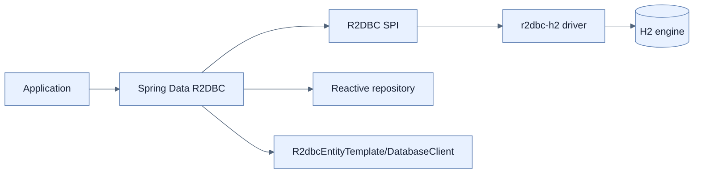

# Reactive Data Store와 R2DBC 선택

## 한눈에 보기

R2DBC는 관계형 database를 Reactive Streams 방식으로 접근하는 specification이다. 책은 Spring Data R2DBC starter, H2 engine, `r2dbc-h2` driver, focused test starter를 사용한다. Low-level R2DBC를 직접 다루기보다 Spring Data 또는 `DatabaseClient`를 권한다.

## 1. 왜 이게 필요한가

MongoDB·Cassandra·Redis 등에는 reactive driver가 있지만 관계형 schema와 SQL을 유지하고 싶은 application도 많다. Blocking JDBC를 바꿀 수 없어 별도의 connection/query/result protocol인 R2DBC가 필요해졌다.

## 2. 어떻게 동작하는가

H2 dependency는 database process/engine, `r2dbc-h2`는 non-blocking application protocol driver, Spring Data starter는 connection factory, mapping, template, repository abstraction을 제공한다. WebFlux/Jackson과 같은 Publisher type을 사용해 database signal이 HTTP까지 이어진다.

책은 servlet/JDBC assumption을 넣는 H2 Console starter를 reactive application에 추가하지 않고 DBeaver/DataGrip 같은 외부 client를 쓴다. R2DBC는 JPA의 reactive 버전이 아니므로 persistence context, lazy loading, dirty checking을 기대하면 안 된다.

## 3. 그림으로 보기

## 4. 이 노트에 나온 용어

- **R2DBC**: relational database access를 reactive/non-blocking으로 표준화한 SPI.
- **Spring Data R2DBC**: mapping, repository, template로 R2DBC 사용을 높이는 module.
- **DatabaseClient**: SQL 실행과 row result를 reactive하게 다루는 Spring Framework client.

## 7. 연결

- [[01-what-reactive-data-access-requires]] — R2DBC를 선택하게 만든 blocking 문제다.
- [[03-creating-reactive-repositories-and-r2dbc-access]] — abstraction을 실제 domain에 적용한다.
- [[chapter-3-querying-for-data-with-spring-boot/01-adding-spring-data-to-an-existing-application|Spring Data JPA]] — persistence model 차이를 비교한다.

## 8. 스스로 확인

- 전체 1차 정리 후: H2와 r2dbc-h2가 각각 제공하는 역할과 R2DBC가 JPA가 아닌 이유를 설명한다.

<!-- ==== 아래는 내 영역 · 스킬 수정 금지 ==== -->

## 내 설명 시도

## 막혔던 지점

## 리뷰 이력

