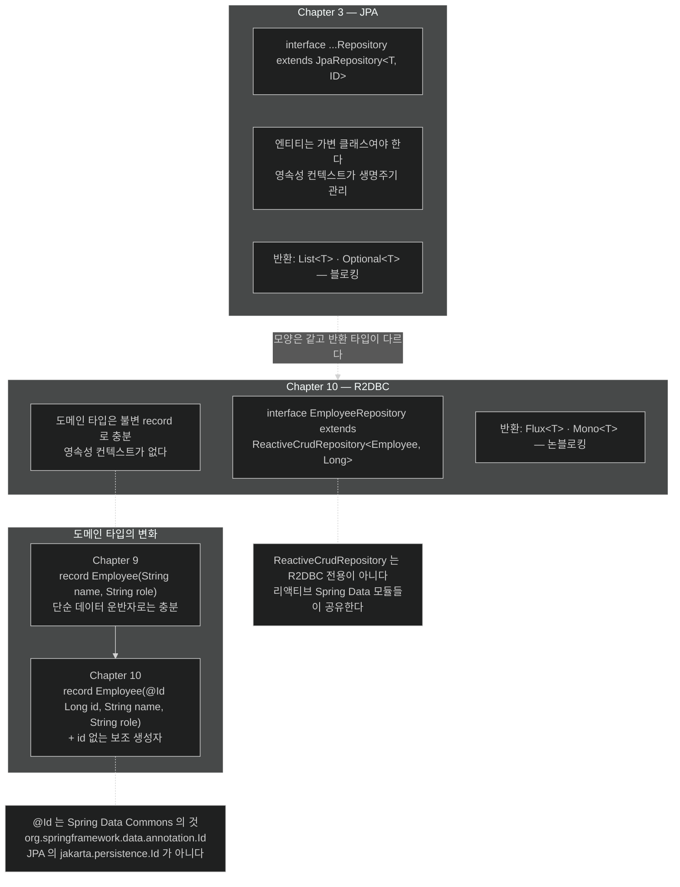

# `ReactiveCrudRepository`와 `@Id` — record에 식별자를 더하는 이유

## 한눈에 보기

```java
public interface EmployeeRepository extends ReactiveCrudRepository<Employee, Long> {}
```

인터페이스 한 줄. Chapter 3의 `JpaRepository`와 **모양이 같고, 반환 타입만 리액티브**다.

```java
public record Employee(@Id Long id, String name, String role) {
    public Employee(String name, String role) { this(null, name, role); }
}
```

Chapter 9의 record에 **`@Id Long id`와 보조 생성자**가 더해졌다.

## 1. 왜 이게 필요한가

Chapter 3에서 Spring Data JPA의 `JpaRepository`를 확장해 읽기 쉬운 데이터 repository를 만들었다. 그 경험이 여기서 거의 그대로 옮겨진다.

다만 두 가지가 달라져야 한다. 하나는 **repository 인터페이스**, 다른 하나는 **도메인 타입**이다.

## 2. 어떻게 동작하는가

### 2.1 repository 인터페이스

```java
public interface EmployeeRepository extends ReactiveCrudRepository<Employee, Long> {}
```

| 요소 | 하는 일 |
|---|---|
| `EmployeeRepository` | Spring Data repository 인터페이스의 이름. **Spring Data가 런타임에 구현을 자동 생성**한다 |
| **[[ReactiveCrudRepository]]**(= CRUD를 리액티브 타입으로 반환하는 Spring Data Commons 인터페이스) | `save`·`findById`·`findAll`·`delete` 같은 리액티브 CRUD 제공 |
| `Employee` | 이 repository가 관리하는 **[[도메인-타입]]**(= repository가 관리하는 대상 타입). Spring Data가 무엇을 저장·조회할지 이 타입으로 판단한다 |
| `Long` | 엔티티 **[[기본-키]]**(= 행을 유일하게 식별하는 값)의 타입. `Employee`의 `id` 필드에 대응한다 |

`ReactiveCrudRepository`의 두 가지 성질이 중요하다.

**첫째, 블로킹 값이 아니라 리액티브 타입을 반환한다.** `findAll()`이 `List<Employee>`가 아니라 **[[Flux]]**`<Employee>`를, `save()`가 `Employee`가 아니라 **[[Mono]]**`<Employee>`를 준다. 이것이 데이터 스토어와의 논블로킹 상호작용을 가능하게 한다.

**둘째, R2DBC 전용이 아니다.** 이 인터페이스는 Spring Data Commons에 있고 **여러 리액티브 Spring Data 모듈이 공유**한다. 그래서 MongoDB 리액티브 repository도 같은 인터페이스를 쓴다. 데이터 스토어를 바꿔도 이 선언은 그대로다.

### 2.2 도메인 타입은 왜 바꿔야 하나

Chapter 9에서 만든 `Employee`는 이랬다.

```java
public record Employee(String name, String role) {
}
```

**단순한 데이터 운반자로만 쓰일 때는 충분했다.** [[../chapter-9-writing-reactive-web-controllers/03-serving-data-with-reactive-get]]의 `Flux.just(...)`나 `Map`에 넣는 용도라면 식별자가 필요 없다.

그런데 **[[Spring-Data-R2DBC]]**(= R2DBC 위에 올리는 Spring Data 툴킷)로 데이터베이스와 상호작용하려면 **조금 더 풍부한 표현**이 필요하다. 특히 **DB의 기본 키에 대응하는 식별자 필드**가 있어야 한다.

이유는 repository가 하는 일을 보면 명확하다. `findById(id)`는 무엇으로 찾을지 알아야 하고, `save()`는 이것이 **새 행인지 기존 행의 갱신인지** 판단해야 한다. 그 판단의 근거가 식별자다.

### 2.3 확장된 record

```java
import org.springframework.data.annotation.Id;

public record Employee(
        @Id Long id,
        String name,
        String role
) {
    public Employee(String name, String role) {
        this(null, name, role);
    }
}
```

바뀐 것 셋이다.

| 요소 | 하는 일 | 왜 |
|---|---|---|
| `id` | DB 기본 키를 나타내는 새 필드 | repository가 행을 식별하려면 필요하다 |
| **[[Id-애노테이션]]**(= 식별자 필드를 표시하는 Spring Data Commons 애노테이션) | Spring Data가 이것을 식별자로 인식하게 한다 | 어느 필드가 키인지 알려 줘야 한다 |
| `public Employee(String, String)` | `id` 없이 인스턴스를 만드는 보조 생성자 | 새 레코드를 넣을 때는 **DB가 식별자를 생성**하므로 `null`로 초기화한다 |

**`@Id`가 JPA의 것이 아니라는 점이 중요하다.** `jakarta.persistence.Id`가 아니라 **Spring Data Commons의 `org.springframework.data.annotation.Id`**이며, R2DBC를 포함한 여러 Spring Data 모듈에서 함께 쓴다.

이 구분이 실무에서 물리는 이유는 **IDE 자동 완성이 JPA 쪽을 먼저 제안하기 때문**이다. 프로젝트에 JPA와 R2DBC가 함께 있으면 잘못된 `@Id`를 import하고도 컴파일은 통과한다.

### 2.4 record가 나머지를 준다

`equals`·`hashCode`·`toString`과 접근자는 **Java record가 자동 생성**한다. 그래서 도메인 타입이 간결하게 유지되면서도 **Spring Data의 매핑 인프라와 완전히 호환**된다.

Chapter 3의 JPA 엔티티와 대비되는 지점이다. JPA 엔티티는 영속성 컨텍스트가 생명주기를 관리하는 **가변 객체**여야 해서 record를 쓸 수 없었다. R2DBC는 영속성 컨텍스트가 없으므로 **불변 record가 그대로 통한다.**

### 2.5 비유와 그 한계

도서관 장서 등록에 빗댈 수 있다. Chapter 9의 `Employee`는 **메모지에 적은 책 제목**이다 — 손에 들고 다니기엔 충분하다. DB에 넣으려면 **청구기호**가 있어야 한다. 그게 `@Id`다. 새 책을 등록할 때는 청구기호를 사서(DB)가 붙여 주므로 우리는 비워 둔다.

**깨지는 지점 둘.** 첫째, 도서관 사서는 같은 책이 이미 있는지 제목으로 확인하지만 **repository는 오직 `id`로만 판단한다** — `id`가 `null`이면 무조건 새 행이다. 그래서 [[04a-returning-data-reactively-to-an-api-controller]]에서 들어온 `id`를 의도적으로 버린다. 둘째, 청구기호는 붙이고 나서도 고칠 수 있지만 record의 `id`는 **불변**이라, 저장 후에는 **새 인스턴스**를 받아야 한다 — `save()`가 `Mono<Employee>`를 돌려주는 이유다.

## 3. 그림으로 보기



## 4. 이 노트에 나온 용어

- **[[ReactiveCrudRepository]]**: CRUD를 리액티브 타입으로 반환하는 Spring Data Commons 인터페이스.
- **[[Id-애노테이션]]**: 식별자 필드를 표시하는 Spring Data Commons 애노테이션.
- **[[도메인-타입]]**: repository가 관리하는 대상 타입.
- **[[기본-키]]**: 행을 유일하게 식별하는 값.
- **[[Spring-Data-R2DBC]]**: R2DBC 위에 올리는 Spring Data 툴킷.
- **[[Flux]]**: 0개 이상의 값이 시간에 걸쳐 도착하는 Reactor 타입.
- **[[Mono]]**: 0개 또는 1개 값을 다루는 Reactor 타입.

## 5. 자주 헷갈리는 것

**`@Id`의 출처** — `jakarta.persistence.Id`(JPA)와 `org.springframework.data.annotation.Id`(Spring Data Commons)는 다른 애노테이션이다. R2DBC에서는 **후자**를 쓴다. IDE가 전자를 먼저 제안하는 경우가 많다.

**`ReactiveCrudRepository`는 R2DBC 전용이 아니다** — MongoDB·Cassandra 리액티브 모듈도 같은 인터페이스를 쓴다. 그래서 데이터 스토어를 바꿔도 repository 선언은 그대로다.

**JPA의 편의가 없다** — 지연 로딩, 연관관계 매핑, 영속성 컨텍스트, dirty checking이 R2DBC에는 **없다.** 그래서 record가 가능해진 것이기도 하고, 동시에 JPA 습관대로 쓰면 기대가 어긋난다.

**보조 생성자는 문법 편의가 아니다** — `id`를 `null`로 두는 것이 "이건 새 행"이라는 신호다. `save()`의 insert/update 판단이 여기 달려 있다.

## 6. 언제 안 쓰나 / 경계

- **JPA의 연관관계가 필요하면** R2DBC로 그대로 옮길 수 없다. 조인과 매핑을 직접 다뤄야 한다.
- **`@Id`를 두 종류 섞어 쓰지 않는다.** 한 프로젝트에 JPA와 R2DBC가 함께 있으면 import를 매번 확인한다.
- **`id`를 클라이언트 입력으로 받지 않는다.** 새 행이어야 할 것이 갱신이 될 수 있다 — [[04a-returning-data-reactively-to-an-api-controller]].
- **스키마는 여전히 우리 몫이다.** repository가 있다고 테이블이 생기지 않는다 — [[04-loading-data-with-r2dbcentitytemplate]].

## 7. 연결

- [[02-choosing-r2dbc-and-a-reactive-data-store]] — 이 repository가 서 있는 의존성 기반.
- [[04-loading-data-with-r2dbcentitytemplate]] — repository가 쓸 테이블을 직접 만드는 단계.
- [[04a-returning-data-reactively-to-an-api-controller]] — `findAll()`·`save()`를 실제로 부르는 곳.
- [[../chapter-9-writing-reactive-web-controllers/03-serving-data-with-reactive-get]] — 식별자 없는 record로 충분했던 앞 장의 상태.

## 8. 스스로 확인

- `JpaRepository`와 `ReactiveCrudRepository`의 선언이 거의 같은데 무엇이 근본적으로 다른가?
- Chapter 9의 record로는 왜 부족한가? 무엇이 판단되지 않는가?
- R2DBC에서 record를 엔티티로 쓸 수 있는데 JPA에서는 안 되는 이유는?
- `id` 없는 보조 생성자가 문법 편의 이상인 이유는?


> 네 문항을 스스로 답한 **뒤에** [[_03-creating-reactive-repositories-and-r2dbc-access]]에서 모범답안과 대조한다. 먼저 열면 이 문항들은 다시 인출 문제로 쓸 수 없다.

<!-- ==== 아래는 내 영역 · 스킬 수정 금지 ==== -->

## 내 설명 시도


## 막혔던 지점


## 리뷰 이력
