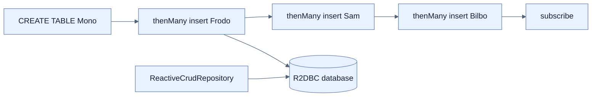

# Reactive Repository와 R2dbcEntityTemplate

## 한눈에 보기

`ReactiveCrudRepository<Employee, Long>`는 `save/findById/findAll/delete`를 Mono·Flux로 제공한다. R2DBC Entity는 JPA 애노테이션 대신 Spring Data `@Id`를 쓰며, `R2dbcEntityTemplate`/DatabaseClient로 schema와 초기 data pipeline을 만들 수 있다.

## 1. 왜 이게 필요한가

Raw R2DBC connection과 row mapping은 application code에 저수준 ceremony를 늘린다. Repository는 반복 CRUD를 domain contract로 줄이고 template은 raw SQL과 type-safe insert 같은 세밀한 작업을 보완한다.

## 2. 어떻게 동작하는가

Employee record에 nullable ID와 편의 constructor를 둬 새 row의 generated ID를 표현한다. Startup runner는 DatabaseClient로 `CREATE TABLE`을 실행하고 `rowsUpdated().thenMany(insert...).thenMany(...)`로 순서를 연결한다. Reactive stream은 lazy하므로 runner의 최종 `subscribe()`가 실행을 시작한다.

Application startup에서 수동 subscribe하는 예제는 초기화 설명용이다. Production schema는 Flyway 같은 migration tool로 관리하고 application readiness 전에 initialization 완료/error를 확실히 다뤄야 한다. Chain 밖에서 여러 subscribe를 하면 순서와 transaction boundary를 잃는다.

## 3. 그림으로 보기

## 4. 이 노트에 나온 용어

- **ReactiveCrudRepository**: CRUD를 Mono/Flux로 노출하는 Spring Data common repository.
- **R2dbcEntityTemplate**: mapped entity 중심의 reactive SQL operation abstraction.
- **thenMany**: 앞 Publisher completion 뒤 다음 multi-value Publisher를 실행하는 Reactor operator.

## 7. 연결

- [[02-choosing-r2dbc-and-a-reactive-data-store]] — repository 아래의 driver/module 구성이다.
- [[04-connecting-reactive-data-to-api-and-templates]] — repository Flux/Mono를 web boundary에 직접 반환한다.
- [[chapter-7-releasing-an-application-with-spring-boot/04-tuning-and-scaling-in-production|DB migration]] — startup seed code의 production 대안이다.

## 8. 스스로 확인

- 전체 1차 정리 후: initialization chain에 `thenMany`와 하나의 subscription을 쓰는 이유를 설명한다.

<!-- ==== 아래는 내 영역 · 스킬 수정 금지 ==== -->

## 내 설명 시도

## 막혔던 지점

## 리뷰 이력

