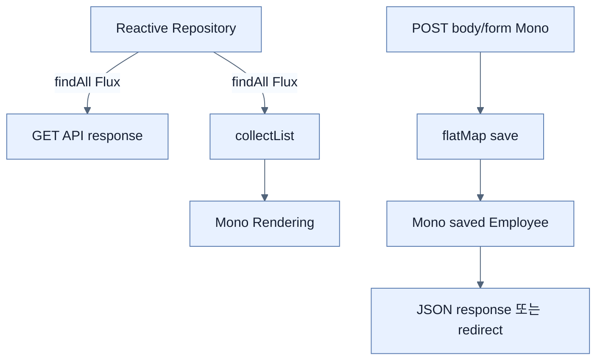

# Reactive Data를 API와 Template에 연결

## 한눈에 보기

GET API는 `repository.findAll()`의 `Flux<Employee>`를 그대로 반환한다. POST는 incoming `Mono<Employee>`를 `flatMap`해 client가 보낸 ID를 버린 새 Entity를 저장한다. Template GET은 Flux를 `collectList`하여 `Mono<Rendering>`을 만들고 form POST는 save 뒤 redirect로 map한다.

## 1. 왜 이게 필요한가

Web layer가 reactive여도 repository 결과를 `.block()`하거나 임시 collection으로 imperative하게 꺼내면 chain이 끊긴다. Publisher를 controller return까지 유지하면 WebFlux가 subscription, error, cancellation과 demand를 통제한다.

## 2. 어떻게 동작하는가

`save`가 `Mono<Employee>`를 반환하므로 incoming Employee에서 `map(repository::save)`을 쓰면 `Mono<Mono<Employee>>`가 된다. `flatMap`이 nested Publisher를 한 단계로 편다. 새 row 생성에서는 request ID를 신뢰하지 않고 name/role만 복사해 DB generated ID를 받는다. Template는 whole table HTML이 필요해 `collectList`로 finite Flux를 모은 후 view와 form-backing object를 Rendering에 넣는다.

API streaming과 template aggregation의 resource profile은 다르다. `collectList`는 결과 전체를 memory에 모으므로 대량 data는 pagination이나 streaming representation을 선택한다.

## 3. 그림으로 보기

## 4. 이 노트에 나온 용어

- **collectList**: finite Flux element를 하나의 `Mono<List<T>>`로 모으는 operator.
- **Rendering**: WebFlux functional view name과 model을 담는 immutable result builder.
- **generated identifier**: insert 시 database가 새 row에 할당한 primary key.

## 7. 연결

- [[03-creating-reactive-repositories-and-r2dbc-access]] — web에 공급할 repository contract다.
- [[chapter-9-writing-reactive-web-controllers/04-consuming-data-with-reactive-post|Reactive POST]] — in-memory 예제를 실제 DB save로 교체한다.
- [[chapter-9-writing-reactive-web-controllers/05-rendering-reactive-templates|Reactive template]] — template rendering flow를 persistence와 연결한다.

## 8. 스스로 확인

- 전체 1차 정리 후: `flatMap(repository::save)`이 필요한 타입 이유와 `collectList`의 memory trade-off를 설명한다.

<!-- ==== 아래는 내 영역 · 스킬 수정 금지 ==== -->

## 내 설명 시도

## 막혔던 지점

## 리뷰 이력

