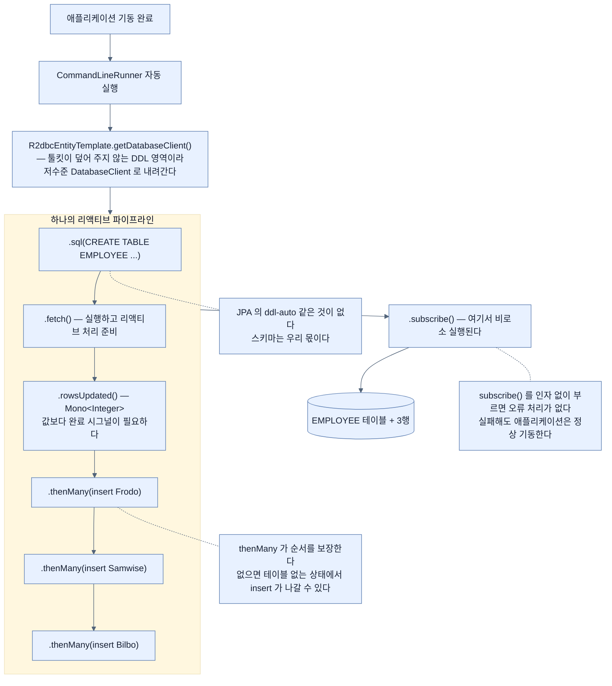

# 스키마 초기화 — 툴킷이 감춰 주지 않는 저수준으로 내려가기

## 한눈에 보기

```java
template.getDatabaseClient()
        .sql("CREATE TABLE EMPLOYEE (...)")
        .fetch()
        .rowsUpdated()
        .thenMany(template.insert(Employee.class).using(new Employee("Frodo Baggins", "ring bearer")))
        .thenMany(...)
        .subscribe();
```

**스키마 생성과 데이터 적재가 하나의 리액티브 파이프라인**으로 조합된다. 마지막 `subscribe()`가 없으면 아무 일도 일어나지 않는다.

## 1. 왜 이게 필요한가

[[03-creating-reactive-repositories-and-r2dbc-access]]에서 repository와 도메인 타입을 갖췄다. 이제 `findAll()`을 부를 수 있다.

**그런데 테이블이 없다.**

데이터를 가져오려면 먼저 데이터베이스를 채워야 한다. 실제 애플리케이션에서는 이 일을 DBA나 데이터베이스 마이그레이션 도구가 맡는다. 하지만 여기서는 **애플리케이션이 시작될 때 자동으로 실행되는 Spring 컴포넌트**를 통해 직접 초기화한다.

그리고 이 지점에서 [[02-choosing-r2dbc-and-a-reactive-data-store]]가 남긴 긴장이 드러난다. **"R2DBC는 저수준이라 툴킷을 쓰라"고 했는데, 스키마만은 툴킷이 덮어 주지 않는다.**

## 2. 어떻게 동작하는가

### 2.1 실행 지점

```java
@Configuration
public class Startup {

    @Bean
    CommandLineRunner initDatabase(R2dbcEntityTemplate template) {
        return args -> {
            // Coming soon!
        };
    }
}
```

| 요소 | 하는 일 |
|---|---|
| `@Configuration` | 이 클래스가 bean 정의의 원천임을 표시 |
| `@Bean` | 이 메서드가 Spring 컨테이너가 관리하는 bean을 반환한다고 선언 |
| **[[CommandLineRunner]]**(= 기동 완료 후 자동 실행되는 Spring Boot 함수형 인터페이스) | 애플리케이션이 시작된 뒤 한 번 자동 실행 |
| **[[R2dbcEntityTemplate]]**(= 도메인 타입을 아는 편의 연산과 저수준 통로를 함께 주는 template) | Spring Data R2DBC의 template 주입 |
| `args -> {}` | 함수형 인터페이스를 구현하는 람다 |

`CommandLineRunner`를 고른 이유는 **기동이 끝난 뒤**여야 하기 때문이다. bean 생성 도중에 DB에 쓰면 연결 팩토리가 아직 준비되지 않았을 수 있다.

### 2.2 스키마는 우리 몫이다

람다 안에 무엇을 넣나. **[[Spring-Data-R2DBC]]**(= R2DBC 위의 Spring Data 툴킷)를 쓰므로 **스키마를 우리가 직접 정의해야 한다.**

이 문장이 JPA에서 온 사람에게 가장 큰 차이다. JPA에는 `ddl-auto`가 있어 엔티티에서 테이블을 만들어 줬다. **R2DBC에는 그런 것이 없다.**

스키마가 외부에 정의돼 있지 않다면(이 장이 그렇다) 프로그래밍 방식으로 만들고 샘플 데이터를 리액티브 파이프라인으로 싣는다.

### 2.3 파이프라인

```java
template.getDatabaseClient()
        .sql("""
            CREATE TABLE EMPLOYEE (
                id IDENTITY NOT NULL PRIMARY KEY,
                name VARCHAR(255),
                role VARCHAR(255)
            )
        """)
        .fetch()
        .rowsUpdated()
        .thenMany(template.insert(Employee.class)
                .using(new Employee("Frodo Baggins", "ring bearer")))
        .thenMany(template.insert(Employee.class)
                .using(new Employee("Samwise Gamgee", "gardener")))
        .thenMany(template.insert(Employee.class)
                .using(new Employee("Bilbo Baggins", "burglar")))
        .subscribe();
```

단계마다 이유를 붙여 읽는다.

| 호출 | 하는 일 | 왜 이 단계가 있나 |
|---|---|---|
| `getDatabaseClient()` | Spring Framework R2DBC 모듈의 **[[DatabaseClient]]**(= 원시 SQL을 리액티브하게 실행하는 저수준 client)에 접근 | `R2dbcEntityTemplate`은 도메인 타입 연산만 안다. **DDL은 그 밖이라** 저수준으로 내려가야 한다 |
| `.sql(...)` | `EMPLOYEE` 테이블을 만드는 SQL 제공 | H2 방언으로 자동 증가 `id`와 `name`·`role`을 정의 |
| `.fetch()` | SQL을 실행하고 결과를 리액티브 처리용으로 준비 | 실행 자체가 리액티브 단계가 된다 |
| **[[rowsUpdated]]**(= 영향받은 행 수를 `Mono<Integer>`로) | 영향받은 행 수를 반환 | 값보다 **완료 시그널**이 필요하다 |
| **[[thenMany]]**(= 앞 단계 완료 후 이어질 연산을 잇는 연산자) | 이후 리액티브 연산을 연결 | **테이블이 만들어진 뒤에만** insert가 돌게 보장한다 |
| `insert(Employee.class)` | `R2dbcEntityTemplate`으로 insert 정의 | 도메인 타입을 주어 **타입 안전**하게 유지 |
| `.using(new Employee(...))` | 삽입할 데이터 제공 | [[03-creating-reactive-repositories-and-r2dbc-access]]의 보조 생성자를 쓴다 — `id`는 DB가 만든다 |
| **[[subscribe]]**(= 파이프라인을 실제로 시작시키는 호출) | 실행 시작 | **[[게으른-평가]]**(= 구독된 순간에 실행) 때문에 구독자가 붙기 전에는 아무것도 실행되지 않는다 |

`thenMany`가 이 파이프라인의 뼈대다. 순차 실행 보장이 없으면 **테이블이 없는 상태에서 insert가 나갈 수 있다.**

### 2.4 무엇이 좋아졌나

이 방식은 초기화 과정 전체를 **완전히 리액티브로** 유지한다. 스키마 생성과 insert 연산이 **하나의 파이프라인으로 조합**되어 각 단계가 순차 실행됨을 보장한다.

이제 데이터베이스에 이 장 나머지에서 쓸 샘플 데이터가 들어 있다.

### 2.5 비유와 그 한계

이사 첫날에 빗댈 수 있다. `CommandLineRunner`는 **입주 직후 한 번 하는 일**이고, `CREATE TABLE`은 **선반을 다는 것**, insert는 **물건을 얹는 것**이다. `thenMany`가 "선반을 단 뒤에 얹어라"는 순서 지정이고, `subscribe()`는 **실제로 작업을 시작하라는 지시**다.

**깨지는 지점 둘.** 첫째, 이사에서는 지시 없이도 사람이 알아서 시작하지만 **리액티브 파이프라인은 `subscribe()` 없이는 계획서로만 남는다.** 둘째, 이사 중 선반이 부러지면 바로 안다. 그런데 이 코드는 `subscribe()`를 **인자 없이** 불러 오류 처리를 하지 않으므로, **실패해도 애플리케이션은 정상 기동하고 테이블 없는 채로 서비스가 뜬다** — §5에서 다룬다.

## 3. 그림으로 보기



## 4. 이 노트에 나온 용어

- **[[스키마-초기화]]**: 테이블을 만들고 초기 데이터를 싣는 단계. R2DBC는 대신해 주지 않는다.
- **[[CommandLineRunner]]**: 기동 완료 후 자동 실행되는 Spring Boot 함수형 인터페이스.
- **[[R2dbcEntityTemplate]]**: 도메인 타입 연산과 저수준 통로를 함께 주는 Spring Data R2DBC template.
- **[[DatabaseClient]]**: 원시 SQL을 리액티브하게 실행하는 저수준 client.
- **[[rowsUpdated]]**: 영향받은 행 수를 `Mono<Integer>`로 돌려주는 연산.
- **[[thenMany]]**: 앞 단계 완료 후 이어질 연산을 잇는 연산자.
- **[[subscribe]]**: 파이프라인을 실제로 시작시키는 호출.
- **[[게으른-평가]]**: 구독된 순간에 실행하는 성질.
- **[[Spring-Data-R2DBC]]**: R2DBC 위에 올리는 Spring Data 툴킷.

## 5. 자주 헷갈리는 것

**책이 자기 조언을 지키지 못하는 지점** — [[02-choosing-r2dbc-and-a-reactive-data-store]]에서 "R2DBC는 저수준이라 직접 쓰면 번거로우니 툴킷을 쓰라"고 했다. 그런데 이 초기화 코드는 `template.getDatabaseClient().sql(...)`로 **결국 저수준 `DatabaseClient`를 직접 쓴다.** 모순은 아니지만, **스키마 정의만은 툴킷이 덮어 주지 않는 영역**이라는 사실이 원문에 명시되지 않는다. JPA에서 오면 이 차이에 놀란다.

**`subscribe()`가 오류를 삼킨다** — 인자 없는 `subscribe()`는 **오류 처리를 포기하는 것**이다. `CREATE TABLE`이 실패해도 예외가 어디로도 전파되지 않고, 애플리케이션은 정상 기동한다. 그러고 나서 첫 요청에서 "테이블 없음"이 터진다. 실무에서는 최소한 `subscribe(v -> {}, err -> log.error(...))` 형태를 쓰거나, `CommandLineRunner` 안에서 `.block()`으로 기동을 막는 편이 안전하다 — **기동 시점의 블로킹은 이벤트 루프 문제가 아니다.**

**`thenMany`와 `then`** — `then()`은 앞 값을 버리고 완료만 받는다. `thenMany`는 이어질 것이 여러 값일 수 있을 때 쓴다. 여기서는 순서 보장이 목적이라 어느 쪽이든 되지만, 뒤에 오는 것이 `Mono`인지 `Flux`인지에 맞춘다.

**`IDENTITY`는 H2 방언이다** — 다른 DB로 옮기면 이 SQL은 그대로 통하지 않는다. 프로그래밍 방식 스키마 생성의 대가다.

## 6. 언제 안 쓰나 / 경계

- **production에서 코드로 스키마를 만들지 않는다.** Flyway·Liquibase 같은 마이그레이션 도구를 쓴다. 이 방식은 예제용이다.
- **`subscribe()`를 인자 없이 쓰지 않는다.** 오류가 조용히 사라진다.
- **인스턴스가 여럿이면 중복 실행된다.** 기동할 때마다 `CREATE TABLE`이 돌아 두 번째부터 실패한다.
- **DDL을 리액티브 파이프라인에 넣는 것이 필수는 아니다.** 기동 시점의 일회성 작업이므로 블로킹이어도 무방하다.

## 7. 연결

- [[03-creating-reactive-repositories-and-r2dbc-access]] — 이 테이블을 쓸 repository와 도메인 타입.
- [[02-choosing-r2dbc-and-a-reactive-data-store]] — "툴킷을 쓰라"던 조언과 이 절의 긴장.
- [[04a-returning-data-reactively-to-an-api-controller]] — 여기 심은 3행을 실제로 읽는 곳.
- [[../chapter-9-writing-reactive-web-controllers/01b-reactive-streams-details]] — 구독 전에는 아무 일도 없다는 원칙의 출처.

## 8. 스스로 확인

- `thenMany`가 없으면 이 파이프라인에서 무슨 일이 생길 수 있는가?
- `subscribe()`를 빼면? 인자 없이 부르면?
- JPA에서 오는 사람이 R2DBC에서 가장 먼저 놀라는 차이는 무엇인가?
- 이 초기화 코드를 production에 그대로 두면 안 되는 이유를 세 가지 들어 보라.

<!-- ==== 아래는 내 영역 · 스킬 수정 금지 ==== -->

## 내 설명 시도


## 막혔던 지점


## 리뷰 이력
