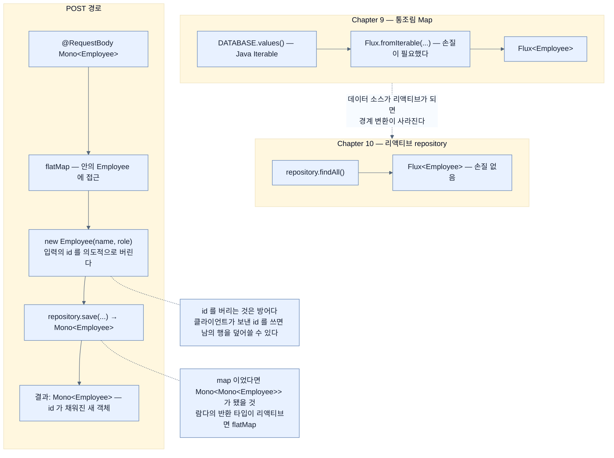

# repository를 API에 그대로 물리기 — 손질이 사라진다

## 한눈에 보기

```java
@GetMapping("/api/employees")
Flux<Employee> employees() {
    return repository.findAll();
}
```

Chapter 9에서는 `Flux.fromIterable(DATABASE.values())`가 필요했다. 여기서는 **`findAll()` 한 줄**이다. repository가 이미 `Flux`를 준다.

## 1. 왜 이게 필요한가

무거운 일은 끝났다. [[04-loading-data-with-r2dbcentitytemplate]]까지 오면 테이블에 3행이 들어 있고, [[03-creating-reactive-repositories-and-r2dbc-access]]의 repository가 그것을 읽을 준비를 마쳤다.

여기서부터는 **앞 장에서 배운 것을 그대로 활용**한다. 그런데 한 가지가 눈에 띄게 줄어든다.

## 2. 어떻게 동작하는가

### 2.1 컨트롤러 골격

```java
@RestController
public class ApiController {
    private final EmployeeRepository repository;
    public ApiController(EmployeeRepository repository) {
        this.repository = repository;
    }
}
```

| 요소 | 하는 일 |
|---|---|
| `@RestController` | 이 클래스가 템플릿을 처리하지 않고 **모든 출력을 응답에 직접 직렬화**한다는 표시 |
| `EmployeeRepository` | 앞 절에서 정의한 repository를 **생성자 주입**으로 받는다 |

### 2.2 GET — 손질이 사라진 자리

```java
@GetMapping("/api/employees")
Flux<Employee> employees() {
    return repository.findAll();
}
```

| 요소 | 하는 일 |
|---|---|
| `@GetMapping` | `GET /api/employees`를 이 메서드에 매핑 |
| **[[Flux]]**`<Employee>` | 하나 이상의 `Employee` 레코드를 반환한다는 표시 |
| `repository.findAll()` | **[[ReactiveCrudRepository]]**(= CRUD를 리액티브 타입으로 반환하는 인터페이스)가 미리 만들어 둔 메서드가 모든 데이터를 가져온다 |

책이 짚는 대비가 이 절의 핵심이다.

> 앞 장에는 단순한 Java `Map`이 있어서 리액티브하게 만들려면 **손질(finagling)**이 좀 필요했다. `EmployeeRepository`가 `ReactiveCrudRepository`를 확장하므로 **메서드의 반환 타입에 리액티브 타입이 이미 구워져 있다 — 손질이 필요 없다!**

[[../chapter-9-writing-reactive-web-controllers/05a-creating-a-reactive-web-controller]]에서 `fromIterable`로 감쌌다가 `collectList`로 도로 빼는 것이 이상해 보인다고 했는데, **그 이상함이 여기서 사라진다.** 데이터 소스가 애초에 리액티브이기 때문이다.

이것이 "end-to-end 리액티브"의 실제 모습이다 — **경계마다 변환이 필요 없다.**

### 2.3 POST

```java
@PostMapping("/api/employees")
Mono<Employee> add(@RequestBody Mono<Employee> newEmployee) {
    return newEmployee.flatMap(e -> {
        Employee employeeToLoad = new Employee(e.name(), e.role());
        return repository.save(employeeToLoad);
    });
}
```

| 요소 | 하는 일 |
|---|---|
| `@PostMapping` | `POST /api/employees`를 매핑 |
| **[[Mono]]**`<Employee>` | 최대 한 항목을 반환 |
| `@RequestBody Mono<Employee>` | 요청 본문을 `Employee`로 역직렬화하되, `Mono`에 감싸여 **시스템이 준비됐을 때만** 처리된다 |
| **[[flatMap]]**(= map 결과의 중첩을 걷어내는 연산자) | 들어온 `Employee`에 접근한다. 그 안에서 **완전히 새 `Employee`를 만들며 입력의 `id`를 의도적으로 버린다** |
| `repository.save()` | 저장하고 `Mono<Employee>`를 반환. 그 안의 새 객체에는 **갓 생성된 `id`를 포함해 전부**가 들어 있다 |

`id`를 버리는 것이 우연이 아니다. [[03-creating-reactive-repositories-and-r2dbc-access]]에서 봤듯 repository는 **[[기본-키]]**(= 행을 유일하게 식별하는 값)로 insert인지 update인지 판단한다. 클라이언트가 보낸 `id`를 그대로 쓰면 **남의 행을 덮어쓸 수 있다.** 여기서 새로 만드는 것이 그 방어다.

### 2.4 왜 `map`이 아니라 `flatMap`인가

책이 이 질문을 스스로 던지고 답한다.

> 왜 `flatMap`하나? 매핑은 보통 한 타입에서 다른 타입으로 변환할 때 쓴다. 이 상황에서도 들어온 `Employee`를 새로 저장된 `Employee` 타입으로 매핑하려는 것이다. 그럼 왜 그냥 `map`하지 않나?
>
> **`save()`가 돌려준 것이 `Employee` 객체가 아니었기 때문이다. `Mono<Employee>`였다.** 그것 위를 `map`했다면 **`Mono<Mono<Employee>>`**가 됐을 것이다.

판단 기준이 이렇게 정리된다 — **람다의 반환 타입이 리액티브 타입이면 `flatMap`.** [[../chapter-9-writing-reactive-web-controllers/04-consuming-data-with-reactive-post]]에서 본 규칙 그대로다.

> **무엇을 해야 할지 모르겠거나 Reactor API가 나를 방해하는 것 같을 때, 비밀은 대개 `flatMap()`이다.** 모든 Reactor 타입이 `flatMap`을 지원하도록 심하게 오버로드돼 있어 `Flux<Flux<?>>`, `Mono<Mono<?>>`와 그 모든 조합이 `flatMap()`만 걸면 잘 풀린다.
>
> Reactor의 **[[then-연산자]]**(= 앞 값은 버리고 완료 시그널만 받아 넘어가는 연산자)를 쓸 때도 마찬가지다 — **`then()` 앞에 `flatMap()`을 쓰면 대개 이전 단계가 수행됨을 보장한다.**

마지막 문장이 실무에서 유용하다. `then()`은 앞 단계의 **값**을 버리는데, 앞 단계가 아직 조립만 된 상태면 실행 자체가 건너뛰어질 수 있다. `flatMap`으로 명시적으로 이어 두면 그 위험이 준다.

### 2.5 비유와 그 한계

택배 대행에 빗댈 수 있다. Chapter 9의 `Map`은 **내가 직접 들고 있는 상자**라 리액티브 컨베이어에 올리려면 포장을 새로 해야 했다(`fromIterable`). repository는 **이미 컨베이어에 실려 오는 상자**라 그대로 흘려보내면 된다.

**깨지는 지점 둘.** 첫째, 컨베이어의 상자는 눈으로 세어 볼 수 있지만 `Flux`는 **몇 개인지 미리 알 수 없다** — `findAll()`이 백만 행이어도 타입은 같다. 둘째, 택배는 받은 상자를 그대로 전달할 수 있지만 **저장은 새 상자를 돌려준다**(`id`가 채워진). 그래서 `map`이 아니라 `flatMap`이고, 그 차이가 `Mono<Mono<>>`라는 형태로 드러난다.

## 3. 그림으로 보기



## 4. 이 노트에 나온 용어

- **[[ReactiveCrudRepository]]**: CRUD를 리액티브 타입으로 반환하는 Spring Data Commons 인터페이스.
- **[[Flux]]**: 0개 이상의 값이 시간에 걸쳐 도착하는 Reactor 타입.
- **[[Mono]]**: 0개 또는 1개 값을 다루는 Reactor 타입.
- **[[flatMap]]**: map 결과의 중첩을 한 단계로 걷어내는 연산자.
- **[[then-연산자]]**: 앞 값은 버리고 완료 시그널만 받아 넘어가는 연산자.
- **[[기본-키]]**: 행을 유일하게 식별하는 값.

## 5. 자주 헷갈리는 것

**원문의 오타** — 책 p.291 POST 메서드 코드의 닫는 중괄호 앞에 **`});f`**로 `f` 한 글자가 붙어 있다. 그대로 복사하면 컴파일되지 않는다. 올바른 형태는 `});`다.

**`id`를 버리는 것이 예제 단순화가 아니다** — 이것은 **보안 판단**이다. 클라이언트가 `id`를 보내면 그것이 기존 행의 갱신이 될 수 있다. 실제 API에서는 여기서 더 나아가 요청 DTO와 엔티티를 아예 분리한다.

**`findAll()`의 위험** — 타입은 `Flux<Employee>`로 같지만 행이 백만 개면 백만 개가 흐른다. 배압이 있어 메모리는 터지지 않지만 **응답이 끝나지 않는다.** 실제로는 페이징을 건다.

**`then()` 앞의 `flatMap`** — 책의 팁이 가리키는 문제는 "조립만 되고 실행되지 않는 단계"다. `then()`은 앞의 값을 버리므로 그 단계를 명시적으로 잇지 않으면 건너뛴 것처럼 보일 수 있다.

## 6. 언제 안 쓰나 / 경계

- **`findAll()`을 무조건 노출하지 않는다.** 데이터가 커지면 페이징이나 필터가 필요하다.
- **클라이언트가 보낸 `id`를 신뢰하지 않는다.**
- **엔티티를 그대로 API 응답으로 내보내지 않는다.** DB 컬럼 변경이 API 계약을 깨뜨린다.
- **`block()`을 부르지 않는다.** repository가 리액티브인 이유가 사라진다.

## 7. 연결

- [[03-creating-reactive-repositories-and-r2dbc-access]] — 여기서 부르는 `findAll()`·`save()`의 출처.
- [[04-loading-data-with-r2dbcentitytemplate]] — 이 endpoint가 읽는 3행을 심은 곳.
- [[04b-reactively-dealing-with-data-in-a-template]] — 같은 repository를 템플릿 쪽에 붙이는 형태.
- [[../chapter-9-writing-reactive-web-controllers/04-consuming-data-with-reactive-post]] — `Map`을 쓰던 앞 장의 같은 메서드.

## 8. 스스로 확인

- Chapter 9에 필요했던 "손질"이 여기서 사라진 이유를 한 문장으로 설명해 보라.
- `map`을 썼다면 반환 타입이 무엇이 됐겠는가? 그 사실이 `flatMap`의 판단 기준을 어떻게 정하는가?
- 들어온 `Employee`의 `id`를 버리는 것이 왜 보안 판단인가?
- `then()` 앞에 `flatMap()`을 두라는 조언이 가리키는 문제는 무엇인가?

<!-- ==== 아래는 내 영역 · 스킬 수정 금지 ==== -->

## 내 설명 시도


## 막혔던 지점


## 리뷰 이력
