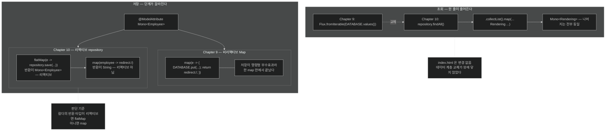

# 템플릿 쪽 연결 — 저장과 redirect를 두 단계로 나누는 이유

## 한눈에 보기

| | Chapter 9 (`Map`) | Chapter 10 (repository) |
|---|---|---|
| 조회 | `Flux.fromIterable(DATABASE.values()).collectList()` | `repository.findAll().collectList()` |
| 저장 | `map`으로 저장 + redirect를 **한 번에** | `flatMap`으로 저장 → `map`으로 redirect, **두 단계** |

같은 화면, 같은 템플릿. 바뀐 것은 **데이터 소스가 리액티브가 되면서 생긴 단계 분리**다.

## 1. 왜 이게 필요한가

[[04a-returning-data-reactively-to-an-api-controller]]에서 JSON API를 repository에 물렸다. 남은 것은 **HTML 쪽**이다.

Chapter 9의 `HomeController`를 그대로 가져오되 `DATABASE` Map을 repository로 바꾸면 될 것 같다. **조회는 실제로 그렇다.** 그런데 **저장 쪽에서 한 가지가 달라진다.**

## 2. 어떻게 동작하는가

### 2.1 컨트롤러 골격

```java
@Controller
public class HomeController {
    private final EmployeeRepository repository;
    public HomeController(EmployeeRepository repository) {
        this.repository = repository;
    }
}
```

| 요소 | 하는 일 |
|---|---|
| `@Controller` | 이 컨트롤러가 **템플릿 렌더링**에 집중한다는 표시 |
| `EmployeeRepository` | 같은 repository를 생성자 주입으로 받는다 |

### 2.2 조회 — 한 줄이 줄어든다

```java
@GetMapping("/")
Mono<Rendering> index() {
    return repository.findAll()
        .collectList()
        .map(employees -> Rendering
            .view("index")
            .modelAttribute("employees", employees)
            .modelAttribute("newEmployee", new Employee("", ""))
            .build());
}
```

**앞 장의 `index()`와 거의 같고 강조된 부분만 다르다.**

- `repository.findAll()`: Map의 값들을 **[[Flux]]**(= 0개 이상이 시간에 걸쳐 도착하는 타입)로 변환하는 대신, `EmployeeRepository`가 **이미 `Flux`를 준다.**

**나머지는 전부 동일하다.** **[[collectList]]**(= `Flux`를 모아 `Mono<List<T>>`로)도, **[[Rendering]]**(= 뷰 이름과 모델 속성을 담는 값 타입) builder도, 두 개의 모델 속성도 그대로다.

즉 [[../chapter-9-writing-reactive-web-controllers/05a-creating-a-reactive-web-controller]]에서 "감쌌다 도로 푸는 것이 이상해 보인다"고 했던 그 `fromIterable` 한 줄만 사라졌다.

### 2.3 저장 — 여기서 갈린다

```java
@PostMapping("/new-employee")
Mono<String> newEmployee(@ModelAttribute Mono<Employee> newEmployee) {
    return newEmployee
        .flatMap(e -> {
            Employee employeeToSave = new Employee(e.name(), e.role());
            return repository.save(employeeToSave);
        })
        .map(employee -> "redirect:/");
}
```

| 요소 | 하는 일 |
|---|---|
| **[[flatMap]]**(= map 결과의 중첩을 걷어내는 연산자) | 들어온 `Employee`를 새 인스턴스로 변환하고 repository로 저장한 뒤, **중첩 없이** `Mono<Employee>`를 반환 |
| 새 인스턴스 생성 | `name`과 `role`만 뽑고 **주어진 `id`는 무시**한다. 새 레코드가 만들어지도록 |
| `map(employee -> "redirect:/")` | 저장된 `Employee`를 redirect 요청으로 변환 |

### 2.4 왜 두 단계로 나누나

책이 명시적으로 짚는 대비다.

> 앞 장과 비교해 중요한 점은, 위 코드에서 **단계를 나눴다**는 것이다. 앞 장에서는 들어온 `Employee` 객체를 그냥 redirect 요청으로 매핑했다. **가짜 데이터베이스가 비리액티브라 데이터를 저장하는 데 명령형 호출 하나면 됐기 때문**이다.
>
> 이 장의 `EmployeeRepository`는 리액티브이므로, **`save()`에 집중하는 연산 하나와 그 결과를 redirect 요청으로 바꾸는 다음 연산으로 나눠야** 한다.
>
> 그리고 `save()`의 응답이 Reactor `Mono` 클래스에 감싸여 있어 **`flatMap`을 써야 했다.** employee를 `"redirect:/"`로 바꾸는 데는 Reactor 타입이 관여하지 않으므로 **단순 `map`이면 충분**하다.

이 세 문단이 `map`/`flatMap` 판단 기준을 완성한다.

| 단계 | 람다의 반환 타입 | 연산자 |
|---|---|---|
| 저장 | `Mono<Employee>` — **리액티브** | `flatMap` |
| redirect 변환 | `String` — 리액티브 아님 | `map` |

Chapter 9에서는 저장이 `DATABASE.put(...)`이라는 **명령형 부수효과**였으므로 리액티브 타입이 나오지 않았고, 그래서 저장과 변환을 한 `map` 안에 넣을 수 있었다. 데이터 계층이 리액티브가 되자 그 둘이 **자연스럽게 갈라진 것**이다.

### 2.5 템플릿은 그대로

`index.html`은 **앞 장에서 그대로 복사**하면 된다. 같은 파일이므로 책도 다시 싣지 않는다 — **변경 없음.**

이것이 이 장의 결론을 잘 보여 준다. 데이터 계층을 리액티브로 바꿨는데 **뷰는 한 글자도 바뀌지 않았다.** 계층 분리가 제대로 되어 있으면 저장소 교체가 화면에 닿지 않는다.

### 2.6 비유와 그 한계

주방 주문 처리에 빗댈 수 있다. Chapter 9에서는 **메모지에 적고 바로 "다음 손님" 하고 외칠 수 있었다** — 적는 데 시간이 안 걸리니까. 이 장에서는 주문을 **주방에 넣고 접수증이 나오기를 기다렸다가** "다음 손님"을 외친다. 두 동작이 갈라진 것은 주방이 비동기이기 때문이다.

**깨지는 지점 둘.** 첫째, 사람은 접수증을 기다리는 동안 **가만히 서 있지만** 리액티브에서는 그 스레드가 다른 일을 한다 — 그래서 "기다린다"는 표현이 정확하지 않다. 둘째, 접수증에는 주문 번호가 찍히지만 이 코드는 **저장된 `Employee`를 받고도 버린다**(`map(employee -> "redirect:/")`). 새로 생긴 `id`를 쓰지 않으므로, redirect 대신 상세 페이지로 보내려면 그 값을 활용해야 한다.

## 3. 그림으로 보기



## 4. 이 노트에 나온 용어

- **[[Rendering]]**: 뷰 이름과 모델 속성을 함께 담는 WebFlux 값 타입.
- **[[collectList]]**: `Flux`의 항목을 모아 `Mono<List<T>>`로 만드는 연산자.
- **[[flatMap]]**: map 결과의 중첩을 한 단계로 걷어내는 연산자.
- **[[Mono]]**: 0개 또는 1개 값을 다루는 Reactor 타입.
- **[[Flux]]**: 0개 이상의 값이 시간에 걸쳐 도착하는 Reactor 타입.
- **[[ReactiveCrudRepository]]**: CRUD를 리액티브 타입으로 반환하는 Spring Data Commons 인터페이스.

## 5. 자주 헷갈리는 것

**원문의 접근자 불일치** — 책 p.293의 이 메서드는 **`e.getName()`·`e.getRole()`**을 호출한다. 그런데 `Employee`는 **record**이므로 접근자는 `e.name()`·`e.role()`이다. 같은 장 p.290의 API용 POST([[04a-returning-data-reactively-to-an-api-controller]])는 **올바르게 `e.name()`을 쓴다.** 즉 같은 타입에 두 가지 접근자 문법이 섞여 있고, 그대로 따라 쓰면 컴파일되지 않는다.

**그리고 p.294가 "템플릿은 변경 없이 복사하라"고 끝난다** — 앞 장 템플릿의 `th:field="*{name}"`은 record 접근자에 의존한다. 위 오류와 합치면 **어느 쪽이 맞는지 독자가 스스로 판단해야 하는 상태**로 장이 마무리된다. 정답은 record 접근자(`name()`)다.

**`map`으로 저장할 수 없는 이유를 한 번 더** — `repository.save()`가 `Mono<Employee>`를 반환한다. `map`을 쓰면 `Mono<Mono<Employee>>`가 되고, 그 뒤의 `map(employee -> ...)`은 **바깥 `Mono`의 값인 안쪽 `Mono`**를 받게 되어 타입이 어긋난다.

**저장 결과를 버리고 있다** — `map(employee -> "redirect:/")`는 새로 생긴 `id`를 쓰지 않는다. 상세 페이지로 보내려면 `map(e -> "redirect:/employees/" + e.id())`처럼 활용할 수 있다.

## 6. 언제 안 쓰나 / 경계

- **`e.getName()`을 쓰지 않는다.** record 접근자는 `name()`이다.
- **저장 성공만으로 redirect하지 않는다.** 실패 경로(`onErrorResume`)를 두지 않으면 오류가 500으로 나간다.
- **`findAll()`을 화면에 그대로 걸지 않는다.** 행이 늘면 페이지가 무한정 길어진다.
- **엔티티를 폼 바인딩 대상으로 그대로 쓰지 않는다.** `id`가 폼에 노출될 수 있다.

## 7. 연결

- [[04a-returning-data-reactively-to-an-api-controller]] — 같은 repository를 JSON API에 붙인 형태. 접근자 문법이 올바른 쪽.
- [[03-creating-reactive-repositories-and-r2dbc-access]] — `save()`가 `Mono<Employee>`를 반환하는 근거.
- [[04-loading-data-with-r2dbcentitytemplate]] — 이 화면이 보여 주는 초기 3행.
- [[../chapter-9-writing-reactive-web-controllers/05b-crafting-a-thymeleaf-template]] — 변경 없이 재사용되는 템플릿과 폼.

## 8. 스스로 확인

- Chapter 9에서는 저장과 redirect를 한 `map`에 넣을 수 있었는데 여기서는 왜 나눠야 하는가?
- `repository.save()`에 `map`을 쓰면 타입이 어떻게 되고, 그다음 `map`에서 무슨 일이 생기는가?
- 데이터 계층을 통째로 바꿨는데 `index.html`이 그대로인 것은 무엇을 뜻하는가?
- `e.getName()`과 `e.name()` 중 무엇이 맞고, 그 근거는?


> 네 문항을 스스로 답한 **뒤에** [[_04b-reactively-dealing-with-data-in-a-template]]에서 모범답안과 대조한다. 먼저 열면 이 문항들은 다시 인출 문제로 쓸 수 없다.

<!-- ==== 아래는 내 영역 · 스킬 수정 금지 ==== -->

## 내 설명 시도


## 막혔던 지점


## 리뷰 이력
