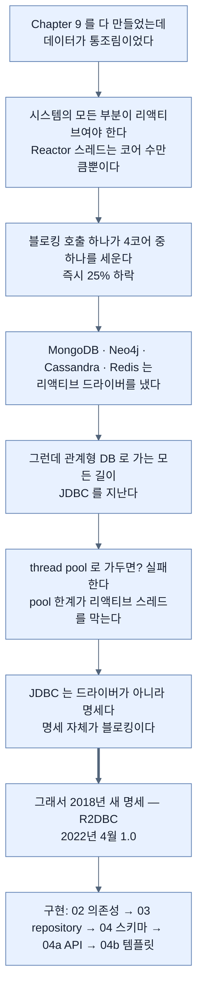
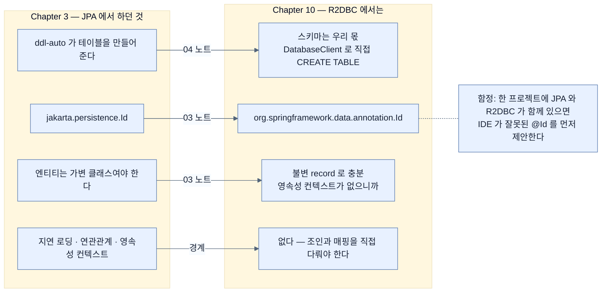

# Chapter 10 개념 지도 — Working with Data Reactively

> *Learning Spring Boot 4*, Ch. 10 (책 pp. 281–294 / PDF pp. 306–319). 노트 6개를 세 축으로 엮는다. 축 1은 **"왜 새 명세가 필요했나"**, 축 2는 **"Map이 repository로 바뀌면 코드가 어떻게 변하나"**, 축 3은 **"JPA 습관이 어디에서 어긋나나"**다.

## 축 1 — 진단에서 처방까지

이 장은 짧지만 논증이 한 줄로 이어진다. **각 단계가 앞 단계의 결론에서 나온다.**

이 사슬을 거꾸로 읽으면 **리액티브 전환을 검토할 때의 점검 순서**가 된다 — 우리 DB에 리액티브 드라이버가 있는가? 없으면 이 장의 길은 막혀 있다.

## 축 2 — Map이 repository로 바뀌면

Chapter 9의 코드와 이 장의 코드를 나란히 놓으면, **데이터 소스가 리액티브가 되면서 무엇이 사라지고 무엇이 갈라지는지** 보인다.

| 자리 | Chapter 9 (`Map`) | Chapter 10 (repository) | 변화 |
|---|---|---|---|
| JSON 조회 | `Flux.just(...)` | `repository.findAll()` | **손질이 사라진다** — [[04a-returning-data-reactively-to-an-api-controller]] |
| 템플릿 조회 | `Flux.fromIterable(DATABASE.values())` | `repository.findAll()` | 한 줄이 줄어든다 — [[04b-reactively-dealing-with-data-in-a-template]] |
| JSON 저장 | `map` 안에서 `DATABASE.put` | `flatMap`으로 `save()` | **`Mono<Mono<>>`를 피하려고 `flatMap`** |
| 템플릿 저장 | `map` 하나로 저장 + redirect | `flatMap`으로 저장 → `map`으로 redirect | **단계가 갈라진다** |
| 도메인 타입 | `record Employee(name, role)` | `record Employee(@Id id, name, role)` | 식별자가 필요해진다 — [[03-creating-reactive-repositories-and-r2dbc-access]] |
| 템플릿 파일 | `index.html` | **변경 없음** | 계층 분리가 지켜졌다 |

여기서 나오는 `map`/`flatMap` 판단 기준이 이 장의 실무적 수확이다 — **람다의 반환 타입이 리액티브면 `flatMap`.** 그리고 책의 조언 한 줄이 그것을 요약한다: **"무엇을 할지 모르겠을 때 비밀은 대개 `flatMap()`이다."**

## 축 3 — JPA 습관이 어긋나는 곳

Chapter 3에서 JPA를 배운 상태로 오면 **기대가 어긋나는 지점이 넷**이다.

세 번째 축이 알려 주는 것은, **R2DBC가 JPA의 리액티브 버전이 아니라는 점**이다. 이름이 비슷하고 repository 모양이 같아 그렇게 보이지만, **없어진 것이 많고 그 대신 record가 가능해졌다.**

## 축 4 — 이 장에서 헷갈리는 쌍들

| 쌍 | 구분 |
|---|---|
| `h2` ↔ `r2dbc-h2` | **데이터베이스 자체** ↔ 그것과 리액티브로 말하는 **드라이버**. 둘 다 필요하다 — [[02-choosing-r2dbc-and-a-reactive-data-store]] |
| R2DBC ↔ Spring Data R2DBC | **명세** ↔ 그 위의 **툴킷**. 명세는 저수준이라 툴킷 없이 쓰면 장황하다 |
| `@Id`(Spring Data) ↔ `@Id`(JPA) | `org.springframework.data.annotation` ↔ `jakarta.persistence` — [[03-creating-reactive-repositories-and-r2dbc-access]] |
| `map` ↔ `flatMap` | 람다 반환이 리액티브가 **아니면** `map`, **이면** `flatMap` — [[04b-reactively-dealing-with-data-in-a-template]] |
| `R2dbcEntityTemplate` ↔ `DatabaseClient` | 도메인 타입을 아는 편의 연산 ↔ 원시 SQL. **DDL은 후자로 내려가야 한다** — [[04-loading-data-with-r2dbcentitytemplate]] |
| `subscribe()` ↔ `subscribe(onNext, onError)` | 오류를 **삼킨다** ↔ 오류를 처리한다. 초기화 코드에서 결정적 차이 |

## 노트 목록

| # | 노트 | 한 줄 |
|---|---|---|
| 01 | [[01-what-reactive-data-access-requires]] | JDBC는 드라이버가 아니라 명세라서 못 고친다 |
| 02 | [[02-choosing-r2dbc-and-a-reactive-data-store]] | R2DBC 명세와 네 개의 좌표 |
| 03 | [[03-creating-reactive-repositories-and-r2dbc-access]] | `ReactiveCrudRepository`와 record에 붙는 `@Id` |
| 04 | [[04-loading-data-with-r2dbcentitytemplate]] | 스키마는 우리 몫, `thenMany`와 `subscribe()` |
| 04a | [[04a-returning-data-reactively-to-an-api-controller]] | 손질이 사라진 JSON API |
| 04b | [[04b-reactively-dealing-with-data-in-a-template]] | 저장과 redirect가 갈라지는 이유 |

## 다른 Chapter와의 연결

- **Ch. 9 리액티브 웹** — 이 장은 그 장의 미완성을 끝낸다. `chapter-9-writing-reactive-web-controllers/04b-java-concurrency-history`가 "JDBC·JPA·JMS·servlet이 문제"라고 진단한 것을 [[01-what-reactive-data-access-requires]]가 이어받고, 같은 폴더의 `05a-creating-a-reactive-web-controller`·`05b-crafting-a-thymeleaf-template`의 `DATABASE` Map이 [[04a-returning-data-reactively-to-an-api-controller]]·[[04b-reactively-dealing-with-data-in-a-template]]에서 실제 저장소로 교체된다.
- **Ch. 3 데이터 조회** — `part-2-creating-an-application-with-spring-boot/chapter-3-querying-for-data-with-spring-boot/03-creating-repositories-and-declarative-queries`의 `JpaRepository`가 [[03-creating-reactive-repositories-and-r2dbc-access]]의 `ReactiveCrudRepository`와 나란히 놓인다. 선언은 닮았고 **없어진 기능이 많다**는 것이 이 장의 경계다. 같은 폴더의 `02a-entities-in-jpa`가 "엔티티는 왜 record가 아닌가"를 다루는데, R2DBC에서는 그 제약이 사라진다.
- **Ch. 11 가상 스레드** — 다음 장이 **같은 문제에 다른 답**을 낸다. 블로킹 JDBC를 그대로 두고 스레드를 싸게 만드는 접근이다. `chapter-11-virtual-threads-in-java-and-spring-boot/01-understanding-virtual-threads`와 같은 폴더의 `02-using-virtual-threads-in-a-spring-boot-application`이 JPA를 그대로 쓰는 것을 보면 이 장의 제약이 절대적이지 않음이 드러난다.
- **Ch. 7 릴리스** — 이 장 요약이 "앞 장들의 배포 전술이 그대로 통한다"고 말한다. `part-3-releasing-an-application-with-spring-boot/chapter-7-releasing-an-application-with-spring-boot/01-creating-an-uber-jar`부터의 절차가 리액티브 애플리케이션에도 동일하게 적용된다.
- **Ch. 5 테스트** — `spring-boot-starter-data-r2dbc-test`가 이 장에서 처음 등장한다. `part-2-creating-an-application-with-spring-boot/chapter-5-testing-with-spring-boot/05-testing-repositories-with-embedded-databases`의 감각이 리액티브 repository에도 이어진다.
