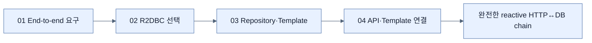

# Chapter 10 지도 — Working with Data Reactively

## JPA와 R2DBC 축

| 관점 | JPA/JDBC | Spring Data R2DBC |
|---|---|---|
| I/O | blocking | non-blocking Publisher |
| Entity state | persistence context·dirty checking | explicit mapped operation |
| CRUD return | entity/list | Mono/Flux |
| 적합한 web model | MVC/virtual threads | WebFlux |

