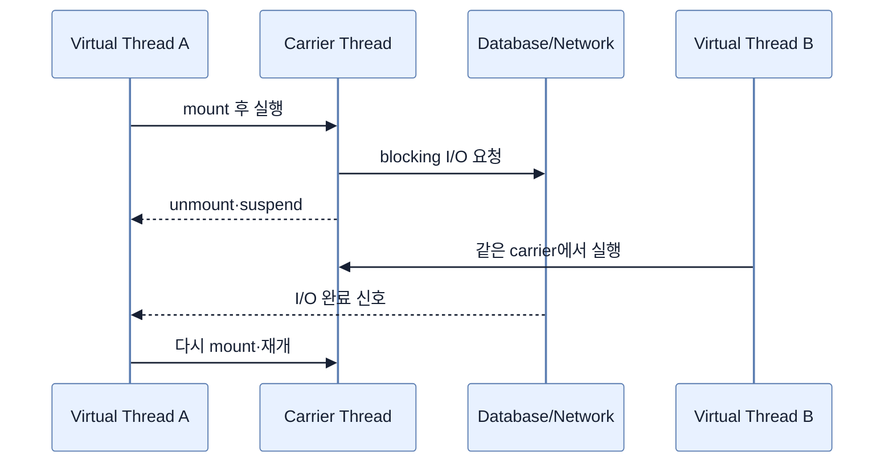

# Virtual Thread 이해하기

## 한눈에 보기

Virtual thread는 운영체제가 아니라 JVM이 관리하는 경량 thread다. I/O를 기다릴 때 실행 중이던 carrier platform thread에서 내려와(unmount) 자리를 비우므로, 익숙한 blocking·imperative 코드를 유지하면서 많은 동시 요청을 감당할 수 있다.

## 1. 왜 이게 필요한가

전통적인 platform thread는 OS thread와 거의 1:1로 대응해 stack memory와 scheduling 비용이 크다. 그래서 thread pool 크기가 동시 처리량의 상한이 되며, DB나 network 응답을 기다리는 동안에도 비싼 thread가 묶인다. Reactive programming은 이 문제를 해결하지만 pipeline 조합과 오류 처리 방식이 달라 학습·유지보수 비용이 있다.

Project Loom이 Java 21에서 정식 제공한 virtual thread는 “요청 하나당 thread 하나” 모델을 다시 실용적으로 만든다. JVM은 virtual thread가 지원되는 blocking I/O에서 대기하면 이를 suspend하고 carrier를 다른 작업에 쓴 뒤 I/O 완료 후 재개한다.

## 2. 어떻게 동작하는가

Virtual thread 자체가 CPU를 더 빠르게 만들지는 않는다. 많은 시간이 대기에 쓰이는 I/O-bound workload에서 값이 크고, CPU-bound 계산의 처리량은 core 수가 결정한다. 또한 backpressure가 핵심인 연속 stream pipeline을 자동으로 대체하지 않는다.

Spring MVC, JPA, 동기 HTTP client처럼 blocking API를 사용하는 기존 계층은 코드를 reactive로 전환하지 않고도 확장성 이점을 얻을 수 있다. 단, 긴 `synchronized` 구간이나 native call처럼 virtual thread가 carrier에 고정되는 pinning과 무제한 외부 요청은 별도로 관리해야 한다.

## 3. 그림으로 보기

## 4. 이 노트에 나온 용어

- **virtual thread**: JVM이 scheduling하고 매우 적은 비용으로 대량 생성할 수 있는 Java thread.
- **platform thread**: 운영체제 thread에 대응하며 실제 CPU에서 코드를 실행하는 전통적인 Java thread.
- **carrier thread**: 어떤 순간에 virtual thread가 올라가 실행되는 platform thread.
- **Project Loom**: virtual thread와 구조화된 동시성 등 Java concurrency 개선을 추진한 OpenJDK 프로젝트.

## 7. 연결

- [[02-using-virtual-threads-in-a-spring-boot-application]] — Boot가 request 처리 infrastructure를 virtual thread로 바꾸는 방법이다.
- [[chapter-9-writing-reactive-web-controllers/01-reactive-programming-and-backpressure|Reactive programming]] — 동시성을 다루는 다른 실행 모델이다.
- [[04-using-virtual-threads-with-restclient]] — blocking I/O와 virtual thread의 결합 사례다.

## 8. 스스로 확인

- 전체 1차 정리 후: virtual thread가 CPU-bound 작업보다 I/O-bound 작업에 더 적합한 이유를 설명한다.

<!-- ==== 아래는 내 영역 · 스킬 수정 금지 ==== -->

## 내 설명 시도

## 막혔던 지점

## 리뷰 이력

