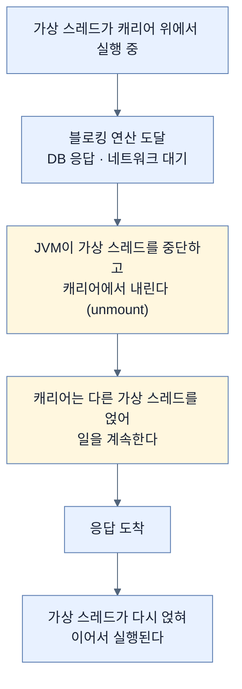
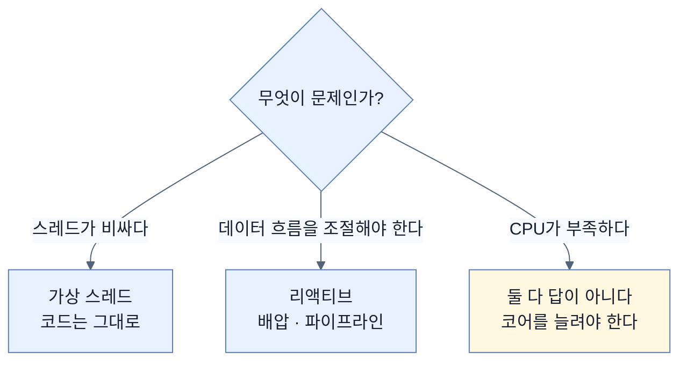

# 블로킹처럼 쓰고 논블로킹처럼 확장하기 — 가상 스레드

## 한눈에 보기

| 질문 | 핵심 답 |
|---|---|
| 무엇을 푸나 | 플랫폼 스레드가 **비싸서** 많이 만들 수 없다는 제약 |
| 기존 우회로 | 스레드 풀 · 비동기 모델 · 리액티브 프레임워크 — 모두 **복잡도를 더한다** |
| 가상 스레드란 | **JVM이** 관리하는 경량 스레드. 수백만 개 가능 |
| 핵심 이점 | **단순한 명령형 블로킹 코드로 높은 확장성** |
| 어떻게 | 블로킹하면 JVM이 가상 스레드를 내리고 **플랫폼 스레드를 풀어 준다** |
| 언제 final이 됐나 | **Java 21** (19·20은 preview), JEP 444 |
| 잘 맞는 곳 | **I/O 바운드** 작업 |
| 대체하지 못하는 것 | 논블로킹 데이터 파이프라인, **세밀한 배압 제어** |

## 1. 왜 이게 필요한가

### 출발 장면: 스레드가 비싸서 못 만든다

서버는 여러 요청을 함께 처리해야 한다. 이것이 **[[동시성]]**(= 여러 작업을 동시에 다루는 능력)이고, 책이 정확히 정의한다 — **"전부가 같은 순간에 실행되고 있지 않더라도"** 여러 작업을 다루는 능력이다.

자바의 전통적 답은 **[[플랫폼-스레드]]**(= 운영체제 스레드에 1:1로 대응하는 전통적 자바 스레드)였다. 요청 하나에 스레드 하나를 주면 코드가 단순하다.

```java
@GetMapping("/employees")
List<Employee> list() {
    return repository.findAll();   // DB 응답을 기다린다 — 이 스레드는 멈춰 있다
}
```

문제는 그 스레드가 **비싸다**는 것이다.

| 비용 | 구체적으로 |
|---|---|
| 메모리 | 스레드마다 스택이 할당된다(보통 수백 KB~1MB) |
| 스케줄링 | OS 커널이 문맥 교환을 한다 |
| 생성 | 시스템 콜이 필요하다 |

그래서 한 프로세스가 만들 수 있는 플랫폼 스레드는 현실적으로 수천 개 수준이다. 동시 접속이 수만이면 감당이 안 된다.

### 우회로들이 만든 새 문제

책이 정리하는 기존 대응이 셋이다.

| 대응 | 하는 일 | 대가 |
|---|---|---|
| **[[스레드-풀]]**(= 비싼 스레드를 미리 만들어 돌려 쓰는 방식) | 생성 비용을 감춘다 | **개수 제한은 그대로**. 풀이 마르면 대기 |
| 비동기 프로그래밍 | 콜백으로 기다림을 없앤다 | 콜백 지옥, 스택 트레이스 소실 |
| **[[리액티브-모델]]**(= 논블로킹 연산 조합으로 동시성을 다루는 모델) | 적은 스레드로 많은 요청 | **코드를 쓰고 조합하고 이해하는 방식이 바뀐다** |

책의 표현이 정확하다 — **"효과적이지만 이 접근들은 추가 복잡도를 들여오고, 개발자가 코드가 어떻게 구조화되고 실행되는지를 다르게 생각하게 만든다."**

[[../chapter-9-writing-reactive-web-controllers/01-reactive-programming-and-backpressure|Chapter 9]]와 [[../chapter-10-working-with-data-reactively/01-what-reactive-data-access-requires|Chapter 10]]이 리액티브 모델을 다뤘고, 이 장은 **다른 답**을 제시한다.

## 2. 어떻게 동작하는가

### 2.1 무엇이 달라졌나

**[[가상-스레드]]**(= JVM이 관리하는 경량 스레드)의 정의에서 결정적인 것은 **누가 관리하는가**다.

| | 플랫폼 스레드 | 가상 스레드 |
|---|---|---|
| 관리 주체 | **운영체제** | **JVM** |
| 스택 | OS가 고정 크기로 할당 | 힙에 두고 필요한 만큼 |
| 생성 비용 | 시스템 콜 | 객체 하나 |
| 현실적 개수 | 수천 | **수백만** |
| 블로킹하면 | OS 스레드가 묶인다 | **밑의 스레드가 풀려난다** |

**[[Project-Loom]]**(= 자바에 경량 동시성을 도입하기 위한 OpenJDK 프로젝트)의 산물이며, Java 19·20 preview를 거쳐 **Java 21에서 final**이 됐다.

> **원문의 표현 문제.** 장 도입부는 "가상 스레드가 Project Loom을 통해 Java 21에서 final이 됐다"고 정확히 쓰는데, 본문에서는 "**Project Loom, introduced in Java 21**"이라고 해 프로젝트 자체가 Java 21에 도입된 것처럼 읽힌다. Project Loom은 2017년경 시작된 프로젝트이고, Java 21에서 최종화된 것은 그 산물인 가상 스레드다.

### 2.2 핵심 아이디어

책이 "핵심 이점"이라고 부르는 것이 이 장 전체의 주제다.

> **단순하고 명령형이며 블로킹 스타일인 코드를 쓰면서도 높은 확장성을 얻는다.**

작동 방식이 세 단계다.



**[[캐리어-스레드]]**(= 가상 스레드를 실제로 실행해 주는 플랫폼 스레드)와 **[[마운트]]**(= 가상 스레드가 캐리어 위에 얹히고 내려오는 것)가 이 구조의 두 축이다.

핵심은 3~4단계다. **[[블로킹-호출]]**(= 결과가 올 때까지 호출한 쪽이 멈춰 서는 호출)이 여전히 코드에는 블로킹으로 적혀 있지만, **자원 관점에서는 블로킹이 아니다.** 기다리는 것은 가상 스레드이고 캐리어는 다른 일을 한다.

이것이 리액티브가 콜백으로 얻던 것을 **언어 수준에서** 얻는 방법이다.

| | 리액티브 | 가상 스레드 |
|---|---|---|
| 코드 모양 | 연산자 체인, 콜백 | **평범한 순차 코드** |
| 스택 트레이스 | 끊긴다 | **그대로 남는다** |
| 디버거 | 어렵다 | 평소처럼 |
| try-catch | 안 통한다 | **통한다** |
| 스레드가 기다리나 | 아무도 안 기다린다 | 가상 스레드가 기다린다(공짜로) |

### 2.3 Spring Boot에서의 의미

책이 짚는 실용적 결론이 크다. **이 모델은 기존 프로그래밍 관행과 자연스럽게 맞는다.**

Spring Web MVC로 만든 애플리케이션, 데이터 접근 계층, 전통적 서비스 컴포넌트가 **리액티브로 옮기지 않고도** 확장성을 얻는다.

**[[명령형-블로킹-스타일]]**(= 위에서 아래로 읽히고 필요한 곳에서 기다리는 평범한 코드)을 유지한 채 동시 요청 처리량을 올린다는 것이 이 장의 약속이다.

### 2.4 대체가 아니다

책이 곧바로 경계를 긋는다. 가상 스레드는 **[[I/O-바운드]]**(= CPU 계산이 아니라 기다림이 시간을 차지하는 작업)에 특히 잘 맞지만, 다음 경우에는 리액티브의 대체가 아니다.

| 리액티브가 여전히 필요한 곳 | 왜 |
|---|---|
| 논블로킹 데이터 파이프라인 | 스트림 변환·조합이 필요하다 |
| 세밀한 **[[배압]]**(= 소비자가 감당할 속도만큼만 생산자가 보내게 조절하는 장치) 제어 | 가상 스레드에는 이런 흐름 제어 개념이 없다 |

이 구분이 중요하다. 가상 스레드는 **"스레드가 비싸다"는 문제**를 푼다. 리액티브는 그것에 더해 **"데이터 흐름을 조절해야 한다"는 문제**까지 다룬다. 후자가 없으면 가상 스레드가 훨씬 단순한 답이다.

CPU 바운드 작업에도 이점이 없다. 계산이 시간을 쓰는 동안에는 캐리어가 풀려나지 않으므로, 가상 스레드를 아무리 많이 만들어도 코어 수 이상으로 빨라지지 않는다.

책의 Note는 더 읽을 곳을 가리킨다 — **[[JEP]]**(= OpenJDK 변경을 기술한 제안 문서) **444**가 Java 21에서 가상 스레드를 final로 전달한 최종 문서다.

## 3. 그림으로 보기



| 축 | 스레드 풀 | 리액티브 | 가상 스레드 |
|---|---|---|---|
| 코드 스타일 | 명령형 | 선언형 체인 | **명령형** |
| 동시 처리 한계 | 풀 크기 | 매우 높음 | **매우 높음** |
| 학습 비용 | 낮음 | **높음** | 낮음 |
| 스택 트레이스 | 온전 | 끊김 | **온전** |
| 배압 | 없음 | **있음** | 없음 |
| I/O 바운드 | 보통 | 좋음 | **좋음** |
| CPU 바운드 | 보통 | 보통 | 보통 |

## 4. 이 노트에 나온 용어

| 용어 | 한 줄 뜻 | 정의 위치 |
|---|---|---|
| 동시성 | 여러 작업을 동시에 다루는 능력 | [[_glossary#동시성]] |
| 플랫폼 스레드 | OS 스레드에 1:1 대응하는 자바 스레드 | [[_glossary#플랫폼-스레드]] |
| 가상 스레드 | JVM이 관리하는 경량 스레드 | [[_glossary#가상-스레드]] |
| Project Loom | 경량 동시성을 위한 OpenJDK 프로젝트 | [[_glossary#Project-Loom]] |
| JEP | OpenJDK 변경 제안 문서 | [[_glossary#JEP]] |
| 캐리어 스레드 | 가상 스레드를 실행해 주는 플랫폼 스레드 | [[_glossary#캐리어-스레드]] |
| 마운트 | 가상 스레드가 캐리어에 얹히고 내려오는 것 | [[_glossary#마운트]] |
| 스레드 풀 | 스레드를 미리 만들어 돌려 쓰는 방식 | [[_glossary#스레드-풀]] |
| 명령형 블로킹 스타일 | 순차적으로 읽히고 기다리는 코드 형태 | [[_glossary#명령형-블로킹-스타일]] |
| 리액티브 모델 | 논블로킹 연산 조합으로 동시성을 다루는 모델 | [[_glossary#리액티브-모델]] |
| 배압 | 소비 속도에 맞춰 생산을 조절하는 장치 | [[_glossary#배압]] |
| I/O 바운드 | 기다림이 시간을 차지하는 작업 | [[_glossary#I/O-바운드]] |
| 블로킹 호출 | 결과가 올 때까지 멈춰 서는 호출 | [[_glossary#블로킹-호출]] |

## 5. 자주 헷갈리는 것

**"가상 스레드는 더 빠른 스레드다"** — 하나하나가 빠른 게 아니라 **많이 만들 수 있는** 것이다. 단일 작업의 실행 속도는 같다.

**"가상 스레드를 쓰면 블로킹이 사라진다"** — 코드는 여전히 블로킹이다. 사라지는 것은 **플랫폼 스레드가 묶이는 것**이다.

**"가상 스레드는 리액티브를 대체한다"** — 확장성 문제는 대체하지만 **배압과 파이프라인 조합**은 아니다. 책이 명시적으로 선을 긋는다.

**"CPU 집약 작업도 빨라진다"** — 아니다. 계산 중에는 캐리어가 풀려나지 않는다.

**"스레드 풀을 크게 만들면 같은 효과다"** — 플랫폼 스레드는 메모리와 문맥 교환 비용이 있어 무한정 늘릴 수 없다.

## 6. 언제 안 쓰나 / 경계

- **CPU 바운드 작업.** 이득이 없다.
- **배압이 필요한 스트리밍.** 리액티브의 영역이다.
- **`synchronized` 블록 안의 블로킹.** 가상 스레드가 캐리어에 고정(pinning)될 수 있어 이점이 사라진다. 책은 다루지 않지만 실무에서 자주 만나는 함정이다.
- **비유의 한계.** 가상 스레드는 "식당에서 주문을 받아 두고 다른 테이블을 보러 가는 종업원"에 비유된다. 요리가 나올 때까지 서 있지 않는다. 다만 이 비유는 **손님 쪽에서는 아무것도 달라지지 않는다**는 점을 흐린다. 실제로는 가상 스레드 코드 자체가 "서서 기다리는" 형태로 쓰여 있고, 자리를 뜨는 주체는 코드가 아니라 **JVM**이다. 종업원이 스스로 판단하는 게 아니라 지배인이 종업원을 다른 테이블로 옮겨 붙이는 쪽에 가깝다.

## 7. 연결

- [[02-using-virtual-threads-in-a-spring-boot-application]] — 여기서 설명한 마운트·캐리어 구조가 실제 로그에서 눈으로 확인된다.
- [[04-using-virtual-threads-with-restclient]] — "블로킹 호출이 자원 관점에서는 블로킹이 아니다"가 HTTP 클라이언트에서 실증된다.
- [[06-error-handling-in-concurrent-tasks]] — "스택 트레이스가 그대로 남는다"는 이점이 **스레드 경계를 넘으면 사라진다**는 반대편을 다룬다.

## 8. 스스로 확인

1. 플랫폼 스레드가 비싼 이유 세 가지를 말할 수 있는가?
2. 기존 우회로 셋이 각각 무엇을 해결하고 무엇을 대가로 치렀는가?
3. "블로킹처럼 쓰고 논블로킹처럼 확장한다"가 실제로 일어나는 과정을 네 단계로 설명할 수 있는가?
4. 리액티브와 가상 스레드가 코드 모양·스택 트레이스·try-catch에서 어떻게 다른가?
5. 가상 스레드가 리액티브를 대체하지 **못하는** 두 영역은?
6. CPU 바운드 작업에 이득이 없는 이유는?
7. 종업원 비유가 깨지는 지점은 어디인가?

<!-- ==== 아래는 내 영역 · 스킬 수정 금지 ==== -->

## 내 설명 시도


## 막혔던 지점


## 리뷰 이력
