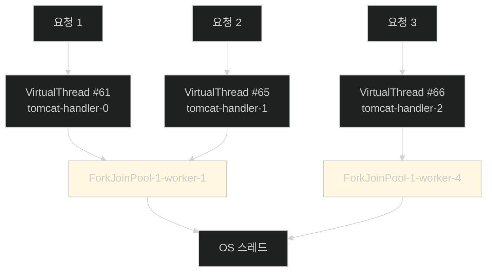

# 프로퍼티 한 줄 — 그리고 정말 켜졌는지 확인하기

## 한눈에 보기

| 질문 | 핵심 답 |
|---|---|
| 의존성 | Spring Web · Spring Data JPA · H2 · Thymeleaf — **가상 스레드 관련은 없다** |
| 켜는 법 | `spring.threads.virtual.enabled=true` **한 줄** |
| 무엇이 켜지나 | Spring Boot가 **자동 설정하는 인프라** — 요청 처리, `@Async`, `@Scheduled` |
| 무엇이 안 켜지나 | 모든 JVM 스레드 · **애플리케이션이 직접 만든 실행자** |
| 켠 뒤 로그에 표시가 | **없다.** 직접 확인해야 한다 |
| 확인 방법 | `Filter`에서 `Thread.currentThread().isVirtual()` |
| 로그 읽는 법 | `/` 앞이 가상 스레드, **뒤가 캐리어 플랫폼 스레드** |
| 엔티티를 record로? | **안 된다.** JPA 엔티티는 가변이어야 한다 |

## 1. 왜 이게 필요한가

### 출발 장면: 무엇을 설치해야 하나

[[01-understanding-virtual-threads]]에서 가상 스레드가 무엇인지는 알았다. 그럼 Spring Boot 애플리케이션에서 쓰려면 무엇을 더해야 할까.

Initializr에서 고르는 의존성이 넷이다.

| 의존성 | 역할 |
|---|---|
| Spring Web | MVC 컨트롤러와 HTTP 요청 처리 |
| Spring Data JPA | 데이터베이스 접근 |
| H2 Database | 인메모리 데이터베이스 |
| **[[Thymeleaf]]**(= 서버 사이드 HTML을 렌더링하는 템플릿 엔진) | 화면 |

책이 강조한다 — **"가상 스레드와 관련된 것은 아직 아무것도 없다. 이전 장들에서 써 온 의존성뿐이다."**

이것이 이 절의 첫 번째 교훈이다. **가상 스레드는 라이브러리가 아니라 자바 런타임의 기능**이므로 의존성을 더할 것이 없다. Java 21 이상에서 돌면 이미 거기 있다.

## 2. 어떻게 동작하는가

### 2.1 예제 애플리케이션

Chapter 9·10의 employee 애플리케이션을 재사용하되 **리액티브 대신 명령형**으로 돌아간다. 아래에서 위로 훑어보자.

```java
@Entity
public class Employee {
     @Id
     @GeneratedValue(strategy = GenerationType.IDENTITY)
     private Long id;

     private String name;
     private String role;

     protected Employee() {
     }

     public Employee(String name, String role) {
           this.name = name;
           this.role = role;
     }
     // getters and setters
}
```

책이 여기서 짚는 설계 판단이 흥미롭다. **왜 record가 아니라 클래스인가.**

| | **[[record]]**(= 자동 생성 접근자를 갖는 불변 데이터 타입) | 클래스 |
|---|---|---|
| 가변성 | **불변** | 가변 |
| 잘 맞는 곳 | DTO, 값 객체 | **JPA 엔티티** |

이유는 **[[영속성-컨텍스트]]**(= JPA가 엔티티의 신원과 변경 사항을 추적하는 작업 단위)에 있다. **[[JPA-엔티티]]**(= 영속성 컨텍스트가 생명주기를 관리하는 가변 객체)는 로딩된 뒤에도 상태가 바뀌고, JPA는 그 변화를 추적해 UPDATE를 만든다. 불변이면 이 추적이 성립하지 않는다.

[[../../part-2-creating-an-application-with-spring-boot/chapter-3-querying-for-data-with-spring-boot/02a-entities-in-jpa|Chapter 3]]에서 같은 이유로 `protected` 무인자 생성자를 남겨 뒀던 것과 이어진다.

리포지토리와 초기 데이터는 익숙한 형태다.

```java
public interface EmployeeRepository
       extends JpaRepository<Employee, Long> {}
```

```java
@Configuration
public class Startup {
       @Bean
       CommandLineRunner initDatabase(EmployeeRepository repository) {
           return args -> {
                if (repository.count() == 0) {
                    repository.saveAll(List.of(
                                   new Employee("Frodo Baggins", "ring bearer"),
                                   new Employee("Samwise Gamgee", "gardener"),
                                   new Employee("Bilbo Baggins", "burglar")
                    ));
               }
           };
       }
}
```

**[[CommandLineRunner]]**(= 애플리케이션이 뜬 뒤 한 번 실행되는 콜백)로 샘플 데이터를 넣는다. `if (repository.count() == 0)` 가드가 있어 재시작해도 중복되지 않는다.

### 2.2 켜기 전 상태

이대로 실행하면 화면이 뜨고 직원을 추가할 수 있다. 그런데 **로그 어디에도 가상 스레드 관련 항목이 없다.**

당연하다. 아직 켜지 않았다.

### 2.3 한 줄

```properties
spring.threads.virtual.enabled=true
```

이것이 전부다. 그런데 이 프로퍼티가 **정확히 무엇을 켜는지**가 중요하다. 책의 설명을 나눠 보자.

**[[spring.threads.virtual.enabled]]**(= Spring Boot가 자동 설정하는 인프라에 가상 스레드를 쓰게 하는 프로퍼티)가 적용되는 범위다.

| 켜지는 것 | 조건 |
|---|---|
| 컨트롤러의 HTTP 요청 처리 | 지원되는 내장 웹 서버 |
| **[[Async]]**(= 메서드 호출을 별도 스레드로 넘기는 애노테이션) 메서드 | Spring Boot의 **기본 실행자**를 쓸 때 |
| **[[Scheduled]]**(= 주기적으로 메서드를 실행시키는 애노테이션) 작업 | Spring Boot의 **기본 스케줄러**를 쓸 때 |

| 켜지지 **않는** 것 |
|---|
| **모든 JVM 스레드**를 가상으로 바꾸지 않는다 |
| **애플리케이션이 직접 만든 실행자**에는 영향이 없다 |

두 번째 줄이 실무에서 자주 놓치는 지점이다. `Executors.newFixedThreadPool(10)`을 직접 만들어 쓰고 있다면 이 프로퍼티와 무관하게 플랫폼 스레드로 돈다. [[06-error-handling-in-concurrent-tasks]]의 `CompletableFuture.runAsync()`도 같은 함정에 걸린다.

### 2.4 켜도 티가 안 난다

책이 다시 짚는다 — **"실행해도 로그에 가상 스레드가 쓰이고 있다는 표시가 나타나지 않는다."**

이것이 가상 스레드의 성질 자체를 보여 준다. **동작이 달라지지 않는다.** 코드도, 응답도, 로그도 같다. 달라지는 것은 자원 사용뿐이다.

그래서 확인 수단을 직접 만든다.

```java
@Component
public class ThreadLoggingFilter implements Filter {

    private static final Logger log =
           LoggerFactory.getLogger(ThreadLoggingFilter.class);

    @Override
    public void doFilter(ServletRequest request,
           ServletResponse response, FilterChain chain)
              throws IOException, ServletException {

           Thread thread = Thread.currentThread();
           log.info("Thread: {}, isVirtual: {}", thread, thread.isVirtual());

           chain.doFilter(request, response);
    }
}
```

| 요소 | 하는 일 |
|---|---|
| `@Component` | 빈으로 등록되면 **모든 요청에 자동 적용**된다 |
| **[[서블릿-필터]]**(= 요청이 컨트롤러에 닿기 전에 가로채는 표준 훅) | 컨트롤러보다 먼저 실행돼 요청 스레드를 본다 |
| `Thread.currentThread()` | 현재 요청을 처리 중인 스레드 |
| **[[isVirtual]]**(= 현재 스레드가 가상인지 알려 주는 Java 21 메서드) | 가장 직접적인 증거 |
| `chain.doFilter(...)` | 다음 단계로 넘긴다 — **빼먹으면 요청이 멈춘다** |

필터를 고른 것이 좋은 선택이다. 컨트롤러마다 로그를 넣지 않아도 **모든 요청**을 한 지점에서 본다. [[../../part-2-creating-an-application-with-spring-boot/chapter-4-securing-an-application-with-spring-boot/01-spring-security-filter-chain-foundations|Chapter 4]]에서 Spring Security가 같은 자리를 쓴 것과 같은 이유다.

### 2.5 로그 읽기

```text
2026-03-21T08:49:26.815-03:00  INFO 8358 --- [omcat-handler-0]
c.s.ThreadLoggingFilter : Thread: VirtualThread[#61,tomcat-handler-0]/runnable@ForkJoinPool-1-worker-1, isVirtual: true
2026-03-21T08:49:27.106-03:00  INFO 8358 --- [omcat-handler-1]
c.s.ThreadLoggingFilter : Thread: VirtualThread[#65,tomcat-handler-1]/runnable@ForkJoinPool-1-worker-1, isVirtual: true
2026-03-21T08:50:18.546-03:00  INFO 8358 --- [omcat-handler-2]
c.s.ThreadLoggingFilter : Thread: VirtualThread[#66,tomcat-handler-2]/runnable@ForkJoinPool-1-worker-4, isVirtual: true
```

이 한 줄에 [[01-understanding-virtual-threads]]의 구조가 통째로 들어 있다.

| 조각 | 뜻 |
|---|---|
| `VirtualThread[#61,…]` | **[[가상-스레드]]**임을 표시하고 내부 식별자를 보여 준다 |
| `tomcat-handler-0` | 웹 서버 안의 요청 처리 컨텍스트. **요청마다 하나** |
| `/` | **경계선** |
| `ForkJoinPool-1-worker-1` | **[[캐리어-스레드]]** — 지금 이 가상 스레드를 얹고 도는 플랫폼 스레드 |
| `isVirtual: true` | 확인 |

책의 정리가 정확하다 — **"`/` 앞부분이 가상 스레드이고, 뒤의 `ForkJoinPool-1-worker-N` 부분이 지금 [[마운트]]돼 있는 캐리어 플랫폼 스레드다. 이는 JDK 스케줄러가 가상 스레드를 플랫폼 스레드 위에 마운트한다는 JEP 444의 설명과 일치한다."**

로그 세 줄에서 읽을 수 있는 사실이 하나 더 있다.

```text
#61 → worker-1
#65 → worker-1     ← 같은 캐리어!
#66 → worker-4
```

**서로 다른 가상 스레드가 같은 캐리어를 쓴다.** 이것이 "제한된 수의 JVM 관리 플랫폼 스레드를 공유하면서 각 요청을 독립적으로 처리한다"는 책의 결론이 눈에 보이는 형태다.

**[[ForkJoinPool]]**(= 작업 훔치기 방식의 자바 스레드 풀)이 캐리어 풀로 쓰인다는 것도 여기서 드러난다.

## 3. 그림으로 보기



| 확인 항목 | 무엇을 증명하나 | 어긋나면 |
|---|---|---|
| `isVirtual: true` | 프로퍼티가 먹었다 | 프로퍼티 오타 또는 Java 21 미만 |
| `VirtualThread[#…]` | 스레드 종류 | — |
| `tomcat-handler-N`이 요청마다 다르다 | 요청이 독립 처리된다 | — |
| **여러 번호가 같은 worker를 쓴다** | **캐리어를 공유한다** | — |

## 4. 이 노트에 나온 용어

| 용어 | 한 줄 뜻 | 정의 위치 |
|---|---|---|
| spring.threads.virtual.enabled | 자동 설정 인프라에 가상 스레드를 쓰게 하는 프로퍼티 | [[_glossary#spring.threads.virtual.enabled]] |
| 서블릿 필터 | 컨트롤러 앞에서 요청을 가로채는 훅 | [[_glossary#서블릿-필터]] |
| isVirtual | 현재 스레드가 가상인지 알려 주는 메서드 | [[_glossary#isVirtual]] |
| 캐리어 스레드 | 가상 스레드를 실행해 주는 플랫폼 스레드 | [[_glossary#캐리어-스레드]] |
| 마운트 | 가상 스레드가 캐리어에 얹히는 것 | [[_glossary#마운트]] |
| ForkJoinPool | 작업 훔치기 방식의 스레드 풀 | [[_glossary#ForkJoinPool]] |
| 가상 스레드 | JVM이 관리하는 경량 스레드 | [[_glossary#가상-스레드]] |
| JPA 엔티티 | 영속성 컨텍스트가 관리하는 가변 객체 | [[_glossary#JPA-엔티티]] |
| 영속성 컨텍스트 | 엔티티의 신원과 변경을 추적하는 작업 단위 | [[_glossary#영속성-컨텍스트]] |
| record | 자동 생성 접근자를 갖는 불변 데이터 타입 | [[_glossary#record]] |
| CommandLineRunner | 기동 직후 한 번 실행되는 콜백 | [[_glossary#CommandLineRunner]] |
| Thymeleaf | 서버 사이드 HTML 템플릿 엔진 | [[_glossary#Thymeleaf]] |
| @Async | 메서드를 별도 스레드로 넘기는 애노테이션 | [[_glossary#Async]] |
| @Scheduled | 주기적으로 메서드를 실행하는 애노테이션 | [[_glossary#Scheduled]] |

## 5. 자주 헷갈리는 것

**"가상 스레드를 쓰려면 의존성을 추가해야 한다"** — 자바 런타임의 기능이라 추가할 것이 없다.

**"프로퍼티를 켜면 모든 스레드가 가상이 된다"** — **Spring Boot가 자동 설정하는 것**만이다. 직접 만든 실행자는 그대로다.

**"켜졌으면 로그에 표시가 난다"** — 나지 않는다. 직접 확인 수단을 만들어야 한다.

**"`ForkJoinPool-1-worker-1`이 가상 스레드다"** — 그것은 **캐리어**다. 가상 스레드는 `/` 앞부분이다.

**"엔티티도 record로 만드는 게 현대적이다"** — JPA 엔티티는 가변이어야 한다. record는 DTO에 쓴다.

## 6. 언제 안 쓰나 / 경계

- **Java 21 미만에서는 켜지지 않는다.** 프로퍼티가 무시되거나 기동이 실패한다.
- **직접 만든 실행자는 별도로 손봐야 한다.** `Executors.newVirtualThreadPerTaskExecutor()` 같은 것을 명시적으로 써야 한다.
- **확인 필터는 개발용이다.** 요청마다 로그를 남기므로 운영에서는 부담이다.
- **비유의 한계.** 이 프로퍼티는 "건물 전체의 조명을 LED로 교체하는 것"에 가깝다. 스위치 하나로 바뀌고 밝기는 그대로인데 전기 요금만 준다. 다만 이 비유는 **교체 범위**를 흐린다. 실제로 바뀌는 것은 관리사무소가 설치한 조명뿐이고, 입주자가 개인적으로 가져다 놓은 스탠드는 그대로다. 그 스탠드가 이 장 뒤의 `CompletableFuture.runAsync()`다.

## 7. 연결

- [[01-understanding-virtual-threads]] — 거기서 개념으로 설명한 캐리어와 마운트가 이 노트의 로그에서 눈으로 확인된다.
- [[03-integrating-virtual-threads-with-taskexecutor]] — 요청 처리 말고 **배경 작업**에도 같은 이점을 주는 방법으로 이어진다.
- [[04-using-virtual-threads-with-restclient]] — 요청 처리에 이어 **나가는 HTTP 호출**에 적용한다.

## 8. 스스로 확인

1. 가상 스레드를 쓰는 데 의존성이 필요 없는 이유는?
2. JPA 엔티티를 record로 만들지 않는 이유를 영속성 컨텍스트로 설명할 수 있는가?
3. `spring.threads.virtual.enabled`가 켜는 것과 켜지 않는 것을 구분할 수 있는가?
4. 켜도 로그에 표시가 없다는 사실이 가상 스레드의 어떤 성질을 보여 주는가?
5. 확인 수단으로 필터를 고른 것이 좋은 이유는?
6. 로그 한 줄에서 가상 스레드와 캐리어를 구분해 짚을 수 있는가?
7. 세 로그 줄에서 "캐리어를 공유한다"는 사실을 어떻게 읽어 내는가?
8. LED 교체 비유가 깨지는 지점은 어디인가?


> 여덟 문항을 스스로 답한 **뒤에** [[_02-using-virtual-threads-in-a-spring-boot-application]]에서 모범답안과 대조한다. 먼저 열면 이 문항들은 다시 인출 문제로 쓸 수 없다.

<!-- ==== 아래는 내 영역 · 스킬 수정 금지 ==== -->

## 내 설명 시도


## 막혔던 지점


## 리뷰 이력
