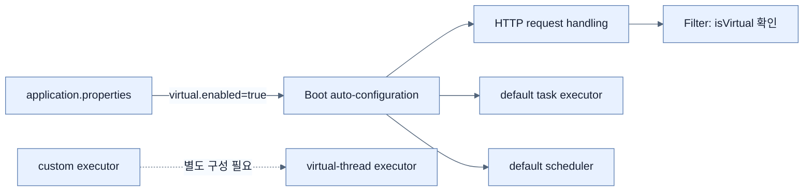

# Spring Boot 애플리케이션에서 Virtual Thread 사용하기

## 한눈에 보기

`spring.threads.virtual.enabled=true` 한 줄은 지원되는 embedded web server의 request 처리와 Boot가 auto-configure한 task executor·scheduler가 virtual thread를 사용하도록 한다. 애플리케이션의 모든 JVM thread나 직접 만든 executor까지 바꾸는 전역 switch는 아니다.

## 1. 왜 이게 필요한가

책은 Spring Web, Spring Data JPA, H2, Thymeleaf로 만든 imperative employee 애플리케이션을 사용한다. Entity와 `JpaRepository`, MVC controller의 programming model을 그대로 둔 채 concurrency infrastructure만 교체해 virtual thread의 장점을 확인하려는 예다.

## 2. 어떻게 동작하는가

```properties
spring.threads.virtual.enabled=true
```

설정 후 Servlet `Filter`에서 현재 thread를 관찰한다.

```java
Thread thread = Thread.currentThread();
log.info("Thread: {}, isVirtual: {}", thread, thread.isVirtual());
```

로그의 `VirtualThread[#...]`는 요청을 담당하는 논리 thread, `/runnable@ForkJoinPool-...worker-N`은 그 순간 이를 실행하는 carrier다. `isVirtual: true`가 직접적인 확인값이다. 요청마다 독립된 virtual thread를 줄 수 있지만 실제 계산은 제한된 platform thread가 나눠 수행한다.

이 설정은 Boot의 기본 infrastructure 범위에 적용된다. 애플리케이션이 `Executors.newFixedThreadPool(...)` 등으로 만든 custom executor에는 별도 구성이 필요하다.

## 3. 그림으로 보기



## 4. 이 노트에 나온 용어

- **spring.threads.virtual.enabled**: Boot가 지원하는 기본 concurrency infrastructure에 virtual thread를 켜는 property.
- **request thread**: 한 HTTP 요청의 controller와 filter chain을 실행하는 thread.
- **Thread.isVirtual**: 현재 Java thread가 virtual thread인지 반환하는 검사 메서드.

## 7. 연결

- [[01-understanding-virtual-threads]] — 설정이 바꾸는 JVM 실행 모델의 기초다.
- [[03-integrating-virtual-threads-with-taskexecutor]] — request 밖의 background task에도 같은 모델을 적용한다.
- [[chapter-6-externalizing-configuration-with-spring-boot/01-creating-custom-properties|외부 설정]] — property가 auto-configuration을 바꾸는 방식과 연결된다.

## 8. 스스로 확인

- 전체 1차 정리 후: property를 켠 뒤 무엇이 바뀌고 무엇은 바뀌지 않는지 경계를 말한다.

<!-- ==== 아래는 내 영역 · 스킬 수정 금지 ==== -->

## 내 설명 시도


## 막혔던 지점


## 리뷰 이력


