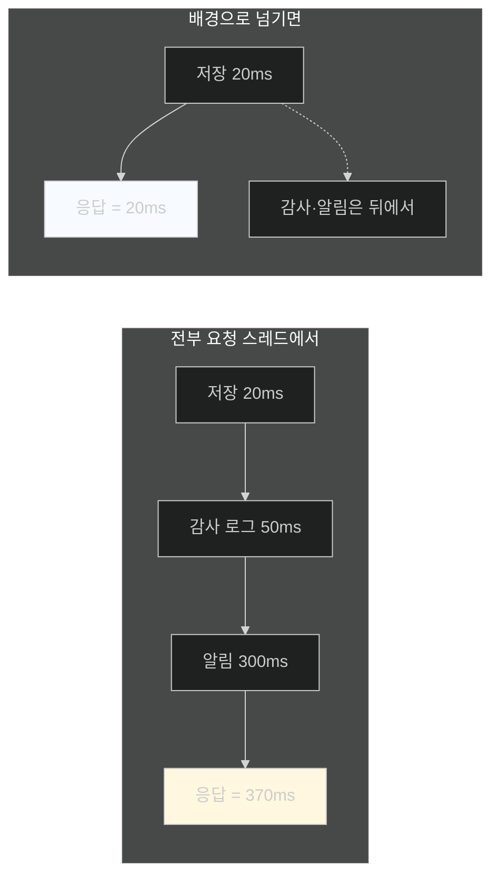
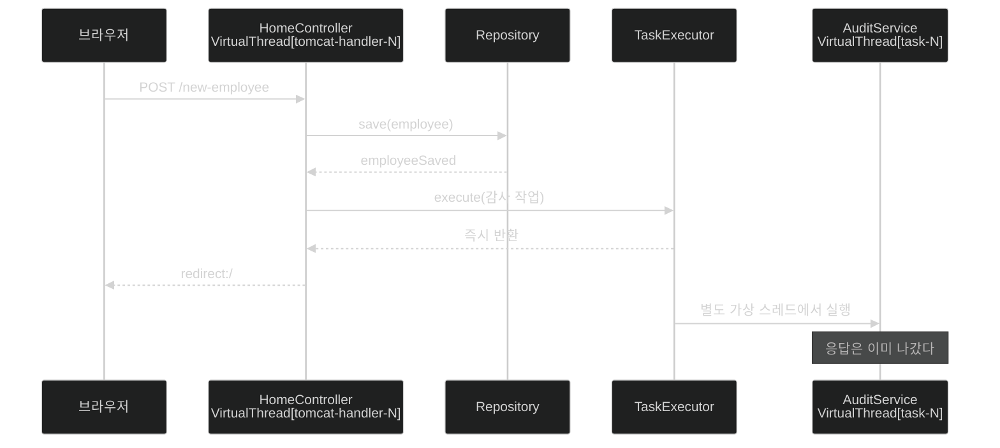

# 응답을 붙잡지 않는 일 — TaskExecutor에 넘기기

## 한눈에 보기

| 질문 | 핵심 답 |
|---|---|
| 문제 | 감사 로그·알림·외부 프로세스가 **HTTP 응답을 지연시킨다** |
| 도구 | `TaskExecutor` — 작업을 별도 스레드로 넘기는 Spring 추상 |
| 가상 스레드와 만나면 | **제출된 작업마다 자기 가상 스레드**에서 돈다 |
| 코드 | `taskExecutor.execute(() -> { … })` |
| 로그의 단서 | `task-1` — 요청 스레드가 아니다 |
| 결과 | 응답이 **기다리지 않고 즉시** 반환된다 |
| 결과가 필요하면 | `AsyncTaskExecutor` (Future · CompletableFuture) |
| 남는 문제 | 그 스레드에서 난 **예외는 어디로 가나** |

## 1. 왜 이게 필요한가

### 출발 장면: 사용자가 감사 로그를 기다린다

[[02-using-virtual-threads-in-a-spring-boot-application]]까지 하면 요청 처리가 가상 스레드에서 돈다. 확장성은 좋아졌다. 그런데 **모든 연산이 여전히 요청 스레드 안에서** 일어난다.

책이 드는 흔한 요구가 있다. 새 직원을 만든 뒤에

- 감사 로그를 기록하고
- 알림을 보내고
- 외부 프로세스를 트리거한다

이 일들의 성질이 공통적이다. **중요하지만 사용자에게 즉시 응답하는 것의 일부가 아니다.**



책의 표현대로 **"동기적으로 실행하면 응답 시간이 불필요하게 늘어난다."**

가상 스레드를 켰어도 이 문제는 그대로다. 가상 스레드는 **스레드가 부족한 문제**를 풀지, **응답이 늦는 문제**를 풀지 않는다. 응답을 빨리 주려면 일을 **응답 경로 밖으로** 내보내야 한다.

## 2. 어떻게 동작하는가

### 2.1 TaskExecutor

**[[TaskExecutor]]**(= 작업을 별도 스레드에서 실행해 주는 Spring의 추상)가 그 자리를 맡는다. 인터페이스가 단순하다 — `execute(Runnable)` 하나로 호출자를 막지 않고 일을 넘긴다.

책이 짚는 결합이 이 절의 요점이다. **`TaskExecutor`가 가상 스레드와 결합하면 제출된 각 작업이 자기 가상 스레드에서 돈다.**

이 조합이 왜 좋은지 보자.

| | 플랫폼 스레드 풀 + TaskExecutor | 가상 스레드 + TaskExecutor |
|---|---|---|
| 동시 배경 작업 수 | **풀 크기가 상한** | 사실상 무제한 |
| 풀이 마르면 | 작업이 큐에서 대기 | — |
| 작업이 블로킹하면 | **풀 스레드 하나가 묶인다** | 캐리어가 풀려난다 |
| 튜닝 | 풀 크기를 맞춰야 한다 | **거의 필요 없다** |

[[02-using-virtual-threads-in-a-spring-boot-application]]에서 켠 프로퍼티가 여기까지 미친다. Spring Boot의 기본 실행자를 쓰므로 자동으로 가상 스레드가 된다.

### 2.2 감사 서비스

```java
@Service
public class AuditService {

       private final TaskExecutor taskExecutor;

       public AuditService(TaskExecutor taskExecutor) {
           this.taskExecutor = taskExecutor;
       }

       public void registerEmployeeCreation(Employee employee) {
           taskExecutor.execute(() -> {
                 System.out.println("Audit log for employee: " +
                     employee.getName() +
                    " | Thread: " + Thread.currentThread() +
                    " | isVirtual: " + Thread.currentThread().isVirtual());
           });
       }
}
```

| 요소 | 하는 일 |
|---|---|
| `TaskExecutor` 생성자 주입 | Spring이 주입한다. 어떤 구현인지는 **설정이 정한다** |
| 람다 `() -> { … }` | 배경에서 실행될 작업 |
| `taskExecutor.execute(…)` | **호출자를 막지 않고** 넘긴다 |
| **[[isVirtual]]** 출력 | 배경 작업도 가상 스레드인지 확인 |

주입받는 타입이 인터페이스라는 점이 중요하다. `AuditService`는 **자기 작업이 어느 스레드에서 돌지 모른다.** 그것은 [[02-using-virtual-threads-in-a-spring-boot-application]]의 프로퍼티가 정한다. 코드를 바꾸지 않고 실행 모델만 갈아 끼울 수 있는 구조다.

### 2.3 컨트롤러에서 부르기

```java
@PostMapping("/new-employee")
String newEmployee(@ModelAttribute Employee newEmployee) {
       Employee employeeToSave = new Employee(newEmployee.getName(),
           newEmployee.getRole());
       Employee employeeSaved = repository.save(employeeToSave);
       auditService.registerEmployeeCreation(employeeSaved);
       return "redirect:/";
}
```

`registerEmployeeCreation`이 **즉시 반환**되므로 `return "redirect:/"`가 곧바로 실행된다. 감사 작업은 뒤에서 계속된다.

호출 순서도 의미가 있다. **저장이 먼저이고 감사가 나중**이다. 저장된 엔티티(`employeeSaved`)를 감사에 넘기므로, DB가 채워 준 `id`가 로그에 들어간다.

### 2.4 로그가 증명한다

```text
Audit log for employee: Gandalf | Thread: VirtualThread[#67,task-1]/runnable@ForkJoinPool-1-worker-2 | isVirtual: true
```

[[02-using-virtual-threads-in-a-spring-boot-application]]의 로그와 나란히 놓으면 차이가 하나다.

| | 요청 처리 | 배경 작업 |
|---|---|---|
| 이름 | `tomcat-handler-0` | **`task-1`** |
| 종류 | `VirtualThread[#61,…]` | `VirtualThread[#67,…]` |
| **[[캐리어-스레드]]** | `ForkJoinPool-1-worker-1` | `ForkJoinPool-1-worker-2` |
| `isVirtual` | true | **true** |

책이 짚는 세 관찰이 그것이다.

1. **`task-1`** — `TaskExecutor`에 제출된 작업임을 보여 준다. **요청 스레드가 아니다.**
2. **`VirtualThread[#…]`** — 배경 작업도 가상 스레드로 실행된다.
3. **`isVirtual: true`** — 비동기 처리에도 가상 스레드가 쓰인다는 확인.

책의 결론이 명확하다 — **"HTTP 요청뿐 아니라 배경 작업도 가상 스레드의 이점을 누릴 수 있어, 프로그래밍 모델을 단순하게 유지하면서 효율적으로 일을 덜어낼 수 있다."**

### 2.5 결과가 필요하면

책이 Note로 선택지를 하나 더 준다.

| | **[[TaskExecutor]]** | **[[AsyncTaskExecutor]]**(= `Future`나 `CompletableFuture`로 결과를 돌려받을 수 있게 확장한 인터페이스) |
|---|---|---|
| 반환값 | 없음 | `Future` / `CompletableFuture` |
| 완료 추적 | 불가 | **가능** |
| 결과 회수 | 불가 | 가능 |
| 예외 처리 | 작업 안에서만 | **명시적으로 다룰 수 있다** |
| 쓰는 곳 | **[[fire-and-forget]]**(= 던져 놓고 결과를 확인하지 않는 방식) | 조율이 필요한 작업 |

책의 권고가 실용적이다 — **감사나 로깅 같은 단순 배경 작업에는 `TaskExecutor`가 더 단순하고 적절하고**, 완료를 추적하거나 결과를 회수하거나 예외를 명시적으로 다뤄야 할 때 `AsyncTaskExecutor`를 쓴다.

여기에 이 절이 남기는 질문이 있다. **fire-and-forget이면 그 작업에서 난 예외는 어디로 가나?** 컨트롤러는 이미 응답을 보냈고 아무도 결과를 보지 않는다. 그 답이 [[06-error-handling-in-concurrent-tasks]]이며, 거기서 **[[CompletableFuture]]**(= 비동기 결과를 나타내며 연결·예외 처리를 체인으로 표현하는 타입)도 함께 나온다.

## 3. 그림으로 보기



| 축 | 요청 스레드 | 배경 작업 스레드 |
|---|---|---|
| 이름 | `tomcat-handler-N` | `task-N` |
| 수명 | 요청 하나 | 작업 하나 |
| 응답을 붙잡나 | 그렇다 | **아니다** |
| 예외가 사용자에게 | 전달된다 | **전달되지 않는다** |
| 가상 스레드인가 | 예 | **예** |

## 4. 이 노트에 나온 용어

| 용어 | 한 줄 뜻 | 정의 위치 |
|---|---|---|
| TaskExecutor | 작업을 별도 스레드에서 실행하는 Spring 추상 | [[_glossary#TaskExecutor]] |
| AsyncTaskExecutor | 결과를 돌려받을 수 있게 확장한 실행자 | [[_glossary#AsyncTaskExecutor]] |
| fire-and-forget | 던져 놓고 결과를 확인하지 않는 방식 | [[_glossary#fire-and-forget]] |
| 가상 스레드 | JVM이 관리하는 경량 스레드 | [[_glossary#가상-스레드]] |
| isVirtual | 현재 스레드가 가상인지 알려 주는 메서드 | [[_glossary#isVirtual]] |
| 캐리어 스레드 | 가상 스레드를 실행해 주는 플랫폼 스레드 | [[_glossary#캐리어-스레드]] |
| CompletableFuture | 비동기 결과를 나타내는 자바 타입 | [[_glossary#CompletableFuture]] |

## 5. 자주 헷갈리는 것

**"가상 스레드를 켜면 응답이 빨라진다"** — 아니다. 가상 스레드는 **동시 처리 수**를 늘리지 개별 응답 시간을 줄이지 않는다. 응답을 빨리 주려면 일을 응답 경로 밖으로 내보내야 한다.

**"`TaskExecutor`가 곧 스레드 풀이다"** — 인터페이스다. 어떤 구현이 주입될지는 설정이 정하고, 가상 스레드가 켜져 있으면 작업마다 가상 스레드다.

**"`execute`가 반환되면 작업이 끝난 것이다"** — 시작만 됐다. 끝났는지 알려면 `AsyncTaskExecutor`가 필요하다.

**"배경 작업의 예외도 500 응답이 된다"** — 되지 않는다. 응답은 이미 나갔다. 이것이 다음 노트의 주제다.

## 6. 언제 안 쓰나 / 경계

- **결과가 필요한 작업에는 맞지 않는다.** `AsyncTaskExecutor`나 `CompletableFuture`를 쓴다.
- **순서가 보장되지 않는다.** 여러 작업을 제출하면 실행 순서가 정해지지 않는다.
- **애플리케이션이 죽으면 대기 중인 작업이 사라진다.** 반드시 처리돼야 하는 일이라면 메시지 큐가 맞다. [[../chapter-12-messaging-and-asynchronous-communication-in-spring-boot-4/01-asynchronous-and-event-driven-communication|Chapter 12]]가 그 이야기다.
- **비유의 한계.** `TaskExecutor`는 "카운터 직원이 서류를 뒷방으로 넘기는 것"에 가깝다. 손님은 기다리지 않고 나간다. 다만 이 비유는 **뒷방에서 서류가 찢어졌을 때** 어떻게 되는지를 담지 못한다. 손님은 이미 떠났고 카운터는 그 사실을 모른다. 그것이 [[06-error-handling-in-concurrent-tasks]]가 다루는 문제이며, 비유상으로는 "뒷방에 자체 기록 절차가 있어야 한다"에 해당한다.

## 7. 연결

- [[02-using-virtual-threads-in-a-spring-boot-application]] — 거기서 켠 프로퍼티가 이 노트의 배경 작업까지 가상 스레드로 만든다.
- [[04-using-virtual-threads-with-restclient]] — 배경 작업 다음으로, **나가는 HTTP 호출**에도 같은 이점이 적용된다.
- [[06-error-handling-in-concurrent-tasks]] — fire-and-forget이 남긴 "예외는 어디로 가나"에 답한다.

## 8. 스스로 확인

1. 가상 스레드를 켰는데도 응답이 느릴 수 있는 이유는?
2. `TaskExecutor`와 가상 스레드가 결합할 때 없어지는 튜닝 항목은?
3. `AuditService`가 자기 작업이 어느 스레드에서 돌지 모른다는 것이 왜 좋은 설계인가?
4. 저장을 먼저 하고 감사를 나중에 부르는 순서에 의미가 있는가?
5. 로그의 `task-1`과 `tomcat-handler-0`이 무엇을 구분해 주는가?
6. `TaskExecutor`와 `AsyncTaskExecutor`를 고르는 기준은?
7. fire-and-forget이 남기는 질문은 무엇인가?
8. 카운터와 뒷방 비유가 깨지는 지점은 어디인가?


> 여덟 문항을 스스로 답한 **뒤에** [[_03-integrating-virtual-threads-with-taskexecutor]]에서 모범답안과 대조한다. 먼저 열면 이 문항들은 다시 인출 문제로 쓸 수 없다.

<!-- ==== 아래는 내 영역 · 스킬 수정 금지 ==== -->

## 내 설명 시도


## 막혔던 지점


## 리뷰 이력
