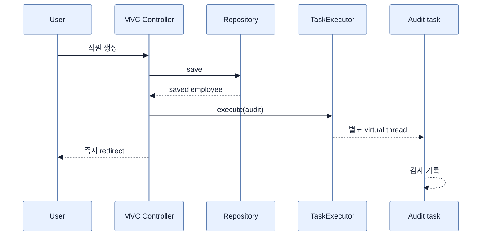

# TaskExecutor와 Virtual Thread 통합하기

## 한눈에 보기

HTTP 응답에 필요하지 않은 감사 로그·알림 작업은 `TaskExecutor.execute(...)`로 request thread에서 떼어낼 수 있다. Virtual thread가 활성화된 Boot 기본 executor라면 제출된 작업마다 경량 virtual thread에서 실행된다.

## 1. 왜 이게 필요한가

직원 저장 직후 감사 로그나 외부 프로세스를 동기 실행하면 사용자는 부가 작업이 끝날 때까지 기다린다. 핵심 transaction 결과만 응답에 필요하다면 background로 넘겨 latency를 줄일 수 있다. 다만 “응답을 기다리지 않는다”는 것은 작업 성공도 보장하지 않는다는 뜻이다.

## 2. 어떻게 동작하는가

```java
@Service
class AuditService {
    private final TaskExecutor taskExecutor;

    void registerEmployeeCreation(Employee employee) {
        taskExecutor.execute(() ->
            log.info("audit {}, virtual={}", employee.getName(),
                Thread.currentThread().isVirtual()));
    }
}
```

Controller는 저장 후 이 메서드를 호출하고 바로 redirect한다. `task-1`과 `isVirtual: true`가 찍히면 request thread와 분리된 virtual-thread task임을 확인할 수 있다.

단순 fire-and-forget에는 `TaskExecutor`가 알맞다. 완료 추적, 반환값, 명시적 exception handling이 필요하면 이를 확장한 `AsyncTaskExecutor`의 `Future`/`CompletableFuture` 계열을 고려한다. 비동기화하기 전에 transaction 경계, entity 지연 로딩, 재시도 필요성도 결정해야 한다.

## 3. 그림으로 보기



## 4. 이 노트에 나온 용어

- **TaskExecutor**: `Runnable` 작업을 호출 thread 밖에서 실행하도록 추상화한 Spring interface.
- **AsyncTaskExecutor**: 결과·완료 추적 기능을 더한 `TaskExecutor` 확장 interface.
- **fire-and-forget**: 작업을 제출한 호출자가 결과나 완료를 기다리지 않는 비동기 방식.

## 7. 연결

- [[02-using-virtual-threads-in-a-spring-boot-application]] — 기본 executor가 virtual thread를 쓰게 하는 설정이다.
- [[06-error-handling-in-concurrent-tasks]] — 분리된 thread의 예외는 request로 돌아오지 않는다.
- [[chapter-12-messaging-and-asynchronous-communication-in-spring-boot-4/01-asynchronous-and-event-driven-communication|메시징]] — process 내부 task보다 강한 내구성과 분리가 필요할 때의 선택지다.

## 8. 스스로 확인

- 전체 1차 정리 후: `TaskExecutor`를 쓰면 응답 시간과 실패 가시성이 각각 어떻게 달라지는지 설명한다.

<!-- ==== 아래는 내 영역 · 스킬 수정 금지 ==== -->

## 내 설명 시도


## 막혔던 지점


## 리뷰 이력


