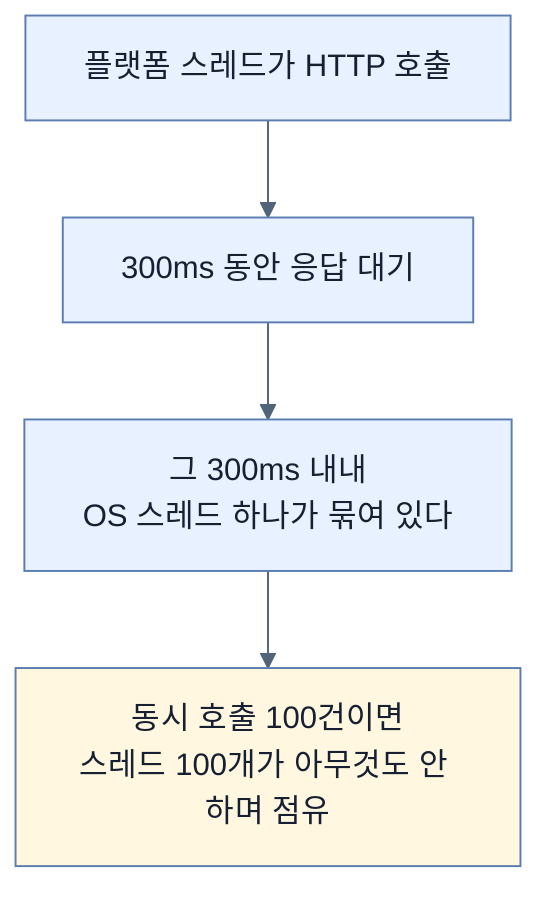
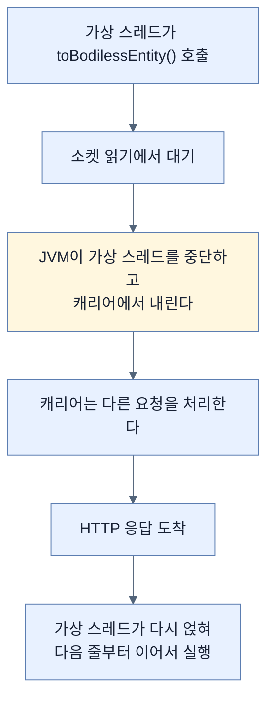
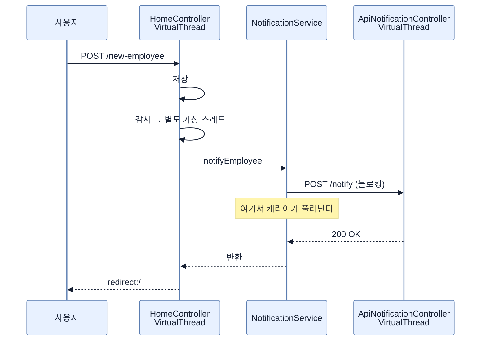

# 블로킹 스타일, 논블로킹 자원 — RestClient와 가상 스레드

## 한눈에 보기

| 질문 | 핵심 답 |
|---|---|
| 왜 HTTP인가 | 외부 시스템 호출은 **전형적인 I/O 바운드** 연산 |
| 클라이언트 | `RestClient` — 현대적 **동기** 클라이언트 |
| 왜 잘 맞나 | 블로킹 모델이라 **가상 스레드와 자연스럽게 통합**된다 |
| WebClient는? | `.block()`으로 쓸 수 있지만 리액티브 스타일을 우회한다. **명령형에는 RestClient** |
| 의존성 | `spring-boot-starter-restclient` + `-test` |
| 핵심 문장 | **"호출은 스타일에서는 블로킹이지만 자원 사용에서는 아니다"** |
| 로그가 보여 주는 것 | **클라이언트 쪽과 서버 쪽이 둘 다** 가상 스레드 |

## 1. 왜 이게 필요한가

### 출발 장면: 외부 시스템에 알려야 한다

[[03-integrating-virtual-threads-with-taskexecutor]]까지 하면 요청 처리와 배경 작업이 가상 스레드에서 돈다. 남은 흔한 시나리오가 하나 있다 — **외부 서비스로의 HTTP 호출.**

알림 시스템, 감사 API, 서드파티 연동이 모두 여기 속한다. 이 앱에서는 새 직원을 만든 뒤 외부 시스템에 알려야 한다.

이 연산의 성질이 결정적이다. **[[I/O-바운드]]**(= CPU 계산이 아니라 기다림이 시간을 차지하는 작업)이다. 시간의 거의 전부가 **네트워크 응답을 기다리는 데** 쓰인다.

플랫폼 스레드에서 이런 호출을 하면 무슨 일이 벌어지는지 보자.



이것이 리액티브 프로그래밍이 등장한 주된 이유였다. 그리고 가상 스레드가 **훨씬 단순하게** 같은 문제를 푼다.

## 2. 어떻게 동작하는가

### 2.1 왜 RestClient인가

**[[RestClient]]**(= Spring Framework 6.1이 들여온 동기 HTTP 클라이언트)를 고르는 이유가 역설적으로 들린다 — **블로킹 모델이기 때문이다.**

책의 문장이 그렇다. **"블로킹 모델을 따르므로 가상 스레드와 자연스럽게 통합된다."**

왜 블로킹이 장점이 되는지는 [[01-understanding-virtual-threads]]의 구조에서 나온다. 가상 스레드는 **블로킹 지점을 만나야** 캐리어에서 내려온다. 코드가 "여기서 기다린다"고 말해야 JVM이 그 자리에서 스레드를 바꿔 끼울 수 있다.

책은 Note로 **[[WebClient]]**(= 논블로킹 리액티브 HTTP 클라이언트)와의 선택 기준도 준다.

| | RestClient | WebClient |
|---|---|---|
| 모델 | 동기·블로킹 | 논블로킹 리액티브 |
| 가상 스레드와 | **자연스럽다** | `.block()`을 붙여야 하는데 **리액티브 스타일을 우회한다** |
| 의도된 용도 | 명령형 애플리케이션 | **완전히 논블로킹인 리액티브 파이프라인** |

책의 결론이 명확하다 — **"명령형 애플리케이션에는 RestClient를 쓰고 WebClient는 리액티브 애플리케이션에만 쓰는 편이 일반적으로 낫다. 가상 스레드는 확장성을 위해 [[리액티브-모델]]이 필요할 일을 최소화한다."**

### 2.2 의존성

```xml
<dependency>
       <groupId>org.springframework.boot</groupId>
       <artifactId>spring-boot-starter-restclient</artifactId>
</dependency>

<dependency>
       <groupId>org.springframework.boot</groupId>
       <artifactId>spring-boot-starter-restclient-test</artifactId>
       <scope>test</scope>
</dependency>
```

| 아티팩트 | 하는 일 |
|---|---|
| `spring-boot-starter-restclient` | `RestClient` API |
| `spring-boot-starter-restclient-test` | HTTP 클라이언트 상호작용을 테스트에서 시뮬레이션·검증 |

Boot 4의 **[[집중형-스타터]]**(= 기능 하나에 필요한 것만 묶은 의존성 단위) 전략이 여기서도 보인다. 이름이 곧 범위이고, 런타임용과 테스트용이 짝을 이룬다.

### 2.3 외부 시스템을 흉내 내기

실제 외부 시스템 대신 같은 애플리케이션 안에 알림 API를 만든다.

```java
@RestController
public class ApiNotificationController {
       @PostMapping("/notify")
       ResponseEntity<Void> notifyEmployee(@RequestBody Employee employee) {
            System.out.println("Notification received for employee: " +
                 employee.getName() +
                    " | Thread: " + Thread.currentThread() +
                    " | isVirtual: " + Thread.currentThread().isVirtual());

         return ResponseEntity.ok().build();
    }
}
```

**받는 쪽에서도 스레드를 찍는다**는 점이 중요하다. 이 덕분에 뒤의 로그에서 **양쪽이 다 가상 스레드**임이 드러난다.

### 2.4 호출하는 쪽

```java
@Service
public class NotificationService {

    private final RestClient restClient;

    public NotificationService(RestClient.Builder builder) {
         this.restClient =
               builder.baseUrl("http://localhost:8080").build();
    }

    public void notifyEmployee(Employee employee) {
           restClient.post()
                   .uri("/notify")
                   .body(employee)
                   .retrieve()
                   .toBodilessEntity();

           System.out.println("Notification sent for: " +
               employee.getName() +
                  " | Thread: " + Thread.currentThread() +
                  " | isVirtual: " + Thread.currentThread().isVirtual());
    }
}
```

호출 체인이 읽기 쉽다 — `post()` → `uri()` → `body()` → `retrieve()` → `toBodilessEntity()`. 마지막 것이 **응답 본문을 버리고 상태만 확인**한다는 뜻이다.

여기서 책이 핵심을 말한다.

> **"이 서비스는 `/notify` 엔드포인트로 [[블로킹-호출]]을 수행한다. 전통적인 플랫폼 스레드였다면 응답을 기다리는 동안 스레드를 묶어 두었을 것이다. 그러나 가상 스레드가 켜져 있으면 이 블로킹 연산이 가벼워진다."**

무슨 일이 벌어지는지 단계로 보자.



**코드 어디에도 콜백이 없다.** `restClient.post()...`가 반환되면 그다음 줄이 실행된다. 그런데 그 사이에 **[[캐리어-스레드]]**(= 가상 스레드를 실행해 주는 플랫폼 스레드)는 다른 일을 했다.

### 2.5 흐름 전체

```java
@PostMapping("/new-employee")
String newEmployee(@ModelAttribute Employee newEmployee) {
     Employee employeeToSave = new Employee(newEmployee.getName(),
          newEmployee.getRole());
     Employee employeeSaved = repository.save(employeeToSave);

     auditService.registerEmployeeCreation(employeeSaved);
     notificationService.notifyEmployee(employeeSaved);
     return "redirect:/";
}
```

책이 세 단계로 정리한다.

| 단계 | 어디서 | 응답을 붙잡나 |
|---|---|---|
| 직원 저장 | 요청 스레드 | 예 (짧다) |
| 감사 | **`TaskExecutor`가 별도 가상 스레드로** | 아니다 |
| 알림 | **요청 스레드에서 블로킹 HTTP 호출** | **예** |

세 번째가 두 번째와 다르다는 점을 짚어 둘 만하다. 감사는 배경으로 넘겼는데 알림은 **요청 스레드에서 그대로 기다린다.** 그래서 알림이 300ms 걸리면 사용자도 300ms를 기다린다.

책의 문장이 그 점을 정확히 좁힌다 — **"알림 호출이 블로킹이더라도 가상 스레드에서 돌기 때문에 확장성을 제한하지 않는다."** 응답 시간이 아니라 **확장성**을 말한 것이다. [[03-integrating-virtual-threads-with-taskexecutor]]에서 본 구분이 여기서 다시 필요하다.

### 2.6 로그가 증명한다

```text
Notification received for employee: Gandalf | Thread: VirtualThread[#72,http-nio-8080-exec-1]/runnable@ForkJoinPool-1-worker-1 | isVirtual: true
Notification sent for: Gandalf | Thread: VirtualThread[#71,tomcat-handler-3]/runnable@ForkJoinPool-1-worker-2 | isVirtual: true
```

책이 짚는 세 가지가 이 두 줄에 있다.

| 관찰 | 근거 |
|---|---|
| **클라이언트와 서버 양쪽 다** 가상 스레드 | 두 줄 모두 `VirtualThread[…]`, `isVirtual: true` |
| **스타일은 블로킹, 자원 사용은 아니다** | 코드에 콜백이 없는데 캐리어는 두 개(`worker-1`, `worker-2`)뿐 |
| 요청과 I/O가 **독립적으로** 확장된다 | 서로 다른 가상 스레드 번호(`#71`, `#72`) |

두 번째 줄이 이 절의 제목이다. **"블로킹 스타일, 논블로킹 자원."**

> **원문 불일치.** 수신 측 로그의 스레드 이름이 `VirtualThread[#72,**http-nio-8080-exec-1**]`인데, 같은 애플리케이션의 다른 로그는 전부 `tomcat-handler-N` 형식이다([[02-using-virtual-threads-in-a-spring-boot-application]] 포함). `http-nio-8080-exec-N`은 **가상 스레드를 켜지 않은** Tomcat의 전통적 워커 이름이라, 한 실행에서 두 명명 규칙이 섞여 나오는 것이 설명되지 않는다.
>
> 또 이 예제는 `baseUrl("http://localhost:8080")`으로 **자기 자신을 호출한다.** 단순화 목적은 이해되지만, 이 구조가 왜 안전한지는 언급되지 않는다. 가상 스레드라 요청 스레드가 캐리어를 점유하지 않아 자기 호출 교착이 생기지 않는 것인데, **플랫폼 스레드였다면 부하 상황에서 스레드 고갈로 교착될 수 있는 형태**다. 역설적으로 이 예제 자체가 가상 스레드의 이점을 보여 주는 셈이다.

## 3. 그림으로 보기



| 축 | 플랫폼 스레드 | 가상 스레드 | 리액티브 |
|---|---|---|---|
| 코드 | 블로킹 | **블로킹** | 논블로킹 체인 |
| 대기 중 OS 스레드 | **묶인다** | 풀려난다 | 애초에 안 쓴다 |
| 동시 호출 상한 | 스레드 수 | 매우 높음 | 매우 높음 |
| 읽기 난이도 | 쉽다 | **쉽다** | 어렵다 |
| 이 장의 선택 | — | **RestClient** | WebClient |

## 4. 이 노트에 나온 용어

| 용어 | 한 줄 뜻 | 정의 위치 |
|---|---|---|
| RestClient | Spring의 현대적 동기 HTTP 클라이언트 | [[_glossary#RestClient]] |
| WebClient | 논블로킹 리액티브 HTTP 클라이언트 | [[_glossary#WebClient]] |
| 블로킹 호출 | 결과가 올 때까지 멈춰 서는 호출 | [[_glossary#블로킹-호출]] |
| I/O 바운드 | 기다림이 시간을 차지하는 작업 | [[_glossary#I/O-바운드]] |
| 가상 스레드 | JVM이 관리하는 경량 스레드 | [[_glossary#가상-스레드]] |
| 캐리어 스레드 | 가상 스레드를 실행해 주는 플랫폼 스레드 | [[_glossary#캐리어-스레드]] |
| 집중형 스타터 | 기능 하나에 필요한 것만 묶은 의존성 | [[_glossary#집중형-스타터]] |
| 리액티브 모델 | 논블로킹 연산 조합으로 동시성을 다루는 모델 | [[_glossary#리액티브-모델]] |
| isVirtual | 현재 스레드가 가상인지 알려 주는 메서드 | [[_glossary#isVirtual]] |

## 5. 자주 헷갈리는 것

**"블로킹 클라이언트는 나쁜 선택이다"** — 가상 스레드에서는 **오히려 맞는 선택**이다. 블로킹 지점이 있어야 JVM이 캐리어를 바꿔 끼울 수 있다.

**"WebClient가 항상 더 확장성이 좋다"** — 가상 스레드 위에서는 차이가 크게 줄고, 코드 복잡도는 WebClient가 훨씬 높다.

**"알림 호출도 배경으로 돌고 있다"** — 아니다. **요청 스레드에서 기다린다.** 감사와 달리 `TaskExecutor`에 넘기지 않았다.

**"블로킹하지 않으므로 응답이 빨라진다"** — 확장성이 좋아지지 응답 시간이 줄지는 않는다.

**"로그의 `ForkJoinPool-1-worker-N`이 다르면 다른 요청이다"** — 캐리어일 뿐이다. 요청을 구분하는 것은 `VirtualThread[#…]` 번호다.

## 6. 언제 안 쓰나 / 경계

- **리액티브 파이프라인 안에서는 WebClient가 맞다.** 스트림 조합과 배압이 필요하면 그렇다.
- **자기 자신을 호출하는 구조는 예제용이다.** 실제로는 별도 서비스여야 하고, 플랫폼 스레드 환경이라면 교착 위험이 있다.
- **타임아웃 설정이 없다.** 예제 코드에는 연결·읽기 타임아웃이 없어, 상대가 응답하지 않으면 가상 스레드가 무한히 매달린다. 가상 스레드가 싸다고 해도 누수는 누수다.
- **비유의 한계.** 가상 스레드 위의 블로킹 호출은 "전화를 걸어 두고 보류음을 들으며 다른 서류를 처리하는 것"에 비유된다. 다만 이 비유는 **누가 서류를 처리하는지**를 흐린다. 실제로 다른 일을 하는 것은 전화를 건 사람(가상 스레드)이 아니라 **책상(캐리어)** 이다. 전화를 건 사람은 그동안 통째로 자리를 비웠다가, 상대가 받으면 다시 그 책상에 앉는다.

## 7. 연결

- [[01-understanding-virtual-threads]] — "블로킹 시 캐리어가 풀려난다"는 원리가 이 노트에서 실제 HTTP 호출로 실증된다.
- [[03-integrating-virtual-threads-with-taskexecutor]] — 감사는 배경으로 넘기고 알림은 요청 스레드에서 기다리는 **차이**를 그 노트와 비교해야 이해된다.
- [[05-using-interface-proxy-http-service-clients]] — 여기서 손으로 조립한 `RestClient` 호출을 인터페이스 선언으로 바꾼다.

## 8. 스스로 확인

1. HTTP 호출이 가상 스레드의 이점이 가장 큰 영역인 이유는?
2. 블로킹 모델이 가상 스레드에서 **장점**이 되는 메커니즘을 설명할 수 있는가?
3. RestClient와 WebClient를 고르는 기준은?
4. 이 절의 세 단계 중 응답 시간을 붙잡는 것은 무엇이며 왜인가?
5. "확장성을 제한하지 않는다"와 "응답이 빨라진다"의 차이는?
6. 로그 두 줄에서 "양쪽 다 가상 스레드"를 어떻게 읽어 내는가?
7. 자기 자신을 호출하는 구조가 플랫폼 스레드였다면 왜 위험한가?
8. 보류음 비유가 깨지는 지점은 어디인가?

<!-- ==== 아래는 내 영역 · 스킬 수정 금지 ==== -->

## 내 설명 시도


## 막혔던 지점


## 리뷰 이력
