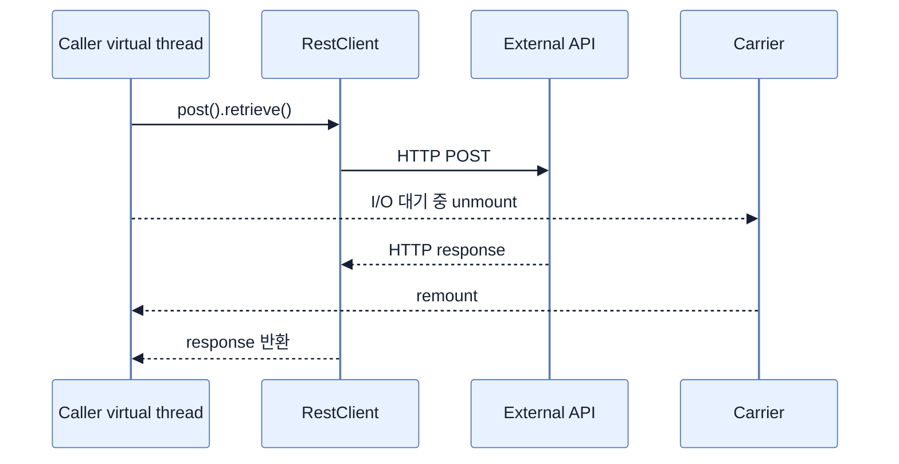

# RestClient를 Virtual Thread와 사용하기

## 한눈에 보기

`RestClient`는 동기·blocking HTTP client다. 호출 virtual thread가 원격 응답을 기다리는 동안 JVM이 carrier를 다른 작업에 쓸 수 있으므로, imperative 호출 형태와 높은 I/O concurrency를 함께 얻는다.

## 1. 왜 이게 필요한가

외부 알림·감사 API 호출은 흔한 I/O-bound 작업이다. Platform thread 환경에서는 각 대기 호출이 pool thread 하나를 차지한다. Reactive `WebClient`는 non-blocking이지만 전체 pipeline을 reactive 방식으로 구성해야 한다. 이미 MVC/JPA 중심인 애플리케이션에서는 virtual thread와 `RestClient`가 더 자연스러운 조합일 수 있다.

## 2. 어떻게 동작하는가

책은 `spring-boot-starter-restclient`와 test starter를 추가하고, auto-configured `RestClient.Builder`로 client를 만든다.

```java
this.restClient = builder.baseUrl("http://localhost:8080").build();

restClient.post()
    .uri("/notify")
    .body(employee)
    .retrieve()
    .toBodilessEntity();
```

코드 관점에서는 응답까지 현재 호출이 멈춘다. Runtime 관점에서는 지원되는 blocking I/O 동안 virtual thread가 suspend되어 carrier를 독점하지 않는다. 책의 로그는 client 요청을 보낸 controller와 `/notify`를 처리한 server 양쪽이 `isVirtual: true`임을 보여준다.

Virtual thread는 remote service의 capacity, connection pool, timeout을 무한하게 만들지 않는다. 호출 수 제한, connect/read timeout, 실패 처리와 관측성은 여전히 필요하다. `WebClient.block()`으로 억지로 동기화하기보다 imperative stack에는 `RestClient`, 순수 reactive pipeline에는 `WebClient`를 고르는 것이 명확하다.

## 3. 그림으로 보기



## 4. 이 노트에 나온 용어

- **RestClient**: Spring의 fluent API 기반 동기 HTTP client.
- **synchronous HTTP client**: 호출이 응답이나 실패를 얻을 때까지 다음 문장으로 진행하지 않는 client.
- **blocking I/O**: 외부 I/O 결과를 기다리는 동안 논리 실행 흐름이 중단되는 작업.

## 7. 연결

- [[01-understanding-virtual-threads]] — I/O 대기 중 carrier가 해제되는 원리다.
- [[05-using-interface-proxy-http-service-clients]] — 같은 `RestClient` 위의 선언적 client 방식이다.
- [[chapter-9-writing-reactive-web-controllers/02-creating-a-webflux-application|WebFlux]] — 완전한 non-blocking pipeline과 선택 기준을 비교한다.

## 8. 스스로 확인

- 전체 1차 정리 후: 동기 호출인데도 virtual thread에서 scalability가 좋아지는 이유를 두 관점으로 나눠 말한다.

<!-- ==== 아래는 내 영역 · 스킬 수정 금지 ==== -->

## 내 설명 시도


## 막혔던 지점


## 리뷰 이력


