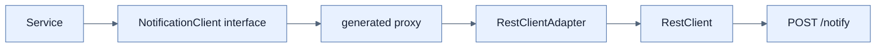

# Spring Boot 4 HTTP 인터페이스 프록시 사용하기

## 한눈에 보기

HTTP interface proxy는 remote API를 annotation이 붙은 Java interface로 선언하고 runtime implementation을 생성한다. 반복되는 URI 구성·method 호출 코드를 감추되 실제 전송은 `RestClient`가 담당한다.

## 1. 왜 이게 필요한가

`RestClient`를 직접 쓰면 유연하지만 서비스마다 method, URI, body, response 처리를 반복한다. Remote contract를 interface에 모으면 호출부가 업무 의도를 드러내고 교체·테스트도 쉬워진다.

## 2. 어떻게 동작하는가

먼저 remote endpoint를 선언한다.

```java
public interface NotificationClient {
    @PostExchange("/notify")
    void notifyEmployee(@RequestBody Employee employee);
}
```

책의 구성에서는 `RestClientAdapter`가 동기 client를 proxy factory에 연결한다.

```java
RestClient restClient = builder.baseUrl("http://localhost:8080").build();
HttpServiceProxyFactory factory = HttpServiceProxyFactory.builderFor(
    RestClientAdapter.create(restClient)).build();
return factory.createClient(NotificationClient.class);
```

생성된 bean을 service에 주입하면 `notificationClient.notifyEmployee(employee)`만 호출한다. `@PostExchange`가 HTTP method·path를, `@RequestBody`가 serialization 대상을 설명하며 proxy가 이를 실제 request로 바꾼다. Virtual-thread 이점은 underlying `RestClient` 실행에서 그대로 유지된다.

## 3. 그림으로 보기



## 4. 이 노트에 나온 용어

- **HTTP interface**: remote HTTP operation을 Java method와 exchange annotation으로 표현한 contract.
- **PostExchange**: 해당 method가 HTTP POST exchange임을 선언하는 annotation.
- **HttpServiceProxyFactory**: HTTP interface의 runtime proxy를 만드는 Spring factory.
- **RestClientAdapter**: `RestClient`를 HTTP service proxy의 exchange adapter로 연결하는 객체.

## 7. 연결

- [[04-using-virtual-threads-with-restclient]] — proxy 아래에서 실제 blocking HTTP 전송을 담당한다.
- [[chapter-2-building-web-applications-with-spring-boot/09-calling-versioned-apis-with-http-service-clients|Versioned API client]] — API version 선택과 선언적 client를 결합하는 사례다.
- [[06-error-handling-in-concurrent-tasks]] — remote 호출과 background 실행의 실패를 어디서 다룰지 정해야 한다.

## 8. 스스로 확인

- 전체 1차 정리 후: interface, proxy factory, adapter, transport client의 역할을 순서대로 설명한다.

<!-- ==== 아래는 내 영역 · 스킬 수정 금지 ==== -->

## 내 설명 시도


## 막혔던 지점


## 리뷰 이력


