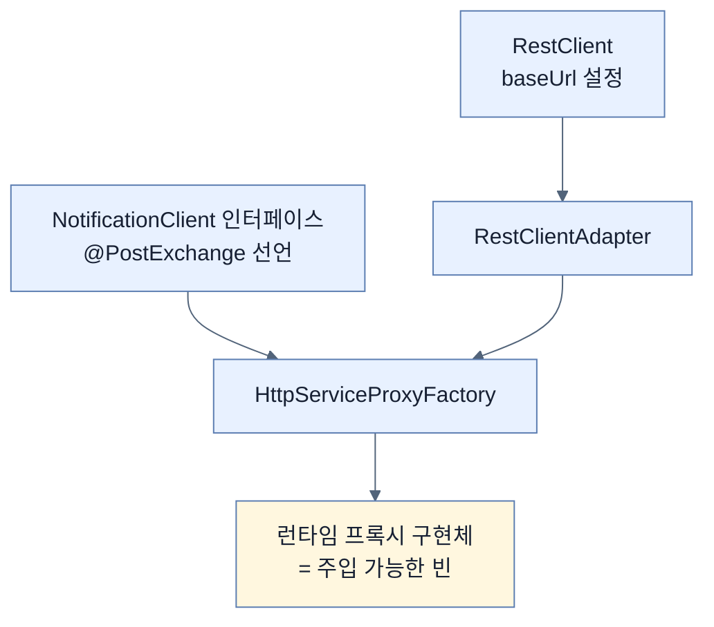
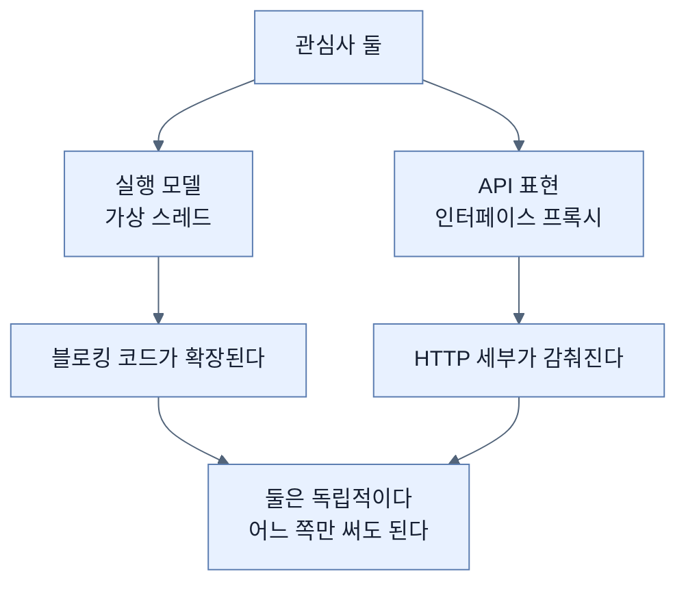

# 요청을 손으로 만들지 않기 — 인터페이스가 곧 클라이언트

## 한눈에 보기

| 질문 | 핵심 답 |
|---|---|
| 무엇이 문제인가 | `RestClient`를 직접 쓰면 요청 구성·URI·응답 처리를 **손으로** 한다 |
| 규모가 커지면 | **반복적이고 덜 표현적인 코드** |
| 해법 | 원격 서비스를 **자바 인터페이스로 선언**하고 구현은 Spring이 만든다 |
| 선언 | `@PostExchange("/notify")` |
| 조립 | `HttpServiceProxyFactory` + `RestClientAdapter` |
| 결과 | 서비스 계층이 **평범한 메서드 호출**만 한다 |
| 가상 스레드와의 관계 | **바뀌지 않는다** — 밑에서 여전히 `RestClient`가 블로킹으로 돈다 |

## 1. 왜 이게 필요한가

### 출발 장면: 엔드포인트가 열 개가 되면

[[04-using-virtual-threads-with-restclient]]의 코드를 다시 보자.

```java
restClient.post()
        .uri("/notify")
        .body(employee)
        .retrieve()
        .toBodilessEntity();
```

한 곳이면 괜찮다. 그런데 외부 서비스의 엔드포인트가 열 개라면 이런 블록이 열 개 생긴다. 그리고 그 열 개에서 반복되는 것들이 있다.

| 반복되는 것 | 문제 |
|---|---|
| HTTP 메서드 선택 | 매번 `post()`/`get()`을 고른다 |
| URI 문자열 | **오타를 컴파일러가 못 잡는다** |
| 본문·파라미터 조립 | 형태가 조금씩 다르다 |
| 응답 처리 | `retrieve().body(X.class)` 같은 반복 |

책의 진단이 정확하다 — **"이 방식은 유연하지만 요청을 손으로 구성하고, URI를 정의하고, 응답을 처리해야 한다. 애플리케이션이 커지면 반복적이고 덜 표현적인 코드로 이어질 수 있다."**

**덜 표현적(less expressive)** 이라는 말이 핵심이다. 코드를 읽어도 "이 서비스가 무엇을 제공하는가"가 한눈에 안 들어온다. HTTP 조립 절차에 가려진다.

## 2. 어떻게 동작하는가

### 2.1 인터페이스로 선언한다

Spring Boot 4는 Spring Framework를 통해 **[[HTTP-인터페이스-프록시]]**(= 원격 서비스를 자바 인터페이스로 선언하면 Spring이 런타임 구현체를 만들어 주는 기능)를 제공한다.

```java
public interface NotificationClient {
       @PostExchange("/notify")
       void notifyEmployee(@RequestBody Employee employee);
}
```

세 줄이 원격 서비스를 통째로 기술한다.

| 요소 | 하는 일 |
|---|---|
| **[[PostExchange]]**(= 인터페이스 메서드를 원격 HTTP POST 호출로 바꾸는 애노테이션) | `/notify`로 POST를 보낸다 |
| `@RequestBody Employee employee` | 이 인자가 요청 본문이 된다 |
| `void` 반환 | 응답 본문을 쓰지 않는다 |

책의 표현대로 **"Spring이 이 정의를 써서 HTTP 호출을 자동으로 생성한다."** 우리가 쓴 것은 **선언**이지 구현이 아니다.

[[../../part-2-creating-an-application-with-spring-boot/chapter-2-creating-web-and-api-applications-with-spring-boot/09-calling-versioned-apis-with-http-service-clients|Chapter 2]]에서 본 것과 같은 모델이고, 짝 관계도 그대로다 — 요청을 **받는** 쪽이 `@PostMapping`, **보내는** 쪽이 `@PostExchange`다.

### 2.2 프록시 빈 만들기

인터페이스만으로는 빈이 생기지 않는다. 구현체를 만들어 등록해야 한다.

```java
@Configuration
public class HttpClientConfig {

       @Bean
       NotificationClient notificationClient(RestClient.Builder builder) {
          RestClient restClient = builder
                                 .baseUrl("http://localhost:8080")
                                 .build();

          HttpServiceProxyFactory factory =
                              HttpServiceProxyFactory.builderFor(
                                         RestClientAdapter.create(restClient))
                                                                        .build();
          return factory.createClient(NotificationClient.class);
       }
}
```

세 부품이 층을 이룬다.

| 부품 | 하는 일 |
|---|---|
| `RestClient.Builder` | **[[RestClient]]**의 base URL을 설정 |
| **[[RestClientAdapter]]**(= 프록시 팩토리가 `RestClient`를 백엔드로 쓰게 이어 주는 어댑터) | 두 세계를 잇는다 |
| **[[HttpServiceProxyFactory]]**(= 표기가 붙은 인터페이스로부터 구현체를 만드는 팩토리) | 런타임 구현체 생성 |

어댑터가 왜 필요한지가 설계상 의미가 있다. `HttpServiceProxyFactory`는 **어떤 HTTP 클라이언트를 쓸지 모른다.** `RestClient`일 수도, `WebClient`일 수도, 다른 것일 수도 있다. 어댑터가 그 차이를 흡수하므로 **프록시 기능과 전송 구현이 분리**된다.



### 2.3 서비스가 단순해진다

```java
@Service
public class NotificationClientService {

    private final NotificationClient notificationClient;

    public NotificationClientService(NotificationClient notificationClient) {
         this.notificationClient = notificationClient;
    }

    public void notifyEmployee(Employee employee) {
          notificationClient.notifyEmployee(employee);

          System.out.println("Notification sent for: " + employee.getName() +
                                        " | Thread: " + Thread.currentThread() +
                                        " | isVirtual: " + Thread.currentThread().isVirtual());
    }
}
```

[[04-using-virtual-threads-with-restclient]]의 `NotificationService`와 비교해 보자.

| | 직접 `RestClient` | 인터페이스 프록시 |
|---|---|---|
| 호출부 | `restClient.post().uri(…).body(…).retrieve().toBodilessEntity()` | **`notificationClient.notifyEmployee(employee)`** |
| URI가 어디에 | 호출부마다 | **인터페이스 선언 한 곳** |
| HTTP 세부 | 서비스가 안다 | **서비스가 모른다** |
| 오타 | 런타임 404 | 컴파일러가 메서드 이름을 검사 |
| 테스트 | HTTP 목킹 | **인터페이스 목킹** |

마지막 줄이 실무에서 크다. 인터페이스이므로 테스트에서 `Mockito.mock(NotificationClient.class)`로 대체할 수 있다.

책의 정리 그대로다 — **"이 서비스가 더 단순하다. HTTP 호출이 인터페이스를 통해 정의되므로 요청을 손으로 구성할 필요가 없어지고, 코드가 읽고 유지하기 쉬워진다."**

### 2.4 가상 스레드와의 관계

이 절이 이 장에 있는 이유를 짚어 둘 필요가 있다. **인터페이스 프록시는 동시성 모델을 바꾸지 않는다.**


프록시는 **호출 구문만** 바꾼다. 밑에서는 여전히 [[04-using-virtual-threads-with-restclient]]의 `RestClient`가 블로킹으로 돌고, 그래서 [[01-understanding-virtual-threads]]의 마운트/언마운트가 그대로 일어난다.

즉 이 절은 **동시성 개선이 아니라 코드 표현력 개선**이다. 두 관심사가 독립적이라는 점 자체가 배울 만하다 — 가상 스레드는 실행 모델, 인터페이스 프록시는 API 표현이다.

> **원문의 공백.** 이 절은 프록시 빈을 `HttpServiceProxyFactory`로 **손수 조립**한다. Spring Boot 4에는 같은 일을 선언으로 하는 `@ImportHttpServices`와 `spring.http.serviceclient.*` 프로퍼티가 있고 [[../../part-2-creating-an-application-with-spring-boot/chapter-2-creating-web-and-api-applications-with-spring-boot/09-calling-versioned-apis-with-http-service-clients|Chapter 2]]가 그 방식을 다뤘는데, 이 장은 그것을 언급하지 않는다. 수동 조립은 Spring Framework 수준의 방법이고 Boot의 자동 설정을 쓰면 설정 클래스 자체가 필요 없어진다.

## 3. 그림으로 보기



| 축 | 받는 쪽 (서버) | 보내는 쪽 (클라이언트) |
|---|---|---|
| 애노테이션 | `@PostMapping` | **`@PostExchange`** |
| 뜻 | "이 URL로 POST가 오면 실행" | "이 메서드를 부르면 POST를 보낸다" |
| 구현 | 내가 쓴다 | **Spring이 만든다** |
| 등록 | 컴포넌트 스캔 | `HttpServiceProxyFactory` |

## 4. 이 노트에 나온 용어

| 용어 | 한 줄 뜻 | 정의 위치 |
|---|---|---|
| HTTP 인터페이스 프록시 | 선언된 인터페이스의 구현체를 Spring이 만들어 주는 기능 | [[_glossary#HTTP-인터페이스-프록시]] |
| @PostExchange | 메서드를 원격 POST 호출로 바꾸는 애노테이션 | [[_glossary#PostExchange]] |
| HttpServiceProxyFactory | 인터페이스로부터 구현체를 만드는 팩토리 | [[_glossary#HttpServiceProxyFactory]] |
| RestClientAdapter | 프록시 팩토리와 RestClient를 잇는 어댑터 | [[_glossary#RestClientAdapter]] |
| RestClient | Spring의 현대적 동기 HTTP 클라이언트 | [[_glossary#RestClient]] |

## 5. 자주 헷갈리는 것

**"인터페이스 프록시를 쓰면 더 빨라진다"** — 성능은 같다. 바뀌는 것은 **코드 표현력**이다.

**"프록시가 논블로킹으로 만들어 준다"** — 밑의 클라이언트가 정한다. `RestClientAdapter`를 쓰면 블로킹이다.

**"인터페이스만 만들면 주입된다"** — 프록시 빈을 만들어 등록해야 한다. 그것이 `HttpClientConfig`가 하는 일이다.

**"메서드 이름이 URL을 정한다"** — `@PostExchange`의 문자열이 정한다. 메서드 이름은 우리가 읽기 위한 것이다.

**"이게 Boot 4의 유일한 방법이다"** — `@ImportHttpServices`로 선언적으로 할 수도 있다. 이 장은 수동 조립만 보여 준다.

## 6. 언제 안 쓰나 / 경계

- **호출이 한두 개면 과할 수 있다.** 설정 클래스와 인터페이스를 만드는 비용이 더 크다.
- **동적으로 URL이 정해지는 호출**에는 맞지 않는다. 선언이 정적이기 때문이다.
- **응답의 세밀한 제어가 필요하면** `RestClient`를 직접 쓰는 편이 낫다(헤더 검사, 조건부 처리 등).
- **비유의 한계.** 인터페이스 프록시는 "메뉴판"에 가깝다. 손님은 "3번"이라고만 말하고 주방이 알아서 만든다. 다만 이 비유는 **메뉴에 없는 것을 시킬 수 없다**는 제약을 가볍게 보이게 한다. 실제로 선언에 없는 형태의 요청(런타임에 결정되는 경로, 동적 헤더)은 이 방식으로 표현할 수 없고, 그때는 다시 `RestClient`를 직접 써야 한다.

## 7. 연결

- [[04-using-virtual-threads-with-restclient]] — 그 노트의 수동 `RestClient` 호출을 이 노트가 인터페이스 선언으로 대체한다. 밑에서 도는 것은 여전히 같은 클라이언트다.
- [[01-understanding-virtual-threads]] — 프록시가 동시성 모델을 바꾸지 않는다는 점이 그 노트의 마운트 구조가 그대로 유지된다는 뜻이다.
- [[06-error-handling-in-concurrent-tasks]] — 호출을 감췄어도 **실패는 감춰지지 않는다.** 오류 처리는 여전히 명시적이어야 한다.

## 8. 스스로 확인

1. `RestClient`를 직접 쓸 때 반복되는 것 네 가지는?
2. "덜 표현적"이라는 진단이 무엇을 뜻하는가?
3. 인터페이스 세 줄이 원격 서비스의 무엇을 기술하는가?
4. `RestClientAdapter`가 필요한 설계상의 이유는?
5. 서비스 계층이 단순해진 것을 다섯 축으로 비교할 수 있는가?
6. 이 절이 동시성과 무관하다는 것이 왜 배울 점인가?
7. Boot 4에 있는 더 선언적인 대안은 무엇인가?
8. 메뉴판 비유가 깨지는 지점은 어디인가?

<!-- ==== 아래는 내 영역 · 스킬 수정 금지 ==== -->

## 내 설명 시도


## 막혔던 지점


## 리뷰 이력
