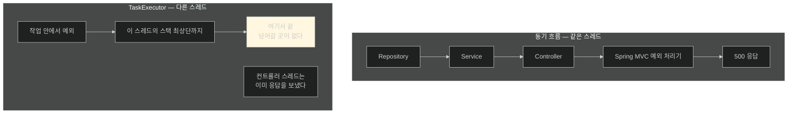
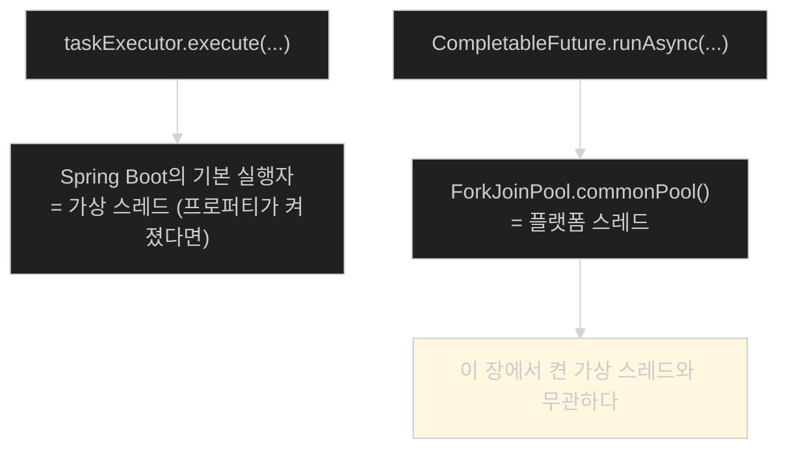
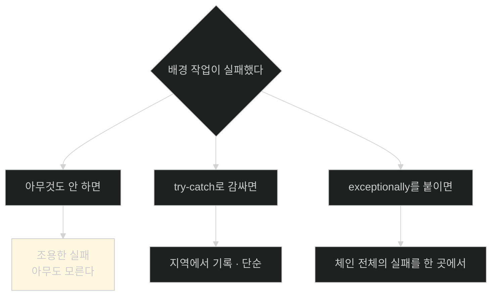

# 예외는 스레드 경계를 넘지 않는다 — 배경 작업의 오류 처리

## 한눈에 보기

| 질문 | 핵심 답 |
|---|---|
| 동기 흐름에서는 | 예외가 호출 스택을 타고 올라가 프레임워크가 처리한다 |
| `TaskExecutor`에서는 | 별도 스레드라 **원래 요청으로 전파되지 않는다** |
| 이게 버그인가 | **아니다.** 의도적 분리다 |
| 왜 의도적인가 | 비핵심 실패가 **사용자 응답에 영향을 주지 않게** 한다 |
| 그래서 필요한 것 | **작업 안에서 명시적으로** 처리 |
| 단순한 방법 | 작업 로직을 `try-catch`로 감싼다 |
| 고급 방법 | `CompletableFuture` + `exceptionally()` |
| 앞으로의 방향 | **구조적 동시성** — 아직 preview (JEP 505) |

## 1. 왜 이게 필요한가

### 출발 장면: 감사 로그가 실패해도 아무도 모른다

[[03-integrating-virtual-threads-with-taskexecutor]]에서 감사를 배경으로 넘겼다. 그런데 그 작업이 실패하면 무슨 일이 벌어질까.

책이 실험을 만든다. 이름이 `"error"`인 직원을 만들면 예외를 던지도록 한다.

```java
public void registerEmployeeCreation(Employee employee) {
       taskExecutor.execute(() -> {
             if (employee.getName().equalsIgnoreCase("error")) {
                                throw new RuntimeException("Simulated audit failure");
             }
             System.out.println("Audit log for employee: " + employee.getName() + …);
       });
}
```

결과가 놀랍다. **예외는 던져지는데 HTTP 응답은 정상적으로 반환된다.**

### 왜 그런가

**[[예외-전파]]**(= 던져진 예외가 호출 스택을 거슬러 올라가 처리자를 찾는 과정)는 **한 스레드 안에서만** 일어난다.



컨트롤러 스레드는 `taskExecutor.execute(...)`가 반환된 순간 **다음 줄로 갔다.** 작업의 완료를 기다리지 않으므로, 그 작업에서 난 예외를 받을 방법이 없다.

책의 설명이 정확하다 — **"작업이 다른 스레드에서 돌고 컨트롤러 스레드는 완료를 기다리지 않으므로, 예외가 원래 요청 컨텍스트로 전파되지 않는다."**

### 버그가 아니라 설계다

여기서 책이 중요한 관점을 준다. **이 분리는 의도적이다.**

> **"비핵심 실패가 사용자의 응답에 영향을 주지 않게 하여, 애플리케이션이 응답성을 유지하면서 배경 오류를 독립적으로 다룰 수 있게 한다."**

생각해 보면 그렇다. 감사 로그 기록이 실패했다고 **직원 생성 자체가 실패한 것으로 처리하면** 더 나쁘다. 직원은 이미 저장됐는데 사용자에게는 500이 간다.

| 감사 실패를 | 결과 |
|---|---|
| 응답에 반영하면 | 저장은 됐는데 실패로 보인다. 사용자가 재시도해 **중복 생성** |
| 응답과 분리하면 | 사용자는 성공을 본다. **감사 로그만 빈다** |

두 번째가 낫다. 다만 조건이 하나 붙는다 — **누군가는 그 실패를 알아야 한다.**

## 2. 어떻게 동작하는가

### 2.1 명시적으로 처리하기

책의 원칙이 한 줄이다 — **"오류는 작업 안에서 명시적으로 처리돼야 한다."**

가장 단순한 방법은 `try-catch`다.

```java
public void registerEmployeeCreation(Employee employee) {
     taskExecutor.execute(() -> {
           try {
                              if (employee.getName().equalsIgnoreCase("error")) {
                                             throw new RuntimeException("Simulated audit failure");
                              }
                              System.out.println("Audit log for employee: " +
                                             employee.getName());
           } catch (Exception ex) {
                              System.err.println("Audit failed for employee: " +
                                             employee.getName()
                                             + " | error: " + ex.getMessage());
           }
     });
}
```

책의 정리대로 **"try-catch 블록이 작업 안에서 오류를 지역적으로 처리해, 실패가 지역에서 다뤄지고 [[조용한-실패]](= 오류가 났는데 아무 데도 드러나지 않는 상태)로 끝나지 않게 한다."**

핵심은 `catch` 안에서 **무언가를 남긴다**는 것이다. 여기서는 `System.err`이지만 실제로는 로거와 메트릭이 들어가야 한다. [[../../part-5-observing-spring-boot-4-applications/chapter-13-observing-spring-boot-4-applications/04b-adding-custom-business-metrics-with-micrometer|Chapter 13]]에서 알림 실패를 `outcome="failed"` 카운터로 세었던 것이 정확히 이 자리에 들어갈 것이다.

### 2.2 더 복잡한 조율이 필요할 때

`try-catch`는 작업 하나에는 충분하다. 그런데 책이 다음 상황을 든다.

- 여러 서비스를 **병렬로** 호출한다
- 그 응답들을 **결합**한다
- 실패하면 **폴백 로직**을 적용한다
- **모든 작업이 끝난 뒤에만** 후속 단계를 실행한다

이런 조율에는 **[[CompletableFuture]]**(= 비동기 결과를 나타내며 연결·예외 처리를 체인으로 표현하는 타입)가 맞다.

```java
public void registerEmployeeCreation(Employee employee) {
     CompletableFuture.runAsync(() -> {
           if (employee.getName().equalsIgnoreCase("error")) {
                              throw new RuntimeException("Simulated audit failure");
           }
           System.out.println("Audit log for employee: " + employee.getName());
     }).exceptionally(ex -> {
           System.err.println("Audit failed: " + ex.getMessage());
           return null;
     });
}
```

| 요소 | 하는 일 |
|---|---|
| `CompletableFuture` | 구조화된 예외 처리, 체이닝, 유연한 워크플로 |
| **[[exceptionally]]**(= 예외 시 실행될 대체 처리를 붙이는 메서드) | 실패를 명시적으로 다뤄 **조용한 실패를 막는다** |
| **[[runAsync]]**(= 값을 돌려주지 않는 작업을 비동기로 실행) | **실행자를 주지 않으면 JVM 공용 풀**에서 돈다 |

`exceptionally`가 `try-catch`와 다른 점은 **체인의 일부**라는 것이다. 여러 단계를 이어 붙인 뒤 마지막에 한 번 붙이면 앞의 어느 단계에서 난 예외든 여기로 온다.

### 2.3 이 예제의 함정

세 번째 항목에 이 절의 가장 중요한 실무 함정이 있다.

책이 정확히 적는다 — **"`runAsync()`는 기본적으로 JVM의 공용 스레드 풀을 쓴다. Spring 애플리케이션에서는 가상 스레드를 백엔드로 하는 것 같은 커스텀 실행자를 넘겨 동시성 모델에 맞출 수 있다."**

그런데 **인쇄된 예제 코드는 실행자를 주지 않는다.**



즉 [[02-using-virtual-threads-in-a-spring-boot-application]]에서 켠 `spring.threads.virtual.enabled=true`가 **이 코드에는 적용되지 않는다.** 그 프로퍼티는 "Spring Boot가 자동 설정하는 인프라"에만 미치고, `CompletableFuture.runAsync()`는 애플리케이션이 직접 부르는 JDK API다.

**[[ForkJoinPool]]**(= 작업 훔치기 방식의 자바 스레드 풀)의 `commonPool()`은 기본적으로 `코어 수 - 1`개의 **플랫폼 스레드**를 갖는다. 블로킹 작업을 여기 던지면 풀이 금방 마른다.

> **원문의 공백.** 책이 "커스텀 실행자를 줄 수 있다"고 짚기는 하지만, **예제 코드는 주지 않은 채로 남는다.** 장의 주제가 가상 스레드인데 마지막 예제가 플랫폼 스레드에서 도는 셈이고, 그 사실이 강조되지 않는다. 실제로는 `runAsync(task, Executors.newVirtualThreadPerTaskExecutor())`처럼 명시하거나 주입받은 `TaskExecutor`를 넘겨야 한다.

### 2.4 둘은 상호 보완적이다

책이 관계를 정리한다.

> **"가상 스레드와 `CompletableFuture`는 서로를 보완한다. 가상 스레드는 블로킹 실행을 단순화하고, `CompletableFuture`는 비동기 워크플로에 대한 제어를 제공한다."**

| | 가상 스레드 | CompletableFuture |
|---|---|---|
| 푸는 문제 | **스레드가 비싸다** | **작업 조율이 어렵다** |
| 코드 모양 | 순차적 | 체인 |
| 여러 작업 결합 | 직접 해야 한다 | `thenCombine`·`allOf` |
| 예외 | try-catch | `exceptionally` |
| 함께 쓰면 | 가상 스레드 실행자 위에서 CompletableFuture 체인 | — |

**둘은 층이 다르다.** 하나는 실행 모델, 하나는 조율 API다. `runAsync`에 가상 스레드 실행자를 주면 둘을 함께 쓰는 것이다.

책의 마지막 강조가 이 절의 요지다 — **"배경 작업의 예외는 HTTP 응답에 영향을 주지 않으므로, 오류 처리는 명시적이어야 하며 적절한 로깅과 모니터링이 따라야 한다."**

### 2.5 앞으로: 구조적 동시성

책이 Note로 방향을 가리킨다. `TaskExecutor`와 `CompletableFuture`는 작업을 동시에 실행하게 해 주지만 **명시적인 조율·오류 처리·생명주기 관리를 요구한다.**

Project Loom이 내놓는 다음 답이 **[[구조적-동시성]]**(= 관련된 동시 작업들을 하나의 스코프로 묶어 다루는 모델)이다.

| 보장 | 뜻 |
|---|---|
| 스코프를 벗어나기 전 **모든 작업 완료** | 떠도는 작업이 남지 않는다 |
| 실패가 **일관되게 전파** | 하나가 실패하면 정해진 방식으로 알려진다 |
| 관련 작업을 **함께 취소** | 하나가 실패하면 나머지를 멈출 수 있다 |

이름의 "구조적"이 무엇을 뜻하는지 보면 이해가 쉽다. 프로그래밍에서 `goto`를 버리고 블록 구조를 택했듯, **동시 작업도 블록처럼 열고 닫히게** 만든 것이다. 블록을 벗어나면 그 안에서 시작한 작업은 전부 끝나 있다.

책의 판단이 신중하다 — **집필 시점에 아직 preview 기능**이라, 이 장의 예제는 **운영에서 검증되고 널리 지원되는** `TaskExecutor`와 `CompletableFuture`에 의존한다. 더 알아볼 곳으로 **[[JEP]] 505**를 가리킨다.

## 3. 그림으로 보기



| 축 | 동기 흐름 | 배경 작업 |
|---|---|---|
| 예외가 가는 곳 | 호출 스택 위로 | **그 스레드 안에서 끝** |
| 프레임워크가 처리 | 한다 | **안 한다** |
| 사용자에게 | 500 | **아무 영향 없음** |
| 개발자가 알려면 | 자동 | **명시적 로깅·모니터링** |
| 좋은 점 | — | 비핵심 실패가 응답을 막지 않는다 |
| 나쁜 점 | — | **모르고 지나가기 쉽다** |

## 4. 이 노트에 나온 용어

| 용어 | 한 줄 뜻 | 정의 위치 |
|---|---|---|
| 예외 전파 | 예외가 호출 스택을 거슬러 처리자를 찾는 과정 | [[_glossary#예외-전파]] |
| 조용한 실패 | 오류가 났는데 아무 데도 드러나지 않는 상태 | [[_glossary#조용한-실패]] |
| TaskExecutor | 작업을 별도 스레드에서 실행하는 Spring 추상 | [[_glossary#TaskExecutor]] |
| CompletableFuture | 비동기 결과를 나타내는 자바 타입 | [[_glossary#CompletableFuture]] |
| runAsync | 값을 돌려주지 않는 작업을 비동기 실행 | [[_glossary#runAsync]] |
| exceptionally | 예외 시 실행될 대체 처리를 붙이는 메서드 | [[_glossary#exceptionally]] |
| fire-and-forget | 던져 놓고 결과를 확인하지 않는 방식 | [[_glossary#fire-and-forget]] |
| 구조적 동시성 | 관련 작업을 하나의 스코프로 묶는 모델 | [[_glossary#구조적-동시성]] |
| JEP | OpenJDK 변경 제안 문서 | [[_glossary#JEP]] |
| 가상 스레드 | JVM이 관리하는 경량 스레드 | [[_glossary#가상-스레드]] |
| ForkJoinPool | 작업 훔치기 방식의 스레드 풀 | [[_glossary#ForkJoinPool]] |

## 5. 자주 헷갈리는 것

**"배경 작업의 예외가 안 보이는 건 버그다"** — **의도적 설계**다. 비핵심 실패가 사용자 응답을 망치지 않게 한다.

**"그러니 그냥 무시해도 된다"** — 아니다. **명시적으로 기록**해야 한다. 안 하면 조용한 실패다.

**"`CompletableFuture`를 쓰면 가상 스레드에서 돈다"** — **아니다.** 실행자를 주지 않으면 `ForkJoinPool.commonPool()`의 플랫폼 스레드다. 이 장의 예제가 그 상태다.

**"`exceptionally`는 `try-catch`와 같다"** — 비슷하지만 **체인 전체**를 감싼다는 점이 다르다. 앞의 어느 단계에서 난 예외든 여기로 온다.

**"구조적 동시성을 지금 쓰면 된다"** — 집필 시점에 preview다. 책이 검증된 방식을 고른 이유다.

## 6. 언제 안 쓰나 / 경계

- **반드시 처리돼야 하는 일은 배경 작업에 두면 안 된다.** 애플리케이션이 죽으면 사라진다. 메시지 큐가 맞다([[../chapter-12-messaging-and-asynchronous-communication-in-spring-boot-4/05-reliability-patterns-retries-dlt-idempotency|Chapter 12]]).
- **`catch (Exception ex)`로 삼키기만 하면 안 된다.** 로깅과 모니터링이 따라야 한다.
- **`runAsync`의 기본 풀에 블로킹 작업을 던지지 마라.** 공용 풀이 마르면 애플리케이션 전체가 영향을 받는다.
- **비유의 한계.** 배경 작업의 예외는 "우체통에 넣은 편지가 반송된 것"에 가깝다. 보낸 사람은 이미 자리를 떴고 반송 사실을 모른다. 다만 이 비유는 **반송 편지가 어딘가에는 남는다**는 인상을 준다. 실제로 잡지 않은 예외는 **아무 데도 남지 않고** 사라진다. 반송함이 있는 게 아니라, 처리자를 만들어 두지 않으면 편지가 증발하는 쪽이다.

## 7. 연결

- [[03-integrating-virtual-threads-with-taskexecutor]] — fire-and-forget으로 넘긴 작업이 이 노트에서 실패한다. 그 노트가 남긴 질문의 답이다.
- [[01-understanding-virtual-threads]] — "스택 트레이스가 그대로 남는다"는 가상 스레드의 이점이 **스레드 경계를 넘으면 사라진다**는 반대편을 보여 준다.
- [[05-using-interface-proxy-http-service-clients]] — 호출 구문을 감췄어도 실패는 감춰지지 않는다는 점에서 같은 원칙이 적용된다.

## 8. 스스로 확인

1. 배경 작업의 예외가 HTTP 응답에 영향을 주지 않는 이유를 스레드 관점에서 설명할 수 있는가?
2. 그 분리가 의도적이라는 근거를 감사 실패 시나리오로 설명할 수 있는가?
3. `try-catch`의 `catch` 안에 무엇이 반드시 있어야 하는가?
4. `exceptionally`가 `try-catch`와 다른 점은?
5. 이 장의 `CompletableFuture` 예제가 가상 스레드에서 돌지 **않는** 이유는?
6. 가상 스레드와 `CompletableFuture`가 "층이 다르다"는 것이 무슨 뜻인가?
7. 구조적 동시성이 보장하는 세 가지와, "구조적"이라는 이름의 유래는?
8. 반송 편지 비유가 깨지는 지점은 어디인가?


> 여덟 문항을 스스로 답한 **뒤에** [[_06-error-handling-in-concurrent-tasks]]에서 모범답안과 대조한다. 먼저 열면 이 문항들은 다시 인출 문제로 쓸 수 없다.

<!-- ==== 아래는 내 영역 · 스킬 수정 금지 ==== -->

## 내 설명 시도


## 막혔던 지점


## 리뷰 이력
