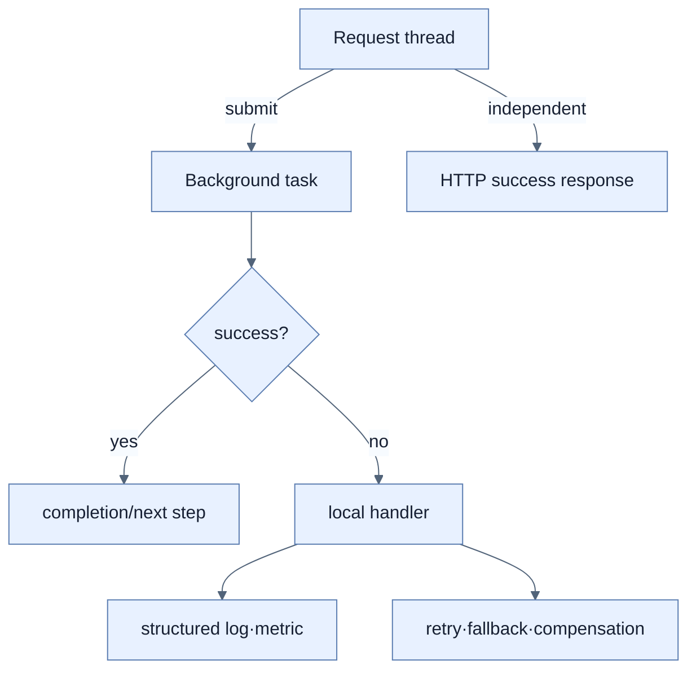

# 동시 작업의 오류 처리

## 한눈에 보기

`TaskExecutor`의 별도 thread에서 난 예외는 원래 HTTP request call stack으로 전파되지 않는다. Background 작업은 내부 `try-catch`, 결과를 가진 future, 중앙 error handler와 관측성으로 실패를 명시적으로 다뤄야 한다.

## 1. 왜 이게 필요한가

책의 예처럼 감사 작업에서 exception이 나도 controller는 이미 성공 응답을 보낼 수 있다. 사용자 응답을 부가 실패로부터 격리하는 장점이 있지만, 아무 조치가 없으면 데이터 손실이나 silent failure가 된다. 비동기 경계는 예외 전파 경계이기도 하다.

## 2. 어떻게 동작하는가

단순 task는 lambda 내부에서 예외를 잡아 문맥과 함께 기록하고 필요한 보상·재시도를 호출한다. 여러 결과의 조합과 후속 단계가 필요하면 `CompletableFuture`로 completion을 모델링할 수 있다.

```java
CompletableFuture.runAsync(() -> audit(employee), executor)
    .exceptionally(ex -> {
        log.error("Audit failed for {}", employee.getName(), ex);
        return null;
    });
```

`runAsync()`는 executor를 넘기지 않으면 JVM common pool을 사용하므로, 애플리케이션 concurrency 정책과 맞는 virtual-thread-backed executor를 명시해야 한다. Virtual thread는 blocking 실행을 단순화하고 `CompletableFuture`는 chaining·combining·exception flow를 제공하므로 서로 대체 관계가 아니다.

책은 관련 작업을 한 scope로 묶어 완료·실패·취소를 함께 관리하는 structured concurrency도 소개하지만, 집필 시점에는 preview라서 production 예제는 `TaskExecutor`와 `CompletableFuture`에 둔다.

## 3. 그림으로 보기



## 4. 이 노트에 나온 용어

- **exception propagation**: 호출 stack을 따라 exception이 상위 호출자에게 전달되는 현상.
- **CompletableFuture**: 비동기 작업의 결과·완료와 조합 가능한 후속 단계를 표현하는 Java API.
- **exceptionally**: `CompletableFuture`가 예외로 끝날 때 fallback 처리를 연결하는 method.
- **structured concurrency**: 관련 child task를 하나의 lexical scope와 lifecycle로 관리하는 동시성 모델.

## 7. 연결

- [[03-integrating-virtual-threads-with-taskexecutor]] — 비동기 경계가 생기는 출발점이다.
- [[chapter-12-messaging-and-asynchronous-communication-in-spring-boot-4/05-reliability-patterns-retries-dlt-idempotency|메시징 신뢰성]] — process 밖에서도 실패를 복구하는 패턴이다.
- [[chapter-13-observing-spring-boot-4-applications/06-correlating-logs-metrics-and-traces|관측성 상관관계]] — background failure를 탐지하고 원인을 추적한다.

## 8. 스스로 확인

- 전체 1차 정리 후: background exception이 controller advice로 가지 않는 이유와 필요한 보완책을 말한다.

<!-- ==== 아래는 내 영역 · 스킬 수정 금지 ==== -->

## 내 설명 시도


## 막혔던 지점


## 리뷰 이력


