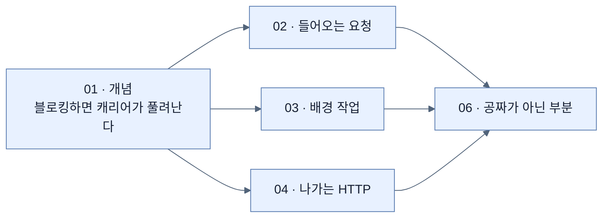
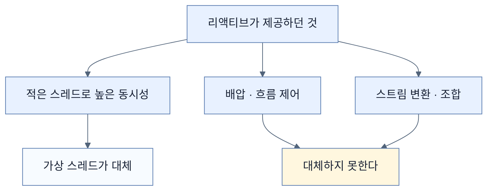

# Chapter 11 개념 지도 — Virtual Threads in Java and Spring Boot

> 책 pp. 295–314 / PDF pp. 320–339. 노트 6개, 용어 40개, 책 이미지 0개.
> 원문 커버리지는 [[_coverage]], 용어 정의는 [[_glossary]]에 있다.

이 장의 주장은 한 줄이다 — **명령형 블로킹 코드를 그대로 쓰면서 리액티브 수준의 확장성을 얻는다.** 그리고 그 주장을 세 자리(요청 처리 · 배경 작업 · 나가는 HTTP)에서 차례로 증명한 뒤, 마지막에 **공짜가 아닌 부분**을 짚는다.

---

## 축 1 — 같은 이점이 세 자리에서 반복된다

| 자리 | 스레드 이름 | 무엇이 증명되나 | 노트 |
|---|---|---|---|
| 들어오는 요청 | `tomcat-handler-N` | 요청마다 가상 스레드, **캐리어는 공유** | [[02-using-virtual-threads-in-a-spring-boot-application]] |
| 배경 작업 | `task-N` | 요청 스레드가 아닌 곳에서도 가상 스레드 | [[03-integrating-virtual-threads-with-taskexecutor]] |
| 나가는 HTTP | `tomcat-handler-N` (호출부) | **클라이언트·서버 양쪽** 가상 스레드 | [[04-using-virtual-threads-with-restclient]] |

세 자리 모두 **코드는 평범한 순차 코드**다. 달라진 것은 로그의 `isVirtual: true` 하나뿐이고, 그것이 이 장의 핵심 주장을 그대로 보여 준다.

---

## 축 2 — 무엇이 무엇을 푸는가 (혼동 방지)

이 장에서 가장 헷갈리기 쉬운 지점이다. **세 문제가 서로 다르고, 도구도 다르다.**

| 문제 | 증상 | 도구 | 노트 |
|---|---|---|---|
| 스레드가 비싸다 | 동시 접속이 늘면 스레드가 마른다 | **가상 스레드** | [[01-understanding-virtual-threads]] |
| 응답이 늦다 | 부가 작업이 응답 시간을 늘린다 | **`TaskExecutor`** | [[03-integrating-virtual-threads-with-taskexecutor]] |
| 코드가 반복적이다 | HTTP 조립이 호출마다 되풀이된다 | **인터페이스 프록시** | [[05-using-interface-proxy-http-service-clients]] |

**셋은 독립적이다.** 가상 스레드를 켜도 응답은 빨라지지 않고, 인터페이스 프록시를 써도 동시성 모델은 그대로다. 이 구분을 놓치면 [[04-using-virtual-threads-with-restclient]]에서 "알림 호출이 왜 여전히 응답을 붙잡는가"가 이해되지 않는다.

---

## 축 3 — 가상 스레드가 대체하는 것과 대체하지 못하는 것

| 영역 | 가상 스레드 | 리액티브 | 이 장의 입장 |
|---|---|---|---|
| I/O 바운드 확장성 | **좋다** | 좋다 | 가상 스레드가 훨씬 단순 |
| 배압 | 없다 | **있다** | 리액티브가 필요 |
| CPU 바운드 | 이득 없음 | 이득 없음 | 코어를 늘려야 한다 |
| 코드 복잡도 | **낮다** | 높다 | — |
| HTTP 클라이언트 | `RestClient` | `WebClient` | **명령형에는 RestClient** ([[04-using-virtual-threads-with-restclient]]) |

[[../chapter-9-writing-reactive-web-controllers/01-reactive-programming-and-backpressure|Chapter 9]]·[[../chapter-10-working-with-data-reactively/01-what-reactive-data-access-requires|Chapter 10]]이 리액티브를 다뤘고, 이 장은 그것을 **부정하지 않고 적용 범위를 좁힌다.**

---

## 축 4 — "자동으로 되는 것"의 경계

`spring.threads.virtual.enabled=true` 한 줄이 어디까지 미치는지가 이 장 전체에서 반복되는 주제다.

| 코드 | 가상 스레드인가 | 근거 |
|---|---|---|
| 컨트롤러 요청 처리 | **예** | Spring Boot 자동 설정 |
| `taskExecutor.execute(...)` | **예** | Spring Boot의 기본 실행자 |
| `@Async` · `@Scheduled` | 예 | 기본 실행자·스케줄러를 쓸 때 |
| `RestClient` 호출 | 예 | 호출하는 스레드가 가상이므로 |
| **`CompletableFuture.runAsync(...)`** | **아니다** | **`ForkJoinPool.commonPool()`의 플랫폼 스레드** |
| 직접 만든 `Executors.newFixedThreadPool(...)` | 아니다 | 애플리케이션이 만든 실행자 |

마지막 두 줄이 [[06-error-handling-in-concurrent-tasks]]의 함정이다. 책 자신의 마지막 예제가 여기 걸리며, 그 사실을 강조하지 않는다.

---

## 축 5 — 단순해진 대가

가상 스레드는 코드를 단순하게 유지하지만 **공짜가 아닌 부분**이 있다.

| 무엇이 여전히 어려운가 | 왜 | 노트 |
|---|---|---|
| 배경 작업의 예외 | **스레드 경계를 넘지 않는다** | [[06-error-handling-in-concurrent-tasks]] |
| 작업 조율 | 여러 작업의 완료·결합·취소 | [[06-error-handling-in-concurrent-tasks]] |
| 실행자 지정 | 자동 설정 밖은 직접 해야 한다 | [[02-using-virtual-threads-in-a-spring-boot-application]] |

[[01-understanding-virtual-threads]]가 자랑하는 "스택 트레이스가 온전하다"는 이점이 **스레드를 하나 건너뛰는 순간 사라진다**는 것이 이 장의 마지막 교훈이다. 그리고 그 문제를 구조적으로 풀려는 시도가 **구조적 동시성**(preview)이다.

---

## 축 6 — 이 장이 남긴 원문의 오류

전체 표는 [[_coverage]] 5절에 있다.

| 위치 | 문제 | 노트 |
|---|---|---|
| p. 296 | "Project Loom, introduced in Java 21" — 프로젝트가 아니라 **가상 스레드**가 Java 21에서 final이 됐다 | [[01-understanding-virtual-threads]] |
| p. 308 | 수신 측 로그만 `http-nio-8080-exec-1`, 나머지는 `tomcat-handler-N` — 두 명명 규칙이 섞여 있다 | [[04-using-virtual-threads-with-restclient]] |
| pp. 307–308 | 앱이 **자기 자신을 호출**하는데 그것이 왜 안전한지 설명이 없다 | [[04-using-virtual-threads-with-restclient]] |
| pp. 309–310 | `@ImportHttpServices`라는 Boot 4의 선언적 대안을 언급하지 않는다 | [[05-using-interface-proxy-http-service-clients]] |
| p. 313 | `runAsync` 예제가 실행자를 주지 않아 **플랫폼 스레드에서 돈다** | [[06-error-handling-in-concurrent-tasks]] |

---

## 앞뒤 Chapter와의 연결

- **← Chapter 9 · 10** — [[../chapter-9-writing-reactive-web-controllers/01-reactive-programming-and-backpressure|Reactive programming and backpressure]]와 [[../chapter-10-working-with-data-reactively/01-what-reactive-data-access-requires|Reactive data access]]: 이 장은 그 모델의 **대안**이지 부정이 아니다. 확장성 문제만 겹치고 배압은 그쪽에 남는다.
- **← Chapter 2** — [[../../part-2-creating-an-application-with-spring-boot/chapter-2-creating-web-and-api-applications-with-spring-boot/09-calling-versioned-apis-with-http-service-clients|HTTP Service Clients]]: [[05-using-interface-proxy-http-service-clients]]의 인터페이스 프록시가 그 장에서 이미 나왔고, Boot의 선언적 방식(`@ImportHttpServices`)도 거기 있다.
- **→ Chapter 12** — [[../chapter-12-messaging-and-asynchronous-communication-in-spring-boot-4/01-asynchronous-and-event-driven-communication|Asynchronous and event-driven communication]]: [[03-integrating-virtual-threads-with-taskexecutor]]의 fire-and-forget이 프로세스와 함께 사라진다는 한계가, 반드시 처리돼야 하는 일에는 메시지 큐가 필요하다는 그 장으로 이어진다.
- **→ Chapter 13** — [[../../part-5-observing-spring-boot-4-applications/chapter-13-observing-spring-boot-4-applications/06-correlating-logs-metrics-and-traces|Correlating signals]]: [[06-error-handling-in-concurrent-tasks]]가 요구하는 "명시적 로깅과 모니터링"이 그 장의 구조화 로그·메트릭·트레이스로 구현된다.

특히 **Chapter 13과의 짝**이 중요하다. 이 장은 "배경 작업의 오류를 명시적으로 기록하라"고 말하지만 **어떻게** 기록해야 하는지는 다루지 않는다. `outcome="failed"` 카운터와 traceId가 실린 구조화 로그가 그 답이다.
