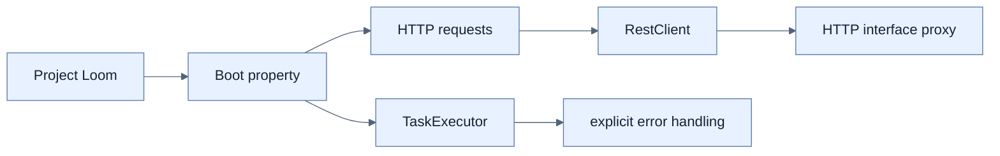

# Chapter 11 — Virtual Threads in Java and Spring Boot

## 학습 경로

1. [[01-understanding-virtual-threads|Virtual thread 이해]]
2. [[02-using-virtual-threads-in-a-spring-boot-application|Spring Boot에서 활성화]]
3. [[03-integrating-virtual-threads-with-taskexecutor|TaskExecutor 통합]]
4. [[04-using-virtual-threads-with-restclient|RestClient 통합]]
5. [[05-using-interface-proxy-http-service-clients|HTTP interface proxy]]
6. [[06-error-handling-in-concurrent-tasks|동시 작업 오류 처리]]

## 책의 범위

- 본문: pp. 295–314
- PDF: pp. 320–339
- 핵심 대비: reactive non-blocking pipeline과 imperative blocking code 위의 virtual thread

